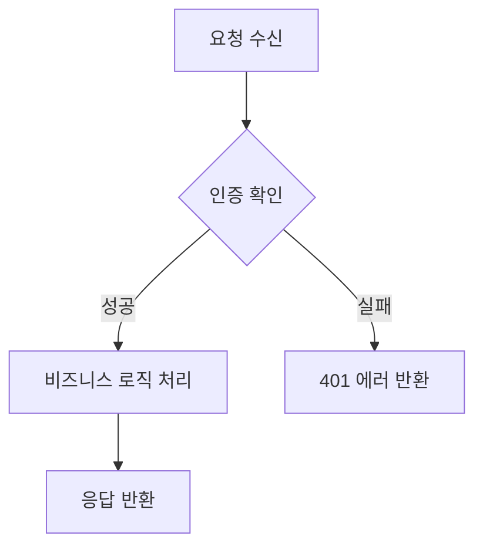
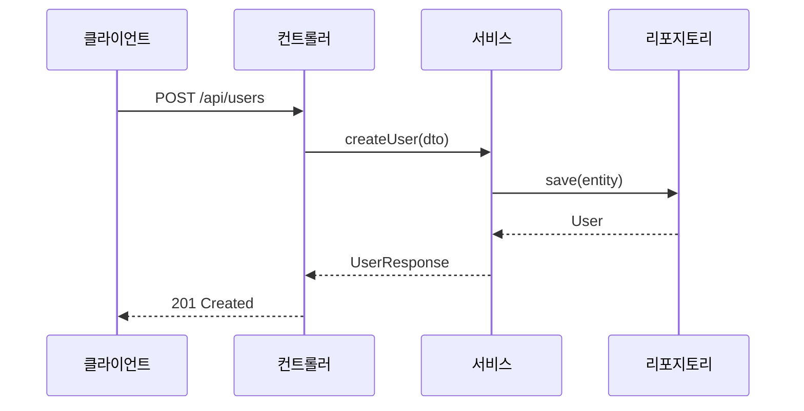
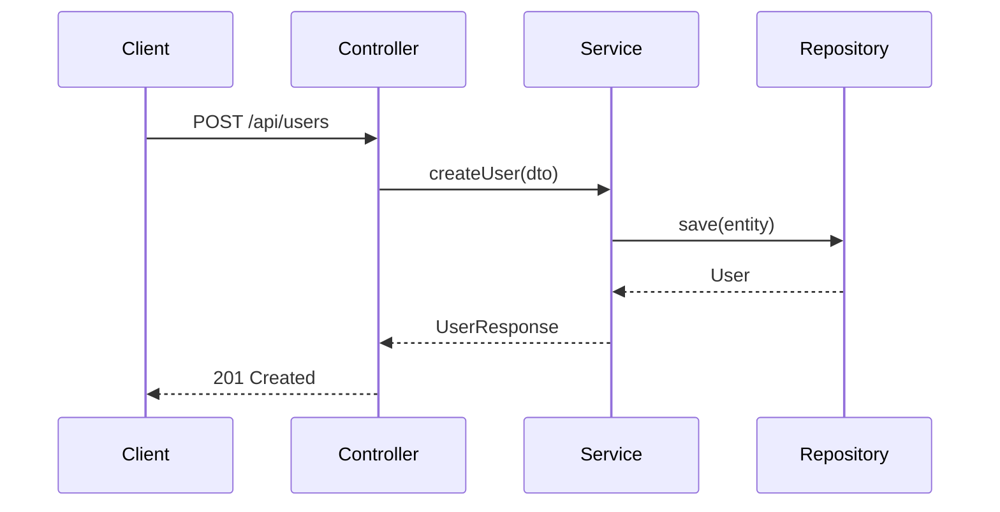

# SimpliX Documentation Guidelines

This document provides comprehensive guidelines for creating and maintaining documentation in the SimpliX project.

## Table of Contents

1. [Folder Structure](#folder-structure)
2. [File Naming Conventions](#file-naming-conventions)
3. [Language Rules](#language-rules)
4. [Diagrams](#diagrams)
5. [Content Guidelines](#content-guidelines)
6. [Markdown Formatting](#markdown-formatting)
7. [Code Examples](#code-examples)
8. [Build Process](#build-process)
9. [Module Documentation](#module-documentation)
10. [Documentation Templates](#documentation-templates)

---

## Folder Structure

### Overview

```
simplix/
+-- docs/                           # Root documentation (Docsify)
|   +-- index.html                  # Docsify main configuration
|   +-- _coverpage.md               # Cover page
|   +-- _navbar.md                  # Navigation bar
|   +-- .nojekyll                   # GitHub Pages config
|   +-- ko/                         # Korean documentation
|       +-- README.md               # Main introduction
|       +-- _sidebar.md             # Sidebar menu structure
|       +-- quick-start.md          # Quick start guide
|       +-- crud-tutorial.md        # CRUD tutorial
|       +-- security-integration.md # Security guide
|       +-- changelog.md            # Change log
|       +-- license.md              # License info
|       +-- documentation-guide.md  # Contribution guide
|
+-- {module}/                       # Each module
|   +-- README.md                   # Module README (English/Korean)
|   +-- docs/
|       +-- ko/                     # Korean module docs
|           +-- overview.md         # Module overview
|           +-- {feature}.md        # Feature-specific guides
|
+-- build-docs/                     # Built documentation output
|   +-- ko/                         # Korean output
|       +-- {module-short}/         # e.g., core, auth, starter
|           +-- readme.md           # Copied from module README
|           +-- overview.md         # Copied from module docs/ko/
|
+-- scripts/
    +-- build-docs.sh               # Documentation build script
```

### Module Name Mapping

When building documentation, module names are converted:

| Source Module                  | Target Directory |
|-------------------------------|------------------|
| simplix-core                  | core             |
| simplix-auth                  | auth             |
| simplix-cache                 | cache            |
| simplix-email                 | email            |
| simplix-encryption            | encryption       |
| simplix-event                 | event            |
| simplix-excel                 | excel            |
| simplix-file                  | file             |
| simplix-hibernate             | hibernate        |
| simplix-mybatis               | mybatis          |
| simplix-scheduler             | scheduler        |
| spring-boot-starter-simplix   | starter          |

---

## File Naming Conventions

### General Rules

- Use lowercase with hyphens: `feature-guide.md` (CORRECT)
- Never use underscores: `feature_guide.md` (INCORRECT)
- Never use language suffixes: `README_ko.md` (INCORRECT)
- Use folder-based localization: `docs/ko/README.md` (CORRECT)

### Standard File Names

| File Name              | Purpose                              |
|-----------------------|--------------------------------------|
| README.md             | Module introduction                   |
| overview.md           | Feature overview                      |
| getting-started.md    | Quick start guide                     |
| configuration.md      | Configuration reference               |
| {feature}-guide.md    | Feature-specific guide                |
| advanced-guide.md     | Advanced usage patterns               |
| security-*.md         | Security-related documentation        |

---

## Language Rules

### Korean Documentation (`docs/ko/`, `{module}/docs/ko/`)

- Full Korean content is allowed
- Technical terms may remain in English (e.g., Spring Boot, JPA)
- Code blocks should use English identifiers

### English Documentation (`docs/`, `{module}/README.md`)

- Full English content
- May be supplemented with Korean versions in `ko/` subfolder

### Code Examples (All Languages)

- Variable names: English only
- Comments in code blocks: English only
- Output messages: English only

---

## Diagrams

Documentation MUST include appropriate diagrams to help readers understand:
- System architecture and component relationships
- Data flow and processing sequences
- State transitions and workflows
- API call sequences

### Diagram Types

| Diagram Type | Use Case | Format |
|-------------|----------|--------|
| Directory Structure | Folder/file hierarchy | ASCII only |
| Flowchart | Process flows, decision logic | Mermaid |
| Sequence Diagram | API calls, component interactions | Mermaid |
| Class Diagram | Entity relationships, class hierarchy | Mermaid |
| State Diagram | State transitions, lifecycle | Mermaid |
| ER Diagram | Database schema | Mermaid |

### Mermaid Diagrams (MANDATORY)

> **IMPORTANT**: All diagrams (except directory structures) MUST be created using Mermaid.
> Use the `.claude/skills/mermaid` skill to generate Mermaid diagrams.

#### Language Rules for Mermaid

- **Korean documentation**: Use Korean labels in Mermaid diagrams
- **English documentation**: Use English labels in Mermaid diagrams

#### Example: Korean Flowchart



#### Example: Korean Sequence Diagram



#### Example: English Sequence Diagram



### ASCII Diagrams (Directory Structures ONLY)

ASCII diagrams are **ONLY** used for directory/file structure representations.

- **MUST use English only** (Korean characters cause alignment issues)
- Use simple ASCII characters: `+`, `-`, `|`, `/`, `\`

Example (CORRECT):
```
+-- src/
|   +-- main/
|   |   +-- java/
|   |   +-- resources/
|   +-- test/
+-- build.gradle
```

Example (INCORRECT - Korean causes misalignment):
```
+-- 소스/           <-- Alignment broken
|   +-- 메인/
```

### When to Include Diagrams

| Document Type | Required Diagrams |
|--------------|-------------------|
| Module Overview | Architecture diagram, component relationships |
| Feature Guide | Flowchart showing usage flow |
| API Documentation | Sequence diagram for API calls |
| Configuration Guide | State diagram if applicable |
| Security Documentation | Authentication/authorization flow |

---

## Content Guidelines

### Version Numbers

- **NEVER hardcode version numbers** in documentation
- Use `${version}` placeholder or omit entirely
- Exception: CLAUDE.md may contain versions for internal reference

CORRECT:
```xml
<dependency>
    <groupId>dev.simplecore</groupId>
    <artifactId>spring-boot-starter-simplix</artifactId>
</dependency>
```

INCORRECT:
```xml
<dependency>
    <groupId>dev.simplecore</groupId>
    <artifactId>spring-boot-starter-simplix</artifactId>
    <version>1.0.15</version>  <!-- Version will become outdated -->
</dependency>
```

### Symbols

Use only approved symbols for status indicators:

| Symbol | Usage                    |
|--------|--------------------------|
| ✔      | Success, completed, OK   |
| ✖      | Error, failed, NO        |
| ⚠      | Warning, caution         |
| ℹ      | Info, note               |

**NEVER use emojis** in documentation.

### Links

#### Internal Links (within docs/)

Use absolute paths from docs root:
```markdown
[Quick Start](/ko/quick-start.md)
[Core Overview](/ko/core/overview.md)
```

#### Cross-Module Links (from module README)

Use relative paths that will be converted during build:
```markdown
[See detailed guide](docs/ko/overview.md)
```

---

## Markdown Formatting

### Headers

```markdown
# Document Title (H1 - only one per document)

## Major Section (H2)

### Subsection (H3)

#### Minor Section (H4)
```

### Code Blocks

Always specify language for syntax highlighting:

````markdown
```java
public class Example {
    // Code here
}
```

```yaml
simplix:
  core:
    enabled: true
```

```bash
./gradlew build
```
````

### Tables

Use proper alignment:

```markdown
| Column 1 | Column 2 | Column 3 |
|----------|----------|----------|
| Data 1   | Data 2   | Data 3   |
```

### Admonitions (Notes/Warnings)

Use blockquotes with symbols:

```markdown
> ℹ **Note**: This is an informational note.

> ⚠ **Warning**: This requires attention.

> ✖ **Important**: This must not be done.
```

---

## Code Examples

### Configuration Examples

Always show both YAML and properties format when relevant:

```markdown
### YAML Configuration

```yaml
simplix:
  auth:
    enabled: true
    jwe:
      encryption-key-location: classpath:keys/jwe-key.json
```

### Properties Configuration

```properties
simplix.auth.enabled=true
simplix.auth.jwe.encryption-key-location=classpath:keys/jwe-key.json
```
```

### Java Examples

- Include necessary imports
- Show complete, runnable examples when possible
- Use realistic variable names

```java
import dev.simplecore.simplix.auth.service.TokenService;
import org.springframework.stereotype.Service;

@Service
public class AuthenticationService {

    private final TokenService tokenService;

    public AuthenticationService(TokenService tokenService) {
        this.tokenService = tokenService;
    }

    public String authenticate(String username, String password) {
        // Authentication logic
        return tokenService.generateToken(username);
    }
}
```

---

## Build Process

### Running the Build

```bash
# Build documentation
./scripts/build-docs.sh

# Preview locally
cd build-docs && python -m http.server 3000
# Open http://localhost:3000
```

### Build Process Steps

1. Initialize `build-docs/` directory
2. Copy Docsify configuration files
3. Copy tutorial documents from `docs/ko/`
4. Copy module documentation from `{module}/docs/ko/`
5. Copy module README files
6. Convert relative links to absolute paths
7. Replace version placeholders

### Link Conversion Rules

The build script automatically converts:

| Source Pattern                        | Target Pattern           |
|--------------------------------------|--------------------------|
| `./overview.md`                       | `ko/{module}/overview.md`|
| `docs/ko/feature.md`                 | `ko/{module}/feature.md` |
| `../../simplix-core/docs/ko/`        | `ko/core/`               |
| `../../simplix-auth/README.md`       | `ko/auth/readme.md`      |

---

## Module Documentation

### Required Files

Each module MUST have:

| File | Purpose | Template |
|------|---------|----------|
| `README.md` | Module introduction | See [README.md Template](./documentation-templates.md#readmemd-template) |
| `docs/ko/overview.md` | Detailed overview | See [Overview Template](./documentation-templates.md#overview-document-template) |

### Recommended Files

| File | When to Include | Template |
|------|-----------------|----------|
| `docs/ko/getting-started.md` | Complex setup required | [Feature Guide Template](./documentation-templates.md#feature-guide-template) |
| `docs/ko/configuration.md` | Many configuration options | [Configuration Reference Template](./documentation-templates.md#configuration-reference-template) |
| `docs/ko/{feature}-guide.md` | Each major feature | [Feature Guide Template](./documentation-templates.md#feature-guide-template) |
| `docs/ko/advanced-guide.md` | Advanced patterns exist | [Feature Guide Template](./documentation-templates.md#feature-guide-template) |

### Sidebar Integration

When adding new documentation, update `docs/ko/_sidebar.md`:

```markdown
* **Module Name**
  * [Introduction](/ko/{module}/readme.md)
  * [Overview](/ko/{module}/overview.md)
  * [Feature Guide](/ko/{module}/feature-guide.md)
```

---

## Documentation Templates

> **MANDATORY**: All documentation MUST follow the templates defined in:
> `.claude/references/documentation-templates.md`

### Template Selection

| Document Type | Template to Use |
|--------------|-----------------|
| Module README | [README.md Template](./documentation-templates.md#readmemd-template) |
| Module Overview | [Overview Document Template](./documentation-templates.md#overview-document-template) |
| Feature Guide | [Feature Guide Template](./documentation-templates.md#feature-guide-template) |
| Configuration Reference | [Configuration Reference Template](./documentation-templates.md#configuration-reference-template) |
| API Documentation | [API Documentation Template](./documentation-templates.md#api-documentation-template) |

### Required Sections by Document Type

| Section | README | Overview | Feature Guide | Config Ref |
|---------|--------|----------|---------------|------------|
| Title + Description | ✔ | ✔ | ✔ | ✔ |
| Table of Contents | - | - | ✔ | - |
| Features List | ✔ | - | - | - |
| Quick Start | ✔ | - | - | - |
| Architecture Diagram | ✔ (ASCII) | ✔ (Mermaid) | - | - |
| Sequence Diagram | - | ✔ | Optional | - |
| Core Components | - | ✔ | - | - |
| Code Examples | ✔ | ✔ | ✔ | ✔ |
| Configuration YAML | ✔ | ✔ | ✔ | ✔ |
| Configuration Table | ✔ | ✔ | ✔ | ✔ |
| REST API Examples | Optional | - | ✔ | - |
| Troubleshooting | - | - | ✔ | - |
| Related Documents | ✔ | ✔ | ✔ | ✔ |
| License | ✔ | - | - | - |

### Template Compliance Checklist

Before submitting documentation:

- [ ] Selected correct template for document type
- [ ] Included ALL required sections from template
- [ ] Followed section ordering from template
- [ ] Used correct diagram format (ASCII for directories, Mermaid for others)
- [ ] Included appropriate Mermaid diagrams (architecture, sequence, flowchart)
- [ ] Configuration tables have Type, Default, and Description columns
- [ ] Code examples are complete and runnable
- [ ] Related Documents section links to other relevant docs

---

## Updating Documentation

### When to Update

- When code is added or modified
- When configuration properties change
- When APIs are updated
- When new features are added

### Update Checklist

- [ ] Update module README if public API changed
- [ ] Update feature guides in docs/ko/
- [ ] Update configuration examples if properties changed
- [ ] Verify all code examples still work
- [ ] Check internal links are not broken
- [ ] Include appropriate diagrams (flowchart, sequence, etc.)
- [ ] Use Mermaid for all non-directory diagrams
- [ ] Use Korean labels in Mermaid for Korean docs
- [ ] **Verify template compliance** (see checklist above)
- [ ] Run build script to verify output