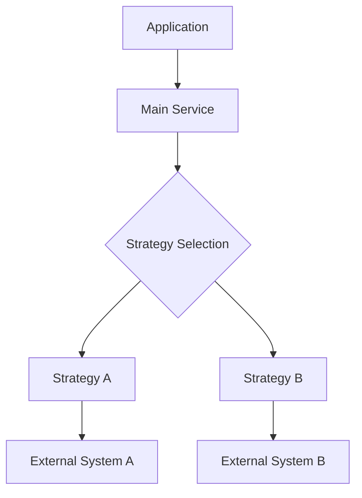
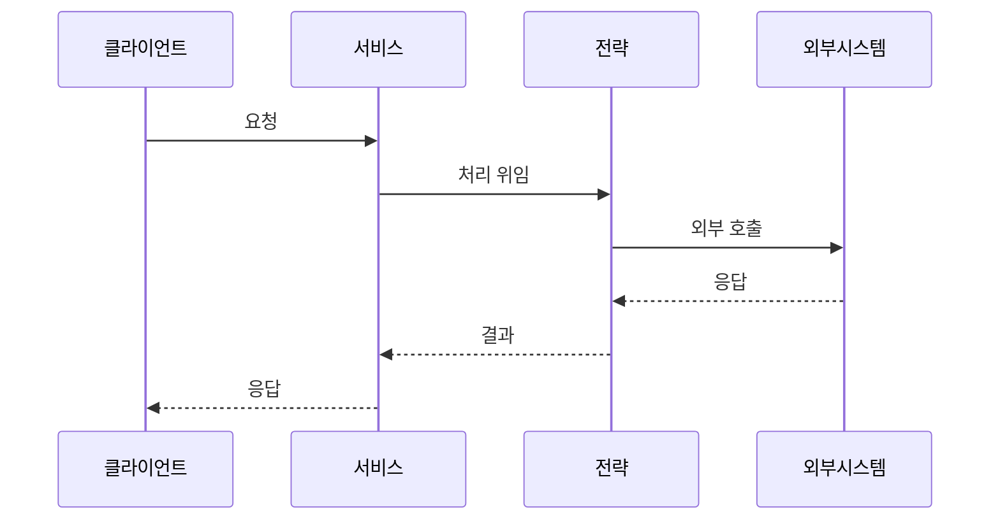
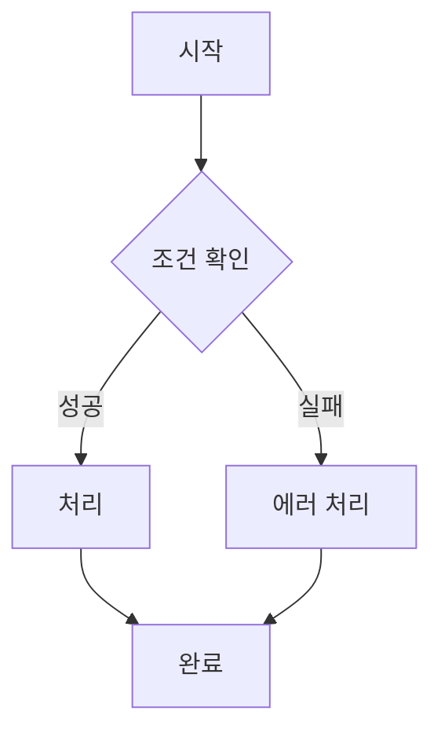

# SimpliX Documentation Templates

This document provides mandatory templates for all documentation in the SimpliX project. All new documentation MUST follow these templates.

> **IMPORTANT**: These templates are MANDATORY. Do not deviate from the structure without explicit approval.

---

## Table of Contents

1. [Template Selection Guide](#template-selection-guide)
2. [README.md Template](#readmemd-template)
3. [Overview Document Template](#overview-document-template)
4. [Feature Guide Template](#feature-guide-template)
5. [Configuration Reference Template](#configuration-reference-template)
6. [API Documentation Template](#api-documentation-template)
7. [Common Elements](#common-elements)

---

## Template Selection Guide

| Document Type | When to Use | Template |
|--------------|-------------|----------|
| Module README | Root of each module | [README.md Template](#readmemd-template) |
| Overview | docs/ko/overview.md | [Overview Template](#overview-document-template) |
| Feature Guide | Feature-specific documentation | [Feature Guide Template](#feature-guide-template) |
| Configuration | Full configuration reference | [Configuration Reference Template](#configuration-reference-template) |
| API Documentation | REST API endpoints | [API Documentation Template](#api-documentation-template) |

---

## README.md Template

**Location**: `{module}/README.md`
**Purpose**: First point of contact for module users

````markdown
# SimpliX {Module Name}

{One-line description of what this module provides.}

## Features

- ✔ **{Feature 1}** - {Brief description}
- ✔ **{Feature 2}** - {Brief description}
- ✔ **{Feature 3}** - {Brief description}
- ✔ **{Feature 4}** - {Brief description}

## Quick Start

### 1. Dependency

```gradle
dependencies {
    implementation 'dev.simplecore:simplix-{module}'

    // Optional dependencies (if any)
    implementation 'org.springframework.boot:spring-boot-starter-xxx'
}
```

### 2. Configuration

```yaml
simplix:
  {module}:
    enabled: true
    # Basic required configuration
    property1: value1
    property2: value2
```

### 3. Usage

```java
@Service
@RequiredArgsConstructor
public class {Example}Service {

    private final {MainService} {mainService};

    public {ReturnType} {exampleMethod}({ParamType} param) {
        // Minimal working example
        return {mainService}.{method}(param);
    }
}
```

## Configuration Summary

| Property | Default | Description |
|----------|---------|-------------|
| `simplix.{module}.enabled` | `true` | Enable/disable module |
| `simplix.{module}.property1` | `{default}` | {Description} |
| `simplix.{module}.property2` | `{default}` | {Description} |

## Architecture

```
simplix-{module}/
+-- autoconfigure/           # Auto-configuration classes
|   +-- SimpliX{Module}AutoConfiguration
+-- service/                 # Main services
|   +-- {MainService}
+-- strategy/                # Strategy implementations (if any)
+-- properties/              # Configuration properties
    +-- {Module}Properties
```

## API Endpoints (if applicable)

| Endpoint | Method | Description |
|----------|--------|-------------|
| `/api/{path}` | GET | {Description} |
| `/api/{path}` | POST | {Description} |

## Required Implementations (if any)

### {InterfaceName}

{Brief description of why this needs to be implemented.}

```java
public interface {InterfaceName} {
    {ReturnType} {method}({ParamType} param);
}
```

## Documentation

| Document | Description |
|----------|-------------|
| [Overview](docs/ko/overview.md) | Detailed architecture and concepts |
| [{Feature} Guide](docs/ko/{feature}-guide.md) | {Feature} usage guide |
| [Configuration Reference](docs/ko/configuration.md) | Full configuration options |

## Requirements

- Java 17+
- Spring Boot 3.5+
- {Additional requirements}

## License

SimpleCORE License 1.0 (SCL-1.0)
````

---

## Overview Document Template

**Location**: `{module}/docs/ko/overview.md`
**Purpose**: Comprehensive module architecture and concepts

````markdown
# {Module Name} Overview

## Architecture



> ℹ Use Mermaid diagrams for architecture. Korean labels for Korean docs.

---

## Core Components

### {ComponentName}

{Description of the component's role and responsibility.}

```java
public interface {ComponentName} {
    // Key methods with brief comments
    {ReturnType} {method1}({ParamType} param);
    {ReturnType} {method2}({ParamType} param);
}
```

**Key Responsibilities:**
- {Responsibility 1}
- {Responsibility 2}
- {Responsibility 3}

### {AnotherComponent}

{Description}

---

## Auto-Configuration

### {AutoConfigurationClass}

```java
@AutoConfiguration
@EnableConfigurationProperties({Properties}.class)
@ConditionalOnProperty(name = "simplix.{module}.enabled", havingValue = "true", matchIfMissing = true)
public class SimpliX{Module}AutoConfiguration {
    // Bean definitions
}
```

**Conditional Beans:**

| Bean | Condition |
|------|-----------|
| `{beanName}` | {Condition description} |
| `{beanName}` | {Condition description} |

---

## Configuration Properties

### Full Configuration Structure

```yaml
simplix:
  {module}:
    # Enable/disable
    enabled: true

    # Section 1: {Section Name}
    {section1}:
      property1: value1
      property2: value2

    # Section 2: {Section Name}
    {section2}:
      property3: value3
```

### Property Reference

| Property | Type | Default | Description |
|----------|------|---------|-------------|
| `{module}.enabled` | boolean | `true` | Module activation |
| `{module}.{property}` | {type} | `{default}` | {Description} |

---

## Strategies/Patterns (if applicable)

### Strategy Comparison

| Feature | {Strategy A} | {Strategy B} |
|---------|--------------|--------------|
| Use Case | {Description} | {Description} |
| Performance | {Description} | {Description} |
| Dependencies | {Description} | {Description} |
| Persistence | {Description} | {Description} |

### When to Use

**{Strategy A} Recommended:**
- {Scenario 1}
- {Scenario 2}

**{Strategy B} Recommended:**
- {Scenario 1}
- {Scenario 2}

---

## Sequence Diagram



---

## Monitoring

### Health Check

```bash
curl http://localhost:8080/actuator/health/{module}
```

**Response:**
```json
{
  "status": "UP",
  "details": {
    "strategy": "{StrategyName}",
    "available": true
  }
}
```

### Metrics

| Metric | Description |
|--------|-------------|
| `{module}.{metric1}` | {Description} |
| `{module}.{metric2}` | {Description} |

### Logging

```yaml
logging:
  level:
    dev.simplecore.simplix.{module}: DEBUG
```

| Level | Output |
|-------|--------|
| TRACE | {Description} |
| DEBUG | {Description} |
| INFO | {Description} |
| WARN | {Description} |

---

## Environment Variables

| Variable | Description | Default |
|----------|-------------|---------|
| `{MODULE}_ENABLED` | Module activation | `true` |
| `{MODULE}_{PROPERTY}` | {Description} | `{default}` |

---

## Related Documents

- [{Feature} Guide](./{feature}-guide.md) - {Description}
- [Configuration Reference](./configuration.md) - {Description}
- [Advanced Guide](./advanced-guide.md) - {Description}
````

---

## Feature Guide Template

**Location**: `{module}/docs/ko/{feature}-guide.md`
**Purpose**: In-depth guide for specific features

````markdown
# {Feature Name}

{2-3 sentence introduction explaining what this feature does and why it's useful.}

## Table of Contents

- [{Section 1}](#{section-1-anchor})
- [{Section 2}](#{section-2-anchor})
- [{Section 3}](#{section-3-anchor})
- [Configuration](#{configuration-anchor})
- [Advanced Usage](#{advanced-anchor})
- [Related Documents](#related-documents)

## {Concept/Comparison Section}

### {Concept} vs {Alternative}

| Aspect | {Concept} | {Alternative} |
|--------|-----------|---------------|
| {Aspect 1} | {Description} | {Description} |
| {Aspect 2} | {Description} | {Description} |

{Explanation of why this approach was chosen.}

---

## {Basic Usage Section}

### Process Flow



### REST API

**Endpoint:** `{METHOD} /api/{path}`

**Request:**
```bash
curl -X {METHOD} "http://localhost:8080/api/{path}" \
  -H "Authorization: Bearer {token}" \
  -H "Content-Type: application/json" \
  -d '{
    "field1": "value1",
    "field2": "value2"
  }'
```

**Response:**
```json
{
  "result": "success",
  "data": {
    "field1": "value1"
  }
}
```

### Programmatic Usage

```java
@Service
@RequiredArgsConstructor
public class {Feature}Service {

    private final {Provider} {provider};

    public {ReturnType} {method}({ParamType} param) {
        // Step 1: {Description}
        // Step 2: {Description}
        return {provider}.{operation}(param);
    }
}
```

---

## {Advanced Section}

### {Advanced Topic 1}

{Explanation}

```yaml
simplix:
  {module}:
    {feature}:
      advanced-option: true
```

### {Advanced Topic 2}

{Explanation with code example}

```java
// Advanced usage example
```

---

## Configuration

### Required Configuration

```yaml
simplix:
  {module}:
    {feature}:
      enabled: true
      required-property: value
```

### Optional Configuration

```yaml
simplix:
  {module}:
    {feature}:
      optional-property1: value1
      optional-property2: value2
```

### Configuration Reference

| Property | Type | Default | Description |
|----------|------|---------|-------------|
| `{feature}.enabled` | boolean | `true` | Enable feature |
| `{feature}.{property}` | {type} | `{default}` | {Description} |

---

## {Customization Section} (if applicable)

### Custom {Handler/Provider/Strategy}

```java
@Configuration
public class Custom{Feature}Config {

    @Bean
    public {Interface} custom{Feature}() {
        return new Custom{Feature}Impl();
    }
}
```

### Extension Points

| Extension Point | Purpose |
|----------------|---------|
| `{Interface1}` | {Description} |
| `{Interface2}` | {Description} |

---

## Troubleshooting

### Common Issues

**{Issue 1}**

Symptom: {Description}

Solution:
```yaml
# Fix configuration
```

**{Issue 2}**

Symptom: {Description}

Solution: {Explanation}

---

## Related Documents

- [{Related Feature 1}](./{related-1}.md) - {Description}
- [{Related Feature 2}](./{related-2}.md) - {Description}
- [Configuration Reference](./configuration.md) - Full configuration options
````

---

## Configuration Reference Template

**Location**: `{module}/docs/ko/configuration.md` or `configuration-reference.md`
**Purpose**: Complete listing of all configuration options

````markdown
# {Module} Configuration Reference

Complete configuration reference for SimpliX {Module}.

## Quick Reference

```yaml
simplix:
  {module}:
    enabled: true
    # Add minimal working configuration
```

---

## Configuration Sections

### Core Settings

| Property | Type | Default | Description |
|----------|------|---------|-------------|
| `simplix.{module}.enabled` | boolean | `true` | Enable/disable module |

### {Section 1}

```yaml
simplix:
  {module}:
    {section1}:
      property1: value1
      property2: value2
```

| Property | Type | Default | Description |
|----------|------|---------|-------------|
| `{section1}.property1` | {type} | `{default}` | {Description} |
| `{section1}.property2` | {type} | `{default}` | {Description} |

### {Section 2}

```yaml
simplix:
  {module}:
    {section2}:
      property3: value3
```

| Property | Type | Default | Description |
|----------|------|---------|-------------|
| `{section2}.property3` | {type} | `{default}` | {Description} |

---

## Environment Variables

All properties can be set via environment variables:

| Property | Environment Variable |
|----------|---------------------|
| `simplix.{module}.enabled` | `SIMPLIX_{MODULE}_ENABLED` |
| `simplix.{module}.{property}` | `SIMPLIX_{MODULE}_{PROPERTY}` |

---

## Configuration Profiles

### Development

```yaml
simplix:
  {module}:
    # Development-optimized settings
```

### Production

```yaml
simplix:
  {module}:
    # Production-optimized settings
```

---

## Related Documents

- [Overview](./overview.md) - Architecture and concepts
- [{Feature} Guide](./{feature}-guide.md) - Usage guide
````

---

## API Documentation Template

**Location**: `{module}/docs/ko/api-reference.md`
**Purpose**: REST API endpoint documentation

````markdown
# {Module} API Reference

REST API endpoints provided by SimpliX {Module}.

## Base URL

```
{base-path}
```

## Authentication

{Description of authentication requirements}

---

## Endpoints

### {Endpoint Group 1}

#### {Operation Name}

**Endpoint:** `{METHOD} {path}`

**Description:** {What this endpoint does}

**Request Headers:**

| Header | Required | Description |
|--------|----------|-------------|
| `Authorization` | Yes | Bearer token |
| `Content-Type` | Yes | application/json |

**Request Body:**

```json
{
  "field1": "string",
  "field2": 123
}
```

| Field | Type | Required | Description |
|-------|------|----------|-------------|
| `field1` | string | Yes | {Description} |
| `field2` | integer | No | {Description} |

**Response:**

```json
{
  "success": true,
  "data": {
    "id": "123",
    "field1": "value"
  }
}
```

**Error Responses:**

| Status | Error Code | Description |
|--------|------------|-------------|
| 400 | `INVALID_REQUEST` | {Description} |
| 401 | `UNAUTHORIZED` | {Description} |
| 404 | `NOT_FOUND` | {Description} |

**Example:**

```bash
curl -X {METHOD} "http://localhost:8080{path}" \
  -H "Authorization: Bearer {token}" \
  -H "Content-Type: application/json" \
  -d '{
    "field1": "value"
  }'
```

---

## Error Response Format

```json
{
  "type": "ERROR",
  "code": "{error_code}",
  "message": "{error_message}",
  "timestamp": "2024-01-15T10:00:00+09:00"
}
```

---

## Related Documents

- [Overview](./overview.md) - Module architecture
- [{Feature} Guide](./{feature}-guide.md) - Usage guide
````

---

## Common Elements

### Required Sections by Document Type

| Section | README | Overview | Feature Guide | Config Ref |
|---------|--------|----------|---------------|------------|
| Title | ✔ | ✔ | ✔ | ✔ |
| Brief Description | ✔ | ✔ | ✔ | - |
| Table of Contents | - | - | ✔ | - |
| Architecture Diagram | ✔ (ASCII) | ✔ (Mermaid) | - | - |
| Sequence Diagram | - | ✔ | Optional | - |
| Code Examples | ✔ | ✔ | ✔ | ✔ |
| Configuration YAML | ✔ | ✔ | ✔ | ✔ |
| Configuration Table | ✔ | ✔ | ✔ | ✔ |
| API Examples | Optional | - | ✔ | - |
| Related Documents | ✔ | ✔ | ✔ | ✔ |
| License | ✔ | - | - | - |

### Diagram Requirements

| Document Type | Diagram Type | Format | Language |
|--------------|--------------|--------|----------|
| README | Directory Structure | ASCII | English only |
| Overview | Architecture | Mermaid | Match document language |
| Overview | Sequence | Mermaid | Match document language |
| Feature Guide | Flow | Mermaid | Match document language |

### Code Example Requirements

- **YAML examples**: Show both minimal and full configurations
- **Java examples**: Include imports, realistic class names, comments
- **curl examples**: Include all required headers, realistic data
- **Response examples**: Show actual JSON structure

### Table Formatting

Always include:
- Header row with column names
- Separator row (`|---|---|`)
- Consistent column widths within document
- Type information for configuration tables
- Default values for configuration tables