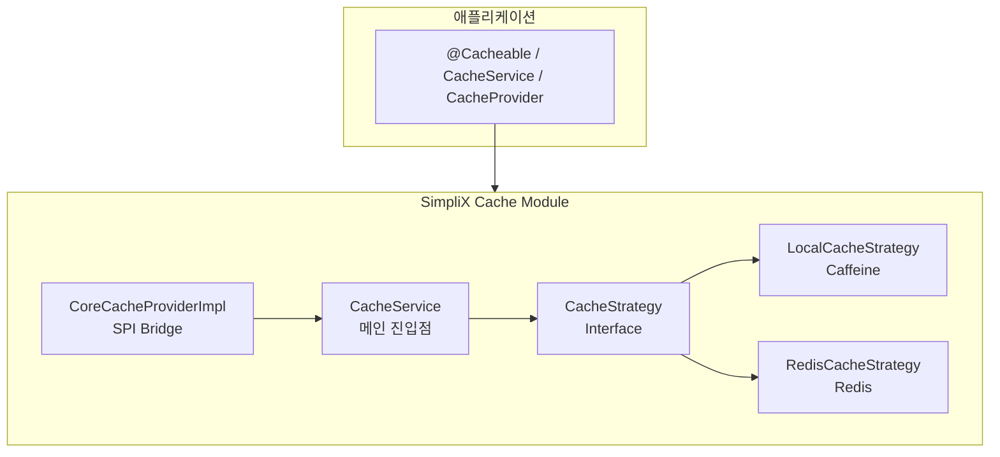

# SimpliX Cache Module Overview

## Table of Contents

- [Architecture](#architecture)
- [Core Components](#core-components)
- [Auto-Configuration](#auto-configuration)
- [Configuration Properties](#configuration-properties)
- [Cache Strategies](#cache-strategies)
- [Monitoring](#monitoring)
- [Environment Variables](#environment-variables)
- [Related Documents](#related-documents)

---

## Architecture



---

## Core Components

### CacheStrategy Interface

캐시 구현체의 공통 계약을 정의하는 인터페이스입니다:

```java
public interface CacheStrategy {
    // 기본 작업
    <T> Optional<T> get(String cacheName, Object key, Class<T> type);
    <T> void put(String cacheName, Object key, T value);
    <T> void put(String cacheName, Object key, T value, Duration ttl);
    <T> T getOrCompute(String cacheName, Object key, Callable<T> valueLoader, Class<T> type);
    <T> T getOrCompute(String cacheName, Object key, Callable<T> valueLoader, Class<T> type, Duration ttl);

    // 제거 작업
    void evict(String cacheName, Object key);
    void evictAll(String cacheName, Collection<?> keys);
    void clear(String cacheName);
    void clearAll();

    // 조회 작업
    boolean exists(String cacheName, Object key);
    Collection<Object> getKeys(String cacheName);
    <T> Map<Object, T> getAll(String cacheName, Class<T> type);
    <T> void putAll(String cacheName, Map<Object, T> entries);

    // 통계 및 라이프사이클
    CacheStatistics getStatistics(String cacheName);
    void initialize();
    void shutdown();
    boolean isAvailable();
}
```

### CacheStatistics

캐시 통계 정보를 담는 record:

```java
record CacheStatistics(
    long hits,        // 캐시 히트 수
    long misses,      // 캐시 미스 수
    long evictions,   // 제거된 항목 수
    long puts,        // 저장된 항목 수
    long removals,    // 삭제된 항목 수
    double hitRate,   // 히트율 (0.0 ~ 1.0)
    long size,        // 현재 캐시 크기
    long memoryUsage  // 메모리 사용량 (bytes)
) {}
```

**통계 필드 제한사항:**

| 필드 | Local (Caffeine) | Redis | 비고 |
|------|------------------|-------|------|
| `hits` | O | O (전역) | Redis는 서버 전체 통계 |
| `misses` | O | O (전역) | Redis는 서버 전체 통계 |
| `evictions` | O | O (전역) | Redis는 `evicted_keys` |
| `puts` | O | O | - |
| `removals` | X (항상 0) | X (항상 0) | 미구현 |
| `hitRate` | O | O | - |
| `size` | O | O | - |
| `memoryUsage` | X (항상 0) | X (항상 0) | 추가 Redis 명령 필요 |

**Redis 통계 주의:**
Redis의 `keyspace_hits`, `keyspace_misses`는 **전역 통계**로, 캐시명별 통계가 아닙니다.

### LocalCacheStrategy

Caffeine 라이브러리 기반의 로컬 캐시 구현체:

- **용도**: 단일 인스턴스 애플리케이션
- **특징**:
  - 인메모리 캐싱
  - 동시성 안전 (concurrent access)
  - TTL 기반 자동 만료
  - 캐시별 고정 TTL (중요: 캐시 이름당 TTL 고정)

**하드코딩 제한:**

| 항목 | 값 | 설명 |
|------|-----|------|
| 최대 캐시 크기 | 10,000 엔트리 | 캐시명당 최대 항목 수 |
| 기본 TTL | 1시간 (3600초) | `defaultTtlSeconds` 미설정 시 |
| TTL 불변성 | 캐시명 기준 | 한번 생성된 캐시는 TTL 변경 불가 |

**TTL 불변성 예시:**
```java
// 첫 호출: 30분 TTL로 캐시 생성
cacheService.put("users", "user1", user1, Duration.ofMinutes(30));

// 이후 호출: TTL 무시, 기존 30분 TTL 적용 (경고 로그 출력)
cacheService.put("users", "user2", user2, Duration.ofHours(1));
// WARN: Different TTL requested for existing cache 'users': ...
```

다른 TTL이 필요하면 별도 캐시명 사용:
```java
cacheService.put("usersShort", key, value, Duration.ofMinutes(5));
cacheService.put("usersLong", key, value, Duration.ofHours(1));
```

### RedisCacheStrategy

Redis 기반의 분산 캐시 구현체:

- **용도**: 다중 인스턴스 분산 환경
- **특징**:
  - Spring Data Redis (Lettuce) 사용
  - JSON 직렬화 (Jackson + JavaTimeModule)
  - 키 접두사 지원
  - 키별 개별 TTL 설정 가능

**Redis 키 생성 패턴:**

```
{keyPrefix}{cacheName}{KEY_SEPARATOR}{key}
```

| 요소 | 기본값 | 설명 |
|------|--------|------|
| `keyPrefix` | `cache:` | `redis.keyPrefix` 설정 |
| `KEY_SEPARATOR` | `::` | 하드코딩 (변경 불가) |

**예시:**
```
cache:users::user-123
cache:orders::order-456
```

**주의사항:**
- `KEYS` 명령 사용으로 대량 키 조회 시 성능 영향 가능
- null 값 자동 무시 (debug 로그 출력 후 반환)

### CacheService

캐시 작업의 주 진입점:

```java
@Service
public class CacheService {
    private final CacheStrategy strategy;

    // 모든 작업을 활성 전략에 위임
    public <T> Optional<T> get(String cacheName, Object key, Class<T> type) {
        return strategy.get(cacheName, key, type);
    }

    // ...
}
```

### CoreCacheProviderImpl

simplix-core의 `CacheProvider` SPI를 구현하는 브릿지:

```java
@Component
public class CoreCacheProviderImpl implements CacheProvider {
    private final CacheService cacheService;

    // CacheService를 통해 Core 모듈과 연동
}
```

---

## Auto-Configuration

### SimpliXCacheAutoConfiguration

Spring Boot 자동 구성 클래스:

```java
@AutoConfiguration
@EnableConfigurationProperties(CacheProperties.class)
@ConditionalOnProperty(name = "simplix.cache.enabled", havingValue = "true", matchIfMissing = true)
public class SimpliXCacheAutoConfiguration {
    // Bean definitions...
}
```

**조건부 빈 생성:**

| 빈 | 조건 |
|-----|------|
| `localCacheManager` | 기본 (Redis 미사용 시 fallback) |
| `localCacheStrategy` | 기본 |
| `redisCacheManager` | Redis 클래스패스 + `mode=redis` |
| `redisCacheStrategy` | Redis 클래스패스 + `mode=redis` |
| `cacheService` | 항상 생성 |
| `cacheHealthIndicator` | Actuator 사용 시 |
| `cacheMetricsCollector` | `metrics.enabled=true` |

---

## Configuration Properties

### 전체 설정 구조

```yaml
simplix:
  cache:
    # 캐시 활성화 (기본: true)
    enabled: true

    # 캐시 모드: local, redis
    mode: local

    # 기본 TTL (초)
    default-ttl-seconds: 3600

    # null 값 캐싱 여부
    cache-null-values: false

    # 캐시별 설정
    cache-configs:
      users:
        ttl-seconds: 900          # 15분
      configs:
        ttl-seconds: 86400        # 24시간

    # 메트릭 설정
    metrics:
      enabled: true

    # Redis 설정
    redis:
      key-prefix: "cache:"
      use-key-prefix: true
```

### CacheProperties 클래스

| 속성 | 타입 | 기본값 | 설명 |
|------|------|--------|------|
| `mode` | String | "local" | 캐시 전략 (local/redis) |
| `defaultTtlSeconds` | long | 3600 | 기본 TTL (초) |
| `cacheNullValues` | boolean | false | null 값 캐싱 여부 |
| `cacheConfigs` | Map | {} | 캐시별 설정 |
| `metrics.enabled` | boolean | true | 메트릭 수집 활성화 |
| `metrics.collectionIntervalSeconds` | long | 60 | 메트릭 수집 간격 (초) |
| `redis.keyPrefix` | String | "cache:" | Redis 키 접두사 |
| `redis.useKeyPrefix` | boolean | true | 키 접두사 사용 여부 |

### CacheMetricsCollector

주기적으로 캐시 통계를 수집하는 스케줄러:

```java
@Component
@ConditionalOnProperty(name = "simplix.cache.metrics.enabled", havingValue = "true", matchIfMissing = true)
public class CacheMetricsCollector {

    @Scheduled(fixedDelayString = "${simplix.cache.metrics.collectionIntervalSeconds:60}000")
    public void collectMetrics() {
        // 각 캐시의 통계 수집 및 로깅
    }
}
```

**설정:**
```yaml
simplix:
  cache:
    metrics:
      enabled: true
      collectionIntervalSeconds: 30  # 30초마다 수집 (기본: 60초)
```

### CoreCacheProviderImpl

simplix-core의 `CacheProvider` SPI를 구현하는 브릿지:

```java
@Component
public class CoreCacheProviderImpl implements CacheProvider {
    // ...

    @Override
    public int getPriority() {
        return 100;  // 높은 우선순위
    }
}
```

**우선순위 시스템:**
- 여러 `CacheProvider` 구현체가 있을 때 `getPriority()` 값이 높은 것이 선택됨
- `CoreCacheProviderImpl`은 100을 반환 (높은 우선순위)

---

## Cache Strategies

### 전략 비교

| 특성 | Local (Caffeine) | Redis |
|------|------------------|-------|
| 배포 형태 | 단일 인스턴스 | 다중 인스턴스 |
| 지연 시간 | 매우 낮음 (ns) | 낮음 (ms) |
| 외부 의존성 | 없음 | Redis 서버 필요 |
| 데이터 공유 | 불가 | 인스턴스 간 공유 |
| 영속성 | 없음 (재시작 시 소멸) | 설정에 따라 가능 |
| TTL 설정 | 캐시명별 고정 | 키별 개별 설정 가능 |

### 사용 시기

**Local Cache 권장:**
- 개발/테스트 환경
- 단일 인스턴스 배포
- 외부 의존성 최소화
- 극한의 낮은 지연 시간 요구

**Redis Cache 권장:**
- 운영 환경
- 다중 인스턴스 배포 (k8s, ECS 등)
- 인스턴스 간 캐시 공유 필요
- 재시작 후에도 캐시 유지 필요

---

## Monitoring

### Health Check

Actuator 헬스 엔드포인트:

```bash
curl http://localhost:8080/actuator/health/cache
```

응답:
```json
{
  "status": "UP",
  "details": {
    "strategy": "LocalCacheStrategy",
    "available": true
  }
}
```

### Metrics

자동 수집되는 메트릭:

| 메트릭 | 설명 |
|--------|------|
| `cache.hits` | 캐시 히트 수 |
| `cache.misses` | 캐시 미스 수 |
| `cache.evictions` | 제거된 항목 수 |
| `cache.hit.ratio` | 히트율 (%) |

```bash
curl http://localhost:8080/actuator/metrics/cache.hits
```

### Logging

로깅 레벨별 출력 내용:

| 레벨 | 내용 |
|------|------|
| TRACE | 모든 캐시 작업 (get, put, evict) |
| DEBUG | 캐시 히트/미스, 통계 |
| INFO | 전략 초기화, 연결 상태 |
| WARN | 연결 실패, 폴백 발생 |
| ERROR | 심각한 오류 |

```yaml
logging:
  level:
    dev.simplecore.simplix.cache: DEBUG
```

---

## Environment Variables

| 변수 | 설명 | 기본값 |
|------|------|--------|
| `CACHE_MODE` | 캐시 전략 | local |
| `CACHE_DEFAULT_TTL` | 기본 TTL (초) | 3600 |
| `CACHE_NULL_VALUES` | null 값 캐싱 | false |
| `CACHE_METRICS_ENABLED` | 메트릭 활성화 | true |
| `CACHE_REDIS_PREFIX` | Redis 키 접두사 | cache: |
| `REDIS_HOST` | Redis 호스트 | localhost |
| `REDIS_PORT` | Redis 포트 | 6379 |
| `REDIS_PASSWORD` | Redis 비밀번호 | (비어있음) |

---

## Related Documents

- [CacheService Guide](./cacheservice-guide.md) - CacheService API 사용법
- [Spring Cache Guide](./spring-cache-guide.md) - @Cacheable 어노테이션 통합
- [Advanced Guide](./advanced-guide.md) - 고급 사용법, 마이그레이션, 트러블슈팅
