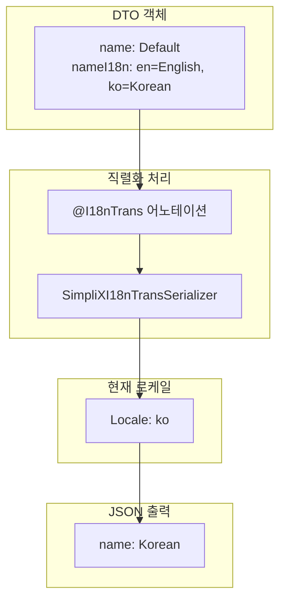

# I18n Translation Guide

JSON 직렬화 시 다국어 번역을 자동으로 적용하는 `@I18nTrans` 어노테이션 사용 가이드입니다.

## 목차

- [개요](#개요)
- [Architecture](#architecture)
- [Simple Mode](#simple-mode)
- [Nested Mode](#nested-mode)
- [Repeatable @I18nTrans](#repeatable-i18ntrans-복수-번역)
- [@JsonIncludeProperties와 함께 사용](#jsonincludeproperties와-함께-사용)
- [깊은 중첩 경로](#깊은-중첩-경로)
- [Fallback 체인](#fallback-체인)
- [설정](#설정)
- [주의사항](#주의사항)
- [API Reference](#api-reference)
- [예제: 완전한 DTO 구성](#예제-완전한-dto-구성)
- [Related Documents](#related-documents)

---

## 개요

`@I18nTrans`는 Jackson 직렬화 시점에 현재 로케일에 맞는 번역을 자동으로 적용하는 어노테이션입니다.

### 특징

- **자동 번역**: `LocaleContextHolder`의 현재 로케일에 맞는 번역 자동 적용
- **Fallback 체인**: 정확한 로케일 -> 언어 코드 -> 기본 로케일 순으로 폴백
- **두 가지 모드**: Simple mode와 Nested mode 지원
- **Repeatable 지원**: 하나의 필드에 여러 `@I18nTrans` 어노테이션 적용 가능
- **리플렉션 기반**: `@JsonIgnore`, `@JsonIncludeProperties`와 무관하게 동작

---

## Architecture



---

## Simple Mode

필드 자체를 번역하는 기본 모드입니다.

### 사용법

```java
public class UserRoleInfo {
    @I18nTrans(source = "roleNameI18n")
    private String roleName;

    @JsonIgnore
    private Map<String, String> roleNameI18n;

    // getters, setters
}
```

### 데이터 구조

```java
UserRoleInfo info = new UserRoleInfo();
info.setRoleName("Default Role");
info.setRoleNameI18n(Map.of(
    "en", "Administrator",
    "ko", "관리자",
    "ja", "管理者"
));
```

### 직렬화 결과

```java
// Locale: ko
LocaleContextHolder.setLocale(Locale.KOREAN);
objectMapper.writeValueAsString(info);
// {"roleName":"관리자"}

// Locale: en
LocaleContextHolder.setLocale(Locale.ENGLISH);
objectMapper.writeValueAsString(info);
// {"roleName":"Administrator"}
```

---

## Nested Mode

중첩 객체의 필드를 번역하는 모드입니다. `target` 속성을 지정하여 사용합니다.

### 사용법

```java
public class TagEntryDTO {
    @I18nTrans(source = "tagGroup.nameI18n", target = "tagGroup.name")
    private CmsTagGroup tagGroup;

    // getters, setters
}

public class CmsTagGroup {
    private Long id;
    private String code;
    private String name;

    @JsonIgnore
    private Map<String, String> nameI18n;

    // getters, setters
}
```

### 경로 설명

| 속성 | 설명 | 예시 |
|------|------|------|
| `source` | i18n Map 필드의 경로 | `"tagGroup.nameI18n"` |
| `target` | 번역 값을 설정할 필드 경로 | `"tagGroup.name"` |

### 데이터 구조

```java
CmsTagGroup tagGroup = new CmsTagGroup();
tagGroup.setId(1L);
tagGroup.setCode("CATEGORY");
tagGroup.setName("Default Category");
tagGroup.setNameI18n(Map.of(
    "en", "Category",
    "ko", "카테고리"
));

TagEntryDTO dto = new TagEntryDTO();
dto.setTagGroup(tagGroup);
```

### 직렬화 결과

```java
// Locale: ko
LocaleContextHolder.setLocale(Locale.KOREAN);
objectMapper.writeValueAsString(dto);
// {"tagGroup":{"id":1,"code":"CATEGORY","name":"카테고리"}}
```

---

## Repeatable @I18nTrans (복수 번역)

중첩 객체에 여러 개의 i18n 필드가 있을 때, 하나의 필드에 여러 `@I18nTrans` 어노테이션을 적용할 수 있습니다.

### 사용 시나리오

```java
// ProductTranslations에 name, description, category 3개의 i18n 필드가 있는 경우
public class ProductTranslations {
    private String name;
    private Map<String, String> nameI18n;

    private String description;
    private Map<String, String> descriptionI18n;

    private String category;
    private Map<String, String> categoryI18n;
}
```

### 사용법

```java
public class ProductDto {
    @I18nTrans(source = "translations.nameI18n", target = "translations.name")
    @I18nTrans(source = "translations.descriptionI18n", target = "translations.description")
    @I18nTrans(source = "translations.categoryI18n", target = "translations.category")
    private ProductTranslations translations;

    // getters, setters
}
```

### 데이터 구조

```java
ProductTranslations translations = new ProductTranslations();
translations.setName("Default Name");
translations.setNameI18n(Map.of("en", "Product Name", "ko", "상품명"));
translations.setDescription("Default Description");
translations.setDescriptionI18n(Map.of("en", "Product Description", "ko", "상품 설명"));
translations.setCategory("Default Category");
translations.setCategoryI18n(Map.of("en", "Electronics", "ko", "전자제품"));

ProductDto dto = new ProductDto();
dto.setTranslations(translations);
```

### 직렬화 결과

```java
// Locale: ko
LocaleContextHolder.setLocale(Locale.KOREAN);
objectMapper.writeValueAsString(dto);
// {
//   "translations": {
//     "name": "상품명",
//     "description": "상품 설명",
//     "category": "전자제품"
//   }
// }
```

### 부분 번역 처리

일부 i18n Map이 `null`이거나 비어있는 경우, 해당 필드만 원본 값을 유지합니다:

```java
translations.setNameI18n(Map.of("en", "Product Name", "ko", "상품명"));
translations.setDescriptionI18n(null);  // null인 경우
translations.setCategoryI18n(Map.of());  // 빈 Map인 경우

// 결과
// {
//   "translations": {
//     "name": "상품명",
//     "description": "Default Description",  // 원본 유지
//     "category": "Default Category"         // 원본 유지
//   }
// }
```

### 하위 호환성

기존에 단일 `@I18nTrans`를 사용하던 코드는 변경 없이 그대로 동작합니다:

```java
// 기존 코드 - 그대로 동작
@I18nTrans(source = "tagGroup.nameI18n", target = "tagGroup.name")
private CmsTagGroup tagGroup;
```

---

## @JsonIncludeProperties와 함께 사용

`@JsonIncludeProperties`와 `@I18nTrans`를 함께 사용할 수 있습니다. 두 가지 방식 모두 지원됩니다.

### 필드 레벨 어노테이션 (권장)

```java
public class TagEntryDTO {
    @JsonIncludeProperties({"id", "code", "name"})  // 필드 레벨
    @I18nTrans(source = "tagGroup.nameI18n", target = "tagGroup.name")
    private CmsTagGroup tagGroup;
}
```

**동작:**
- `@JsonIncludeProperties`에 지정된 필드만 JSON에 포함됩니다.
- `nameI18n`이 목록에 없어도 리플렉션으로 번역을 가져옵니다.
- `description` 등 목록에 없는 필드는 JSON에서 제외됩니다.

### 클래스 레벨 어노테이션

```java
@JsonIncludeProperties({"id", "code", "name"})
public class CmsTagGroup {
    private Long id;
    private String code;
    private String name;
    private String description;  // JSON에서 제외됨
    private Map<String, String> nameI18n;  // JSON에서 제외되지만 번역에 사용됨
}
```

**동작 원리**: `@I18nTrans` 시리얼라이저는 리플렉션으로 필드에 접근하므로, Jackson의 직렬화 필터와 무관하게 i18n Map을 읽을 수 있습니다. 직렬화 시에는 `BeanProperty`의 컨텍스트를 유지하여 필드 레벨 어노테이션도 올바르게 적용됩니다.

---

## 깊은 중첩 경로

여러 레벨의 중첩 객체도 dot notation으로 접근할 수 있습니다.

```java
public class DeepNestedDTO {
    @I18nTrans(
        source = "container.inner.nameI18n",
        target = "container.inner.name"
    )
    private OuterContainer container;
}

public class OuterContainer {
    private InnerTagGroup inner;
}

public class InnerTagGroup {
    private String name;

    @JsonIgnore
    private Map<String, String> nameI18n;
}
```

---

## Fallback 체인

번역을 찾는 순서는 다음과 같습니다:

| 순서 | 시도 | 예시 |
|------|------|------|
| 1 | 정확한 로케일 매칭 | `"ko_KR"` |
| 2 | 언어 코드만 | `"ko"` |
| 3 | 설정의 기본 로케일 | `SimpliXI18nConfigHolder.getDefaultLocale()` |
| 4 | 어노테이션의 기본 로케일 | `@I18nTrans(defaultLocale = "en")` |
| 5 | 지원 로케일 중 첫 번째 | `SimpliXI18nConfigHolder.getSupportedLocales()` |
| 6 | Map의 첫 번째 값 | 아무 값이나 |
| 7 | 원본 필드 값 | 번역 실패 시 |

---

## 설정

### Application Properties

```yaml
simplix:
  i18n:
    default-locale: en
    supported-locales:
      - en
      - ko
      - ja
```

### 설정 클래스

```java
@ConfigurationProperties(prefix = "simplix.i18n")
public class SimpliXI18nProperties {
    private String defaultLocale = "en";
    private List<String> supportedLocales = Arrays.asList("en", "ko", "ja");

    // getters, setters
}
```

---

## 주의사항

### 필드 값이 null인 경우

필드 값이 `null`이면 i18n Map이 있어도 번역되지 않고 `null`을 유지합니다.

```java
dto.setName(null);
dto.setNameI18n(Map.of("ko", "Korean Name"));

// 결과: {"name":null}
```

### i18n Map이 null 또는 비어있는 경우

번역 Map이 없으면 원본 필드 값을 그대로 사용합니다.

```java
dto.setName("Original Name");
dto.setNameI18n(null);

// 결과: {"name":"Original Name"}
```

### 로케일 형식

로케일 키는 다음 형식을 지원합니다:

- 언어 코드만: `"ko"`, `"en"`, `"ja"`
- 언어_국가: `"ko_KR"`, `"en_US"`, `"ja_JP"`

---

## API Reference

### @I18nTrans

| 속성 | 타입 | 기본값 | 설명 |
|------|------|--------|------|
| `source` | String | (필수) | i18n Map 필드 경로 (dot notation 지원) |
| `target` | String | `""` | 번역 값 설정 경로 (비어있으면 Simple mode) |
| `defaultLocale` | String | `"en"` | 폴백 기본 로케일 |

### @I18nTransList

`@I18nTrans`의 Container 어노테이션입니다. 여러 `@I18nTrans`를 동일 필드에 적용할 때 컴파일러가 자동으로 이 어노테이션으로 감쌉니다.

| 속성 | 타입 | 설명 |
|------|------|------|
| `value` | I18nTrans[] | @I18nTrans 어노테이션 배열 |

**참고**: 직접 사용할 필요 없이 `@I18nTrans`를 여러 번 선언하면 자동 적용됩니다.

### SimpliXI18nConfigHolder

| 메서드 | 반환 타입 | 설명 |
|--------|----------|------|
| `getDefaultLocale()` | String | 기본 로케일 코드 |
| `getSupportedLocales()` | List<String> | 지원하는 로케일 목록 |
| `initialize(properties)` | void | 설정 초기화 (Auto-Configuration에서 호출) |

---

## 예제: 완전한 DTO 구성

### 단일 번역

```java
@Schema(description = "Tag entry with translated tag group")
public class CmsTagEntryDTO {

    @Schema(description = "Tag entry ID")
    private Long id;

    @Schema(description = "Tag code")
    private String code;

    @Schema(description = "Tag group with translated name")
    @JsonIncludeProperties({"tagGroupId", "code", "name"})
    @I18nTrans(source = "tagGroup.nameI18n", target = "tagGroup.name")
    private CmsTagGroup tagGroup;

    // getters, setters
}
```

### 복수 번역 (Repeatable)

```java
@Schema(description = "Product with multiple translated fields")
public class ProductDTO {

    @Schema(description = "Product ID")
    private Long id;

    @Schema(description = "Product code")
    private String code;

    @Schema(description = "Product translations")
    @JsonIncludeProperties({"name", "description", "category"})
    @I18nTrans(source = "info.nameI18n", target = "info.name")
    @I18nTrans(source = "info.descriptionI18n", target = "info.description")
    @I18nTrans(source = "info.categoryI18n", target = "info.category")
    private ProductInfo info;

    // getters, setters
}
```

---

## Related Documents

- [Overview (개요)](./overview.md) - SimpliX Core 전체 개요
- [Type Converters Guide (타입 변환)](./type-converters.md) - Boolean, Enum, DateTime 변환