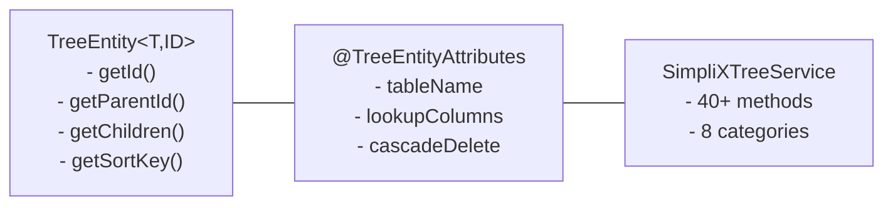

# Tree Structure Guide

## Overview

SimpliX Core는 계층 구조(트리) 데이터를 위한 포괄적인 지원을 제공합니다.



---

## TreeEntity Interface

계층 구조 엔티티를 위한 핵심 인터페이스입니다.

```java
public interface TreeEntity<T extends TreeEntity<T, ID>, ID> {
    ID getId();
    void setId(ID id);
    ID getParentId();
    void setParentId(ID parentId);
    List<T> getChildren();
    void setChildren(List<T> children);
    Comparable<?> getSortKey();

    default boolean isRoot() {
        return getParentId() == null;
    }

    default boolean isLeaf() {
        List<T> children = getChildren();
        return children == null || children.isEmpty();
    }
}
```

### 주요 메서드

| 메서드 | 설명 |
|--------|------|
| `getId()` | 엔티티 고유 ID |
| `getParentId()` | 부모 엔티티 ID (null이면 루트) |
| `getChildren()` | 직접 자식 목록 |
| `getSortKey()` | 형제 간 정렬 키 (Integer, Instant, String 등) |
| `isRoot()` | 루트 노드 여부 |
| `isLeaf()` | 리프 노드 여부 |

---

## SortableTreeEntity Interface

정렬 순서를 프로그래밍 방식으로 변경할 수 있는 트리 엔티티를 위한 확장 인터페이스입니다.

```java
public interface SortableTreeEntity<T extends SortableTreeEntity<T, ID>, ID>
        extends TreeEntity<T, ID> {

    Integer getSortOrder();
    void setSortOrder(Integer sortOrder);
}
```

### 사용 시점

| 인터페이스 | 사용 시점 |
|-----------|----------|
| `TreeEntity` | 정렬 키가 불변인 경우 (`createdAt`, `name` 등) |
| `SortableTreeEntity` | 정렬 순서를 변경할 수 있는 경우 (`sortOrder` 필드) |

### 구현 예제

```java
@Entity
public class Category implements SortableTreeEntity<Category, Long> {

    @Id
    private Long id;
    private Long parentId;
    private Integer sortOrder;

    @Transient
    private List<Category> children = new ArrayList<>();

    @Override
    public Integer getSortOrder() {
        return sortOrder;
    }

    @Override
    public void setSortOrder(Integer sortOrder) {
        this.sortOrder = sortOrder;
    }

    @Override
    public Comparable<?> getSortKey() {
        return sortOrder;
    }

    // ... 기타 getter/setter
}
```

---

## @TreeEntityAttributes

트리 엔티티의 메타데이터를 설정하는 어노테이션입니다.

```java
@Target(ElementType.TYPE)
@Retention(RetentionPolicy.RUNTIME)
public @interface TreeEntityAttributes {
    String tableName();                              // 테이블명
    String idColumn();                               // ID 컬럼명
    String parentIdColumn();                         // 부모 ID 컬럼명
    String sortOrderColumn();                        // 정렬 컬럼명
    LookupColumn[] lookupColumns() default {};       // 검색 컬럼
    SortDirection sortDirection() default SortDirection.ASC;  // 정렬 방향
    boolean cascadeDelete() default false;           // 캐스케이드 삭제
    int maxDepth() default -1;                       // 최대 깊이 (-1: 무제한)
}
```

### 속성 설명

| 속성 | 기본값 | 설명 |
|------|--------|------|
| `tableName` | (필수) | 데이터베이스 테이블명 |
| `idColumn` | (필수) | 기본 키 컬럼명 |
| `parentIdColumn` | (필수) | 부모 참조 컬럼명 |
| `sortOrderColumn` | (필수) | 정렬 순서 컬럼명 |
| `lookupColumns` | `{}` | 검색 가능 컬럼 정의 |
| `sortDirection` | `ASC` | 정렬 방향 (ASC/DESC) |
| `cascadeDelete` | `false` | 자식 자동 삭제 여부 |
| `maxDepth` | `-1` | 트리 탐색 최대 깊이 |

---

## @LookupColumn

검색 가능한 컬럼을 정의합니다.

```java
@LookupColumn(name = "name", type = ColumnType.STRING)
@LookupColumn(name = "active", type = ColumnType.BOOLEAN)
@LookupColumn(name = "priority", type = ColumnType.NUMBER)
```

### ColumnType

| 타입 | 설명 | SQL 타입 |
|------|------|----------|
| `STRING` | 문자열 | VARCHAR, CHAR, TEXT |
| `NUMBER` | 숫자 | INT, BIGINT, DECIMAL |
| `BOOLEAN` | 불리언 | BOOLEAN, BIT, TINYINT |

### 쿼리 동작

- **STRING**: 정확 일치 및 패턴 매칭 지원
- **NUMBER**: 동등 비교 및 범위 비교 지원
- **BOOLEAN**: true/false, 1/0, yes/no 입력 자동 변환

---

## SortDirection

정렬 방향을 지정합니다.

```java
public enum SortDirection {
    ASC,   // 오름차순 (1, 2, 3... / oldest first / A-Z)
    DESC   // 내림차순 (3, 2, 1... / newest first / Z-A)
}
```

---

## 트리 엔티티 정의 예제

### Category 엔티티 (정수 기반 정렬)

```java
@Entity
@Table(name = "categories")
@TreeEntityAttributes(
    tableName = "categories",
    idColumn = "id",
    parentIdColumn = "parent_id",
    sortOrderColumn = "sort_order",
    sortDirection = SortDirection.ASC,
    cascadeDelete = true,
    maxDepth = 10,
    lookupColumns = {
        @LookupColumn(name = "name", type = ColumnType.STRING),
        @LookupColumn(name = "active", type = ColumnType.BOOLEAN)
    }
)
@Getter
@Setter
public class Category implements TreeEntity<Category, Long> {

    @Id
    @GeneratedValue(strategy = GenerationType.IDENTITY)
    private Long id;

    @Column(name = "parent_id")
    private Long parentId;

    private String name;
    private String description;
    private Boolean active = true;

    @Column(name = "sort_order")
    private Integer sortOrder;

    @Transient
    private List<Category> children = new ArrayList<>();

    @Override
    public Comparable<?> getSortKey() {
        return sortOrder;
    }
}
```

### Menu 엔티티 (시간 기반 정렬)

```java
@Entity
@Table(name = "menus")
@TreeEntityAttributes(
    tableName = "menus",
    idColumn = "id",
    parentIdColumn = "parent_id",
    sortOrderColumn = "created_at",
    sortDirection = SortDirection.DESC,  // 최신순
    lookupColumns = {
        @LookupColumn(name = "title", type = ColumnType.STRING),
        @LookupColumn(name = "visible", type = ColumnType.BOOLEAN)
    }
)
@Getter
@Setter
public class Menu implements TreeEntity<Menu, UUID> {

    @Id
    @UuidGenerator(style = UuidGenerator.Style.TIME)
    private UUID id;

    @Column(name = "parent_id")
    private UUID parentId;

    private String title;
    private String url;
    private Boolean visible = true;

    @Column(name = "created_at")
    private Instant createdAt;

    @Transient
    private List<Menu> children = new ArrayList<>();

    @Override
    public Comparable<?> getSortKey() {
        return createdAt;  // 시간 기반 정렬
    }
}
```

---

## SimpliXTreeRepository

트리 구조 전용 리포지토리입니다.

```java
@NoRepositoryBean
public interface SimpliXTreeRepository<T extends TreeEntity<T, ID>, ID>
    extends JpaRepository<T, ID> {

    List<T> findCompleteHierarchy();           // 전체 계층 조회
    List<T> findItemWithAllDescendants(ID id); // 특정 항목 + 하위 전체
    List<T> findRootItems();                   // 루트 항목들
    List<T> findDirectChildren(ID parentId);   // 직접 자식들
    List<T> buildHierarchy(List<T> allItems);  // 메모리 계층 구성
    List<T> findByLookup(Map<String, String> parameters);  // 검색
}
```

### 리포지토리 정의

```java
public interface CategoryRepository
    extends SimpliXTreeRepository<Category, Long> {

    List<Category> findByActive(Boolean active);
}
```

---

## SimpliXTreeService

트리 구조를 위한 포괄적인 서비스 인터페이스입니다. **40개 이상의 메서드**를 8개 카테고리로 제공합니다.

### 메서드 카테고리 요약

| 카테고리 | 메서드 수 | 설명 |
|----------|----------|------|
| **CRUD** | 5 | 기본 생성, 조회, 수정, 삭제 |
| **탐색** | 6 | 계층 구조 탐색 |
| **조작** | 4 | 이동, 복사, 재정렬 |
| **검색** | 6 | Lookup, 레벨, 리프 노드, 조건 검색 |
| **벌크** | 3 | 대량 생성, 수정, 삭제 |
| **분석** | 4 | 메트릭스, 깊이, 경로, 후손 확인 |
| **검증** | 2 | 무결성 검증, 구조 복구 |
| **호환성** | 3 | 레거시 메서드 |

---

### CRUD Operations

```java
// 생성
Category category = new Category();
category.setName("Electronics");
category.setParentId(null);  // 루트 카테고리
Category created = categoryService.create(category);

// 조회
Optional<Category> found = categoryService.findById(1L);

// 페이지네이션 조회
Page<Category> page = categoryService.findAll(PageRequest.of(0, 20));

// 수정
category.setName("Consumer Electronics");
Category updated = categoryService.update(category);

// 삭제
categoryService.deleteById(1L);
```

---

### Tree Traversal (트리 탐색)

```java
// 전체 계층 조회 (루트부터 모든 하위 포함)
List<Category> hierarchy = categoryService.findCompleteHierarchy();

// 특정 항목 + 모든 하위 항목
List<Category> subtree = categoryService.findWithDescendants(1L);

// 루트 항목들만
List<Category> roots = categoryService.findRoots();

// 특정 부모의 직접 자식들
List<Category> children = categoryService.findDirectChildren(1L);

// 조상 조회 (부모 → 최상위 루트)
List<Category> ancestors = categoryService.findAncestors(10L);

// 형제 조회 (같은 부모를 가진 항목들)
List<Category> siblings = categoryService.findSiblings(5L);
```

---

### Tree Manipulation (트리 조작)

```java
// 이동 (다른 부모로)
Category moved = categoryService.move(5L, 2L);  // ID 5를 ID 2의 자식으로

// 루트로 이동
Category movedToRoot = categoryService.move(5L, null);

// 서브트리 복사
Category copied = categoryService.copySubtree(1L, 10L);

// 속성 오버라이드와 함께 복사
Map<String, Object> overrides = Map.of(
    "active", false,
    "name", "Copied Category"
);
Category copiedWithProps = categoryService.copySubtreeWithProperties(1L, 10L, overrides);

// 자식 순서 재정렬
List<Long> newOrder = List.of(3L, 1L, 2L);
categoryService.reorderChildren(parentId, newOrder);
```

---

### Search Operations (검색)

```java
// Lookup 컬럼으로 검색
Map<String, String> params = Map.of(
    "name", "Electronics",
    "active", "true"
);
List<Category> results = categoryService.findByLookup(params);

// 페이지네이션과 함께
Page<Category> pagedResults = categoryService.findByLookup(
    params,
    PageRequest.of(0, 20)
);

// 계층 컨텍스트와 함께 검색 (조상 포함)
List<Category> withHierarchy = categoryService.findHierarchyByLookup(params);

// 특정 레벨의 항목들
List<Category> level2 = categoryService.findByLevel(2);

// 리프 노드들 (자식 없는 항목)
List<Category> leaves = categoryService.findLeafNodes();

// 커스텀 조건으로 검색
List<Category> custom = categoryService.findByPredicate(
    cat -> cat.getName().startsWith("A") && cat.getActive()
);
```

---

### Bulk Operations (벌크 작업)

```java
// 대량 생성
List<Category> categories = List.of(cat1, cat2, cat3);
List<Category> created = categoryService.createBatch(categories);

// 대량 수정
List<Category> updated = categoryService.updateBatch(categories);

// 대량 삭제
List<Long> idsToDelete = List.of(1L, 2L, 3L);
categoryService.deleteBatch(idsToDelete);
```

---

### Analysis & Metrics (분석)

```java
// 트리 메트릭스 조회
Map<String, Number> metrics = categoryService.getTreeMetrics();
// {
//   "totalNodes": 150,
//   "maxDepth": 5,
//   "avgDepth": 2.3,
//   "leafNodes": 80,
//   "branchNodes": 70,
//   "rootNodes": 10,
//   "avgChildren": 2.1
// }

// 후손 여부 확인
boolean isChild = categoryService.isDescendantOf(10L, 1L);

// 깊이 조회 (루트는 0)
int depth = categoryService.getDepth(10L);

// 경로 조회 (루트 → 현재)
List<Category> path = categoryService.getPath(10L);
```

---

### Validation & Integrity (검증)

```java
// 무결성 검증
Map<String, List<String>> issues = categoryService.validateTreeIntegrity();
// {
//   "circularReferences": ["Category 5 -> 3 -> 5"],
//   "orphanedNodes": ["Category 15 has non-existent parent 999"]
// }

// 구조 복구 (고아 노드 등 처리)
int repaired = categoryService.repairTreeStructure();
```

---

## 서비스 구현 예제

```java
@Service
@RequiredArgsConstructor
public class CategoryService extends SimpliXTreeBaseService<Category, Long> {

    private final CategoryRepository categoryRepository;

    @Override
    protected SimpliXTreeRepository<Category, Long> getRepository() {
        return categoryRepository;
    }

    // 커스텀 메서드 추가
    public List<Category> findActiveCategories() {
        return categoryRepository.findByActive(true);
    }

    public Category findByName(String name) {
        return findByLookup(Map.of("name", name))
            .stream()
            .findFirst()
            .orElseThrow(() -> new SimpliXGeneralException(
                ErrorCode.GEN_NOT_FOUND,
                "Category not found",
                Map.of("name", name)
            ));
    }
}
```

---

## SimpliXSortableTreeBaseService

`SortableTreeEntity`를 구현한 엔티티를 위한 확장 서비스입니다. `reorderChildren()` 메서드의 기본 구현을 제공합니다.

```java
@Service
public class CategoryService extends SimpliXSortableTreeBaseService<Category, Long> {

    public CategoryService(SimpliXTreeRepository<Category, Long> repository) {
        super(repository);
    }

    // reorderChildren()이 기본 구현됨
}
```

### reorderChildren 동작

```java
// 자식 노드 순서 변경
List<Long> newOrder = List.of(3L, 1L, 2L);
categoryService.reorderChildren(parentId, newOrder);

// 내부 동작:
// - ID 3의 sortOrder = 0
// - ID 1의 sortOrder = 1
// - ID 2의 sortOrder = 2
```

---

## 유틸리티 메서드

`SimpliXTreeBaseService`는 트리 작업에 유용한 protected 유틸리티 메서드를 제공합니다.

### normalizeParentId

빈 문자열을 null로 변환합니다. 폼 입력에서 빈 문자열이 루트를 의미할 때 유용합니다.

```java
@Override
public Category create(CategoryDTO dto) {
    Category entity = new Category();
    entity.setParentId(normalizeParentId(dto.getParentId()));  // "" -> null
    return save(entity);
}
```

### validateNoCircularReference

순환 참조를 방지합니다. 노드를 자신의 하위 노드로 이동하려 할 때 예외를 발생시킵니다.

```java
@Override
public Category move(Long id, Long newParentId) {
    validateNoCircularReference(id, newParentId);
    // 또는 커스텀 예외 사용
    validateNoCircularReference(id, newParentId,
        () -> new SimpliXGeneralException(ErrorCode.TREE_CIRCULAR_REFERENCE));
    return super.move(id, newParentId);
}
```

### validateNoChildren

자식이 있는 노드의 삭제를 방지합니다.

```java
@Override
public void deleteById(Long id) {
    validateNoChildren(id);
    // 또는 커스텀 예외 사용
    validateNoChildren(id,
        () -> new SimpliXGeneralException(ErrorCode.TREE_HAS_CHILDREN));
    super.deleteById(id);
}
```

### buildTreeFromFlatList

플랫 리스트에서 트리 구조를 재구성합니다. JPA 관계 없이 노드를 가져온 후 메모리에서 트리를 구성할 때 유용합니다.

```java
public List<Category> getTreeFromCustomQuery() {
    List<Category> flatNodes = categoryRepository.findByCustomCriteria();
    return buildTreeFromFlatList(flatNodes, null);  // null = 루트 노드들 반환
}
```

### mapToTreeDto

엔티티 트리를 DTO 트리로 재귀적으로 변환합니다.

```java
public List<CategoryDTO> getTreeAsDto() {
    List<Category> entityTree = findCompleteHierarchy();

    return mapToTreeDto(
        entityTree,
        entity -> modelMapper.map(entity, CategoryDTO.class),  // 엔티티 -> DTO 변환
        Category::getChildren,                                   // 자식 getter
        CategoryDTO::setChildren                                 // 자식 setter
    );
}
```

### 유틸리티 메서드 요약

| 메서드 | 설명 |
|--------|------|
| `normalizeParentId(ID)` | 빈 문자열을 null로 변환 |
| `validateNoCircularReference(ID, ID)` | 순환 참조 검증 |
| `validateNoChildren(ID)` | 자식 존재 여부 검증 |
| `buildTreeFromFlatList(List, ID)` | 플랫 리스트 → 트리 구조 |
| `mapToTreeDto(List, Function, Function, BiConsumer)` | 엔티티 트리 → DTO 트리 |

---

## 트리 구조 시각화

```
findCompleteHierarchy() 결과:

Electronics (id=1, parentId=null)
├── Computers (id=2, parentId=1)
│   ├── Laptops (id=4, parentId=2)
│   └── Desktops (id=5, parentId=2)
├── Mobile (id=3, parentId=1)
│   ├── Smartphones (id=6, parentId=3)
│   └── Tablets (id=7, parentId=3)
└── Audio (id=8, parentId=1)
    ├── Headphones (id=9, parentId=8)
    └── Speakers (id=10, parentId=8)
```

---

## 성능 고려사항

### Lazy Loading

```java
@Entity
public class Category implements TreeEntity<Category, Long> {
    // children은 @Transient로 선언하여 필요할 때만 로드
    @Transient
    private List<Category> children = new ArrayList<>();
}
```

### 캐싱

- `findAncestors()`, `getDepth()`, `getPath()` 등은 내부적으로 캐싱 활용
- 자주 접근하는 경로는 캐시에 저장

### 벌크 작업

- 대량 데이터 처리 시 `createBatch()`, `updateBatch()`, `deleteBatch()` 사용
- 개별 작업보다 성능 향상

### maxDepth 설정

```java
@TreeEntityAttributes(
    // ...
    maxDepth = 5  // 5단계까지만 탐색
)
```

---

## Related Documents

- [Overview (아키텍처 개요)](./overview.md) - 모듈 구조
- [Entity & Repository Guide (엔티티/리포지토리)](./entity-repository.md) - 베이스 엔티티
- [Type Converters Guide (타입 변환)](./type-converters.md) - Boolean, Enum, DateTime 변환
- [Security Guide (보안)](./security.md) - XSS 방지, 해싱, 마스킹
- [Exception & API Guide (예외/API)](./exception-api.md) - 에러 코드, API 응답
- [Cache Guide (캐시)](./cache.md) - CacheManager, CacheProvider
- [I18n Translation Guide (다국어 번역)](./i18n-translation.md) - @I18nTrans, 자동 번역
