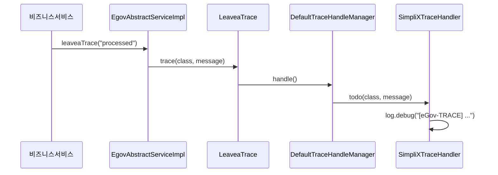

# SimpliX eGov Module Overview

전자정부 표준프레임워크(eGovFrame) 5.0.0과 Spring Boot 애플리케이션을 통합하는 자동 구성 모듈입니다. `EgovAbstractServiceImpl`이 의존하는 핵심 빈(`LeaveaTrace`, `TraceHandler`, `TraceHandlerService`)을 자동 등록하여 별도 XML 설정 없이 eGovFrame 표준 서비스 구조를 즉시 사용할 수 있도록 합니다.

## Architecture

```mermaid
flowchart TB
    SVC["EgovAbstractServiceImpl 상속<br/>비즈니스 서비스"]
    AUTO["SimpliXEgovAutoConfiguration"]
    CONFIG["SimpliXEgovConfiguration"]
    TRACE["LeaveaTrace<br/>(eGovFrame 핵심 빈)"]
    MANAGER["DefaultTraceHandleManager"]
    HANDLER["SimpliXTraceHandler<br/>(SLF4J 기반)"]

    SVC -->|@Resource| TRACE
    AUTO --> CONFIG
    CONFIG --> TRACE
    CONFIG --> MANAGER
    CONFIG --> HANDLER
    TRACE --> MANAGER
    MANAGER -->|패턴 매칭| HANDLER
```

---

## Core Components

### SimpliXEgovAutoConfiguration

```java
@AutoConfiguration
@ConditionalOnClass(name = "org.egovframe.rte.fdl.cmmn.EgovAbstractServiceImpl")
@ConditionalOnProperty(name = "simplix.egov.enabled", havingValue = "true", matchIfMissing = true)
@EnableConfigurationProperties(SimpliXEgovProperties.class)
@Import(SimpliXEgovConfiguration.class)
public class SimpliXEgovAutoConfiguration { ... }
```

활성화 조건: 클래스패스에 `EgovAbstractServiceImpl`이 있고 `simplix.egov.enabled=true`인 경우.

### SimpliXEgovConfiguration

eGovFrame 빈 그래프를 구성합니다.

| Bean | Type | Conditional |
|------|------|-------------|
| `simplixTraceHandler` | `SimpliXTraceHandler` | `@ConditionalOnMissingBean` (사용자 빈 우선) |
| `traceHandlerService` | `DefaultTraceHandleManager` | 무조건 등록. `*` 패턴으로 모든 클래스에 핸들러 매칭 |
| `leaveaTrace` | `LeaveaTrace` | `@ConditionalOnMissingBean(name="leaveaTrace")` |

### SimpliXTraceHandler

`leaveaTrace()` 호출 메시지를 SLF4J 디버그 로그로 출력하는 기본 구현체입니다.

```java
public class SimpliXTraceHandler implements TraceHandler {
    @Override
    public void todo(Class<?> clazz, String message) {
        log.debug("[eGov-TRACE] {}: {}", clazz.getName(), message);
    }
}
```

---

## Configuration Properties

```yaml
simplix:
  egov:
    enabled: true   # 모듈 활성화 (기본값)
```

| Property | Type | Default | Description |
|----------|------|---------|-------------|
| `simplix.egov.enabled` | boolean | `true` | eGov 자동 구성 활성화 여부 |

---

## Sequence



---

## Customization

기본 `SimpliXTraceHandler`를 다른 출력으로 교체하려면 동일 타입의 빈을 등록합니다. `@ConditionalOnMissingBean`으로 자동 비활성화됩니다.

```java
@Bean
public SimpliXTraceHandler auditTraceHandler(AuditService auditService) {
    return new SimpliXTraceHandler() {
        @Override
        public void todo(Class<?> clazz, String message) {
            auditService.record(clazz.getName(), message);
        }
    };
}
```

추적 로그 활성화:

```yaml
logging:
  level:
    dev.simplecore.simplix.egov: DEBUG
```

---

## Log4j Conflict Avoidance

다음 모듈은 SLF4J/Logback 환경과 충돌하므로 자동 제외됩니다.

| Group | Module | 사유 |
|-------|--------|------|
| `org.apache.logging.log4j` | `log4j-slf4j2-impl` | SLF4J 바인딩 충돌 |
| `org.apache.logging.log4j` | `log4j-core` | Logback과 동시 사용 시 충돌 |

---

## Related Documents

- [README](../../README.md) - 모듈 소개 및 빠른 시작
