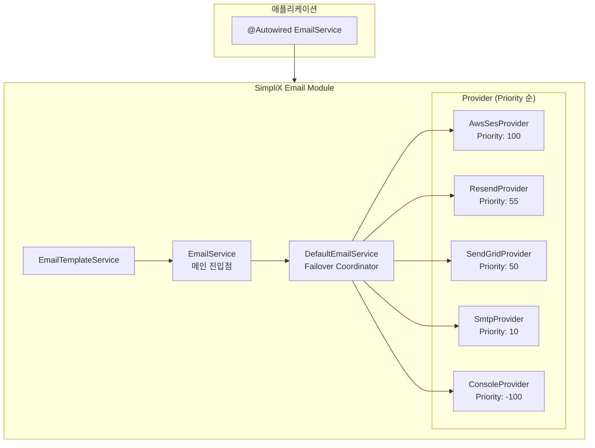

# SimpliX Email Module Overview

## Architecture



---

## Core Components

### EmailService Interface

이메일 발송의 주 진입점:

```java
public interface EmailService {
    // Synchronous operations
    EmailResult send(EmailRequest request);
    EmailResult sendTemplate(TemplateEmailRequest request);
    EmailResult sendTemplate(String templateCode, String to, Map<String, Object> variables);
    BulkEmailResult sendBulk(BulkEmailRequest request);

    // Asynchronous operations
    CompletableFuture<EmailResult> sendAsync(EmailRequest request);
    CompletableFuture<EmailResult> sendTemplateAsync(TemplateEmailRequest request);
    CompletableFuture<BulkEmailResult> sendBulkAsync(BulkEmailRequest request);

    // Status check
    boolean isAvailable();
}
```

### DefaultEmailService

`EmailService` 인터페이스의 기본 구현체:

- **Provider Failover**: Priority 기반으로 Provider 순회
- **Async Executor**: `ThreadPoolTaskExecutor` 사용
- **Default From**: 설정된 기본 발신자 주소 사용
- **Template Processing**: `EmailTemplateService`와 연동

### EmailProvider Interface

각 이메일 서비스 Provider의 공통 인터페이스:

```java
public interface EmailProvider {
    EmailResult send(EmailRequest request);
    MailProviderType getType();
    boolean isAvailable();
    default int getPriority() { return 0; }
    default boolean supportsBulkSend() { return false; }
}
```

### Provider Implementations

| Provider | Class | Priority | Bulk 지원 | 용도 |
|----------|-------|----------|-----------|------|
| AWS SES | `AwsSesEmailProvider` | 100 | ✔ | Production (AWS) |
| Resend | `ResendEmailProvider` | 55 | ✔ | Production |
| SendGrid | `SendGridEmailProvider` | 50 | ✔ | Production |
| SMTP | `SmtpEmailProvider` | 10 | - | Self-hosted |
| Console | `ConsoleEmailProvider` | -100 | - | Development |

### EmailTemplateEngine

Thymeleaf 기반 템플릿 처리 엔진:

```java
public class EmailTemplateEngine {
    public String processText(String template, Map<String, Object> variables, Locale locale);
    public String processHtml(String template, Map<String, Object> variables, Locale locale);
    public ProcessedTemplate process(ResolvedTemplate resolved, Map<String, Object> variables);

    public record ProcessedTemplate(String subject, String htmlBody, String textBody) {
        public boolean hasHtmlBody();
        public boolean hasTextBody();
    }
}
```

### EmailTemplateResolver Interface

템플릿 소스 로딩 인터페이스:

```java
public interface EmailTemplateResolver {
    Optional<ResolvedTemplate> resolve(String templateCode, Locale locale);
    boolean exists(String templateCode);
    default int getPriority() { return 0; }

    record ResolvedTemplate(
        String code,
        String subject,
        String htmlBody,
        String textBody,
        Locale locale
    ) {}
}
```

| Resolver | Priority | 설명 |
|----------|----------|------|
| `DatabaseEmailTemplateResolver` | 100 | DB에서 템플릿 로딩 |
| `ClasspathEmailTemplateResolver` | 10 | 클래스패스 리소스에서 로딩 |

---

## Auto-Configuration

### EmailAutoConfiguration

Spring Boot 자동 구성 클래스:

```java
@AutoConfiguration
@EnableConfigurationProperties(EmailProperties.class)
@ConditionalOnProperty(prefix = "simplix.email", name = "enabled",
                       havingValue = "true", matchIfMissing = true)
public class EmailAutoConfiguration {
    // Bean definitions...
}
```

**자동 생성되는 Bean:**

| Bean | 조건 | 설명 |
|------|------|------|
| `textTemplateEngine` | 항상 | TEXT 모드 Thymeleaf 엔진 |
| `htmlTemplateEngine` | 항상 | HTML 모드 Thymeleaf 엔진 |
| `emailTemplateEngineWrapper` | 항상 | 두 엔진 통합 래퍼 |
| `classpathEmailTemplateResolver` | 항상 | 클래스패스 템플릿 리졸버 |
| `emailTemplateService` | 항상 | 템플릿 서비스 |
| `emailAsyncExecutor` | 항상 | 비동기 처리용 Executor |
| `consoleEmailProvider` | 항상 | Console Provider (fallback) |
| `smtpEmailProvider` | `smtp.enabled=true` | SMTP Provider |
| `awsSesEmailProvider` | `aws-ses.enabled=true` + SDK | AWS SES Provider |
| `sendGridEmailProvider` | `sendgrid.enabled=true` + SDK | SendGrid Provider |
| `resendEmailProvider` | `resend.enabled=true` + SDK | Resend Provider |
| `emailService` | 항상 | DefaultEmailService |

---

## Configuration Properties

### 전체 설정 구조

```yaml
simplix:
  email:
    # 이메일 모듈 활성화 (기본: true)
    enabled: true

    # 기본 Provider (CONSOLE, SMTP, AWS_SES, SENDGRID, RESEND)
    provider: CONSOLE

    # 기본 발신자 설정
    from:
      address: noreply@example.com
      name: My Application

    # SMTP 설정
    smtp:
      enabled: false
      host: smtp.example.com
      port: 587
      username: user@example.com
      password: secret
      starttls: true
      ssl: false
      connection-timeout: 10000
      timeout: 10000

    # AWS SES 설정
    aws-ses:
      enabled: false
      region: us-east-1
      configuration-set: my-config-set
      access-key: AKIA...        # Optional (IAM Role 사용 시 생략)
      secret-key: ...            # Optional

    # SendGrid 설정
    sendgrid:
      enabled: false
      api-key: SG.xxxx

    # Resend 설정
    resend:
      enabled: false
      api-key: re_xxxx

    # 템플릿 설정
    template:
      base-path: templates/email
      database-enabled: false

    # 비동기 처리 설정
    async:
      core-pool-size: 2
      max-pool-size: 10
      queue-capacity: 100
      thread-name-prefix: email-async-
```

### EmailProperties 클래스

| 속성 | 타입 | 기본값 | 설명 |
|------|------|--------|------|
| `enabled` | boolean | true | 이메일 모듈 활성화 |
| `provider` | MailProviderType | CONSOLE | 기본 Provider |
| `from.address` | String | - | 기본 발신자 이메일 |
| `from.name` | String | - | 기본 발신자 이름 |
| `smtp.enabled` | boolean | false | SMTP 활성화 |
| `smtp.host` | String | - | SMTP 호스트 |
| `smtp.port` | int | 587 | SMTP 포트 |
| `smtp.username` | String | - | SMTP 사용자명 |
| `smtp.password` | String | - | SMTP 비밀번호 |
| `smtp.starttls` | boolean | true | STARTTLS 사용 |
| `smtp.ssl` | boolean | false | SSL 사용 |
| `smtp.connection-timeout` | int | 10000 | 연결 타임아웃 (ms) |
| `smtp.timeout` | int | 10000 | 요청 타임아웃 (ms) |
| `aws-ses.enabled` | boolean | false | AWS SES 활성화 |
| `aws-ses.region` | String | - | AWS 리전 |
| `aws-ses.configuration-set` | String | - | SES Configuration Set |
| `aws-ses.access-key` | String | - | AWS Access Key (선택) |
| `aws-ses.secret-key` | String | - | AWS Secret Key (선택) |
| `sendgrid.enabled` | boolean | false | SendGrid 활성화 |
| `sendgrid.api-key` | String | - | SendGrid API Key |
| `resend.enabled` | boolean | false | Resend 활성화 |
| `resend.api-key` | String | - | Resend API Key |
| `template.base-path` | String | templates/email | 템플릿 기본 경로 |
| `template.database-enabled` | boolean | false | DB 템플릿 활성화 |
| `async.core-pool-size` | int | 2 | 코어 스레드 수 |
| `async.max-pool-size` | int | 10 | 최대 스레드 수 |
| `async.queue-capacity` | int | 100 | 큐 용량 |
| `async.thread-name-prefix` | String | email-async- | 스레드 이름 접두사 |

---

## Model Classes

### 주요 모델

| 클래스 | 설명 |
|--------|------|
| `EmailRequest` | 기본 이메일 요청 |
| `TemplateEmailRequest` | 템플릿 기반 요청 |
| `BulkEmailRequest` | 대량 발송 요청 |
| `EmailResult` | 발송 결과 |
| `BulkEmailResult` | 대량 발송 결과 |
| `EmailAddress` | 이메일 주소 (이름 포함) |
| `EmailAttachment` | 첨부 파일 |

### Enumerations

**MailProviderType:**
```java
public enum MailProviderType {
    CONSOLE,    // Development only
    SMTP,       // Traditional SMTP
    AWS_SES,    // Amazon SES
    SENDGRID,   // SendGrid service
    RESEND      // Resend service
}
```

**MailPriority:**
```java
public enum MailPriority {
    LOW(1),         // Marketing, newsletters
    NORMAL(3),      // Standard transactional
    HIGH(5),        // Important notifications
    CRITICAL(10)    // Security alerts
}
```

**EmailStatus:**
```java
public enum EmailStatus {
    PENDING,      // Queued
    SENDING,      // Being processed
    SENT,         // Sent to provider
    DELIVERED,    // Delivered to recipient
    FAILED,       // Failed
    BOUNCED,      // Bounced
    COMPLAINED,   // Marked as spam
    SUPPRESSED    // On suppression list
}
```

---

## Provider Failover

### 동작 방식

1. 활성화된 모든 Provider를 Priority 내림차순으로 정렬
2. 가장 높은 Priority의 Provider부터 발송 시도
3. 실패 시 retryable 에러인 경우 다음 Provider로 시도
4. 모든 Provider 실패 시 마지막 에러 반환

### Priority 순서

```
AWS SES (100) → Resend (55) → SendGrid (50) → SMTP (10) → Console (-100)
```

### Retryable vs Non-Retryable

| Provider | Retryable | Non-Retryable |
|----------|-----------|---------------|
| SMTP | 연결 타임아웃, 네트워크 오류 | 인증 실패 |
| AWS SES | Throttling, ServiceUnavailable | 잘못된 파라미터, 인증 실패 |
| SendGrid | HTTP 429, 5xx 서버 오류 | 4xx 클라이언트 오류 |
| Resend | Rate limit, 500/503 오류 | 잘못된 파라미터 |

---

## Environment Variables

| 변수 | 설명 | 기본값 |
|------|------|--------|
| `EMAIL_ENABLED` | 이메일 모듈 활성화 | true |
| `EMAIL_PROVIDER` | 기본 Provider | CONSOLE |
| `EMAIL_FROM_ADDRESS` | 기본 발신자 주소 | - |
| `EMAIL_FROM_NAME` | 기본 발신자 이름 | - |
| `SMTP_HOST` | SMTP 호스트 | - |
| `SMTP_PORT` | SMTP 포트 | 587 |
| `SMTP_USERNAME` | SMTP 사용자명 | - |
| `SMTP_PASSWORD` | SMTP 비밀번호 | - |
| `AWS_SES_REGION` | AWS SES 리전 | - |
| `SENDGRID_API_KEY` | SendGrid API Key | - |
| `RESEND_API_KEY` | Resend API Key | - |

---

## Related Documents

- [Sending Guide (이메일 발송)](./sending-guide.md) - EmailService 사용법
- [Template Guide (템플릿 사용)](./template-guide.md) - 이메일 템플릿 작성 및 활용
- [Provider Guide (Provider 설정)](./provider-guide.md) - 각 Provider별 상세 설정
- [Advanced Guide (고급 기능)](./advanced-guide.md) - 대량 발송, 멀티테넌시, 트러블슈팅
