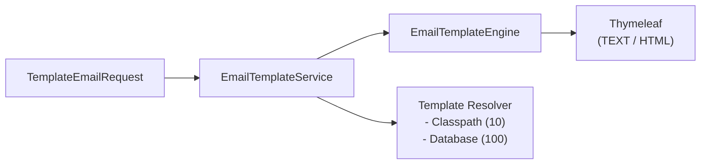

# SimpliX Email Template Guide

## Template System Overview

SimpliX Email은 Thymeleaf 기반의 강력한 템플릿 시스템을 제공합니다.



### Components

| Component | Description |
|-----------|-------------|
| `EmailTemplateService` | 템플릿 처리 총괄 서비스 (`render()`, `templateExists()` 포함) |
| `EmailTemplateEngine` | Thymeleaf 엔진 래퍼 (TEXT/HTML 모드) |
| `ClasspathEmailTemplateResolver` | 클래스패스에서 템플릿 로딩 (Priority: 10) |
| `DatabaseEmailTemplateResolver` | DB에서 템플릿 로딩 (Priority: 100) |

---

## Classpath Templates

### Folder Structure

```
src/main/resources/
└── templates/
    └── email/
        ├── welcome/
        │   ├── en/
        │   │   ├── subject.txt
        │   │   ├── body.html
        │   │   └── body.txt
        │   └── ko/
        │       ├── subject.txt
        │       ├── body.html
        │       └── body.txt
        ├── password-reset/
        │   ├── en/
        │   │   ├── subject.txt
        │   │   └── body.html
        │   └── ko/
        │       ├── subject.txt
        │       └── body.html
        └── order-confirmation/
            ├── en/
            │   ├── subject.txt
            │   ├── body.html
            │   └── body.txt
            └── ko/
                ├── subject.txt
                ├── body.html
                └── body.txt
```

### Configuration

```yaml
simplix:
  email:
    template:
      base-path: templates/email    # Default value
```

### Template Files

**subject.txt** - TEXT 모드 (Thymeleaf TEXT syntax):
```
[(${userName})]님, 가입을 환영합니다!
```

**body.html** - HTML 모드 (Thymeleaf Standard syntax):
```html
<!DOCTYPE html>
<html xmlns:th="http://www.thymeleaf.org">
<head>
    <meta charset="UTF-8">
    <style>
        .container { max-width: 600px; margin: 0 auto; }
        .header { background: #4A90D9; color: white; padding: 20px; }
        .content { padding: 20px; }
        .button {
            display: inline-block;
            background: #4A90D9;
            color: white;
            padding: 12px 24px;
            text-decoration: none;
            border-radius: 4px;
        }
    </style>
</head>
<body>
    <div class="container">
        <div class="header">
            <h1>Welcome!</h1>
        </div>
        <div class="content">
            <p>Hi <span th:text="${userName}">User</span>,</p>
            <p>Thank you for joining <strong th:text="${serviceName}">Our Service</strong>!</p>

            <p th:if="${activationRequired}">
                Please click the button below to activate your account:
            </p>

            <a th:href="${activationUrl}" class="button">Activate Account</a>

            <p>If you didn't create this account, please ignore this email.</p>
        </div>
    </div>
</body>
</html>
```

**body.txt** - TEXT 모드 (선택사항, 텍스트 전용 클라이언트용):
```
Hi [(${userName})],

Thank you for joining [(${serviceName})]!

[# th:if="${activationRequired}"]
Please click the link below to activate your account:
[(${activationUrl})]
[/]

If you didn't create this account, please ignore this email.
```

---

## Template Syntax

### TEXT Mode (subject.txt, body.txt)

TEXT 모드에서는 Thymeleaf의 텍스트 문법을 사용합니다:

| Syntax | Description | Example |
|--------|-------------|---------|
| `[(${var})]` | 변수 출력 | `[(${userName})]` |
| `[# th:if="..."]...[/]` | 조건문 | `[# th:if="${showButton}"]Click[/]` |
| `[# th:each="..."]...[/]` | 반복문 | `[# th:each="item : ${items}"][(${item.name})][/]` |

**예시 - 반복문:**
```
주문 상품:
[# th:each="item : ${orderItems}"]
- [(${item.name})]: [(${item.quantity})]개 x [(${#numbers.formatDecimal(item.price, 0, 'COMMA', 0, 'POINT')})]원
[/]

합계: [(${#numbers.formatDecimal(totalAmount, 0, 'COMMA', 0, 'POINT')})]원
```

### HTML Mode (body.html)

HTML 모드에서는 표준 Thymeleaf 문법을 사용합니다:

| Syntax | Description | Example |
|--------|-------------|---------|
| `${var}` | 변수 출력 (in attributes) | `th:text="${userName}"` |
| `th:text` | 텍스트 출력 (escaped) | `<span th:text="${name}">` |
| `th:utext` | HTML 출력 (unescaped) | `<div th:utext="${htmlContent}">` |
| `th:if` | 조건부 표시 | `<p th:if="${showSection}">` |
| `th:unless` | 조건부 숨김 | `<p th:unless="${isEmpty}">` |
| `th:each` | 반복 | `<li th:each="item : ${items}">` |
| `th:href` | 링크 | `<a th:href="${url}">` |
| `th:src` | 이미지 | `` |

**예시 - 주문 확인 템플릿:**
```html
<!DOCTYPE html>
<html xmlns:th="http://www.thymeleaf.org">
<head>
    <meta charset="UTF-8">
    <title>Order Confirmation</title>
</head>
<body>
    <h1>Order Confirmation</h1>

    <p>Order ID: <strong th:text="${orderId}">ORD-001</strong></p>
    <p>Order Date: <span th:text="${#temporals.format(orderDate, 'yyyy-MM-dd HH:mm')}">2024-01-01</span></p>

    <h2>Items</h2>
    <table>
        <thead>
            <tr>
                <th>Product</th>
                <th>Qty</th>
                <th>Price</th>
            </tr>
        </thead>
        <tbody>
            <tr th:each="item : ${items}">
                <td th:text="${item.productName}">Product</td>
                <td th:text="${item.quantity}">1</td>
                <td th:text="${#numbers.formatDecimal(item.price, 0, 'COMMA', 0, 'POINT')} + ' KRW'">1,000 KRW</td>
            </tr>
        </tbody>
    </table>

    <p>
        Total: <strong th:text="${#numbers.formatDecimal(totalAmount, 0, 'COMMA', 0, 'POINT')} + ' KRW'">10,000 KRW</strong>
    </p>

    <div th:if="${deliveryNote != null and !deliveryNote.isEmpty()}">
        <h3>Delivery Note</h3>
        <p th:text="${deliveryNote}">Note</p>
    </div>
</body>
</html>
```

---

## TemplateEmailRequest

### Builder Pattern

```java
TemplateEmailRequest request = TemplateEmailRequest.builder()
    .templateCode("welcome")
    .to(List.of(EmailAddress.of("John Doe", "john@example.com")))
    .variables(Map.of(
        "userName", "John",
        "serviceName", "MyApp",
        "activationRequired", true,
        "activationUrl", "https://example.com/activate?token=abc123"
    ))
    .locale(Locale.KOREAN)
    .priority(MailPriority.HIGH)
    .build();

EmailResult result = emailService.sendTemplate(request);
```

### Fields

| Field | Type | Required | Description |
|-------|------|----------|-------------|
| `templateCode` | `String` | ✔ | 템플릿 코드 (폴더명) |
| `from` | `EmailAddress` | - | 발신자 |
| `to` | `List<EmailAddress>` | ✔ | 수신자 목록 |
| `cc` | `List<EmailAddress>` | - | 참조 |
| `bcc` | `List<EmailAddress>` | - | 숨은 참조 |
| `replyTo` | `EmailAddress` | - | 답장 주소 |
| `subject` | `String` | - | 제목 override (생략 시 템플릿 사용) |
| `variables` | `Map<String, Object>` | - | 템플릿 변수 |
| `locale` | `Locale` | - | 로케일 (기본: 시스템 기본값) |
| `attachments` | `List<EmailAttachment>` | - | 첨부 파일 |
| `priority` | `MailPriority` | - | 우선순위 |
| `tenantId` | `String` | - | 테넌트 ID |
| `correlationId` | `String` | - | 상관 ID |
| `tags` | `List<String>` | - | 태그 |

### Factory Method

```java
// Simple template email
TemplateEmailRequest request = TemplateEmailRequest.of(
    "password-reset",           // templateCode
    "user@example.com",         // to
    Map.of(                     // variables
        "userName", "John",
        "resetCode", "123456",
        "expiresIn", "10 minutes"
    )
);
```

---

## Template Usage Examples

### Basic Template Email

```java
@Service
@RequiredArgsConstructor
public class UserNotificationService {

    private final EmailService emailService;

    public void sendWelcomeEmail(User user) {
        TemplateEmailRequest request = TemplateEmailRequest.builder()
            .templateCode("welcome")
            .to(List.of(EmailAddress.of(user.getName(), user.getEmail())))
            .variables(Map.of(
                "userName", user.getName(),
                "serviceName", "My Application",
                "activationUrl", generateActivationUrl(user)
            ))
            .locale(user.getPreferredLocale())
            .priority(MailPriority.HIGH)
            .build();

        emailService.sendTemplate(request);
    }
}
```

### With Variables

```java
public void sendOrderConfirmation(Order order) {
    Map<String, Object> variables = new HashMap<>();
    variables.put("orderId", order.getId());
    variables.put("orderDate", order.getCreatedAt());
    variables.put("customerName", order.getCustomerName());
    variables.put("items", order.getItems());
    variables.put("totalAmount", order.getTotalAmount());
    variables.put("deliveryAddress", order.getDeliveryAddress());
    variables.put("estimatedDelivery", order.getEstimatedDeliveryDate());

    TemplateEmailRequest request = TemplateEmailRequest.builder()
        .templateCode("order-confirmation")
        .to(List.of(EmailAddress.of(order.getCustomerEmail())))
        .variables(variables)
        .locale(Locale.KOREAN)
        .correlationId(order.getId())
        .build();

    emailService.sendTemplate(request);
}
```

### Subject Override

```java
// Template subject.txt: "Your order has been shipped"
// Override with dynamic subject:
TemplateEmailRequest request = TemplateEmailRequest.builder()
    .templateCode("shipping-notification")
    .to(List.of(EmailAddress.of(customer.getEmail())))
    .subject("Your order #" + order.getId() + " is on its way!")  // Override
    .variables(Map.of(
        "orderId", order.getId(),
        "trackingNumber", shipment.getTrackingNumber()
    ))
    .build();
```

### Simplified Method

```java
// Using EmailService's shorthand method
emailService.sendTemplate(
    "password-reset",
    "user@example.com",
    Map.of(
        "resetCode", "ABC123",
        "expiresAt", LocalDateTime.now().plusMinutes(10)
    )
);
```

---

## i18n Support

### Locale-Based Resolution

템플릿은 `locale` 파라미터에 따라 자동으로 선택됩니다:

```java
// Korean template selected
TemplateEmailRequest.builder()
    .templateCode("welcome")
    .locale(Locale.KOREAN)  // Uses templates/email/welcome/ko/
    ...

// English template selected
TemplateEmailRequest.builder()
    .templateCode("welcome")
    .locale(Locale.ENGLISH)  // Uses templates/email/welcome/en/
    ...
```

### Fallback Behavior

1. 요청된 locale 확인 (예: `ko`)
2. 없으면 기본 locale로 fallback (예: `en`)

```
Request: locale=ko
  1. Try: templates/email/welcome/ko/
  2. Fallback: templates/email/welcome/en/
  3. Not found: TemplateNotFoundException
```

### Locale Detection from User

```java
public void sendNotification(User user, String templateCode, Map<String, Object> variables) {
    Locale userLocale = Optional.ofNullable(user.getLanguage())
        .map(Locale::forLanguageTag)
        .orElse(Locale.ENGLISH);

    TemplateEmailRequest request = TemplateEmailRequest.builder()
        .templateCode(templateCode)
        .to(List.of(EmailAddress.of(user.getEmail())))
        .variables(variables)
        .locale(userLocale)
        .build();

    emailService.sendTemplate(request);
}
```

---

## Database Templates

### Configuration

```yaml
simplix:
  email:
    template:
      database-enabled: true
```

### DatabaseEmailTemplateResolver Setup

```java
@Configuration
public class EmailTemplateConfig {

    @Bean
    public DatabaseEmailTemplateResolver databaseEmailTemplateResolver(
            EmailTemplateRepository templateRepository) {

        return new DatabaseEmailTemplateResolver(
            // Template fetcher: (code, locale) -> Optional<TemplateData>
            (code, locale) -> templateRepository
                .findByCodeAndLocale(code, locale.getLanguage())
                .map(entity -> new DatabaseEmailTemplateResolver.TemplateData(
                    entity.getCode(),
                    entity.getSubject(),
                    entity.getBodyHtml(),
                    entity.getBodyText()
                ))
        );
    }
}
```

### TemplateData Record

```java
public record TemplateData(
    String code,
    String subject,
    String bodyHtml,
    String bodyText  // Optional, can be null
) {}
```

### Database Entity Example

```java
@Entity
@Table(name = "email_templates")
public class EmailTemplate {

    @Id
    @GeneratedValue(strategy = GenerationType.IDENTITY)
    private Long id;

    @Column(nullable = false, length = 100)
    private String code;

    @Column(nullable = false, length = 10)
    private String locale;

    @Column(nullable = false)
    private String subject;

    @Column(columnDefinition = "TEXT")
    private String bodyHtml;

    @Column(columnDefinition = "TEXT")
    private String bodyText;

    @Column(length = 50)
    private String tenantId;

    private boolean active = true;

    @CreatedDate
    private LocalDateTime createdAt;

    @LastModifiedDate
    private LocalDateTime updatedAt;
}
```

### Repository

```java
public interface EmailTemplateRepository extends JpaRepository<EmailTemplate, Long> {

    Optional<EmailTemplate> findByCodeAndLocaleAndActiveTrue(String code, String locale);

    default Optional<EmailTemplate> findByCodeAndLocale(String code, String locale) {
        return findByCodeAndLocaleAndActiveTrue(code, locale)
            .or(() -> findByCodeAndLocaleAndActiveTrue(code, "en"));  // Fallback
    }
}
```

### Multi-Tenancy Support

```java
@Bean
public DatabaseEmailTemplateResolver databaseEmailTemplateResolver(
        EmailTemplateRepository templateRepository,
        TenantContextHolder tenantContextHolder) {

    return new DatabaseEmailTemplateResolver(
        (code, locale) -> {
            String tenantId = tenantContextHolder.getCurrentTenantId();
            return templateRepository
                .findByCodeAndLocaleAndTenantId(code, locale.getLanguage(), tenantId)
                .map(this::toTemplateData);
        },
        tenantContextHolder::getCurrentTenantId  // Tenant ID provider
    );
}
```

---

## Template Best Practices

### 1. Organize Templates by Feature

```
templates/email/
├── auth/
│   ├── welcome/
│   ├── password-reset/
│   ├── email-verification/
│   └── account-locked/
├── order/
│   ├── confirmation/
│   ├── shipped/
│   └── delivered/
└── notification/
    ├── weekly-digest/
    └── system-alert/
```

### 2. Use Consistent Variable Naming

```java
// Convention: camelCase
Map.of(
    "userName", "John",
    "orderNumber", "ORD-001",
    "totalAmount", 1000,
    "deliveryDate", LocalDate.now()
);
```

### 3. Provide Default Values in Templates

```html
<p>Hi <span th:text="${userName} ?: 'Customer'">Customer</span>,</p>
```

### 4. Use Fragment for Reusable Components

**fragments/header.html:**
```html
<!DOCTYPE html>
<html xmlns:th="http://www.thymeleaf.org">
<body>
<header th:fragment="header(title)">
    <div style="background: #4A90D9; color: white; padding: 20px;">
        <h1 th:text="${title}">Title</h1>
    </div>
</header>
</body>
</html>
```

**welcome/body.html:**
```html
<!DOCTYPE html>
<html xmlns:th="http://www.thymeleaf.org">
<head>
    <meta charset="UTF-8">
</head>
<body>
    <div th:replace="~{fragments/header :: header('Welcome!')}"></div>
    <div class="content">
        <p>Welcome message...</p>
    </div>
</body>
</html>
```

### 5. Test Templates

```java
@SpringBootTest
class EmailTemplateTest {

    @Autowired
    private EmailTemplateService templateService;

    @Test
    void shouldResolveWelcomeTemplate() {
        TemplateEmailRequest request = TemplateEmailRequest.builder()
            .templateCode("welcome")
            .to(List.of(EmailAddress.of("test@example.com")))
            .variables(Map.of(
                "userName", "TestUser",
                "serviceName", "TestApp"
            ))
            .locale(Locale.ENGLISH)
            .build();

        EmailRequest processed = templateService.process(request);

        assertThat(processed.getSubject()).contains("TestUser");
        assertThat(processed.getHtmlBody()).contains("Welcome");
        assertThat(processed.getHtmlBody()).contains("TestApp");
    }
}
```

---

## EmailTemplateService 유틸리티 메서드

### render() - 독립 템플릿 렌더링

템플릿 파일 없이 TEXT 모드 템플릿 문자열을 직접 렌더링합니다:

```java
@Service
@RequiredArgsConstructor
public class SmsNotificationService {

    private final EmailTemplateService templateService;

    public String formatWelcomeMessage(String userName) {
        String template = "[(${userName})]님, 가입을 환영합니다!";

        return templateService.render(
            template,
            Map.of("userName", userName),
            Locale.KOREAN
        );
        // Result: "홍길동님, 가입을 환영합니다!"
    }

    public String formatOrderSummary(Order order) {
        String template = """
            주문번호: [(${orderId})]
            상품: [(${productName})]
            수량: [(${quantity})]개
            합계: [(${#numbers.formatDecimal(total, 0, 'COMMA', 0, 'POINT')})]원
            """;

        return templateService.render(
            template,
            Map.of(
                "orderId", order.getId(),
                "productName", order.getProductName(),
                "quantity", order.getQuantity(),
                "total", order.getTotal()
            ),
            Locale.KOREAN
        );
    }
}
```

**사용 사례:**
- SMS 메시지 템플릿 렌더링
- 푸시 알림 내용 생성
- 동적 문자열 생성

### templateExists() - 템플릿 존재 확인

템플릿 발송 전에 템플릿이 존재하는지 미리 확인합니다:

```java
@Service
@RequiredArgsConstructor
public class NotificationService {

    private final EmailTemplateService templateService;
    private final EmailService emailService;

    public void sendNotification(String templateCode, User user, Map<String, Object> variables) {
        // Check template exists before processing
        if (!templateService.templateExists(templateCode)) {
            log.warn("Template not found: {}, falling back to default", templateCode);
            templateCode = "default-notification";
        }

        TemplateEmailRequest request = TemplateEmailRequest.builder()
            .templateCode(templateCode)
            .to(List.of(EmailAddress.of(user.getEmail())))
            .variables(variables)
            .build();

        emailService.sendTemplate(request);
    }

    public List<String> validateTemplates(List<String> templateCodes) {
        return templateCodes.stream()
            .filter(code -> !templateService.templateExists(code))
            .toList();  // Returns missing templates
    }
}
```

### TemplateNotFoundException

템플릿을 찾을 수 없을 때 발생하는 예외입니다:

```java
try {
    EmailRequest processed = templateService.processTemplate(request);
    emailService.send(processed);
} catch (EmailTemplateService.TemplateNotFoundException e) {
    log.error("Template not found: {}", e.getMessage());
    // Handle missing template - send default email or notify admin
}
```

---

## Troubleshooting

### Template Not Found

```
TemplateNotFoundException: Template not found: welcome
```

**Causes:**
1. 템플릿 폴더 경로 오류
2. 템플릿 파일명 오류 (subject.txt, body.html)
3. locale 폴더 미존재

**Solutions:**
```
✔ templates/email/welcome/en/subject.txt
✔ templates/email/welcome/en/body.html
✖ templates/email/welcome/subject.txt (locale folder missing)
```

### Variable Not Resolved

```
Error evaluating expression: userName
```

**Causes:**
1. variables Map에 키 누락
2. 오타

**Solutions:**
```java
// Check variable names match template
Map.of(
    "userName", user.getName(),  // ✔ Correct key
    "username", user.getName()   // ✖ Wrong case
);
```

### Encoding Issues

```
Korean text appears as ??? or garbled
```

**Solutions:**
1. 템플릿 파일을 UTF-8로 저장
2. `<meta charset="UTF-8">` 추가

---

## Related Documents

- [Sending Guide (이메일 발송)](./sending-guide.md) - 기본 이메일 발송
- [Provider Guide (Provider 설정)](./provider-guide.md) - Provider 상세 설정
- [Advanced Guide (고급 기능)](./advanced-guide.md) - 대량 발송, 멀티테넌시
