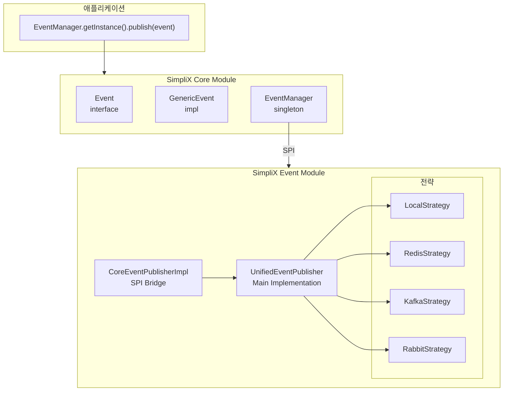

# SimpliX Event Module

## Table of Contents

- [Overview](#overview)
- [Features](#features)
- [Architecture](#architecture)
- [Quick Start](#quick-start)
- [Core Components](#core-components)
  - [Event Interface](#event-interface)
  - [GenericEvent](#genericevent)
  - [EventManager](#eventmanager)
  - [PublishOptions](#publishoptions)
- [Event Strategies](#event-strategies)
  - [LocalEventStrategy](#localeventstrategy)
  - [RedisEventStrategy](#rediseventstrategy)
  - [KafkaEventStrategy](#kafkaeventstrategy)
  - [RabbitEventStrategy](#rabbiteventstrategy)
- [설정 속성](#설정-속성)
- [Monitoring](#monitoring)
- [Strategy Selection Guide](#strategy-selection-guide)
- [Exception Handling](#exception-handling)
- [Related Documents](#related-documents)

---

## Overview

SimpliX Event 모듈은 전략 패턴(Strategy Pattern) 기반의 유연한 이벤트 발행 시스템입니다. 런타임에 Local, Redis Streams, Kafka, RabbitMQ 등 다양한 메시지 브로커를 선택할 수 있습니다.

## Features

- **Strategy Pattern**: 설정 변경만으로 이벤트 브로커 교체
- **Multiple Brokers**: Local, Redis Streams, Kafka, RabbitMQ 지원
- **SPI Integration**: Core 모듈과 자동 연동
- **Auto-Configuration**: Spring Boot 자동 설정
- **Monitoring**: Micrometer 메트릭 및 Health Check
- **Conditional Loading**: 클래스패스 의존성에 따라 전략 자동 활성화

---

## Architecture



---

## Quick Start

### 1. Dependency

```gradle
implementation 'dev.simplecore:simplix-event:${version}'

// Optional: Choose your broker
implementation 'org.springframework.boot:spring-boot-starter-data-redis'  // Redis
implementation 'org.springframework.kafka:spring-kafka'                    // Kafka
implementation 'org.springframework.boot:spring-boot-starter-amqp'         // RabbitMQ
```

### 2. Configuration

```yaml
simplix:
  events:
    mode: local  # local, redis, kafka, rabbit
```

### 3. Publish Event

```java
import dev.simplecore.simplix.core.event.EventManager;
import dev.simplecore.simplix.core.event.GenericEvent;

GenericEvent event = GenericEvent.builder()
    .eventType("OrderCreated")
    .aggregateId("order-123")
    .payload(orderData)
    .build();

EventManager.getInstance().publish(event);
```

---

## Core Components

### Event Interface

이벤트의 기본 인터페이스입니다:

```java
public interface Event {
    String getEventId();       // UUID (자동 생성)
    String getEventType();     // 이벤트 타입 (필수)
    String getAggregateId();   // 대상 엔티티 ID (필수)
    Instant getOccurredAt();   // 발생 시간 (자동 생성)
    String getUserId();        // 이벤트 발생 사용자
    String getTenantId();      // 테넌트 ID
    Map<String, Object> getMetadata();  // 추가 메타데이터
    Object getPayload();       // 이벤트 페이로드
}
```

### GenericEvent

범용 이벤트 구현체입니다. Builder 패턴으로 생성합니다:

```java
GenericEvent event = GenericEvent.builder()
    .eventType("UserRegistered")     // 필수
    .aggregateId("user-456")         // 필수
    .aggregateType("User")           // metadata에 저장
    .userId("admin-001")             // 이벤트 발생자
    .tenantId("tenant-123")          // 멀티테넌트
    .payload(userData)               // 페이로드 (Object)
    .addMetadata("source", "api")    // 추가 메타데이터
    .build();
```

| 필드 | 필수 | 설명 | 기본값 |
|------|:----:|------|--------|
| `eventType` | O | 이벤트 유형 | - |
| `aggregateId` | O | 대상 엔티티 ID | - |
| `eventId` | - | 이벤트 고유 ID | UUID 자동 생성 |
| `occurredAt` | - | 발생 시간 | 현재 시간 |
| `aggregateType` | - | 엔티티 타입 | - |
| `userId` | - | 이벤트 발생 사용자 | - |
| `tenantId` | - | 테넌트 ID | - |
| `payload` | - | 이벤트 데이터 | - |
| `metadata` | - | 추가 메타데이터 | - |

### EventManager

싱글톤 이벤트 발행 관리자입니다:

```java
// 이벤트 발행
EventManager.getInstance().publish(event);

// 발행자 상태 확인
boolean available = EventManager.getInstance().isAvailable();

// 발행자 이름
String name = EventManager.getInstance().getPublisherName();
```

### PublishOptions

이벤트 발행 옵션을 지정합니다:

```java
PublishOptions options = PublishOptions.builder()
    .critical(true)         // 중요 이벤트 (실패 시 예외)
    .persistent(true)       // 영속화
    .async(false)           // 동기 발행
    .maxRetries(5)          // 최대 재시도
    .retryDelay(1000)       // 재시도 간격 (ms)
    .routingKey("orders")   // 라우팅 키
    .partitionKey("user-1") // Kafka 파티션 키
    .ttl(Duration.ofHours(24))  // TTL
    .addHeader("key", "value")  // 커스텀 헤더
    .build();

eventPublisher.publish(event, options);
```

**정적 팩토리 메서드:**

```java
// 기본 옵션
PublishOptions.defaults();

// 중요 이벤트 (persistent=true, maxRetries=5)
PublishOptions.critical();

// 일회성 이벤트 (재시도 없음)
PublishOptions.fireAndForget();
```

---

## Event Strategies

### LocalEventStrategy

Spring ApplicationEventPublisher를 사용합니다. 외부 의존성 없이 동일 JVM 내에서 이벤트를 발행합니다.

**Mode**: `local`

```yaml
simplix:
  events:
    mode: local
```

**특징:**
- 외부 인프라 불필요
- 개발/테스트 환경에 적합
- 단일 인스턴스 애플리케이션용
- 비동기 발행 지원 (`PublishOptions.async(true)` 사용 시 `CompletableFuture.runAsync()` 활용)

**예외 처리:**

```java
// 발행 실패 시 LocalEventStrategy.EventPublishException 발생
public static class EventPublishException extends RuntimeException {
    public EventPublishException(String message) { super(message); }
    public EventPublishException(String message, Throwable cause) { super(message, cause); }
}
```

---

### RedisEventStrategy

Redis Streams를 사용한 분산 이벤트 발행입니다.

**Mode**: `redis`

```yaml
simplix:
  events:
    mode: redis
    redis:
      stream-prefix: simplix-events
      stream:
        consumer-group: my-app-group
        consumer-name: ${HOSTNAME:auto}
        max-len: 10000
        auto-create-group: true

spring:
  data:
    redis:
      host: localhost
      port: 6379
```

**특징:**
- Consumer Group 지원
- 자동 스트림 트리밍 (메모리 관리)
- ACK 기반 메시지 보장
- Consumer Group 캐싱 (중복 생성 명령 방지)

| 설정 | 기본값 | 설명 |
|------|--------|------|
| `stream-prefix` | simplix-events | 스트림 키 접두사 |
| `stream.consumer-group` | simplix-events-group | 컨슈머 그룹명 |
| `stream.consumer-name` | 호스트명 | 컨슈머명 |
| `stream.max-len` | 10000 | 최대 스트림 길이 |
| `stream.auto-create-group` | true | 그룹 자동 생성 |
| `stream.readFromBeginning` | false | 스트림 처음부터 읽기 |

**스트림 키 생성 알고리즘:**

```
routingKey 지정 시: {streamPrefix}:{routingKey}
미지정 시: {streamPrefix}:{eventType}

예시:
  streamPrefix=simplix-events, eventType=OrderCreated
  → simplix-events:OrderCreated
```

**자동 트리밍 최적화:**

- 100개 발행마다 비동기 트리밍 실행 (`MAXLEN ~` 근사 모드)
- 트리밍 실패 카운터 추적 (`trimmingFailures`)
- `CompletableFuture.runAsync()` 사용으로 메인 스레드 비차단

**예외 처리:**

```java
public static class RedisStreamPublishException extends RuntimeException {
    public RedisStreamPublishException(String message, Throwable cause) { super(message, cause); }
}
```

---

### KafkaEventStrategy

Apache Kafka를 사용한 고처리량 이벤트 스트리밍입니다.

**Mode**: `kafka`

```yaml
simplix:
  events:
    mode: kafka
    kafka:
      topic-prefix: simplix-events
      default-topic: domain-events

spring:
  kafka:
    bootstrap-servers: localhost:9092
    producer:
      key-serializer: org.apache.kafka.common.serialization.StringSerializer
      value-serializer: org.springframework.kafka.support.serializer.JsonSerializer
```

**특징:**
- Topic 기반 라우팅
- 파티셔닝 지원 (partitionKey)
- 30초 타임아웃 (무한 대기 방지)
- 지수 백오프 재시도 (Critical 이벤트)

| 설정 | 기본값 | 설명 |
|------|--------|------|
| `topic-prefix` | simplix-events | 토픽 접두사 |
| `default-topic` | domain-events | 기본 토픽 |

**토픽 이름 생성 알고리즘:**

```
routingKey 지정 시: {topicPrefix}-{routingKey}
미지정 시: {topicPrefix}-{eventType.toLowerCase()}

예시:
  topicPrefix=simplix-events, eventType=OrderCreated
  → simplix-events-ordercreated
```

**재시도 전략 (지수 백오프):**

```java
// Critical 이벤트 재시도 시 선형 증가
delayMillis = retryDelay.toMillis() * attempt

// 예: retryDelay=1000ms, maxRetries=3
// 1차: 1000ms, 2차: 2000ms, 3차: 3000ms
```

**예외 처리:**

```java
public static class KafkaPublishException extends RuntimeException {
    private final String topic;
    private final String eventId;

    public KafkaPublishException(String topic, String eventId, Throwable cause) {
        super("Failed to publish event " + eventId + " to topic " + topic, cause);
        this.topic = topic;
        this.eventId = eventId;
    }

    public String getTopic() { return topic; }
    public String getEventId() { return eventId; }
}
```

---

### RabbitEventStrategy

RabbitMQ를 사용한 신뢰성 있는 메시지 큐입니다.

**Mode**: `rabbit` 또는 `rabbitmq`

```yaml
simplix:
  events:
    mode: rabbit
    rabbit:
      exchange: simplix.events
      routing-key-prefix: event.
      ttl: 86400000  # 24시간
      max-retries: 3
      retry-delay: 1000
      dlq:
        enabled: true
        exchange: simplix.events.dlq

spring:
  rabbitmq:
    host: localhost
    port: 5672
    username: guest
    password: guest
```

**특징:**
- Exchange/Routing Key 기반 라우팅
- Dead Letter Queue (DLQ) 자동 라우팅
- 메시지 우선순위 (critical=9, normal=5)
- 지수 백오프 재시도

| 설정 | 기본값 | 설명 |
|------|--------|------|
| `exchange` | simplix.events | 교환기명 |
| `routing-key-prefix` | event. | 라우팅 키 접두사 |
| `ttl` | 86400000 | 메시지 TTL (ms) |
| `max-retries` | 3 | 최대 재시도 |
| `retry-delay` | 1000 | 재시도 간격 (ms) |
| `dlq.enabled` | true | DLQ 활성화 |
| `dlq.exchange` | simplix.events.dlq | DLQ 교환기 |
| `queue` | simplix.events.queue | 메인 큐 이름 |
| `dlq.queue` | simplix.events.dlq.queue | DLQ 이름 |

**라우팅 키 생성 알고리즘:**

```
{routingKeyPrefix}{aggregateId.toLowerCase()}.{eventType.toLowerCase()}

예시:
  prefix=event., aggregateId=order-123, eventType=OrderCreated
  → event.order-123.ordercreated
```

**메시지 우선순위:**

| 이벤트 유형 | 우선순위 | 설명 |
|------------|:-------:|------|
| Critical (`options.critical=true`) | 9 | 최우선 처리 |
| Normal | 5 | 일반 처리 |

**DLQ 자동 라우팅:**

발행 실패 시 비-Critical 이벤트는 자동으로 DLQ로 라우팅됩니다:

```
DLQ Routing Key: dlq.{original-routing-key}

자동 추가 헤더:
- x-original-error: 에러 메시지
- x-failed-at: 실패 시간 (ISO 8601)
- x-original-exchange: 원본 교환기
```

**재시도 전략 (지수 백오프):**

```java
// 비동기 재시도 시 지수 증가
delay = retryDelay * Math.pow(2, attempt)

// 예: retryDelay=1000ms, maxRetries=3
// 1차: 1000ms, 2차: 2000ms, 3차: 4000ms
```

**예외 처리:**

```java
public static class RabbitPublishException extends RuntimeException {
    public RabbitPublishException(String message, Throwable cause) { super(message, cause); }
}
```

---

## 설정 속성

### 전체 설정

```yaml
simplix:
  events:
    # 발행 모드 (local, redis, kafka, rabbit)
    mode: local

    # 메타데이터 자동 추가 (instanceId, publisherMode, enrichedAt)
    enrich-metadata: true

    # 기본 영속화 여부
    persistent-by-default: false

    # 기본 비동기 발행 여부
    async-by-default: true

    # 인스턴스 ID (분산 환경 추적용)
    instance-id: ${HOSTNAME:auto}

    # 설정 검증 활성화
    validation:
      enabled: true

    # 모니터링
    monitoring:
      metrics-enabled: true
      metrics-prefix: simplix.events
      health-check:
        enabled: true
        interval: 30000
```

### 메타데이터 Enrichment

`enrich-metadata: true` 설정 시 다음 헤더가 자동 추가됩니다:

| 헤더 | 값 | 설명 |
|------|-----|------|
| `instanceId` | UUID 또는 설정값 | 분산 환경 인스턴스 식별 |
| `publisherMode` | local/redis/kafka/rabbit | 현재 발행 모드 |
| `enrichedAt` | ISO 8601 타임스탬프 | 메타데이터 추가 시간 |

```java
// 예시: 메타데이터 enrichment 결과
{
  "instanceId": "app-server-01",
  "publisherMode": "kafka",
  "enrichedAt": "2025-01-15T10:30:00Z",
  // ... 원본 메타데이터와 PublishOptions 헤더
}
```

### 설정 검증 (EventConfigurationValidator)

시작 시 다음 항목을 자동 검증합니다:

| 검증 항목 | 검증 내용 |
|----------|----------|
| Mode 유효성 | `local`, `redis`, `kafka`, `rabbit` 중 하나 |
| 의존성 확인 | Redis: `RedisTemplate` 존재, Kafka: `KafkaTemplate` 존재, RabbitMQ: `RabbitTemplate` 존재 |
| 연결 정보 | 호스트/포트 미설정 시 경고 로그 출력 |

```
ℹ SimpliX Event Configuration:
  Mode: kafka
  Async by Default: true
  Persistent by Default: false
  Enrich Metadata: true
  Instance ID: app-01
```

---

## Monitoring

### Health Check

```bash
curl http://localhost:8080/actuator/health
```

```json
{
  "status": "UP",
  "components": {
    "eventPublisher": {
      "status": "UP",
      "details": {
        "mode": "UnifiedEventPublisher-local",
        "enrichMetadata": true,
        "persistentByDefault": false
      }
    }
  }
}
```

**Health Indicator 응답 형식:**

| 필드 | 설명 |
|------|------|
| `mode` | `{PublisherName}-{strategyName}` 형식 |
| `enrichMetadata` | 메타데이터 자동 추가 여부 |
| `persistentByDefault` | 기본 영속화 여부 |

### Metrics

Micrometer 기반 메트릭 (eventType 태그 포함):

| 메트릭 | 타입 | 설명 |
|--------|------|------|
| `simplix.events.published` | Counter | 발행된 이벤트 수 |
| `simplix.events.failed` | Counter | 실패한 이벤트 수 |
| `simplix.events.publish.time` | Timer | 발행 소요 시간 |

**EventMetrics 내부 기능:**

```java
// Timer 시작/종료
Timer.Sample sample = eventMetrics.startTimer();
// ... 작업 수행
eventMetrics.stopTimer(sample);  // 자동으로 publish.time 기록

// 메트릭 레지스트리 없을 시 graceful 동작 (로그만 출력)
```

```promql
# Grafana 쿼리 예시
sum by (eventType) (simplix_events_published_total)
rate(simplix_events_failed_total[5m]) / rate(simplix_events_published_total[5m])
```

---

## Strategy Selection Guide

| 환경 | 권장 전략 | 이유 |
|------|----------|------|
| 개발/테스트 | Local | 외부 인프라 불필요 |
| 분산 시스템 (중소규모) | Redis | Consumer Group, 간편한 설정 |
| 고처리량 | Kafka | 파티셔닝, 확장성 |
| 복잡한 라우팅 | RabbitMQ | Exchange/Routing, DLQ |

---

## Exception Handling

### 예외 클래스 계층

| 예외 클래스 | 발생 조건 | 위치 |
|------------|----------|------|
| `UnifiedEventPublisher.EventPublishException` | Critical 이벤트 발행 실패 | 통합 발행자 |
| `LocalEventStrategy.EventPublishException` | 로컬 발행 실패 | Local 전략 |
| `KafkaEventStrategy.KafkaPublishException` | Kafka 발행 실패 | Kafka 전략 |
| `RedisEventStrategy.RedisStreamPublishException` | Redis Stream 발행 실패 | Redis 전략 |
| `RabbitEventStrategy.RabbitPublishException` | RabbitMQ 발행 실패 | RabbitMQ 전략 |

### UnifiedEventPublisher.EventPublishException

Critical 이벤트의 발행이 완전히 실패한 경우 발생합니다:

```java
public static class EventPublishException extends RuntimeException {
    public EventPublishException(String message) { super(message); }
    public EventPublishException(String message, Throwable cause) { super(message, cause); }
}
```

**발생 조건:**
- `PublishOptions.critical(true)` 설정된 이벤트
- 최대 재시도 후에도 발행 실패

**처리 예시:**

```java
try {
    eventPublisher.publish(event, PublishOptions.critical());
} catch (UnifiedEventPublisher.EventPublishException e) {
    log.error("Critical event publish failed: {}", e.getMessage());
    // 보상 트랜잭션 또는 알림 발송
}
```

---

## Related Documents

- [Usage Guide](./usage-guide.md) - 상세 사용법 가이드
- [SimpliX Core Module](../../../simplix-core/)
