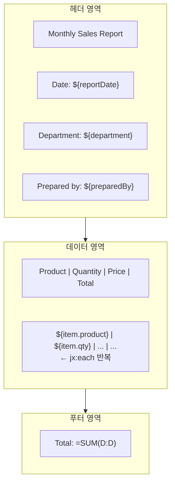

# SimpliX Excel Export Guide

Excel/CSV 내보내기 상세 사용법 가이드입니다.

## Table of Contents

- [Excel Export](#excel-export)
- [CSV Export](#csv-export)
- [다국어 라벨](#다국어-라벨)
- [Template Export](#template-export)
- [Styling](#styling)
- [Large Data Export](#large-data-export)
- [Best Practices](#best-practices)
- [Troubleshooting](#troubleshooting)

---

## Excel Export

### Basic Export

가장 기본적인 Excel 내보내기:

```java
@RestController
@RequiredArgsConstructor
public class UserController {

    private final UserRepository userRepository;

    @GetMapping("/users/export")
    public void exportUsers(HttpServletResponse response) {
        List<User> users = userRepository.findAll();

        ExcelExporter.of(User.class)
            .filename("users.xlsx")
            .sheetName("Users")
            .export(response, users);
    }
}
```

### DTO with @ExcelColumn

필드별 컬럼 설정:

```java
public class UserExportDto {

    @ExcelColumn(name = "ID", order = 1, width = 10)
    private Long id;

    @ExcelColumn(name = "Name", order = 2, width = 20, bold = true)
    private String name;

    @ExcelColumn(name = "Email", order = 3, width = 30)
    private String email;

    @ExcelColumn(
        name = "Status",
        order = 4,
        width = 15,
        alignment = HorizontalAlignment.CENTER,
        backgroundColor = IndexedColors.LIGHT_YELLOW
    )
    private UserStatus status;

    @ExcelColumn(
        name = "Created Date",
        order = 5,
        width = 15,
        format = "yyyy-MM-dd"
    )
    private LocalDate createdAt;

    @ExcelColumn(
        name = "Balance",
        order = 6,
        width = 15,
        format = "#,##0.00",
        alignment = HorizontalAlignment.RIGHT
    )
    private BigDecimal balance;

    // 내보내기에서 제외
    @ExcelColumn(ignore = true)
    private String internalNote;
}
```

### Export to OutputStream

파일로 직접 저장:

```java
public void exportToFile(List<User> users) throws IOException {
    try (FileOutputStream fos = new FileOutputStream("users.xlsx")) {
        ExcelExporter.of(User.class)
            .sheetName("Users")
            .export(fos, users);
    }
}
```

### Auto-Size Columns

컬럼 너비 자동 조정 (성능 영향 있음):

```java
ExcelExporter.of(User.class)
    .filename("users.xlsx")
    .autoSizeColumns()  // 내용에 맞게 컬럼 너비 자동 조정
    .export(response, users);
```

---

## CSV Export

### Basic CSV Export

```java
@GetMapping("/users/export/csv")
public void exportUsersCsv(HttpServletResponse response) {
    List<User> users = userRepository.findAll();

    CsvExporter.of(User.class)
        .filename("users.csv")
        .export(response, users);
}
```

### CSV Options

다양한 CSV 옵션 설정:

```java
CsvExporter.of(User.class)
    .filename("users.csv")
    .delimiter(';')           // 구분자 (기본: ,)
    .encoding("UTF-8")        // 인코딩 (기본: UTF-8)
    .quoteStrings()           // 문자열 인용 부호 추가
    .includeHeader(true)      // 헤더 행 포함
    .export(response, users);
```

### 셀 이스케이프

값이 구분자를 담고 있으면 행이 갈라지므로, 모든 셀은 쓰기 직전에 다음 규칙을 거칩니다. 별도 설정은 필요 없습니다.

| 값 | 기록되는 형태 |
|----|--------------|
| `Acme, Inc.` | `"Acme, Inc."` |
| `Acme "AC"` | `"Acme ""AC"""` |
| 줄바꿈을 담은 메모 | 따옴표로 감싼 여러 줄 |
| `1,234,567` (천 단위 구분) | `"1,234,567"` |

`quoteStrings`를 켜 두면 문자열과 날짜·시간 타입은 위 조건에 해당하지 않아도 따옴표로 감쌉니다. 끄면 필요한 셀만 감쌉니다.

### 수식 차단

`=` `+` `-` `@` 탭 캐리지리턴으로 시작하는 값은 스프레드시트가 수식으로 해석합니다. 고객명이 `=cmd`인 데이터가 남의 스프레드시트에서 명령이 되지 않도록, 이런 값 앞에는 작은따옴표가 붙어 문자열로 기록됩니다.

| 원본 값 | 기록되는 형태 |
|---------|--------------|
| `=1+1` | `"'=1+1"` |
| `+82-10-0000-0000` | `"'+82-10-0000-0000"` |

기본값은 켜짐입니다. 값을 원문 그대로 남겨야 하는 기계 처리용 파일에서는 끕니다. 이 메서드는 `CsvExporter` 인터페이스가 아니라 `UnifiedCsvExporter`에 있습니다.

```java
UnifiedCsvExporter<User> exporter = new UnifiedCsvExporter<>(User.class);
exporter.filename("users.csv")
        .sanitizeFormulas(false)
        .export(users, response);
```

### CSV Delimiters

지원되는 구분자:

| 구분자 | 문자 | 용도 |
|--------|------|------|
| Comma | `,` | 표준 CSV (기본) |
| Semicolon | `;` | 유럽 지역 |
| Tab | `\t` | TSV 포맷 |
| Pipe | `|` | 특수 용도 |

### CSV Encoding

지원되는 인코딩:

```java
// UTF-8 (기본, BOM 포함 가능)
CsvExporter.of(User.class).encoding("UTF-8")

// Excel에서 한글 인식을 위한 UTF-8 with BOM
CsvExporter.of(User.class).encoding("UTF-8-BOM")

// ISO-8859-1 (Latin-1)
CsvExporter.of(User.class).encoding("ISO-8859-1")

// UTF-16LE (Windows)
CsvExporter.of(User.class).encoding("UTF-16LE")
```

---

## 다국어 라벨

헤더·열거형·논리값은 화면과 같은 말로 기록됩니다. Excel과 CSV 모두 같은 규칙을 씁니다.

### 헤더 번역

`@ExcelColumn(name)`을 `{key}` 형태로 적으면 메시지 키로 해석됩니다. 중괄호가 없으면 문자열 그대로 헤더가 됩니다.

```java
public class ContractExportDto {

    @ExcelColumn(name = "{entities.Contract.customer}", order = 1)
    private String customer;

    @ExcelColumn(name = "고객 메모", order = 2)
    private String note;
}
```

```properties
# messages/entities_ko.properties
entities.Contract.customer=고객사

# messages/entities_en.properties
entities.Contract.customer=Customer
```

로케일은 요청 로케일(`LocaleContextHolder`)을 따릅니다. 번역이 없는 키는 중괄호를 벗긴 키 자체가 헤더로 남습니다. 라벨 하나 때문에 내려받기 전체가 실패하지 않습니다.

### 열거형 라벨

`enums.{클래스 단순명}.{상수명}` 키를 먼저 찾고, 없으면 `SimpliXLabeledEnum.getLabel()`, 둘 다 없으면 `name()`을 씁니다.

```properties
enums.ContractStatus.ACTIVE=사용 중
enums.ContractStatus.SUSPENDED=정지
```

### 논리값 표기

`Boolean` 필드는 Excel의 참·거짓 셀이 아니라 설정된 표기로 기록됩니다. 같은 목록을 Excel로 한 번, CSV로 한 번 내려받았을 때 두 파일이 다르게 읽히지 않도록 하기 위함입니다.

```yaml
simplix:
  excel:
    format:
      booleanTrueValue: Y
      booleanFalseValue: N
```

`{key}` 형태로 적으면 이 값도 메시지 키로 해석됩니다.

### 메시지 번들이 병합된 경우

엔티티·열거형 라벨 번들을 클래스패스 와일드카드로 병합하는 애플리케이션은 그 경로를 `MessageSource` basename으로 표현할 수 없습니다. 이때는 `ExcelLabelResolver`를 빈으로 등록합니다. 등록된 리졸버가 `MessageSource`보다 먼저, 빈 순서대로 조회됩니다.

```java
@Bean
public ExcelLabelResolver entityLabelResolver(EntityLabelBundle bundle) {
    // 자기 키가 아니면 null을 반환해 다음 리졸버로 넘김
    return (key, locale) -> key.startsWith("entities.") ? bundle.find(key, locale) : null;
}
```

---

## Template Export

### JXLS Template

복잡한 레이아웃이 필요한 경우 템플릿 사용:

```java
@GetMapping("/reports/monthly")
public void exportMonthlyReport(HttpServletResponse response) {
    List<SalesData> sales = salesRepository.findByMonth(LocalDate.now());

    JxlsExporter.of(SalesData.class)
        .filename("monthly-report.xlsx")
        .template("classpath:templates/monthly-report.xlsx")
        .parameter("reportDate", LocalDate.now())
        .parameter("department", "Sales")
        .parameter("preparedBy", getCurrentUser())
        .enableFormulas()
        .export(response, sales);
}
```

### Template Structure

템플릿 파일 (`monthly-report.xlsx`) 구조:



### JXLS Comments

셀에 주석으로 JXLS 명령 추가:

```
jx:area(lastCell="D100")
jx:each(items="items" var="item" lastCell="D2")
```

### Template Options

```java
JxlsExporter.of(SalesData.class)
    .template("classpath:templates/report.xlsx")
    .enableFormulas()    // 수식 활성화
    .hideGridLines()     // 눈금선 숨기기
    .parameter("key", value)  // 파라미터 전달
    .export(response, data);
```

---

## Styling

### Column-Level Styling

@ExcelColumn으로 스타일 지정:

```java
public class StyledDto {

    @ExcelColumn(
        name = "Header",
        bold = true,
        fontSize = 12,
        fontColor = IndexedColors.WHITE,
        backgroundColor = IndexedColors.DARK_BLUE,
        alignment = HorizontalAlignment.CENTER
    )
    private String header;

    @ExcelColumn(
        name = "Amount",
        format = "#,##0.00",
        alignment = HorizontalAlignment.RIGHT,
        fontColor = IndexedColors.GREEN
    )
    private BigDecimal amount;

    @ExcelColumn(
        name = "Description",
        width = 50,
        wrapText = true
    )
    private String description;
}
```

### @ExcelColumn Style Options

| 옵션 | 타입 | 기본값 | 설명 |
|------|------|--------|------|
| `fontName` | String | "Arial" | 폰트 이름 |
| `fontSize` | int | 10 | 폰트 크기 |
| `bold` | boolean | false | 굵은 글꼴 |
| `italic` | boolean | false | 기울임 글꼴 |
| `backgroundColor` | IndexedColors | AUTOMATIC | 배경색 |
| `fontColor` | IndexedColors | AUTOMATIC | 글꼴색 |
| `alignment` | HorizontalAlignment | LEFT | 정렬 (LEFT, CENTER, RIGHT) |
| `wrapText` | boolean | false | 텍스트 줄바꿈 |

### Color Options

사용 가능한 IndexedColors:

```java
// 자주 사용되는 색상
IndexedColors.WHITE
IndexedColors.BLACK
IndexedColors.RED
IndexedColors.GREEN
IndexedColors.BLUE
IndexedColors.YELLOW
IndexedColors.LIGHT_YELLOW
IndexedColors.LIGHT_GREEN
IndexedColors.LIGHT_BLUE
IndexedColors.GREY_25_PERCENT
IndexedColors.GREY_50_PERCENT
IndexedColors.DARK_BLUE
```

### Format Patterns

날짜/숫자 포맷 패턴:

```java
// 날짜
@ExcelColumn(format = "yyyy-MM-dd")           // 2024-01-15
@ExcelColumn(format = "yyyy/MM/dd")           // 2024/01/15
@ExcelColumn(format = "MM/dd/yyyy")           // 01/15/2024
@ExcelColumn(format = "yyyy-MM-dd HH:mm:ss")  // 2024-01-15 14:30:00

// 숫자
@ExcelColumn(format = "#,##0")                // 1,234,567
@ExcelColumn(format = "#,##0.00")             // 1,234,567.89
@ExcelColumn(format = "#,##0.00%")            // 12.34%
@ExcelColumn(format = "0.00E+00")             // 1.23E+06
@ExcelColumn(format = "\\#,##0")              // W1,234,567 (원화)
@ExcelColumn(format = "$#,##0.00")            // $1,234.56
```

---

## Large Data Export

### Streaming Export

대용량 데이터 내보내기 (SXSSFWorkbook 사용):

```java
@GetMapping("/logs/export")
public void exportLogs(HttpServletResponse response) {
    // DataProvider로 페이지 단위 조회
    ExcelExporter.of(LogEntry.class)
        .filename("logs.xlsx")
        .streaming()  // SXSSFWorkbook 사용
        .export(response, pageNumber -> {
            Page<LogEntry> page = logRepository.findAll(
                PageRequest.of(pageNumber, 1000, Sort.by("createdAt").descending())
            );
            return page.hasContent() ? page.getContent() : null;
        });
}
```

### Virtual Paging

메모리에 있는 대용량 컬렉션 처리:

```java
@GetMapping("/data/export")
public void exportData(HttpServletResponse response) {
    List<Data> largeDataset = dataService.getAllData();  // 100만 건

    ExcelExporter.of(Data.class)
        .filename("data.xlsx")
        .streaming()
        .export(response, largeDataset);  // 내부적으로 가상 페이징 사용
}
```

### Memory Configuration

설정으로 메모리 관리:

```yaml
simplix:
  excel:
    export:
      pageSize: 1000     # 한 번에 처리할 행 수
      windowSize: 100    # 메모리에 유지할 행 수 (SXSSF)
```

### Export Mode Selection

데이터 양에 따른 모드 선택:

| 데이터 크기 | 권장 모드 | 설명 |
|-------------|----------|------|
| < 10,000건 | Standard | 기본 모드 |
| 10,000 ~ 100,000건 | Streaming | 스트리밍 모드 |
| > 100,000건 | Streaming + DataProvider | 페이지 단위 조회 |

```java
// 소규모 (< 10,000건)
ExcelExporter.of(User.class).export(response, users);

// 대규모 (> 10,000건)
ExcelExporter.of(User.class)
    .streaming()
    .export(response, dataProvider);
```

---

## Best Practices

### 1. DTO 분리

엔티티 대신 전용 DTO 사용:

```java
// Good: 내보내기 전용 DTO
public class UserExportDto {
    @ExcelColumn(name = "ID")
    private Long id;

    @ExcelColumn(name = "Name")
    private String name;

    // 필요한 필드만 포함
}

// Bad: 엔티티 직접 사용
@Entity
public class User {
    @Id
    private Long id;

    @ExcelColumn(name = "Name")  // 엔티티에 Excel 어노테이션 혼용
    private String name;

    private String password;  // 민감 정보 노출 위험
}
```

### 2. 파일명 인코딩

한글 파일명 처리:

```java
// ExcelExporter가 자동으로 UTF-8 인코딩 처리
ExcelExporter.of(User.class)
    .filename("사용자목록.xlsx")  // 자동 인코딩
    .export(response, users);
```

### 3. 날짜 타입

Java 8+ 날짜 타입 권장:

```java
// Good: Java 8+ 날짜 타입
@ExcelColumn(format = "yyyy-MM-dd")
private LocalDate createdAt;

// Avoid: Legacy Date
@ExcelColumn(format = "yyyy-MM-dd")
private Date createdAt;
```

### 4. Enum 라벨

여러 로케일을 제공하는 애플리케이션은 메시지 번들에 `enums.{클래스 단순명}.{상수명}` 키를 둡니다. 로케일이 하나뿐이면 `SimpliXLabeledEnum` 구현만으로도 충분합니다.

```properties
# messages/enums_ko.properties
enums.OrderStatus.PENDING=대기
enums.OrderStatus.CONFIRMED=확인
enums.OrderStatus.SHIPPED=배송중
enums.OrderStatus.DELIVERED=배송완료
```

```java
// 메시지 키가 없을 때 쓰이는 코드 내 라벨
public enum OrderStatus implements SimpliXLabeledEnum {
    PENDING("대기"),
    CONFIRMED("확인"),
    SHIPPED("배송중"),
    DELIVERED("배송완료");

    private final String label;

    @Override
    public String getLabel() {
        return label;
    }
}
```

### 5. 컬럼 순서 관리

명시적인 순서 지정:

```java
public class OrderExportDto {
    @ExcelColumn(name = "Order ID", order = 1)
    private String orderId;

    @ExcelColumn(name = "Customer", order = 2)
    private String customerName;

    @ExcelColumn(name = "Amount", order = 3)
    private BigDecimal amount;

    // order 값이 같으면 필드 선언 순서로 정렬
}
```

---

## Troubleshooting

### OutOfMemoryError

**증상**: 대용량 내보내기 시 메모리 부족

**해결**:
```java
// 스트리밍 모드 사용
ExcelExporter.of(Data.class)
    .streaming()
    .export(response, dataProvider);
```

```yaml
# 윈도우 크기 줄이기
simplix:
  excel:
    export:
      windowSize: 50
```

### 한글 깨짐 (CSV)

**증상**: Excel에서 CSV 열면 한글 깨짐

**해결**:
```java
// UTF-8 with BOM 사용
CsvExporter.of(User.class)
    .encoding("UTF-8-BOM")
    .export(response, users);
```

### 날짜 형식 오류

**증상**: 날짜가 숫자로 표시됨

**해결**:
```java
// format 속성 지정
@ExcelColumn(name = "Date", format = "yyyy-MM-dd")
private LocalDate date;
```

### 스타일 적용 안됨

**증상**: @ExcelColumn 스타일이 적용되지 않음

**해결**:
```java
// IndexedColors 사용 확인
@ExcelColumn(backgroundColor = IndexedColors.YELLOW)  // Good
@ExcelColumn(backgroundColor = "#FFFF00")            // Not supported
```

### 템플릿 못 찾음

**증상**: JxlsExporter에서 템플릿 로드 실패

**해결**:
```java
// classpath 접두사 확인
.template("classpath:templates/report.xlsx")  // Good
.template("templates/report.xlsx")            // May fail

// 파일 위치 확인: src/main/resources/templates/report.xlsx
```

### 파일 다운로드 안됨

**증상**: 브라우저에서 파일 다운로드 대신 응답만 표시

**해결**:
```java
// Content-Disposition 헤더 확인 (ExcelExporter가 자동 설정)
// 커스텀 처리 시:
response.setContentType("application/vnd.openxmlformats-officedocument.spreadsheetml.sheet");
response.setHeader("Content-Disposition", "attachment; filename=\"export.xlsx\"");
```

---

## Related Documents

- [Overview](./overview.md) - 모듈 개요
- [Import Guide](./import-guide.md) - 가져오기 가이드
