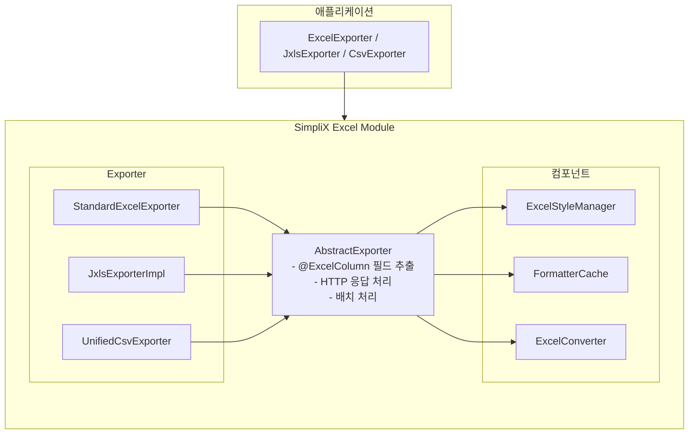

# SimpliX Excel Module Overview

## Table of Contents

- [Architecture](#architecture)
- [핵심 컴포넌트](#핵심-컴포넌트)
- [@ExcelColumn Annotation](#excelcolumn-annotation)
- [Export Implementations](#export-implementations)
- [Import Functionality](#import-functionality)
- [Type Conversion](#type-conversion)
- [Style Management](#style-management)
- [Formatter System](#formatter-system)
- [Template Processing](#template-processing)
- [설정 속성](#설정-속성)
- [Performance Optimization](#performance-optimization)
- [Utility Classes](#utility-classes)
- [Exception Handling](#exception-handling)
- [Related Documents](#related-documents)

---

## Architecture



---

## 핵심 컴포넌트

### ExcelExporter<T>

표준 Excel 내보내기 인터페이스:

```java
public interface ExcelExporter<T> {
    ExcelExporter<T> filename(String filename);
    ExcelExporter<T> sheetName(String sheetName);
    ExcelExporter<T> streaming();
    ExcelExporter<T> autoSizeColumns();

    void export(HttpServletResponse response, Collection<T> data);
    void export(OutputStream outputStream, Collection<T> data);
}
```

### JxlsExporter<T>

템플릿 기반 내보내기 인터페이스:

```java
public interface JxlsExporter<T> {
    JxlsExporter<T> template(String templatePath);
    JxlsExporter<T> enableFormulas();
    JxlsExporter<T> hideGridLines();
    JxlsExporter<T> parameter(String key, Object value);

    void export(HttpServletResponse response, Collection<T> data);
}
```

### CsvExporter<T>

CSV 내보내기 인터페이스:

```java
public interface CsvExporter<T> {
    CsvExporter<T> filename(String filename);
    CsvExporter<T> delimiter(char delimiter);
    CsvExporter<T> encoding(String encoding);
    CsvExporter<T> quoteStrings();
    CsvExporter<T> includeHeader(boolean include);

    void export(HttpServletResponse response, Collection<T> data);
}
```

---

## @ExcelColumn Annotation

필드를 Excel 컬럼에 매핑하는 어노테이션:

```java
@Retention(RetentionPolicy.RUNTIME)
@Target(ElementType.FIELD)
public @interface ExcelColumn {
    // 기본 설정
    String name() default "";           // 컬럼 헤더명
    int order() default 0;              // 컬럼 순서
    int width() default 15;             // 컬럼 너비
    boolean ignore() default false;     // 내보내기 제외

    // 포맷
    String format() default "";         // 날짜/숫자 포맷 패턴

    // 폰트 스타일
    String fontName() default "Arial";
    int fontSize() default 10;
    boolean bold() default false;
    boolean italic() default false;

    // 색상
    IndexedColors backgroundColor() default IndexedColors.AUTOMATIC;
    IndexedColors fontColor() default IndexedColors.AUTOMATIC;

    // 레이아웃
    HorizontalAlignment alignment() default HorizontalAlignment.LEFT;
    boolean wrapText() default false;
}
```

### 옵션 상세

| 옵션 | 타입 | 기본값 | 설명 |
|------|------|--------|------|
| `name` | String | "" | 컬럼 헤더에 표시될 이름 |
| `order` | int | 0 | 컬럼 순서 (오름차순) |
| `width` | int | 15 | 문자 단위 컬럼 너비 |
| `ignore` | boolean | false | true면 내보내기에서 제외 |
| `format` | String | "" | 날짜: "yyyy-MM-dd", 숫자: "#,##0" |
| `fontName` | String | "Arial" | 폰트 이름 |
| `fontSize` | int | 10 | 폰트 크기 |
| `bold` | boolean | false | 굵은 글꼴 |
| `italic` | boolean | false | 기울임 글꼴 |
| `backgroundColor` | IndexedColors | AUTOMATIC | 배경색 |
| `fontColor` | IndexedColors | AUTOMATIC | 글꼴색 |
| `alignment` | HorizontalAlignment | LEFT | 정렬 (LEFT, CENTER, RIGHT) |
| `wrapText` | boolean | true | 텍스트 줄바꿈 |

### order 속성 동작

- 기본값: `Integer.MAX_VALUE`
- 정렬 규칙: order 값이 같으면 필드 선언 순서로 정렬
- 사용법:
  ```java
  @ExcelColumn(name = "ID", order = 1)      // 첫 번째 컬럼
  private Long id;

  @ExcelColumn(name = "Name", order = 2)    // 두 번째 컬럼
  private String name;

  @ExcelColumn(name = "Email")              // order 미지정 → 마지막
  private String email;
  ```

### 색상 제약사항

- **IndexedColors Enum만 지원** (RGB/HEX 미지원)
- 사용 가능 색상: `IndexedColors.WHITE`, `IndexedColors.BLACK`, `IndexedColors.RED`, `IndexedColors.GREEN`, `IndexedColors.BLUE`, `IndexedColors.YELLOW`, `IndexedColors.GREY_25_PERCENT` 등

---

## Export Implementations

### StandardExcelExporter

3가지 내보내기 모드 지원:

#### 1. Standard Mode (기본)

모든 데이터를 메모리에 로드:

```java
ExcelExporter.of(User.class)
    .filename("users.xlsx")
    .export(response, users);
```

#### 2. Streaming Mode with DataProvider

페이지네이션 기반 배치 처리:

```java
ExcelExporter.of(User.class)
    .filename("users.xlsx")
    .streaming()
    .export(response, pageNumber -> userRepository.findAll(PageRequest.of(pageNumber, 1000)));
```

#### 3. Streaming Mode with Collection

가상 페이징으로 대용량 컬렉션 처리:

```java
ExcelExporter.of(User.class)
    .filename("users.xlsx")
    .streaming()
    .export(response, largeUserList);  // 내부적으로 StreamingCollection 사용
```

### JxlsExporterImpl

JXLS 마커 기반 템플릿 처리:

```java
JxlsExporter.of(User.class)
    .template("classpath:templates/user-report.xlsx")
    .parameter("reportDate", LocalDate.now())
    .parameter("department", "IT")
    .enableFormulas()
    .export(response, users);
```

### UnifiedCsvExporter

다양한 CSV 옵션 지원:

```java
CsvExporter.of(User.class)
    .filename("users.csv")
    .delimiter(';')           // 구분자
    .encoding("UTF-8")        // 인코딩
    .quoteStrings()           // 문자열 인용
    .includeHeader(true)      // 헤더 포함
    .export(response, users);
```

#### Encoding Enum

형식 안전한 인코딩 설정:

```java
public enum Encoding {
    UTF8("UTF-8", null),
    UTF8_BOM("UTF-8", new byte[]{(byte)0xEF, (byte)0xBB, (byte)0xBF}),
    ISO_8859_1("ISO-8859-1", null),
    UTF16_LE("UTF-16LE", new byte[]{(byte)0xFF, (byte)0xFE}),
    UTF16_BE("UTF-16BE", new byte[]{(byte)0xFE, (byte)0xFF});

    // ...
}

// 사용법
CsvExporter.of(User.class)
    .encoding(UnifiedCsvExporter.Encoding.UTF8_BOM)  // Enum 사용
    .export(response, users);
```

#### 추가 메서드

```java
CsvExporter.of(User.class)
    .dateFormat("yyyy-MM-dd")         // 날짜 포맷 패턴
    .numberFormat("#,##0.00")         // 숫자 포맷 패턴
    .lineEnding("\r\n")               // 라인 종료 문자 (기본: \r\n)
    .batchSize(5000)                  // 스트리밍 배치 크기
    .dataProvider(pageRequest -> ...) // 페이지 단위 데이터 조회
    .export(response);
```

---

## Import Functionality

### StandardExcelImporter

Excel 및 CSV 파일 가져오기:

```java
StandardExcelImporter<User> importer = new StandardExcelImporter<>(User.class);

// Excel 가져오기
List<User> users = importer.importFromExcel(excelFile);

// CSV 가져오기
List<User> users = importer.importFromCsv(csvFile);
```

### Import Options

```java
StandardExcelImporter<User> importer = new StandardExcelImporter<>(User.class);

// 헤더 건너뛰기
importer.setSkipHeader(true);

// 시트 인덱스 (0부터 시작)
importer.setSheetIndex(0);

// 날짜 포맷
importer.setDateFormat("yyyy-MM-dd");
importer.setDateTimeFormat("yyyy-MM-dd HH:mm:ss");

// 컬럼 매핑 (인덱스 -> 필드명)
Map<Integer, String> mapping = Map.of(
    0, "id",
    1, "name",
    2, "email"
);
importer.setColumnMapping(mapping);
```

---

## Type Conversion

### 지원 타입

| 카테고리 | 타입 |
|----------|------|
| 기본형 | boolean, byte, short, int, long, float, double |
| 숫자 | BigDecimal, BigInteger |
| 문자열 | String |
| 날짜/시간 (Legacy) | Date, Calendar |
| 날짜/시간 (Java 8+) | LocalDate, LocalDateTime, LocalTime, OffsetDateTime, ZonedDateTime, Instant |
| 기간 | Year, YearMonth, MonthDay, Duration, Period |
| 열거형 | Enum, SimpliXLabeledEnum |
| 컬렉션 | List, Set, Collection (쉼표 구분 문자열로 변환) |
| 객체 | getId(), getName(), getTitle(), getCode() 메서드 자동 탐색 |

### Enum 처리

```java
// 기본 Enum - name() 사용
public enum Status {
    ACTIVE, INACTIVE, PENDING
}

// SimpliXLabeledEnum - getLabel() 사용
public enum Status implements SimpliXLabeledEnum {
    ACTIVE("활성"),
    INACTIVE("비활성"),
    PENDING("대기");

    private final String label;

    @Override
    public String getLabel() {
        return label;
    }
}
```

---

## Style Management

### ExcelStyleManager

셀 스타일 생성 및 캐싱:

```java
ExcelStyleManager styleManager = new ExcelStyleManager(workbook);

// 헤더 스타일 (굵은 글꼴, 회색 배경, 테두리)
CellStyle headerStyle = styleManager.createHeaderStyle();

// 데이터 스타일 (@ExcelColumn 기반)
CellStyle dataStyle = styleManager.createDataStyle(value, excelColumn);
```

### Style Caching

동일 설정의 스타일은 캐싱되어 재사용:

```
스타일 키 = fontName + fontSize + bold + italic + bgColor + fontColor + alignment + wrapText + format
```

---

## Formatter System

### FormatterCache

패턴 기반 포맷터 캐싱:

```java
// 날짜 포맷터
DateTimeFormatter formatter = FormatterCache.getDateTimeFormatter("yyyy-MM-dd");

// 숫자 포맷터
DecimalFormat formatter = FormatterCache.getDecimalFormatter("#,##0.00");

// Legacy Date 포맷터
SimpleDateFormat formatter = FormatterCache.getLegacyDateFormatter("yyyy-MM-dd");
```

#### 추가 메서드

```java
// 기본 타임존 조회
ZoneId defaultZone = FormatterCache.getDefaultZone();

// Enum 값 추출 함수 등록 (커스텀 Enum 처리)
FormatterCache.registerEnumValueExtractor(
    MyEnum.class,
    myEnum -> myEnum.getDisplayValue()
);

// 등록된 Enum 추출 함수 조회
Function<?, String> extractor = FormatterCache.getEnumValueExtractor(MyEnum.class);
```

### 기본 포맷

| 타입 | 기본 포맷 |
|------|----------|
| Date | yyyy-MM-dd |
| Time | HH:mm:ss |
| DateTime | yyyy-MM-dd HH:mm:ss |
| Number | #,##0 |
| Decimal | #,##0.00 |
| Percentage | #,##0.00% |
| Currency | ¤#,##0.00 |

---

## Template Processing

### ExcelTemplateManager

템플릿 로딩 및 캐싱:

```java
// 템플릿 로드 (classpath 우선, filesystem 폴백)
byte[] template = ExcelTemplateManager.loadTemplate("templates/report.xlsx");

// 기본 템플릿 자동 생성
byte[] template = ExcelTemplateManager.getOrCreateTemplate("templates/default.xlsx", User.class);
```

#### 유틸리티 메서드

```java
ExcelTemplateManager templateManager = new ExcelTemplateManager();

// 템플릿 존재 여부 확인
boolean exists = templateManager.templateExists("templates/report.xlsx");

// 캐시에서 템플릿 제거
templateManager.removeFromCache("templates/report.xlsx");

// 템플릿을 InputStream으로 조회
InputStream stream = templateManager.getTemplateStream("templates/report.xlsx");
```

#### 자동 템플릿 생성

classpath/filesystem에서 템플릿을 찾을 수 없으면 temp 디렉토리에 기본 템플릿을 자동 생성합니다:

```java
// 내부적으로 @ExcelColumn 어노테이션을 분석하여 헤더가 포함된 템플릿 생성
byte[] template = templateManager.getOrCreateTemplate(
    "nonexistent-template.xlsx",
    UserExportDto.class
);
// → temp 디렉토리에 UserExportDto 필드 기반 헤더가 포함된 템플릿 생성
```

### JXLS Markers

템플릿에서 사용하는 JXLS 마커:

```
${item.name}           - 단일 값
${item.createdAt}      - 날짜 값
jx:each(items, "item") - 반복 처리
jx:area(A1:D100)       - 영역 지정
```

---

## 설정 속성

### 전체 설정

```yaml
simplix:
  excel:
    # 템플릿 설정
    template:
      path: templates/default-template.xlsx
      defaultSheetName: Data
      defaultColumnWidth: 15
      useJxlsMarkers: true
      applyHeaderStyle: true

    # 내보내기 설정
    export:
      pageSize: 1000              # 스트리밍 페이지 크기
      windowSize: 100             # SXSSF 윈도우 크기
      defaultSheetName: Data
      streamingEnabled: false
      hideGridLines: false
      enableFormulas: true

    # CSV 설정
    csv:
      delimiter: ","
      encoding: UTF-8
      quoteStrings: true
      includeHeaders: true
      lineSeparator: (system)

    # 포맷 설정
    format:
      dateFormat: yyyy-MM-dd
      timeFormat: HH:mm:ss
      dateTimeFormat: yyyy-MM-dd HH:mm:ss
      numberFormat: "#,##0"
      decimalFormat: "#,##0.00"
      percentageFormat: "#,##0.00%"
      currencyFormat: "¤#,##0.00"
      booleanTrueValue: Y
      booleanFalseValue: N

    # 캐시 설정
    cache:
      templateCacheEnabled: true
      fieldCacheEnabled: true
      columnCacheEnabled: true
```

---

## Performance Optimization

### 1. Streaming Mode

대용량 데이터는 스트리밍 모드 사용:

```java
ExcelExporter.of(User.class)
    .streaming()  // SXSSFWorkbook 사용
    .export(response, dataProvider);
```

### 2. Batch Processing

페이지 단위 처리로 메모리 관리:

```java
// pageSize: 1000 (한 번에 처리할 행 수)
// windowSize: 100 (메모리에 유지할 행 수)
```

### 3. Style Caching

동일 스타일 재사용:

```java
// 자동으로 캐싱됨 - 같은 설정의 CellStyle은 한 번만 생성
```

### 4. Formatter Caching

포맷터 재사용:

```java
// 패턴 기반 캐싱 - 동일 패턴은 캐시에서 반환
```

---

## Utility Classes

### StreamingCollection

대용량 데이터를 가상 컬렉션으로 처리:

```java
// 내부적으로 스트리밍 모드에서 사용
// 페이지 제공자를 사용하여 대용량 데이터를 메모리 효율적으로 처리

StreamingCollection<User> streamingData = new StreamingCollection<>(
    pageRequest -> userRepository.findAll(pageRequest),
    1000  // 페이지 크기
);

// ExcelExporter에서 내부적으로 사용
ExcelExporter.of(User.class)
    .streaming()
    .export(response, largeUserList);  // 내부적으로 StreamingCollection 사용
```

### ExcelConverter

JXLS 템플릿용 데이터 모델 변환:

```java
ExcelConverter converter = new ExcelConverter();

// JXLS 템플릿용 데이터 모델 맵 준비
Map<String, Object> dataModel = converter.prepareDataModel(users, User.class);
// → { "items": users, "entityClass": User.class }

// 필드/컬럼 캐시 초기화
converter.clearCaches();
```

---

## Exception Handling

### ExcelExportException

Excel 내보내기 중 발생하는 예외:

```java
public class ExcelExportException extends RuntimeException {
    public ExcelExportException(String message) { super(message); }
    public ExcelExportException(String message, Throwable cause) { super(message, cause); }
}
```

**발생 조건:**
- 파일 생성 실패
- 템플릿 로드 실패
- 데이터 변환 오류
- 스트리밍 처리 중 오류

**처리 예시:**

```java
try {
    ExcelExporter.of(User.class)
        .filename("users.xlsx")
        .export(response, users);
} catch (ExcelExportException e) {
    log.error("Excel export failed: {}", e.getMessage(), e);
    response.sendError(HttpStatus.INTERNAL_SERVER_ERROR.value(), "Export failed");
}
```

---

## Related Documents

- [Export Guide](./export-guide.md) - 내보내기 상세 가이드
- [Import Guide](./import-guide.md) - 가져오기 상세 가이드
