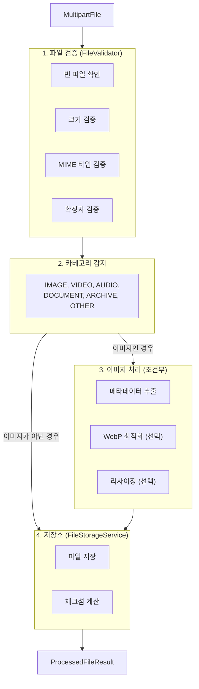

# Upload Guide

파일 업로드 및 처리 가이드입니다.

## 목차

- [FileProcessingService](#fileprocessingservice)
- [API Reference](#api-reference)
- [FileProcessingRequest](#fileprocessingrequest)
- [ProcessedFileResult](#processedfileresult)
- [FileValidator 검증 규칙](#filevalidator-검증-규칙)
- [코드 예제](#코드-예제)
- [Related Documents](#related-documents)

---

## FileProcessingService

파일 업로드의 메인 오케스트레이션 서비스입니다. 도메인에 독립적으로 설계되어 어떤 애플리케이션에서도 재사용할 수 있습니다.

### 처리 흐름



---

## API Reference

### processAndStore()

파일을 처리하고 저장합니다. 자동으로 파일 타입을 감지하여 적절한 처리를 수행합니다.

```java
@Autowired
private FileProcessingService fileProcessingService;

public ProcessedFileResult uploadFile(MultipartFile file) {
    FileProcessingRequest request = FileProcessingRequest.of(file, "files");
    return fileProcessingService.processAndStore(request);
}
```

### processAndStoreImage()

이미지 파일을 처리하고 저장합니다. 리사이징 옵션을 지정할 수 있습니다.

```java
public ProcessedFileResult uploadImage(MultipartFile file) {
    // 기본 설정 사용
    return fileProcessingService.processAndStoreImage(file, null, null);
}

public ProcessedFileResult uploadImageWithResize(MultipartFile file) {
    // 최대 1024x1024로 리사이징
    return fileProcessingService.processAndStoreImage(file, 1024, 1024);
}
```

### processAndStoreGenericFile()

일반 파일(비이미지)을 처리하고 저장합니다.

```java
public ProcessedFileResult uploadDocument(MultipartFile file) {
    return fileProcessingService.processAndStoreGenericFile(file, "documents");
}
```

### determineCategory()

파일의 카테고리를 판별합니다.

```java
public void checkCategory(MultipartFile file) {
    FileCategory category = fileProcessingService.determineCategory(file);

    switch (category) {
        case IMAGE -> log.info("Image file");
        case VIDEO -> log.info("Video file");
        case DOCUMENT -> log.info("Document file");
        default -> log.info("Other file type");
    }
}
```

---

## FileProcessingRequest

### 정적 팩토리 메서드

```java
// 기본 요청
FileProcessingRequest request = FileProcessingRequest.of(file, "files");

// 이미지 요청 (기본 크기)
FileProcessingRequest imageRequest = FileProcessingRequest.forImage(file);

// 이미지 요청 (커스텀 크기)
FileProcessingRequest imageRequest = FileProcessingRequest.forImage(file, 1920, 1080);
```

### Builder 패턴

상세한 옵션이 필요한 경우 Builder를 사용합니다.

```java
FileProcessingRequest request = FileProcessingRequest.builder(file)
    .directory("uploads/images")
    .maxFileSize(DataSize.ofMegabytes(5))
    .allowedMimeTypes(Set.of("image/jpeg", "image/png"))
    .maxWidth(2048)
    .maxHeight(2048)
    .enableWebpOptimization(true)
    .build();

ProcessedFileResult result = fileProcessingService.processAndStore(request);
```

### 파라미터 설명

| 파라미터 | 타입 | 기본값 | 설명 |
|---------|------|-------|------|
| `file` | MultipartFile | (필수) | 업로드할 파일 |
| `directory` | String | "files" | 저장 디렉토리 |
| `maxFileSize` | DataSize | 설정값 | 최대 파일 크기 |
| `allowedMimeTypes` | Set<String> | 설정값 | 허용 MIME 타입 |
| `maxWidth` | Integer | 설정값 | 최대 이미지 너비 |
| `maxHeight` | Integer | 설정값 | 최대 이미지 높이 |
| `enableWebpOptimization` | Boolean | 설정값 | WebP 최적화 여부 |

---

## ProcessedFileResult

처리 결과를 담는 레코드입니다.

### 주요 필드

```java
ProcessedFileResult result = fileProcessingService.processAndStore(request);

// StoredFileInfo 접근
StoredFileInfo storedInfo = result.storedInfo();
String storedPath = result.getStoredPath();        // storedInfo.storedPath()
String originalName = result.getOriginalName();    // storedInfo.originalName()
long fileSize = result.getFileSize();              // storedInfo.fileSize()
String extension = result.getExtension();          // storedInfo.extension()
String checksum = result.getChecksum();            // storedInfo.checksum()

// 카테고리 및 MIME 타입
FileCategory category = result.category();
String mimeType = result.mimeType();               // 최종 MIME (WebP 변환 후)
String originalMimeType = result.originalMimeType(); // 원본 MIME

// 이미지 메타데이터 (이미지가 아니면 null)
Integer width = result.width();
Integer height = result.height();

// 최적화 여부
boolean wasOptimized = result.wasOptimized();
boolean mimeTypeChanged = result.wasMimeTypeChanged();
```

### 카테고리 확인 메서드

```java
if (result.isImage()) {
    // 이미지 처리
    log.info("Image {}x{}", result.width(), result.height());
}

if (result.isVideo()) {
    // 비디오 처리
}

if (result.isDocument()) {
    // 문서 처리
}

if (result.isAudio()) {
    // 오디오 처리
}
```

---

## FileValidator 검증 규칙

### 검증 순서

1. **빈 파일 검사**: `file.isEmpty()` 확인
2. **파일 크기 검증**: `maxFileSize` 이하인지 확인
3. **MIME 타입 검증**: `allowedMimeTypes`에 포함되는지 확인
4. **확장자-MIME 매칭**: 확장자와 MIME 타입이 일치하는지 확인 (경고)
5. **이미지 형식 검증**: 이미지인 경우 실제 이미지 형식인지 확인

### MIME-확장자 매핑

| MIME 타입 | 허용 확장자 |
|----------|------------|
| `image/jpeg` | jpg, jpeg |
| `image/png` | png |
| `image/gif` | gif |
| `image/webp` | webp |
| `image/bmp` | bmp |
| `image/tiff` | tiff, tif |
| `image/svg+xml` | svg |
| `application/pdf` | pdf |
| `application/msword` | doc |
| `application/vnd.openxmlformats-officedocument.wordprocessingml.document` | docx |
| `application/vnd.ms-excel` | xls |
| `application/vnd.openxmlformats-officedocument.spreadsheetml.sheet` | xlsx |
| `application/zip` | zip |
| `application/gzip` | gz, gzip |
| `application/x-tar` | tar |
| `text/plain` | txt |
| `text/csv` | csv |
| `text/rtf` | rtf |

> MIME 타입과 확장자가 불일치하는 경우 경고만 로깅되고 처리는 계속 진행됩니다.

---

## 코드 예제

### 기본 파일 업로드

```java
@RestController
@RequestMapping("/api/files")
@RequiredArgsConstructor
public class FileController {

    private final FileProcessingService fileProcessingService;
    private final FileStorageService storageService;

    @PostMapping("/upload")
    public FileUploadResponse upload(@RequestParam("file") MultipartFile file) {
        ProcessedFileResult result = fileProcessingService.processAndStore(
            FileProcessingRequest.of(file, "files")
        );

        return FileUploadResponse.builder()
            .storedPath(result.getStoredPath())
            .originalName(result.getOriginalName())
            .mimeType(result.mimeType())
            .fileSize(result.getFileSize())
            .url(storageService.getPublicUrl(result.getStoredPath()))
            .build();
    }
}
```

### 이미지 업로드 (리사이징)

```java
@PostMapping("/upload/image")
public ImageUploadResponse uploadImage(@RequestParam("file") MultipartFile file) {
    ProcessedFileResult result = fileProcessingService.processAndStoreImage(
        file, 1920, 1080  // 최대 1920x1080
    );

    return ImageUploadResponse.builder()
        .storedPath(result.getStoredPath())
        .width(result.width())
        .height(result.height())
        .wasOptimized(result.wasOptimized())
        .mimeType(result.mimeType())
        .url(storageService.getPublicUrl(result.getStoredPath()))
        .thumbnailUrl(storageService.getThumbnailUrl(result.getStoredPath(), 128, 128))
        .build();
}
```

### 커스텀 검증 옵션

```java
@PostMapping("/upload/profile")
public FileUploadResponse uploadProfile(@RequestParam("file") MultipartFile file) {
    FileProcessingRequest request = FileProcessingRequest.builder(file)
        .directory("profiles")
        .maxFileSize(DataSize.ofMegabytes(2))
        .allowedMimeTypes(Set.of("image/jpeg", "image/png"))
        .maxWidth(512)
        .maxHeight(512)
        .enableWebpOptimization(true)
        .build();

    ProcessedFileResult result = fileProcessingService.processAndStore(request);

    return FileUploadResponse.from(result);
}
```

### 에러 처리

```java
@PostMapping("/upload")
public ResponseEntity<?> uploadWithErrorHandling(@RequestParam("file") MultipartFile file) {
    try {
        ProcessedFileResult result = fileProcessingService.processAndStore(
            FileProcessingRequest.of(file, "files")
        );
        return ResponseEntity.ok(FileUploadResponse.from(result));

    } catch (FileUploadException e) {
        return switch (e.getErrorCode()) {
            case EMPTY_FILE -> ResponseEntity.badRequest()
                .body(new ErrorResponse("FILE_EMPTY", "File is empty"));
            case FILE_SIZE_EXCEEDED -> ResponseEntity.status(HttpStatus.PAYLOAD_TOO_LARGE)
                .body(new ErrorResponse("FILE_TOO_LARGE", "File size exceeds limit"));
            case INVALID_FILE_TYPE -> ResponseEntity.badRequest()
                .body(new ErrorResponse("INVALID_TYPE", "File type not allowed"));
            default -> ResponseEntity.internalServerError()
                .body(new ErrorResponse("UPLOAD_FAILED", e.getMessage()));
        };
    }
}
```

### 애플리케이션 서비스 통합

```java
@Service
@RequiredArgsConstructor
public class ArticleService {

    private final FileProcessingService fileProcessingService;
    private final FileAttachmentRepository attachmentRepository;
    private final FileStorageService storageService;

    @Transactional
    public FileAttachment uploadAttachment(Long articleId, MultipartFile file) {
        // 1. 파일 처리 (인프라 계층)
        ProcessedFileResult result = fileProcessingService.processAndStore(
            FileProcessingRequest.of(file, "articles/" + articleId)
        );

        // 2. 도메인 엔티티 생성 (애플리케이션 계층)
        FileAttachment attachment = FileAttachment.builder()
            .entityType("ARTICLE")
            .entityId(articleId.toString())
            .originalName(result.getOriginalName())
            .storedPath(result.getStoredPath())
            .mimeType(result.mimeType())
            .fileSize(result.getFileSize())
            .checksum(result.getChecksum())
            .fileType(mapCategory(result.category()))
            .mediaWidth(result.width())
            .mediaHeight(result.height())
            .build();

        // 3. 저장
        return attachmentRepository.save(attachment);
    }

    private FileType mapCategory(FileCategory category) {
        return switch (category) {
            case IMAGE -> FileType.IMAGE;
            case VIDEO -> FileType.VIDEO;
            case DOCUMENT -> FileType.DOCUMENT;
            default -> FileType.OTHER;
        };
    }
}
```

---

## Related Documents

- [Overview (아키텍처 상세)](./overview.md) - 모듈 구조 및 설정
- [Storage Guide (저장소 설정)](./storage-guide.md) - Local/S3 Provider 설정
- [Image Guide (이미지 처리)](./image-guide.md) - 이미지 리사이징, 썸네일, WebP
