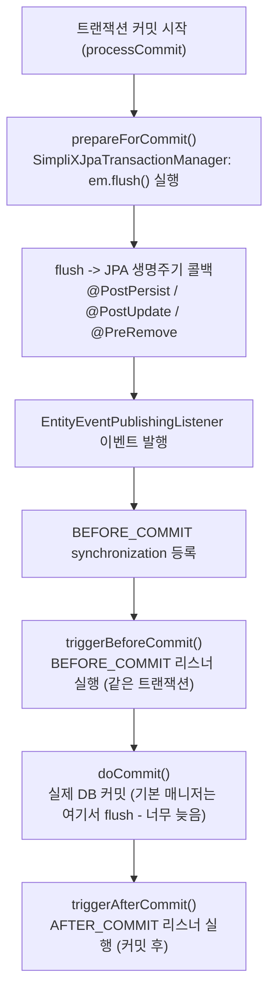

# Entity 이벤트 발행

JPA 엔티티의 생성·수정·삭제를 감지해 Spring 애플리케이션 이벤트(`EventMessage`)로 발행하는 기능입니다. `SimpliXJpaTransactionManager`와 함께 동작해, 커밋 시점에만 flush되는 변경(삭제, dirty check로만 감지되는 수정)에 대해서도 `@TransactionalEventListener(BEFORE_COMMIT)` 리스너가 같은 트랜잭션 안에서 이벤트를 확실히 받도록 보장합니다.

## 목차

- [동작 원리](#동작-원리)
- [기본 사용법](#기본-사용법)
- [이벤트 전달 시점과 소비](#이벤트-전달-시점과-소비)
- [실패 처리 계약](#실패-처리-계약)
- [설정](#설정)
- [제약 사항](#제약-사항)
- [문제 해결](#문제-해결)
- [관련 문서](#관련-문서)

---

## 동작 원리

Spring의 `@TransactionalEventListener`는 이벤트가 발행될 때 곧바로 실행되지 않는다. 트랜잭션에 `TransactionSynchronization`을 등록해 두고 정해진 단계(BEFORE_COMMIT 등)에 실행된다. 문제는 등록과 실행의 순서다.

기본 `JpaTransactionManager`는 `doCommit` 안에서 flush한다. 그런데 flush가 일어나야 JPA 생명주기 콜백이 발동하고, 그 콜백이 이벤트를 발행한다. 즉 이벤트 발행과 synchronization 등록이 `doCommit`에서 벌어지는데, BEFORE_COMMIT 리스너를 실제로 실행하는 `triggerBeforeCommit`은 이미 지나간 뒤다. `triggerBeforeCommit`은 등록된 synchronization 목록의 스냅샷을 순회하므로, 이후에 등록된 것은 실행되지 않는다. 결과적으로 이벤트가 조용히 사라진다.

`SimpliXJpaTransactionManager`는 `triggerBeforeCommit`보다 앞서 도는 유일한 확장 지점인 `prepareForCommit`에서 flush한다. 이렇게 하면 생명주기 콜백과 이벤트 발행, synchronization 등록이 모두 끝난 상태로 `triggerBeforeCommit`에 진입하므로, BEFORE_COMMIT 리스너가 정상 실행된다.



이 flush는 가장 바깥 읽기·쓰기 트랜잭션에서만 일어난다. 참여 중인 안쪽 커밋과 읽기 전용 트랜잭션은 건너뛴다. 이미 flush가 끝난 트랜잭션에서는 추가 flush가 사실상 no-op이라 부담이 없다.

---

## 기본 사용법

### 엔티티에 이벤트 설정

엔티티에 `@EntityEventConfig`를 붙이고, 리스너를 `@EntityListeners`로 등록한다.

```java
import dev.simplecore.simplix.core.entity.annotation.EntityEventConfig;
import dev.simplecore.simplix.hibernate.event.EntityEventPublishingListener;
import jakarta.persistence.Entity;
import jakarta.persistence.EntityListeners;

@Entity
@EntityListeners(EntityEventPublishingListener.class)
@EntityEventConfig(
    onCreate = "USER_CREATED",
    onUpdate = "USER_UPDATED",
    onDelete = "USER_DELETED",
    ignoreProperties = {"updatedAt", "version"}
)
public class User extends BaseEntity {
    // ...
}
```

CREATE는 `@PostPersist`, UPDATE는 변경 속성이 있을 때, DELETE는 `@PreRemove` 시점에 발행된다. DELETE를 `@PreRemove`에서 발행하는 이유는 엔티티 그래프가 아직 살아 있어 payload에 삭제 전 데이터를 담을 수 있기 때문이다.

### payload 데이터 추가

`EntityEventPayloadProvider`를 구현하면 기본 필드(`id`, `className`) 외에 원하는 데이터를 payload에 넣을 수 있다.

```java
import dev.simplecore.simplix.core.entity.EntityEventPayloadProvider;

@Entity
@EntityListeners(EntityEventPublishingListener.class)
@EntityEventConfig(onCreate = "ORG_CREATED")
public class Organization extends BaseEntity implements EntityEventPayloadProvider {

    @Override
    public Map<String, Object> getEventPayloadData() {
        return Map.of(
            "name", getName(),
            "parentId", getParentId()
        );
    }
}
```

### 이벤트 소비

발행된 `EventMessage`는 일반 `@EventListener`나 `@TransactionalEventListener`로 받는다.

```java
import dev.simplecore.simplix.core.event.model.EventMessage;
import org.springframework.transaction.event.TransactionPhase;
import org.springframework.transaction.event.TransactionalEventListener;

@Component
public class OutboxWriter {

    @TransactionalEventListener(phase = TransactionPhase.BEFORE_COMMIT)
    public void onEntityEvent(EventMessage event) {
        // Runs inside the same transaction - the outbox row commits atomically
        // with the business change.
        outboxRepository.save(toOutboxRecord(event));
    }
}
```

---

## 이벤트 전달 시점과 소비

| 소비 방식 | 실행 시점 | 트랜잭션 참여 | 용도 |
|-----------|----------|--------------|------|
| `@TransactionalEventListener(BEFORE_COMMIT)` | 커밋 직전, flush 이후 | 참여 (같은 트랜잭션) | outbox 적재, 같은 트랜잭션에 원자적으로 묶어야 하는 후처리 |
| `@TransactionalEventListener(AFTER_COMMIT)` | 커밋 성공 후 | 미참여 | 알림 발송, 외부 시스템 호출 등 커밋 확정 후 처리 |
| `@EventListener` | 발행 즉시 (동기) | 발행 스레드에서 실행 | 트랜잭션 경계와 무관한 즉시 처리 |

BEFORE_COMMIT 소비자를 붙이려면 활성 트랜잭션 매니저가 `SimpliXJpaTransactionManager`여야 한다. 기본 자동 구성에서 이 매니저가 등록되며, 시작 시점에 활성 매니저를 검증한다([설정](#설정) 참고).

---

## 실패 처리 계약

이벤트 발행이 실패했을 때 비즈니스 트랜잭션을 어떻게 처리할지는 `@EntityEventConfig`의 `failOnError`로 정한다. 발행 경로란 payload 구성(`getEventPayloadData()`)과 동기 리스너 실행을 말한다.

| `failOnError` | 발행 경로 실패 시 | 용도 |
|---------------|------------------|------|
| `true` (기본값) | 예외가 전파되어 커밋이 롤백된다 | outbox처럼 이벤트가 비즈니스 변경과 원자적으로 저장돼야 하는 경우 |
| `false` | 예외를 로그로 남기고 삼킨다. 트랜잭션은 커밋된다 | 감사 로그·알림처럼 유실이 비즈니스를 깨뜨리면 안 되는 best-effort 이벤트 |

```java
// Best-effort audit event: a payload bug must not roll back the business change.
@Entity
@EntityListeners(EntityEventPublishingListener.class)
@EntityEventConfig(onUpdate = "AUDIT_TRAIL", failOnError = false)
public class AuditableDocument extends BaseEntity implements EntityEventPayloadProvider {
    // ...
}
```

⚠ `failOnError`는 발행 경로만 관장한다. BEFORE_COMMIT 소비자가 자기 리스너 본문에서 예외를 던지면, 이 플래그와 무관하게 항상 커밋이 롤백된다. 이는 Spring이 리스너를 `triggerBeforeCommit` 단계에서 실행하기 때문이며, 발행 경로 바깥이다.

---

## 설정

`SimpliXJpaTransactionManager`는 기본으로 등록되며, `HibernateJpaAutoConfiguration`보다 먼저 구성돼 Spring Boot 기본 매니저가 물러난다. 애플리케이션이 자체 트랜잭션 매니저를 정의하면 그쪽이 우선하고, 시작 검증기가 이를 알린다.

```yaml
simplix:
  transaction:
    enabled: true       # 기능 사용 여부 (기본: true)
    fail-fast: false    # 활성 JPA 매니저가 SimpliX 것이 아닐 때 시작 실패 여부 (기본: false)
```

| 속성 | 타입 | 기본값 | 설명 |
|------|------|-------|------|
| `simplix.transaction.enabled` | boolean | `true` | `false`면 매니저 등록과 시작 검증을 하지 않는다 |
| `simplix.transaction.fail-fast` | boolean | `false` | `true`면 활성 JPA 트랜잭션 매니저가 `SimpliXJpaTransactionManager`가 아닐 때 ERROR 로그 대신 시작을 실패시킨다 |

활성 JPA 매니저가 `SimpliXJpaTransactionManager`이면 시작 시점에 확인 로그를 남긴다. 아니면 BEFORE_COMMIT 이벤트 전달이 보장되지 않는다는 ERROR를 남기고, `fail-fast=true`면 시작을 중단한다.

---

## 제약 사항

- **트랜잭션 매니저 교체가 전제다.** BEFORE_COMMIT 전달 보장은 활성 JPA 트랜잭션 매니저가 `SimpliXJpaTransactionManager`일 때만 성립한다. 애플리케이션이 자체 매니저를 등록하면 보장이 깨지므로, 그 경우 `SimpliXJpaTransactionManager`를 상속하거나 대신 사용한다. 다중 데이터소스처럼 매니저가 여럿인 구성에서는 각각을 개별적으로 검토한다.
- **보장은 한 단계 깊이까지 미친다.** BEFORE_COMMIT 리스너가 스스로 엔티티를 변경하면, 그 변경은 `doCommit`의 두 번째 flush에서 처리되고 거기서 발행되는 이벤트는 다시 BEFORE_COMMIT에 늦는다. 리스너 안에서 만든 변경까지 같은 BEFORE_COMMIT 보장을 받지는 못한다.
- **읽기 전용 트랜잭션은 대상이 아니다.** `@Transactional(readOnly = true)` 트랜잭션은 flush를 건너뛰므로 이벤트가 발행되지 않는다.

---

## 문제 해결

**BEFORE_COMMIT 리스너가 삭제·dirty check 수정 이벤트를 받지 못한다**

증상: 명시적으로 `flush()`를 부르지 않는 삭제나 수정에서 BEFORE_COMMIT 리스너가 호출되지 않는다.

원인: 활성 트랜잭션 매니저가 `SimpliXJpaTransactionManager`가 아니다.

해결: 시작 로그에서 활성 매니저를 확인한다. 자체 매니저를 쓴다면 `SimpliXJpaTransactionManager`로 교체한다. 조기에 드러내려면 다음을 설정한다.

```yaml
simplix:
  transaction:
    fail-fast: true
```

**payload 구성 오류가 비즈니스 트랜잭션을 롤백시킨다**

증상: `getEventPayloadData()`의 오류로 정상적인 저장·삭제가 롤백된다.

해결: 해당 이벤트가 best-effort라면 엔티티에 `failOnError = false`를 지정한다. outbox 용도라면 payload 구성 오류 자체를 고쳐야 한다.

---

## 관련 문서

- [Overview (아키텍처 상세)](./overview.md) - 모듈 구조 및 컴포넌트
- [Configuration Guide (설정 가이드)](./configuration.md) - 캐시 설정 옵션
