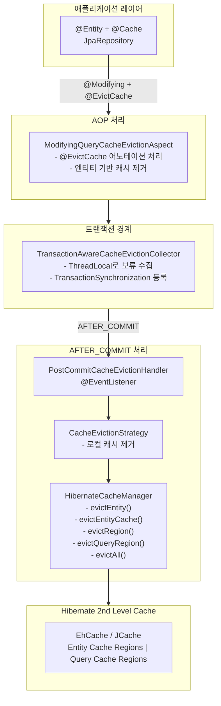

# SimpliX Hibernate Cache Module Overview

## 목차

- [Architecture](#architecture)
  - [Key Design: Transaction-Aware Eviction](#key-design-transaction-aware-eviction)
- [Hibernate Native Cache Management](#hibernate-native-cache-management)
- [Core Components](#core-components)
  - [HibernateCacheManager](#hibernatecachemanager)
  - [EntityCacheScanner](#entitycachescanner)
  - [CacheEvictionStrategy](#cacheevictionstrategy)
- [@Modifying 쿼리 캐시 무효화](#modifying-쿼리-캐시-무효화)
- [Auto-Configuration](#auto-configuration)
- [설정 속성](#설정-속성)
- [Distributed Cache](#distributed-cache)
- [Related Documents](#related-documents)

---

## Architecture



### Key Design: Transaction-Aware Eviction

캐시 무효화가 **트랜잭션 커밋 후에만** 실행됩니다:

- `TransactionSynchronization.afterCommit()`에서만 캐시 삭제 이벤트 발행
- 롤백 시 캐시 유지

---

## Hibernate Native Cache Management

Hibernate 2nd-level 캐시는 기본 EntityManager 작업에 대해 자동으로 캐시를 관리합니다:

| 작업 | Hibernate 처리 | SimpliX 역할 |
|------|---------------|-------------|
| `repository.save()` | 자동 캐시 업데이트 | 불필요 |
| `repository.delete()` | 자동 캐시 제거 | 불필요 |
| `entityManager.persist()` | 자동 캐시 업데이트 | 불필요 |
| `entityManager.remove()` | 자동 캐시 제거 | 불필요 |
| `@Modifying` 쿼리 | **처리 안 됨** | **@EvictCache 필요** |

SimpliX Hibernate 모듈은 Hibernate의 네이티브 기능을 대체하지 않고, **@Modifying 쿼리에 대한 보완적 지원**을 제공합니다.

---

## Core Components

### HibernateCacheManager

Hibernate 2nd-level 캐시 작업의 중앙 관리자입니다.

```java
public class HibernateCacheManager {
    // 특정 엔티티 캐시 제거
    public void evictEntity(Class<?> entityClass, Object id);

    // 엔티티 타입 전체 캐시 제거
    public void evictEntityCache(Class<?> entityClass);

    // 특정 리전 제거
    public void evictRegion(String regionName);

    // 쿼리 캐시 리전 제거
    public void evictQueryRegion(String queryRegion);

    // 모든 캐시 제거
    public void evictAll();

    // 캐시 존재 확인
    public boolean contains(Class<?> entityClass, Object id);

    // 활성 리전 목록
    public Set<String> getActiveRegions();
}
```

### EntityCacheScanner

애플리케이션 시작 시 `@Cache` 어노테이션이 있는 엔티티를 자동으로 스캔합니다.

```java
// 지정 패키지에서 캐시된 엔티티 스캔
scanner.scanForCachedEntities("com.example.domain");

// 캐시된 엔티티 목록 조회
Set<Class<?>> cachedEntities = scanner.getCachedEntities();

// 캐시 리전 목록 조회
Set<String> regions = scanner.getCacheRegions();

// 특정 엔티티 캐시 여부 확인
boolean isCached = scanner.isCached(User.class);
```

**자동 스캔:**
- `simplix.hibernate.cache.scan-packages` 설정 또는
- 패키지 미지정 시 전체 클래스패스 스캔

### CacheEvictionStrategy

캐시 무효화를 수행합니다.

```java
public class CacheEvictionStrategy {
    // 엔티티 변경 시 캐시 제거
    public void evict(Class<?> entityClass, Object entityId);

    // 클래스명으로 캐시 제거
    public void evict(String entityClassName, Object entityId);
}
```

---

## @Modifying 쿼리 캐시 무효화

`@Modifying` 쿼리는 Hibernate 엔티티 이벤트를 발생시키지 않습니다. SimpliX는 **`@EvictCache` 어노테이션**을 통해 명시적으로 캐시 무효화를 지정합니다.

```java
@Modifying
@Query("UPDATE User u SET u.status = :status WHERE u.role = :role")
@EvictCache(User.class)
int updateStatusByRole(@Param("status") Status status, @Param("role") Role role);
```

상세 사용법: [Cache Eviction Guide](./cache-eviction.md#evictcache-annotation)

---

## Auto-Configuration

`SimpliXHibernateCacheAutoConfiguration`이 자동으로 활성화됩니다.

**활성화 조건:**
- Hibernate 클래스패스 존재
- EntityManagerFactory 빈 존재
- `simplix.hibernate.cache.disabled=false` (기본값)

**자동 등록 빈:**

| Bean | 설명 |
|------|------|
| HibernateCacheManager | 캐시 작업 관리자 |
| TransactionAwareCacheEvictionCollector | 트랜잭션 인식 eviction 수집기 |
| PostCommitCacheEvictionHandler | 커밋 후 캐시 삭제 핸들러 |
| ModifyingQueryCacheEvictionAspect | @EvictCache 어노테이션 처리 |
| EntityCacheScanner | @Cache 엔티티 스캔 |
| CacheEvictionStrategy | 캐시 무효화 전략 |
| HibernateCacheInitializer | 시작 시 엔티티 스캔 초기화 |

---

## 설정 속성

```yaml
simplix:
  hibernate:
    cache:
      disabled: false              # 캐시 관리 비활성화 (기본: false)
      scan-packages: com.example   # @Cache 엔티티 스캔 패키지 (선택)
```

| 속성 | 타입 | 기본값 | 설명 |
|------|------|--------|------|
| `simplix.hibernate.cache.disabled` | boolean | `false` | 캐시 관리 비활성화 |
| `simplix.hibernate.cache.scan-packages` | String | - | @Cache 엔티티 스캔 패키지 |
| `simplix.hibernate.cache.query-cache-auto-eviction` | boolean | `true` | @EvictCache 시 쿼리 캐시 자동 무효화 |

### query-cache-auto-eviction 속성

전역적으로 쿼리 캐시 자동 무효화를 제어합니다:

```yaml
simplix:
  hibernate:
    cache:
      query-cache-auto-eviction: false  # 전역 비활성화
```

**우선순위:**
1. `@EvictCache(evictQueryCache = false)` - 개별 메서드 설정 (최우선)
2. `query-cache-auto-eviction` - 전역 기본값

상세 설정: [Configuration Guide](./configuration.md)

---

## Distributed Cache

분산 캐시 동기화가 필요한 경우, Hibernate의 네이티브 분산 캐시 통합을 사용하세요:

| Provider | 설정 방법 |
|----------|----------|
| Hazelcast | `hibernate-jcache` + Hazelcast JCache provider |
| Infinispan | `hibernate-cache-infinispan` |
| Redis | Redisson Hibernate cache |

이러한 프로바이더들은 클러스터 전체 캐시 무효화를 자동으로 처리합니다.

---

## Related Documents

- [Configuration Guide (설정 가이드)](./configuration.md) - 설정 옵션 및 @Cache 사용법
- [Cache Eviction Guide (캐시 무효화)](./cache-eviction.md) - 수동 제거 및 @EvictCache 사용법
