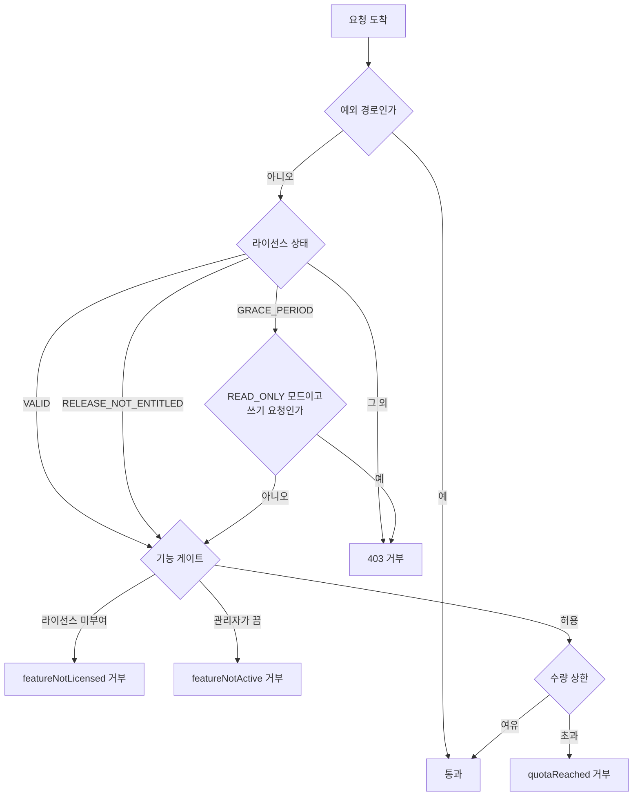

# 라이선스 강제 적용

라이선스 판정을 실제 요청과 데이터에 적용하는 방법을 설명합니다. 강제 지점은 요청 필터, 기능 게이트, 수량 제한 셋이며 모두 같은 판정을 읽습니다.

## 목차

- [강제 지점 비교](#강제-지점-비교)
- [요청 단위 강제](#요청-단위-강제)
- [기능 게이팅](#기능-게이팅)
- [관리자 활성화 연동](#관리자-활성화-연동)
- [수량 제한](#수량-제한)
- [감사 기록](#감사-기록)
- [메시지 키](#메시지-키)
- [문제 해결](#문제-해결)
- [관련 문서](#관련-문서)

## 강제 지점 비교

| 지점 | 판정 대상 | 적용 방법 | 거부 결과 |
|------|----------|----------|----------|
| 요청 필터 | 라이선스 상태 | 자동 등록 | 403, `LICENSE_{상태}` |
| 기능 게이트 | 기능 부여 여부 | `@RequiresFeature` | 403, `featureNotLicensed` |
| 활성화 게이트 | 관리자 켬/끔 | `@RequiresFeature` + `FeatureActivationChecker` | 403, `featureNotActive` |
| 수량 제한 | 계약 상한 | `LicenseQuotaGuard.require()` | 409, `quotaReached` |

### 전체 판정 흐름



---

## 요청 단위 강제

`LicenseEnforcementFilter`가 `/api/*` 아래 요청을 라이선스 상태에 따라 처리합니다. 별도 등록 없이 자동 구성됩니다.

### 상태별 동작

| 상태 | 동작 |
|------|------|
| `VALID` | 모든 요청 허용 |
| `RELEASE_NOT_ENTITLED` | 모든 요청 허용, 유료 기능은 기능 게이트가 거부 |
| `GRACE_PERIOD` + `READ_ONLY` | GET, HEAD, OPTIONS만 허용 |
| `GRACE_PERIOD` + `RESTRICTED` | 모든 요청 허용, 기능 제한만 적용 |
| `SIGNING_KEY_COMPROMISED` | 예외 경로를 제외하고 403 |
| 그 외 | 예외 경로를 제외하고 403 |

### 항상 열려 있는 경로

| 경로 | 이유 |
|------|------|
| `{prefix}/auth/token/issue`, `/refresh`, `/revoke` | 로그인 없이는 라이선스 화면에 접근할 수 없음 |
| `{prefix}/deployment-license/` | 라이선스 등록 화면 |
| `{prefix}/system/setup`, `{prefix}/install` | 최초 설치 마법사 |
| `{prefix}/public/` | 공개 엔드포인트 |
| `/actuator/health`, `/backend/login`, `/backend/logout` | 상태 확인과 로그인 화면 |
| `/css/`, `/js/`, `/images/`, `/fonts/`, `/favicon` | 정적 자원 |

인증 경로를 여는 것만으로는 아무 권한도 생기지 않습니다. 로그인한 운영자도 나머지 API는 이 필터에, 유료 기능은 기능 게이트에 막힙니다. 얻는 것은 라이선스 화면에 도달할 수 있다는 점뿐입니다.

인증 경로는 접두사가 아니라 정확한 경로 세 개로 지정됩니다. 나중에 `/auth/token` 아래에 추가되는 엔드포인트는 검토를 거쳐 명시적으로 추가하기 전까지 차단됩니다.

### 거부 응답

```json
{
  "type": "ERROR",
  "message": "라이선스가 만료되었습니다",
  "body": null,
  "errorCode": "LICENSE_EXPIRED",
  "timestamp": "2026-07-29T11:30:00+09:00"
}
```

`errorCode`가 `LICENSE_`로 시작하므로, 클라이언트는 일반 권한 오류와 구분해 권한 안내 대신 라이선스 화면을 제시할 수 있습니다.

### 강제 지점 이동

라이선스를 직접 판매하는 제품처럼, 모든 요청을 끊으면 고객사 배포본까지 함께 멈추는 경우에는 필터를 끄고 필요한 지점에서 직접 게이트를 호출합니다.

```yaml
application:
  license:
    enforcement:
      http-filter-enabled: false
```

```java
@Service
public class SubscriptionService {

    private final LicenseState licenseState;

    public SubscriptionService(LicenseState licenseState) {
        this.licenseState = licenseState;
    }

    public Subscription issue(SubscriptionCreateDTO dto) {
        if (!licenseState.isUsable()) {
            throw new SimpliXGeneralException(ErrorCode.AUTHZ_ACCESS_DENIED,
                    "{error.license.notValid}", null);
        }
        return subscriptionRepository.save(dto.toEntity());
    }
}
```

> ℹ 이 설정은 판정을 없애지 않습니다. 판정을 묻는 위치를 요청 필터에서 애플리케이션 코드로 옮길 뿐입니다.

---

## 기능 게이팅

### 어노테이션 적용

```java
import dev.accesscore.license.sdk.adapter.RequiresFeature;

@RestController
@RequestMapping("/visitor-analytics")
@RequiresFeature(PortalFeatures.ANALYTICS)
public class VisitorAnalyticsRestController extends SimpliXBaseController<VisitorAnalytics, String> {
    // Every endpoint here needs the analytics feature
}
```

메서드 어노테이션이 클래스 어노테이션보다 우선합니다. 컨트롤러 전체를 하나의 기능으로 묶고, 그중 한 엔드포인트만 다른 기능을 요구하도록 지정할 수 있습니다.

```java
@RestController
@RequiresFeature(PortalFeatures.ANALYTICS)
public class VisitorAnalyticsRestController {

    @GetMapping("/export")
    @RequiresFeature(PortalFeatures.ADVANCED_EXPORT)
    public SimpliXApiResponse<ExportResultDTO> export() {
        // Needs the advanced export feature instead
    }
}
```

기능 키는 문자열 리터럴이 아니라 상수로 관리합니다. 리터럴 오타는 조용히 게이트를 여는 방향으로 실패합니다.

```java
public final class PortalFeatures {

    public static final String ANALYTICS = "analytics";
    public static final String ADVANCED_EXPORT = "advanced-export";

    private PortalFeatures() {
    }
}
```

### 코드에서 직접 확인

스케줄러, 이벤트 리스너처럼 HTTP 요청이 없는 경로는 `FeatureAccess`를 직접 호출합니다.

```java
@Component
public class AnalyticsAggregationScheduler {

    private final FeatureAccess featureAccess;
    private final AnalyticsService analyticsService;

    public AnalyticsAggregationScheduler(FeatureAccess featureAccess,
                                         AnalyticsService analyticsService) {
        this.featureAccess = featureAccess;
        this.analyticsService = analyticsService;
    }

    @Scheduled(cron = "0 0 2 * * ?")
    public void aggregateDaily() {
        if (!featureAccess.isAllowed(PortalFeatures.ANALYTICS)) {
            return;
        }
        analyticsService.aggregate();
    }
}
```

`isAllowed()`는 라이선스 부여와 관리자 활성화를 함께 확인합니다. 관리자가 끈 기능의 배치 작업이 계속 도는 일을 막는 지점이 여기입니다.

### 기능 카탈로그 보고

이 배포본이 게이팅하는 기능 키를 라이선스 서버에 알리면, 판매됐지만 어느 배포본도 확인하지 않는 기능을 발급 측에서 발견할 수 있습니다.

```java
@Component
public class PortalFeatureCatalogue implements FeatureCatalogue {

    @Override
    public List<String> gatedFeatures() {
        return List.of(PortalFeatures.ANALYTICS, PortalFeatures.ADVANCED_EXPORT);
    }
}
```

### 프론트엔드 연동

화면 메뉴는 서버가 판정한 결과와 같아야 합니다.

```bash
curl -X GET "http://localhost:8080/api/v1/deployment-license/features" \
  -H "Authorization: Bearer {token}"
```

```json
{
  "type": "SUCCESS",
  "body": ["analytics", "reporting"],
  "timestamp": "2026-07-29T11:30:00+09:00"
}
```

이 목록은 `FeatureAccess.effectiveFeatures()`와 같은 값이므로 화면과 서버 게이트가 어긋나지 않습니다.

---

## 관리자 활성화 연동

라이선스가 부여한 기능이라도 관리자가 끌 수 있게 하려면 `FeatureActivationChecker`를 등록합니다. 등록하면 `FeatureActivationAspect`가 함께 활성화되어, `@RequiresFeature` 지점에서 활성화 여부까지 확인합니다.

```java
@Component
public class ModuleActivationChecker implements FeatureActivationChecker {

    private final ModuleSettingRepository moduleSettingRepository;

    public ModuleActivationChecker(ModuleSettingRepository moduleSettingRepository) {
        this.moduleSettingRepository = moduleSettingRepository;
    }

    @Override
    public boolean isEffectivelyActive(String feature) {
        return moduleSettingRepository.findByFeatureKey(feature)
                .map(ModuleSetting::isActive)
                .orElse(true);
    }
}
```

| 라이선스 부여 | 관리자 활성화 | 결과 |
|-------------|-------------|------|
| 예 | 예 | 허용 |
| 예 | 아니오 | `featureNotActive` 거부 |
| 아니오 | 무관 | `featureNotLicensed` 거부 |

---

## 수량 제한

### 카운터 등록

```java
@Component
public class DeviceQuotaCounter implements QuotaCounter {

    private final DeviceRepository deviceRepository;

    public DeviceQuotaCounter(DeviceRepository deviceRepository) {
        this.deviceRepository = deviceRepository;
    }

    @Override
    public List<String> countedQuotaCodes() {
        return List.of("devices", "gateways");
    }

    @Override
    public long count(String quotaCode) {
        return switch (quotaCode) {
            case "devices" -> deviceRepository.countByDeletedFalse();
            case "gateways" -> gatewayRepository.countByDeletedFalse();
            default -> 0L;
        };
    }
}
```

카운터가 없는 코드는 상한이 강제되지 않습니다. 카운터가 하나도 없으면 기동 시 경고가 남습니다.

### 등록 지점에서 확인

```java
@Service
@Transactional(readOnly = true)
public class DeviceService extends SimpliXBaseService<Device, String> {

    private final LicenseQuotaGuard quotaGuard;

    @Transactional
    public DeviceDTOs.DetailDTO create(DeviceDTOs.CreateDTO dto) {
        quotaGuard.require("devices");
        return buildDetailDTO(deviceRepository.save(toEntity(dto)));
    }

    @Transactional
    public List<DeviceDTOs.DetailDTO> createFromModel(ControllerModel model) {
        // A controller model that brings eight reader ports needs eight places, not one
        quotaGuard.require("devices", model.getPortCount());
        return model.buildDevices().stream().map(this::save).toList();
    }
}
```

| 상황 | 동작 |
|------|------|
| 라이선스가 코드를 명시하지 않음 | 무제한 |
| 상한이 0 | 등록 불가 |
| 세는 카운터 없음 | 강제되지 않음 |
| 추가 개수가 0 이하 | 항상 허용 |
| 현재 개수 + 추가 개수 > 상한 | 409 거부, 감사 기록 |

### 계약이 줄어든 경우

계약 수량이 이미 설치된 수보다 작아져도 설치된 설비는 계속 동작합니다. 라이선스가 바뀌었다는 이유로 출입 통제를 멈추면 사람이 문 앞에 갇히기 때문입니다. 거부되는 것은 신규 등록뿐이며, 초과분은 라이선스 화면의 사용량과 감사 기록으로 드러납니다.

```json
{
  "limits": {"devices": 300},
  "usage": {"devices": 412}
}
```

---

## 감사 기록

`AuditRecorder`를 등록하면 라이선스 관련 사건이 애플리케이션의 감사 체계로 들어갑니다.

```java
@Component
public class LicenseAuditRecorder implements AuditRecorder {

    private final AuditEventService auditEventService;

    public LicenseAuditRecorder(AuditEventService auditEventService) {
        this.auditEventService = auditEventService;
    }

    @Override
    public void recordStatusChange(LicenseStatus previous, LicenseStatus current, String licenseId) {
        auditEventService.record("LICENSE_STATUS_CHANGED",
                Map.of("previous", previous.name(), "current", current.name(),
                        "licenseId", String.valueOf(licenseId)));
    }

    @Override
    public void recordLifecycle(LifecycleEvent event, String licenseId, String detail) {
        auditEventService.record("LICENSE_" + event.name(),
                Map.of("licenseId", String.valueOf(licenseId), "detail", detail));
    }

    @Override
    public void recordLimitReached(String quotaCode, long current, long limit) {
        auditEventService.record("LICENSE_LIMIT_REACHED",
                Map.of("quotaCode", quotaCode, "current", current, "limit", limit));
    }
}
```

등록하지 않으면 아무것도 기록되지 않습니다. 라이선스 상태 전이는 운영 사건이므로 감사 대상 시스템에서는 등록을 권장합니다.

---

## 메시지 키

거부 메시지는 키로 던져지고 HTTP 계층에서 요청 로케일로 번역됩니다. 애플리케이션이 제공하는 모든 로케일의 메시지 번들에 다음 키가 있어야 합니다.

| Key | 발생 지점 |
|-----|----------|
| `error.license.notValid` | 요청 필터의 일반 거부 |
| `error.license.signingKeyCompromised` | 유출로 표시된 키로 서명된 토큰이 고정된 천장보다 더 요구함 |
| `error.license.gracePeriodReadOnly` | 유예 기간 읽기 전용 모드의 쓰기 요청 |
| `error.license.quotaReached` | 수량 상한 초과 |
| `error.license.malformedProductKey` | 제품 키 형식 오류 |
| `error.license.fingerprintUnavailable` | 머신 지문 확보 실패 |
| `error.license.serverError` | 라이선스 서버 오류 (구체적 키가 없을 때) |
| `error.system.featureNotLicensed` | 라이선스가 기능을 부여하지 않음 |
| `error.system.featureNotActive` | 관리자가 기능을 끔 |

라이선스 상태별 거부 사유는 SDK 판정이 키를 함께 전달하므로, 판정이 내려주는 키도 번들에 있어야 합니다.

---

## 문제 해결

### 기능 게이트가 동작하지 않습니다

증상: `@RequiresFeature`가 붙었는데 라이선스가 없어도 호출됩니다.

원인: Spring AOP가 클래스패스에 없거나, 프록시를 거치지 않는 자기 호출(self-invocation)입니다. `spring-boot-starter-aop`를 추가하고, 같은 빈 내부에서 직접 호출하는 대신 `FeatureAccess`를 호출합니다.

### 상한이 강제되지 않습니다

증상: 계약 수량을 넘겨도 등록됩니다.

확인 순서:

1. 기동 로그에 "No counter answers for any quota" 경고가 있는지 확인합니다.
2. `countedQuotaCodes()`가 반환하는 코드와 라이선스의 상한 코드가 같은지 확인합니다.
3. 등록 지점에서 `quotaGuard.require()`를 호출하는지 확인합니다. 카운터만으로는 강제되지 않습니다.

### 유예 기간에 화면이 저장되지 않습니다

증상: 조회는 되는데 저장이 403으로 실패합니다.

원인: `grace-period-mode`가 `READ_ONLY`입니다. 의도한 동작이며, 유예 기간에도 쓰기를 허용하려면 `RESTRICTED`로 바꿉니다. 이 경우 요청은 통과하고 기능 게이트만 적용됩니다.

### SIGNING_KEY_COMPROMISED로 차단됩니다

증상: 정상 발급된 토큰인데 상태가 `SIGNING_KEY_COMPROMISED`입니다.

원인: 토큰을 서명한 키가 이 빌드의 검증 키 목록에서 유출로 표시되어 있고, 토큰이 고정된 천장보다 많은 것을 요구합니다. 기능·수량 한도·만료·릴리스 상한 중 하나라도 올라가면 토큰 전체가 거절됩니다.

기동 로그에 거절된 토큰의 키 이름이 남습니다. 현재 서명 키를 담은 릴리스로 올린 뒤 그 키로 발급된 토큰을 등록하면 풀립니다. 유출 키로 서명된 토큰을 다시 발급받아도 결과는 같습니다.

아무것도 등록되지 않은 배포본은 천장이 "보유한 것 없음"으로 고정되므로, 유출 키로 서명된 토큰으로는 어떤 것도 등록할 수 없습니다.

### 라이선스 등록 화면에도 접근할 수 없습니다

증상: 차단 상태에서 라이선스 화면까지 403입니다.

원인: `api.version.prefix` 설정이 실제 API 경로와 다릅니다. 필터는 이 값에서 예외 경로를 계산하므로, 접두사를 바꿨다면 설정도 함께 맞춰야 합니다.

---

## 관련 문서

- [모듈 개요](./overview.md) - 아키텍처와 판정 흐름
- [활성화 가이드](./activation-guide.md) - 라이선스 등록 절차
- [설정 레퍼런스](./configuration.md) - 설정 옵션 전체 목록
