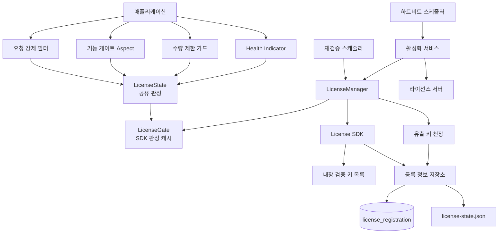
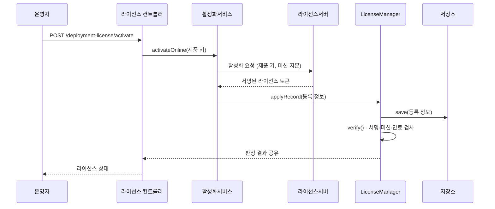
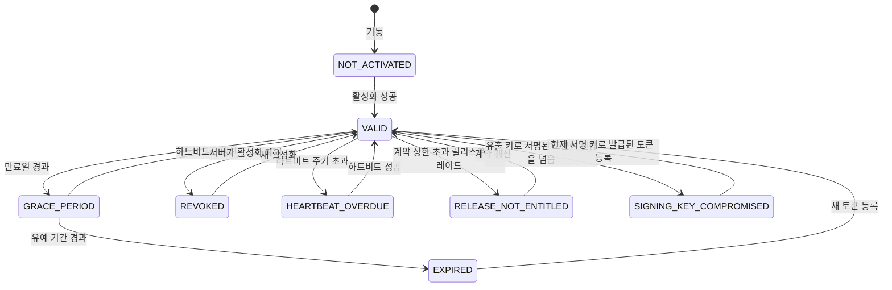

# SimpliX License 모듈 개요

배포본이 어떤 라이선스로 운영되는지 판정하고, 그 판정을 요청·기능·수량 세 지점에서 강제하는 모듈입니다. 판정 자체는 라이선스 SDK가 수행하며, 이 모듈은 판정 시점과 강제 지점을 Spring Boot 애플리케이션에 조립합니다.

## 주요 기능

| 기능 | 설명 |
|------|------|
| 서명 검증 | 빌드에 내장된 공개키로만 토큰을 검증 |
| 키 교체 | 여러 검증 키를 함께 담아 발급자가 서명 키를 바꿔도 이전 라이선스가 살아 있음 |
| 유출 키 천장 | 유출로 표시된 키로 서명된 토큰은 배포본이 이미 보유한 것보다 더 줄 수 없음 |
| 온라인 활성화 | 제품 키로 좌석을 확보하고 머신에 바인딩된 토큰 수령 |
| 오프라인 활성화 | 요청 파일 생성 → 서버 제출 → 서명된 응답 등록 |
| 하트비트 | 주기적으로 토큰을 갱신해 폐기·계약 변경 반영 |
| 재검증 | 설정 주기마다 저장된 등록 정보를 다시 판정 |
| 기능 게이팅 | `@RequiresFeature`가 붙은 지점에서 기능 부여 여부 확인 |
| 수량 제한 | 신규 등록이 계약 상한을 넘으면 거부 |
| 설치 게이트 | 최초 설치가 끝나기 전에는 설치 마법사만 허용 |

## 설계 원칙

| 원칙 | 이유 |
|------|------|
| 강제 실행을 끄는 설정이 없음 | 온프레미스 고객이 제어할 수 있는 우회 경로를 만들지 않기 위함 |
| 검증 키 위치가 고정 | 배포본이 스스로 서명한 토큰을 검증하지 못하게 함 |
| 키 이름과 공개키가 한 항목 | 이름을 코드에, 키를 파일에 따로 두면 둘이 어긋나 모든 라이선스가 이유 없이 검증 불가로 보임 |
| 천장 기준이 보유 상태가 아니라 고정된 기록 | 현재 보유량과 비교하는 천장은 올리는 토큰마다 함께 올라가 아무것도 막지 못함 |
| `ProductIdentity` 기본값 없음 | 제품을 모르는 배포본은 토큰이 자기 것인지 판정할 수 없음 |
| 판정 캐시가 한 곳 | 필터·Aspect·스케줄러·Health가 서로 다른 답을 낼 수 없음 |
| 개발 환경도 같은 경로 | 개발용 채널 라이선스로 동일한 검증을 거침 |

## 아키텍처 다이어그램



강제 지점은 넷이지만 모두 같은 판정 캐시를 읽습니다. 백그라운드 작업이 관리자가 끈 기능을 실행하거나, 필터와 Health가 다른 상태를 보고하는 일이 생기지 않습니다.

---

## 핵심 컴포넌트

### LicenseManager

배포본이 자기 라이선스에 대해 하는 일을 담당합니다. 판정은 SDK에 맡기고, SDK가 정하지 않는 부분 — 검증 시점, 수동 제공 토큰을 읽는 위치, 등록 정보가 쓸모없어졌을 때의 처리 — 을 소유합니다.

```java
public class LicenseManager {
    void initialize();                              // Startup: import, verify, recover
    void verify();                                  // Judge and publish
    void applyRecord(RegistrationRecord record);    // Replace and judge
    void markRevoked();                             // Record server-side revocation
    void clearRegistration();                       // Return to unregistered
    List<String> machineFingerprints();
    boolean isFeatureAvailable(String feature);
    boolean isGracePeriodReadOnly();
}
```

**주요 책임:**
- 기동 시 `token-path`의 토큰을 저장소에 없을 때만 가져오기
- 저장된 등록 정보가 거부됐을 때 파일의 토큰으로 복구
- 판정 결과를 `LicenseState`에 공개

기동 시 검증은 빈 생성이 아니라 `ApplicationReadyEvent`에서 실행됩니다. DB 저장소를 쓰는 배포본이 그 시점에 완전히 준비되기 때문이며, 그전까지의 상태는 "활성화되지 않음"으로 유료 기능을 거부합니다.

### VerificationKeys

빌드가 담고 있는 검증 키 전체입니다. `classpath:license-verification-keys.json` 한 자원에서 읽으며, 각 항목이 키 이름·공개키·유출 표시를 함께 들고 있습니다.

```json
[
  { "keyId": "acps-portal-2026", "publicKeyPem": "-----BEGIN PUBLIC KEY-----\n...", "compromised": false },
  { "keyId": "acps-portal-2024", "publicKeyPem": "-----BEGIN PUBLIC KEY-----\n...", "compromised": true }
]
```

키를 여러 개 담는 이유는 발급자가 서명 키를 바꿔도 이전 키로 서명된 라이선스가 한꺼번에 거절되지 않게 하기 위함입니다. 어떤 키로 검증할지는 토큰이 싣고 있는 키 이름이 정하며, 그 선택은 SDK가 합니다.

자원이 비어 있거나, 이름 없는 항목·키 없는 항목·같은 이름이 두 번 있으면 컨텍스트가 기동하지 않습니다. 셋 다 어떤 라이선스를 검증 불가로 만들면서 로그에는 이유가 남지 않는 상태입니다.

### CompromiseCeiling

유출로 표시된 키를 처음 읽은 시점에 이 배포본이 보유하고 있던 것을 그대로 고정한 기록입니다. 그 키로 서명된 토큰은 이 기록을 넘지 못합니다.

| 축 | 판정 |
|----|------|
| 기능 | 고정 시점에 없던 기능을 요구하면 거절 |
| 수량 한도 | 고정 시점보다 큰 한도를 요구하거나, 한도 코드를 아예 빼면 거절 |
| 만료 | 고정 시점보다 늦게 만료되면 거절 |
| 릴리스 상한 | 고정 시점보다 높은 릴리스를 요구하거나, 상한을 아예 빼면 거절 |

한 축이라도 올라가면 토큰 전체가 거절되어 상태가 `SIGNING_KEY_COMPROMISED`가 됩니다. 맞는 부분만 주고 나머지를 버리면 이 배포본이 무엇으로 돌고 있는지 아무도 말할 수 없게 됩니다.

릴리스 순위는 SDK가 매깁니다. 문자열로 비교하면 `3.10`이 `3.9`보다 낮게 나와 마이너 버전 한 칸을 올리는 토큰이 통과합니다.

유출 표시가 없는 키로 내려진 판정은 그대로 통과합니다. 서명을 그만두었을 뿐인 이전 키는 예전에 주던 것을 계속 줍니다.

**아무것도 등록되지 않은 배포본**은 고정할 것이 없습니다. 이 경우 기동 시 "보유한 것 없음"으로 천장이 먼저 고정되며, 이후 그 키로 서명된 토큰은 아무것도 주지 못합니다. 새 배포본을 세워 위조 토큰을 먹이는 경로가 여기서 닫힙니다. 천장 고정이 수동 제공 토큰을 읽기 전에 실행되는 이유도 같습니다. 먼저 읽으면 손으로 넣은 토큰이 기준이 됩니다.

### CompromiseCeilingStore

고정된 천장이 보관되는 곳입니다. 등록 정보와 같은 자리에 두는데, 등록 정보가 살아남는 만큼 정확히 같이 살아남아야 하기 때문입니다. 컨테이너 교체로 사라지는 천장은 그 컨테이너가 받은 토큰으로 다시 고정되어 존재 이유를 잃습니다.

기본 구현은 `JpaLicenseStore`와 `FileLicenseStore`가 겸합니다. 애플리케이션이 저장소를 직접 등록한다면 `LicenseStore`와 이 인터페이스를 함께 구현해야 하며, 한쪽만 있으면 컨텍스트가 기동하지 않습니다. 천장을 보관하지 못하는 배포본은 아무도 보지 않는 시점에 조용히 실패하지만, 기동하지 않는 컨텍스트는 제품을 빌드하는 날 읽힙니다.

### LicenseState

SDK 게이트가 내린 판정을 애플리케이션이 묻는 형태로 읽습니다. 마지막 검증 시각만 이 클래스가 직접 보관하는데, 라이선스가 아니라 이 배포본의 일정에 관한 사실이기 때문입니다.

```java
public class LicenseState {
    Snapshot snapshot();          // Status, payload, last checked, full evaluation
    LicenseStatus status();
    boolean isUsable();
    boolean isGracePeriod();
    List<String> features();
    String tierLabel();
}
```

### FeatureAccess

기능 하나가 지금 쓸 수 있는지 판정하는 단일 지점입니다. 라이선스가 부여했고 **그리고** 관리자가 켰을 때만 허용합니다. REST 엔드포인트는 Aspect로, 스케줄러·리스너는 이 클래스를 직접 호출합니다.

```java
public class FeatureAccess {
    boolean isAllowed(String feature);       // Licensed and activated
    boolean isLicensed(String feature);      // Licensed only
    boolean isActivated(String feature);     // Activated only
    List<String> effectiveFeatures();        // What a client may act on
}
```

### LicenseQuotaGuard

계약 상한을 넘는 신규 등록을 거부합니다. 계약이 이미 설치된 수량보다 줄어들어도 설치된 설비는 계속 동작합니다 — 라이선스가 바뀌었다고 출입 통제를 멈추면 사람이 문 앞에 갇힙니다. 초과분은 라이선스 화면과 감사 기록에 보고됩니다.

```java
public class LicenseQuotaGuard {
    void require(String quotaCode);                 // One more must fit
    void require(String quotaCode, long additional); // N more must fit
    long currentCount(String quotaCode);
    Map<String, Long> currentUsage();
    List<String> countedQuotaCodes();
}
```

라이선스가 명시하지 않은 코드는 무제한이고, 상한 0은 0입니다. 세는 카운터가 없는 코드는 상한이 강제되지 않습니다.

### LicenseEnforcementFilter

요청 단위로 판정을 적용합니다. 상태별 동작은 [README](../../README.md#license-status)의 표를 따르며, 차단 상태에서도 인증·라이선스 등록·설치 마법사 경로는 열려 있습니다. 이 예외가 없으면 라이선스가 없는 배포본은 로그인할 수 없어 라이선스를 등록할 수도 없게 됩니다.

경로 예외는 API 접두사(`api.version.prefix`)에서 계산하므로, 접두사를 바꾼 배포본이 조용히 예외를 잃지 않습니다.

---

## 자동 구성

### LicenseAutoConfiguration

```java
@AutoConfiguration
@EnableConfigurationProperties(LicenseProperties.class)
@ImportRuntimeHints(LicenseRuntimeHints.class)
public class LicenseAutoConfiguration {
    // Bean definitions
}
```

빈 이름에는 모두 `simplixLicense` 접두사가 붙습니다. 자동 구성이 평범한 이름을 쓰면 같은 이름의 애플리케이션 빈이 조용히 사라지기 때문입니다.

**조건부 빈:**

| Bean | 조건 |
|------|------|
| `simplixLicenseJpaLicenseStore` | `EntityManager`가 클래스패스에 있고 다른 `LicenseStore`가 없음 |
| `simplixLicenseFileLicenseStore` | 다른 `LicenseStore`가 없음 |
| `simplixLicenseSetupController` | `SetupState` 빈이 등록됨 |
| `simplixLicenseEnvSetupController` | `SetupState` 빈이 등록됨 |
| `simplixLicenseInitializationGateFilter` | `SetupState` 빈이 등록됨 |
| `simplixLicenseFeatureActivationAspect` | `FeatureActivationChecker` 빈이 등록됨 |
| `simplixLicenseEnforcementFilter` | `application.license.enforcement.http-filter-enabled`가 `false`가 아님 |

애플리케이션이 반드시 등록해야 하는 빈은 `ProductIdentity` 하나입니다. 없으면 컨텍스트가 기동하지 않습니다. 검증 키의 이름과 공개키는 `classpath:license-verification-keys.json`이 함께 들고 있습니다.

### LicenseActuatorAutoConfiguration

Actuator 없이도 라이선스가 동작하도록 분리되어 있습니다.

| Bean | 조건 |
|------|------|
| `licenseHealthIndicator` | `HealthIndicator` 클래스와 `LicenseState` 빈이 있음 |
| `licenseMetrics` | `MeterRegistry` 클래스와 `LicenseState` 빈이 있음 |

### 필터 순서

| 순서 | 필터 | 역할 |
|------|------|------|
| 40 | `InitializationGateFilter` | 설치 전에는 설치 마법사 경로만 허용 |
| 50 | `LicenseEnforcementFilter` | 라이선스 상태에 따라 API 요청 허용·거부 |

설치 게이트가 먼저입니다. 설치가 끝나지 않은 배포본에는 판정할 라이선스 자체가 없고, 설치 마법사는 열려 있어야 합니다.

---

## 설정 속성

### 전체 설정 구조

```yaml
application:
  license:
    # 수동 제공 토큰과 파일 저장소 경로
    token-path: ./license.key
    state-path: ./license-state.json

    # 판정 주기와 만료 후 동작
    re-verification-interval-minutes: 30
    grace-period-mode: READ_ONLY

    # 제품 키 접두사 (체크섬에 포함)
    product-key-prefix: ACPS

    # 온라인 활성화
    activation:
      server-url: https://license.example.com
      heartbeat-enabled: true

    # 강제 지점
    enforcement:
      http-filter-enabled: true
```

### 속성 레퍼런스

| Property | Type | Default | Description |
|----------|------|---------|-------------|
| `token-path` | String | `./license.key` | 수동 제공 토큰 파일 경로 |
| `state-path` | String | `./license-state.json` | 파일 저장소의 상태 기록 경로 |
| `re-verification-interval-minutes` | int | `30` | 재검증 주기 (분, 최소 1) |
| `grace-period-mode` | enum | `READ_ONLY` | 유예 기간 동작 |
| `product-key-prefix` | String | `ACPS` | 제품 키 접두사 |
| `activation.server-url` | String | 없음 | 라이선스 서버 주소 |
| `activation.heartbeat-enabled` | boolean | `true` | 하트비트 전송 여부 |
| `enforcement.http-filter-enabled` | boolean | `true` | 요청 필터 등록 여부 |

전체 목록은 [설정 레퍼런스](./configuration.md)를 참고하세요.

---

## 활성화 시퀀스



---

## 상태 전이



`SIGNING_KEY_COMPROMISED`는 서명 검증에 실패한 상태가 아닙니다. 서명은 맞지만 그 키가 유출로 표시되어 있고, 토큰이 [고정된 천장](#compromiseceiling)보다 많이 요구한 경우입니다. 현재 서명 키를 담은 릴리스로 올리고 그 키로 발급된 토큰을 등록하면 풀립니다.

`RELEASE_NOT_ENTITLED`는 요청을 막지 않습니다. 릴리스 상한은 판매 범위를 통제하는 장치이고, 여기서 요청을 끊으면 출입 통제까지 멈춥니다. 대신 유료 기능 목록이 비게 되어 기능 게이트가 모두 거부합니다.

---

## 저장소 전략

| 항목 | JpaLicenseStore | FileLicenseStore |
|------|-----------------|------------------|
| 조건 | JPA가 클래스패스에 있음 | JPA 없음 |
| 보관 위치 | `license_registration` 테이블 | `state-path` 파일 |
| 천장 보관 | 같은 행의 `compromise_ceiling` 열 | 같은 파일의 `compromiseCeiling` 항목 |
| 컨테이너 교체 | 볼륨 없이 라이선스 유지 | 볼륨 마운트 필요 |
| 비밀 값 보호 | 다른 자격 증명과 같은 암호화 적용 | 파일 권한에 의존 |

두 저장소 모두 천장만 담고 등록 정보가 없는 상태를 "등록 없음"으로 보고합니다. 이 상태는 유출 키를 담은 배포본이 아직 아무것도 등록하지 않았을 때 생깁니다. 이를 등록으로 보고하면 등록 여부를 묻는 모든 곳이 "있다"고 답하고, 가져간 적 없는 좌석을 반납하겠다는 제안까지 나옵니다.

JPA 저장소에서 천장 열을 읽지 못하면 배포본이 기동하지 않습니다. "천장 없음"으로 답하면 다음 판정이 그때 저장된 토큰으로 천장을 새로 고정하는데, 열을 읽지 못하게 만들어서 노릴 것이 정확히 그 재고정이기 때문입니다.

DB 저장소는 Spring Data 저장소 인터페이스 대신 `EntityManager`로 질의합니다. 프레임워크 모듈에서 `@EnableJpaRepositories`를 선언하면 애플리케이션의 저장소 자동 구성이 꺼지기 때문입니다.

---

## 모니터링

### Health Check

```bash
curl http://localhost:8080/actuator/health/license
```

**Response:**
```json
{
  "status": "UP",
  "details": {
    "status": "VALID",
    "lastChecked": "2026-07-29T02:10:00Z",
    "licenseId": "LIC-0001",
    "productCode": "ACPS-PORTAL",
    "tierLabel": "Enterprise",
    "customer": "Example Corp",
    "expiresAt": "2027-07-29T00:00:00Z",
    "features": ["analytics", "reporting"]
  }
}
```

| 라이선스 상태 | Health 상태 |
|--------------|------------|
| `VALID` | `UP` |
| `GRACE_PERIOD` | `GRACE_PERIOD` |
| 그 외 | `DOWN` |

### Metrics

| Metric | Description |
|--------|-------------|
| `license.valid` | 배포본이 계속 동작 가능하면 1, 아니면 0 |
| `license.days.remaining` | 만료까지 남은 일수 |
| `license.grace.period` | 유예 기간이면 1, 아니면 0 |

### Logging

```yaml
logging:
  level:
    dev.simplecore.simplix.license: INFO
```

| Level | Output |
|-------|--------|
| INFO | 검증 키 지문, 검증 성공, 토큰 가져오기, 복구 등록 |
| WARN | 요청 차단, 기능 거부, 상한 도달, 세는 카운터 없음 |
| ERROR | 토큰 읽기 실패, 복구 토큰까지 거부됨 |

기동 로그의 검증 키 지문은 라이선스 서버가 서명 키에 대해 기록하는 지문과 같아야 합니다. 다르면 그 서버가 발급한 모든 라이선스가 여기서 거부됩니다.

---

## 관련 문서

- [활성화 가이드](./activation-guide.md) - 온라인·오프라인 등록 절차
- [강제 적용 가이드](./enforcement-guide.md) - 기능 게이팅과 수량 제한
- [설정 레퍼런스](./configuration.md) - 설정 옵션 전체 목록
