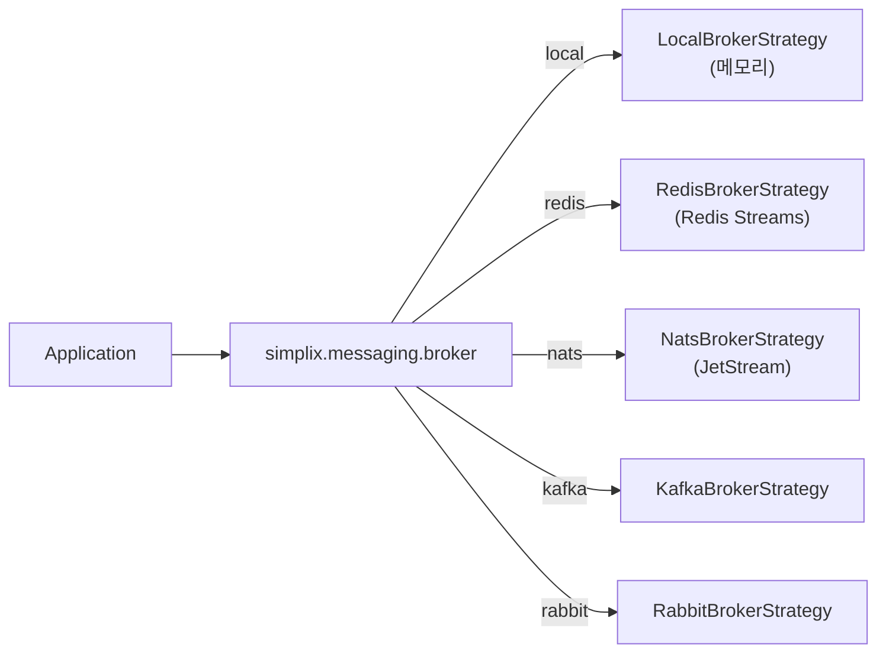

# SimpliX Messaging Broker Guide

브로커별 활성화 방법, 의존성, 운영 시 주의사항을 정리한 가이드입니다.

## Table of Contents

- [Broker Selection](#broker-selection)
- [Local Broker](#local-broker)
- [Redis Streams Broker](#redis-streams-broker)
- [NATS JetStream Broker](#nats-jetstream-broker)
- [Kafka Broker](#kafka-broker)
- [RabbitMQ Broker](#rabbitmq-broker)
- [Switching Brokers](#switching-brokers)
- [Troubleshooting](#troubleshooting)
- [Related Documents](#related-documents)

## Broker Selection

브로커는 `simplix.messaging.broker` 속성으로 선택합니다. 자동 구성이 클래스패스에 해당 클라이언트가 존재하는지 함께 확인합니다.



| 브로커 | 권장 사용처 | 외부 의존성 |
|--------|-------------|-------------|
| `local` | 단위/통합 테스트, 단일 프로세스 | 없음 |
| `redis` | 경량 큐 + 기존 Redis 인프라 | Redis 6+ |
| `nats` | 권장 기본 (네이티브 dedup, ack, leader) | NATS 2.10+ |
| `kafka` | 대용량/장기 보존 | Kafka 3.x |
| `rabbit` | 기존 RabbitMQ 인프라, 네이티브 DLQ | RabbitMQ 3.x |

---

## Local Broker

인메모리 큐로 동작하는 테스트용 브로커입니다.

### Configuration

```yaml
simplix:
  messaging:
    broker: local
```

### 특징

- 외부 의존성 없음
- 애플리케이션 재시작 시 모든 메시지 손실
- 동일 JVM 내 publisher와 subscriber가 함께 동작해야 함
- 모든 브로커 기능 (replay, scheduler, dedup) 메모리로 모킹

### 한계

- 다중 인스턴스 사이 메시지 공유 불가
- 영속성 없음

---

## Redis Streams Broker

Redis 6 이상에서 동작하는 Stream/Consumer Group 기반 브로커입니다.

### Dependency

```gradle
implementation 'org.springframework.boot:spring-boot-starter-data-redis'
```

### Configuration

```yaml
spring:
  data:
    redis:
      host: localhost
      port: 6379

simplix:
  messaging:
    broker: redis
    redis:
      key-prefix: "${spring.application.name}:"
      batch-size: 20
      poll-timeout: 3s
      claim-min-idle-time: 5m
      payload-encoding: BASE64
```

### 동작 방식

- 채널마다 별도 Redis Stream 생성 (`{key-prefix}{channel-name}`)
- `XGROUP CREATE`로 컨슈머 그룹 자동 생성
- `XREADGROUP`로 폴링, `XACK`로 ACK
- `XCLAIM`으로 idle 메시지를 다른 컨슈머가 가로채기

### Payload Encoding

| 모드 | 동작 | 사용처 |
|------|------|--------|
| `BASE64` (기본) | 페이로드를 Base64 문자열로 저장 | 일반 권장 |
| `RAW` | 바이너리 그대로 저장 | RedisInsight 등에서 protobuf viewer 활용 |

### Replay

`XRANGE`로 구현됩니다. ID 또는 시간 기반 모두 지원됩니다.

### Scheduled Delivery

Redis KV(SET + ZADD)로 구현됩니다. 별도 leader election 없이 폴링.

### 한계

- 네이티브 dedup 없음 → `idempotent=true` 권장
- 네이티브 DLQ 없음 → `error.dead-letter.enabled=true`로 별도 stream에 라우팅

---

## NATS JetStream Broker

권장 기본 브로커입니다. 네이티브 dedup, ack-wait, leader election을 활용합니다.

### Dependency

```gradle
implementation 'io.nats:jnats'
```

### Configuration

```yaml
simplix:
  messaging:
    broker: nats
    nats:
      servers: nats://nats:4222
      stream-prefix: "myapp-"
      subject-prefix: "myapp."
      replicas: 3
      max-age: 7d
      duplicate-window: 2m
      auto-create-streams: true
```

### 동작 방식

- 채널 → JetStream 스트림 자동 매핑 (`{stream-prefix}{channel}`)
- subject는 `{subject-prefix}{channel}` 패턴
- Pull-based subscriber (`PullSubscriber`)
- ACK 정책: `explicit`
- 네이티브 dedup: `Nats-Msg-Id` 헤더로 `duplicate-window` 내 중복 차단

### IaC 환경에서 stream 관리

운영팀이 Terraform/NATS CLI로 stream을 관리하면 자동 변경을 막을 수 있습니다.

```yaml
simplix:
  messaging:
    nats:
      auto-create-streams: false   # 부재 시 IllegalStateException
      auto-update-streams: false   # 기존 설정 보존
```

### Per-Channel Override

```yaml
simplix:
  messaging:
    channels:
      audit-events:
        max-length: 1000000
        duplicate-window: 5m
        deliver-policy: new
```

### Scheduled Delivery (KV)

```yaml
simplix:
  messaging:
    nats:
      scheduler:
        enabled: true
        kv-bucket: simplix-scheduled
        poll-interval: 5s
        leader-lock-ttl: 30s
```

> ⚠ NATS 사용자에게 KV 권한이 없으면 `enabled: false`로 설정하세요. 활성 상태로 권한이 없으면 부팅 시 KV 버킷 생성에서 실패합니다.

### Replay

JetStream Stream API의 `getMessage(seq)` 또는 `purgeStream` 패턴을 사용합니다. ID/시간 기반 모두 지원됩니다.

### Native Request/Reply

NATS는 native request/reply를 지원하므로 `RequestReplyTemplate`이 별도 reply subject 폴링 없이 효율적으로 동작합니다.

---

## Kafka Broker

대용량 스트림 처리에 적합합니다.

### Dependency

```gradle
implementation 'org.springframework.kafka:spring-kafka'
```

### Configuration

```yaml
spring:
  kafka:
    bootstrap-servers: kafka:9092

simplix:
  messaging:
    broker: kafka
```

### 동작 방식

- 채널 → 토픽 자동 매핑
- 컨슈머 그룹 = `@MessageHandler.group`
- 파티션 단위 강한 정렬 보장
- offset 기반 replay

### 한계

- 네이티브 지연 발행 미지원 (`scheduledDelivery=false`)
- 네이티브 dedup 미지원 → `idempotent=true` 권장

### 권장 시나리오

- 메시지 볼륨이 매우 큰 경우 (수만~수백만 msg/s)
- 장기 보존 (수일 ~ 영구)
- 다중 컨슈머 그룹이 동일 스트림을 독립 처리해야 하는 경우

---

## RabbitMQ Broker

기존 RabbitMQ 인프라가 있고 네이티브 DLQ / Request-Reply가 필요할 때 적합합니다.

### Dependency

```gradle
implementation 'org.springframework.boot:spring-boot-starter-amqp'
```

### Configuration

```yaml
spring:
  rabbitmq:
    host: rabbitmq
    port: 5672

simplix:
  messaging:
    broker: rabbit
    error:
      dead-letter:
        enabled: true
```

### 동작 방식

- 채널 → exchange + queue 자동 구성
- 네이티브 DLQ (Dead Letter Exchange) 활용
- 네이티브 Request/Reply (Direct Reply-To)
- 지연 발행: rabbitmq_delayed_message_exchange 플러그인 활용

### 한계

- replay 미지원 (`replay=false`)

---

## Switching Brokers

브로커 교체는 일반적으로 두 단계입니다.

1. 의존성 교체

   ```gradle
   // FROM
   implementation 'org.springframework.boot:spring-boot-starter-data-redis'
   // TO
   implementation 'io.nats:jnats'
   ```

2. 설정 변경

   ```yaml
   simplix:
     messaging:
       broker: nats        # 이전: redis
       nats:
         servers: ${NATS_URL}
   ```

`@MessageHandler` 메서드와 `MessagePublisher` 사용 코드는 변경 없이 동작합니다. 단, 다음 항목은 브로커별로 다를 수 있어 점검이 필요합니다.

| 항목 | 점검 사항 |
|------|----------|
| Replay | 신규 브로커가 replay 지원 여부 (`capabilities().replay()`) |
| 지연 발행 | `MessageScheduler` 빈 가용성 |
| Dead Letter | 네이티브 vs 직접 라우팅 |
| Dedup | 네이티브 dedup 미지원 시 `idempotent=true` 적용 검토 |

---

## Troubleshooting

### 메시지가 처리되지 않음

1. `@MessageHandler` 어노테이션 누락 확인
2. `simplix.messaging.broker` 속성과 클래스패스 의존성 일치 여부
3. `BrokerStrategy` 빈이 `isReady() == true` 인지 health 엔드포인트로 확인

```bash
curl http://localhost:8080/actuator/health/messaging
```

### NATS 부팅 실패

`auto-create-streams=true`인데 권한이 없는 경우 `IllegalStateException`이 발생합니다. 다음 중 하나로 해결하세요.

- 운영팀이 stream을 미리 생성하고 `auto-create-streams=false`로 설정
- NATS 사용자에게 `$JS.API.STREAM.CREATE.<stream>` 권한 부여

### KV 스케줄러 부팅 실패

```
io.nats.client.JetStreamApiException: ... bucket not found ...
```

KV 권한이 없거나 버킷이 존재하지 않을 때 발생합니다. KV가 필요 없다면 비활성화하세요.

```yaml
simplix:
  messaging:
    nats:
      scheduler:
        enabled: false
```

### Redis claim 충돌

`claim-min-idle-time`이 너무 짧으면 다른 컨슈머가 처리 중인 메시지를 가로챌 수 있습니다. 핸들러의 처리 시간보다 충분히 길게 설정하세요.

```yaml
simplix:
  messaging:
    redis:
      claim-min-idle-time: 10m
```

### Kafka 메시지 순서 꼬임

Kafka는 파티션 단위로만 순서를 보장합니다. 키를 지정하지 않으면 라운드로빈 분산되어 순서가 보장되지 않습니다. 순서가 중요한 경우 `MessageHeaders`로 키를 지정하거나 단일 파티션 토픽을 사용하세요.

---

## Related Documents

- [Overview](./overview.md) - 모듈 개요 및 아키텍처
- [Configuration Reference](./configuration.md) - 전체 설정 옵션
