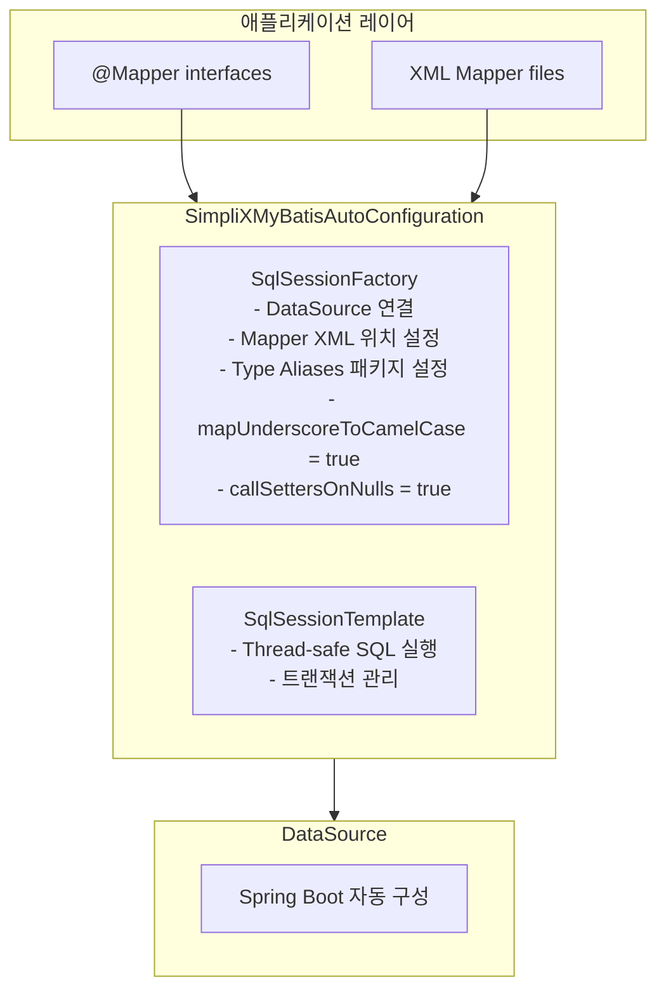

# SimpliX MyBatis Module Overview

## 목차

- [Architecture](#architecture)
- [Core Components](#core-components)
  - [SimpliXMyBatisAutoConfiguration](#simplixmybatisautoconfiguration)
  - [Auto-Configuration 순서](#auto-configuration-순서)
  - [Mapper 스캐닝](#mapper-스캐닝)
  - [트랜잭션 관리](#트랜잭션-관리)
  - [DataSource 생성](#datasource-생성)
  - [SimpliXMyBatisProperties](#simplixmybatisproperties)
- [Configuration Properties](#configuration-properties)
- [기본 Configuration](#기본-configuration)
- [사용 예제](#사용-예제)
- [프로젝트 구조](#프로젝트-구조)
- [Type Aliases](#type-aliases)
- [MyBatis 설정 파일 사용](#mybatis-설정-파일-사용)
- [환경별 설정](#환경별-설정)
- [비활성화](#비활성화)
- [트러블슈팅](#트러블슈팅)

---

## Architecture



---

## Core Components

### SimpliXMyBatisAutoConfiguration

MyBatis 자동 구성 클래스입니다.

**활성화 조건:**
- `SqlSessionTemplate`, `SqlSessionFactoryBean` 클래스 존재
- `mybatis.enabled=true` (기본값)

**자동 등록 빈:**

| Bean | 설명 |
|------|------|
| SqlSessionFactory | MyBatis SQL 세션 팩토리 |
| SqlSessionTemplate | Thread-safe SQL 세션 템플릿 |

### Auto-Configuration 순서

SimpliX MyBatis는 Spring Boot의 기본 `MybatisAutoConfiguration` **이후에** 실행됩니다:

```java
@AutoConfiguration(after = MybatisAutoConfiguration.class)
```

**우선순위:**
1. Spring Boot 기본 MyBatis 설정
2. SimpliX MyBatis 추가 설정 (덮어쓰기)

### Mapper 스캐닝

기본적으로 다음 패키지에서 `@Mapper` 인터페이스를 스캔합니다:

```java
@MapperScan(basePackages = "${mybatis.mapper-locations:dev.simplecore.simplix.**.mapper}")
```

**커스텀 베이스 패키지:**
```yaml
mybatis:
  mapper-base-packages: com.example.mapper
```

### 트랜잭션 관리

`@EnableTransactionManagement`가 자동으로 활성화됩니다:

```java
@Service
@RequiredArgsConstructor
public class UserService {
    private final UserMapper userMapper;

    @Transactional  // 자동 트랜잭션 관리 지원
    public void createUser(User user) {
        userMapper.insert(user);
    }
}
```

### DataSource 생성

SimpliX는 `DataSourceProperties`를 사용하여 DataSource를 직접 생성합니다:

```java
sessionFactory.setDataSource(dataSourceProperties.initializeDataSourceBuilder().build());
```

**주의:** 커스텀 DataSource 빈이 정의된 경우, SimpliX의 자동 생성 대신 해당 빈이 사용됩니다.

### SimpliXMyBatisProperties

MyBatis 설정 속성입니다.

```java
@ConfigurationProperties(prefix = "mybatis")
public class SimpliXMyBatisProperties {
    private boolean enabled = true;
    private String mapperLocations = "classpath*:mapper/**/*.xml";
    private String typeAliasesPackage;
    private String configLocation;
}
```

---

## Configuration Properties

### 기본 설정 (`mybatis.*`)

```yaml
mybatis:
  enabled: true                              # 모듈 활성화
  mapper-locations: classpath*:mapper/**/*.xml  # Mapper XML 위치
  type-aliases-package: com.example.domain   # Type Aliases 패키지
  config-location: classpath:mybatis-config.xml  # MyBatis 설정 파일 (선택)
```

### 설정 속성 상세

| 속성 | 타입 | 기본값 | 설명 |
|------|------|-------|------|
| `enabled` | boolean | `true` | 모듈 활성화 여부 |
| `mapper-locations` | String | `classpath*:mapper/**/*.xml` | Mapper XML 파일 위치 패턴 |
| `type-aliases-package` | String | (없음) | Type Aliases 스캔 패키지 |
| `config-location` | String | (없음) | MyBatis 설정 파일 경로 |

---

## 기본 Configuration

SimpliX MyBatis는 다음 기본 설정을 적용합니다:

```java
Configuration configuration = new Configuration();
configuration.setMapUnderscoreToCamelCase(true);  // snake_case → camelCase 자동 변환
configuration.setCallSettersOnNulls(true);        // NULL 값도 setter 호출
```

### mapUnderscoreToCamelCase

데이터베이스 컬럼명(snake_case)을 Java 필드명(camelCase)으로 자동 변환합니다.

```
DB Column: user_name → Java Field: userName
DB Column: created_at → Java Field: createdAt
```

### callSettersOnNulls

NULL 값이 반환되어도 setter를 호출합니다. Map 반환 시 NULL 키도 포함됩니다.

```java
// callSettersOnNulls = true
Map<String, Object> result = mapper.selectUser(1);
// result = {id: 1, name: "John", email: null}  ← null 포함

// callSettersOnNulls = false
// result = {id: 1, name: "John"}  ← null 제외
```

---

## 사용 예제

### Mapper Interface

```java
package com.example.mapper;

import com.example.domain.User;
import org.apache.ibatis.annotations.Mapper;
import org.apache.ibatis.annotations.Param;

import java.util.List;

@Mapper
public interface UserMapper {

    List<User> findAll();

    User findById(@Param("id") Long id);

    void insert(User user);

    void update(User user);

    void delete(@Param("id") Long id);
}
```

### Mapper XML

**위치:** `src/main/resources/mapper/UserMapper.xml`

```xml
<?xml version="1.0" encoding="UTF-8"?>
<!DOCTYPE mapper PUBLIC "-//mybatis.org//DTD Mapper 3.0//EN"
        "http://mybatis.org/dtd/mybatis-3-mapper.dtd">

<mapper namespace="com.example.mapper.UserMapper">

    <select id="findAll" resultType="User">
        SELECT id, user_name, email, created_at
        FROM users
    </select>

    <select id="findById" resultType="User">
        SELECT id, user_name, email, created_at
        FROM users
        WHERE id = #{id}
    </select>

    <insert id="insert" parameterType="User" useGeneratedKeys="true" keyProperty="id">
        INSERT INTO users (user_name, email, created_at)
        VALUES (#{userName}, #{email}, #{createdAt})
    </insert>

    <update id="update" parameterType="User">
        UPDATE users
        SET user_name = #{userName},
            email = #{email}
        WHERE id = #{id}
    </update>

    <delete id="delete">
        DELETE FROM users WHERE id = #{id}
    </delete>

</mapper>
```

### Domain Class

```java
package com.example.domain;

import lombok.Data;
import java.time.LocalDateTime;

@Data
public class User {
    private Long id;
    private String userName;      // DB: user_name (자동 매핑)
    private String email;
    private LocalDateTime createdAt;  // DB: created_at (자동 매핑)
}
```

### Service 사용

```java
@Service
@RequiredArgsConstructor
public class UserService {

    private final UserMapper userMapper;

    public List<User> getAllUsers() {
        return userMapper.findAll();
    }

    public User getUser(Long id) {
        return userMapper.findById(id);
    }

    @Transactional
    public void createUser(User user) {
        userMapper.insert(user);
    }

    @Transactional
    public void updateUser(User user) {
        userMapper.update(user);
    }

    @Transactional
    public void deleteUser(Long id) {
        userMapper.delete(id);
    }
}
```

---

## 프로젝트 구조

```
src/
├── main/
│   ├── java/
│   │   └── com/example/
│   │       ├── domain/
│   │       │   └── User.java
│   │       ├── mapper/
│   │       │   └── UserMapper.java
│   │       └── service/
│   │           └── UserService.java
│   └── resources/
│       ├── mapper/
│       │   └── UserMapper.xml
│       └── application.yml
```

---

## Type Aliases

Type Aliases를 사용하면 XML에서 전체 클래스명 대신 짧은 별칭을 사용할 수 있습니다.

### 설정

```yaml
mybatis:
  type-aliases-package: com.example.domain
```

### 사용

```xml
<!-- type-aliases-package 설정 전 -->
<select id="findById" resultType="com.example.domain.User">

<!-- type-aliases-package 설정 후 -->
<select id="findById" resultType="User">
```

---

## MyBatis 설정 파일 사용

고급 설정이 필요한 경우 별도의 MyBatis 설정 파일을 사용할 수 있습니다.

### application.yml

```yaml
mybatis:
  config-location: classpath:mybatis-config.xml
```

### mybatis-config.xml

```xml
<?xml version="1.0" encoding="UTF-8"?>
<!DOCTYPE configuration PUBLIC "-//mybatis.org//DTD Config 3.0//EN"
        "http://mybatis.org/dtd/mybatis-3-config.dtd">

<configuration>
    <settings>
        <setting name="cacheEnabled" value="true"/>
        <setting name="lazyLoadingEnabled" value="true"/>
        <setting name="defaultStatementTimeout" value="30"/>
    </settings>

    <typeHandlers>
        <typeHandler handler="com.example.handler.JsonTypeHandler"/>
    </typeHandlers>

    <plugins>
        <plugin interceptor="com.example.interceptor.LoggingInterceptor"/>
    </plugins>
</configuration>
```

---

## 환경별 설정

### 개발 환경

```yaml
spring:
  datasource:
    url: jdbc:h2:mem:testdb
    driver-class-name: org.h2.Driver

mybatis:
  mapper-locations: classpath*:mapper/**/*.xml
  type-aliases-package: com.example.domain

logging:
  level:
    com.example.mapper: DEBUG  # SQL 로그 출력
```

### 운영 환경

```yaml
spring:
  datasource:
    url: jdbc:mysql://localhost:3306/mydb
    username: ${DB_USERNAME}
    password: ${DB_PASSWORD}
    driver-class-name: com.mysql.cj.jdbc.Driver
    hikari:
      maximum-pool-size: 20
      minimum-idle: 5

mybatis:
  mapper-locations: classpath*:mapper/**/*.xml
  type-aliases-package: com.example.domain

logging:
  level:
    com.example.mapper: WARN
```

---

## 비활성화

MyBatis 모듈을 비활성화하려면:

```yaml
mybatis:
  enabled: false
```

---

## 트러블슈팅

### Mapper를 찾을 수 없음

**증상:** `Invalid bound statement (not found)`

**해결:**
1. Mapper XML 파일 위치 확인
   ```yaml
   mybatis:
     mapper-locations: classpath*:mapper/**/*.xml
   ```

2. namespace가 Mapper 인터페이스와 일치하는지 확인
   ```xml
   <mapper namespace="com.example.mapper.UserMapper">
   ```

### 컬럼명-필드명 매핑 오류

**증상:** 데이터가 null로 반환됨

**해결:** `mapUnderscoreToCamelCase`는 기본 활성화됨. 컬럼명과 필드명 규칙 확인:
- DB: `user_name` → Java: `userName`
- DB: `created_at` → Java: `createdAt`

### Type Alias 인식 안됨

**증상:** `Could not resolve type alias 'User'`

**해결:**
```yaml
mybatis:
  type-aliases-package: com.example.domain  # 패키지 경로 확인
```
