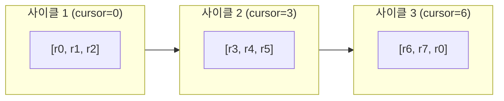
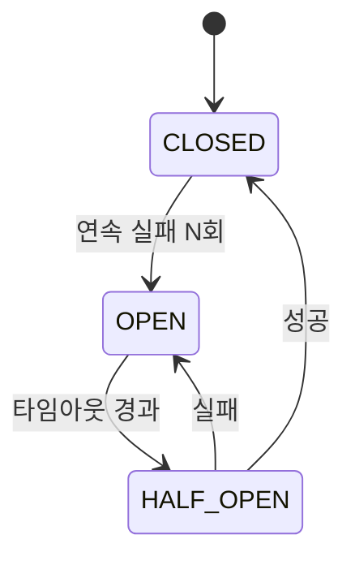
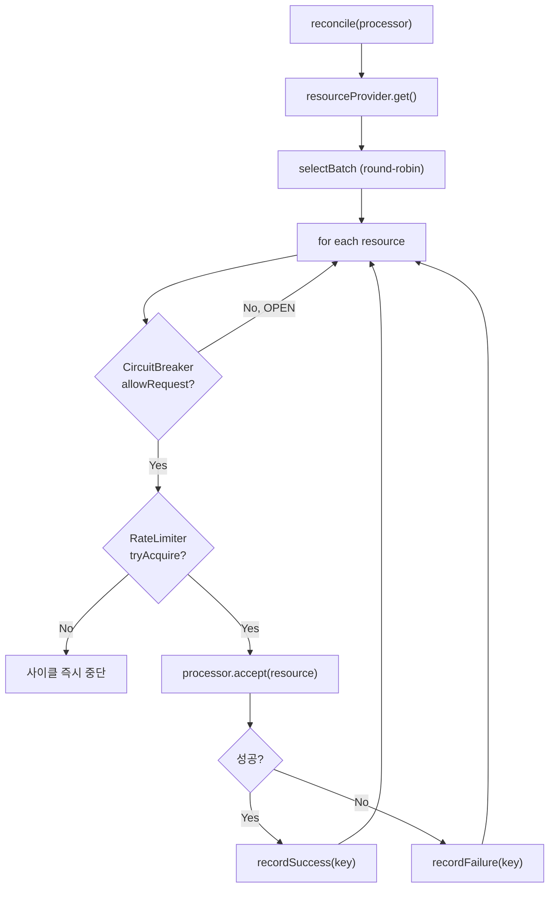

# Advanced Guide

`InMemoryStateStore`와 `ReconciliationScheduler`의 활용 패턴, Resilience 통합, Custom Backend 작성 등 simplix-sync의 고급 사용법을 정리합니다.

## Table of Contents

- [State Store](#state-store)
- [Reconciliation](#reconciliation)
- [Resilience Integration](#resilience-integration)
- [Distributed Locking](#distributed-locking)
- [Custom Backend](#custom-backend)
- [Common Pitfalls](#common-pitfalls)
- [Related Documents](#related-documents)

---

## State Store

### Concurrency Model

`InMemoryStateStore<S>`는 상태 객체 자체에 락을 걸어 같은 키에 대한 변경을 직렬화합니다.

| 동작 | 락 |
|------|-----|
| `get`, `getAll`, `getAllKeys`, `size`, `remove` | 없음 (`ConcurrentHashMap` 동시성에 의존) |
| `mutate(key, ...)` | `synchronized(state)` — 같은 키만 직렬화 |
| `compute(key, ...)` | `synchronized(state)` — 같은 키만 직렬화 |

다른 키는 동시 변경 가능하므로 처리량이 크게 저하되지 않습니다.

### Patterns

#### 패턴 1: Read-Modify-Broadcast

```java
public void updateStatus(String deviceId, DeviceStatus status) {
    DeviceStatusUpdate event = store.compute(deviceId, state -> {
        state.setStatus(status);
        return new DeviceStatusUpdate(deviceId, status, Instant.now());
    });
    syncChannel.broadcast(event);
}
```

#### 패턴 2: 조건부 적용 (LWW)

분산 환경에서 메시지 순서가 보장되지 않으므로 타임스탬프 기반 충돌 해결을 권장합니다.

```java
public void apply(DeviceReading reading) {
    store.mutate(reading.getDeviceId(), state -> {
        if (reading.getTimestamp().isAfter(state.getLastReadingAt())) {
            state.apply(reading);
        }
        // 오래된 reading은 폐기
    });
}
```

#### 패턴 3: 일괄 정리

```java
@Scheduled(fixedDelay = 60_000)
public void cleanupStale() {
    Instant threshold = Instant.now().minus(Duration.ofHours(1));
    for (String key : store.getAllKeys()) {
        DeviceState state = store.get(key);
        if (state != null && state.getLastSeenAt().isBefore(threshold)) {
            store.remove(key);
        }
    }
}
```

### Memory Considerations

- 모든 상태가 JVM 힙에 보관됨 → 키 수가 수십만 이상이면 외부 스토어 검토
- TTL 자동 적용 없음 → 직접 정리 필요
- 인스턴스 종료 시 손실 → reconciliation으로 복구 또는 별도 영속 저장소 결합

---

## Reconciliation

### Why Round-Robin

라운드로빈은 **시작점을 사이클마다 다르게** 하여 모든 리소스가 균등하게 처리되도록 합니다.



| 문제 | 해법 |
|------|------|
| 한 번에 너무 많은 리소스 처리 | `batchSize`로 사이클당 N개만 |
| 항상 같은 리소스부터 | 라운드로빈으로 균등 순회 |
| 실패한 리소스 무한 재시도 | `CircuitBreaker`로 일정 시간 차단 |
| Rate limit 초과 | `RateLimiter`로 글로벌 처리 속도 제한 |

### Builder

```java
ReconciliationScheduler<DeviceState> scheduler = ReconciliationScheduler.<DeviceState>builder()
    .resourceProvider(stateStore::getAll)        // 필수
    .keyExtractor(DeviceState::getDeviceId)       // 필수
    .batchSize(10)                                 // 선택, 기본 5
    .circuitBreaker(circuitBreaker)                // 선택
    .rateLimiter(rateLimiter)                      // 선택
    .build();

@Scheduled(fixedDelay = 30_000)
public void reconcile() {
    scheduler.reconcile(state -> {
        DeviceReading fresh = client.read(state.getDeviceId());
        stateService.onLocalReading(fresh);
    });
}
```

### Tuning

#### batchSize 선택

| 외부 호출 속도 | 권장 batchSize |
|----------------|----------------|
| 빠름 (수 ms) | 20 ~ 50 |
| 보통 (수십 ms) | 5 ~ 10 |
| 느림 (수백 ms+) | 1 ~ 3 |

#### 한 바퀴 시간 계산

```
한 바퀴 시간 = (전체 리소스 수 / batchSize) * 사이클 주기
```

예: 1000개 리소스, batchSize=10, 사이클 30초 → 한 바퀴 50분

운영 요구사항(예: 모든 디바이스를 1시간 내 한 번씩)에 부합하는지 검증하세요.

---

## Resilience Integration

`ReconciliationScheduler`는 simplix-core의 `CircuitBreaker`, `RateLimiter`, `RoundRobinSelector`를 통합합니다.

### CircuitBreaker

키별 실패를 추적하여 일정 횟수 이상 실패한 리소스는 일정 시간 차단합니다.

```java
// 5번 연속 실패하면 60초 차단
CircuitBreaker breaker = new CircuitBreaker(5, 60_000L);
```



ReconciliationScheduler는 매 처리 후 자동으로 `recordSuccess`/`recordFailure`를 호출합니다.

| 상황 | failureThreshold | halfOpenTimeoutMs |
|------|------------------|--------------------|
| 일시적 네트워크 흔들림 흔함 | 5 ~ 10 | 30,000 ~ 60,000 |
| 빠른 차단이 필요 | 2 ~ 3 | 60,000 ~ 120,000 |

### RateLimiter

토큰 버킷 기반의 글로벌 처리 속도 제한입니다.

```java
// 초당 20개 처리 제한
RateLimiter limiter = new RateLimiter(20);
```

토큰이 없으면 **사이클 즉시 중단**되고 다음 사이클로 이월됩니다. 외부 시스템의 rate limit보다 보수적으로 설정하세요(예: 외부가 100/s 허용 → 80/s 설정).

### 통합 동작 흐름



---

## Distributed Locking

분산 환경에서 한 번에 한 인스턴스만 reconcile하도록 ShedLock을 통합할 수 있습니다.

### Setup

```gradle
implementation 'net.javacrumbs.shedlock:shedlock-spring'
implementation 'net.javacrumbs.shedlock:shedlock-provider-jdbc-template'
```

```java
@Configuration
@EnableSchedulerLock(defaultLockAtMostFor = "PT5M")
public class ShedLockConfig {

    @Bean
    public LockProvider lockProvider(DataSource dataSource) {
        return new JdbcTemplateLockProvider(
            JdbcTemplateLockProvider.Configuration.builder()
                .withJdbcTemplate(new JdbcTemplate(dataSource))
                .usingDbTime()
                .build()
        );
    }
}
```

### 잠금된 reconciliation

```java
@Scheduled(fixedDelay = 30_000)
@SchedulerLock(name = "device-reconciliation",
               lockAtMostFor = "PT4M",
               lockAtLeastFor = "PT1M")
public void run() {
    scheduler.reconcile(this::reconcileDevice);
}
```

> ℹ ShedLock 없이 다중 인스턴스에서 운영하면 외부 시스템 부하가 인스턴스 수만큼 곱해집니다. 분산 환경에서는 ShedLock 또는 RateLimiter를 인스턴스 수에 맞게 조정하세요.

---

## Custom Backend

내장 백엔드(NoOp, Redis, NATS) 외에 다른 시스템을 사용하려면 `InstanceSyncBroadcaster`를 직접 구현하면 됩니다.

### Wire Format 일관성

가능하면 내장 백엔드와 동일한 16-byte UUID prefix wire format을 따르세요. 향후 백엔드 교체 시 호환성이 보장됩니다.

```
+----------------------+----------------------+
| 16 bytes UUID prefix | payload bytes        |
+----------------------+----------------------+
```

### 예시: Kafka 기반 구현

```java
public class KafkaInstanceSyncBroadcaster implements InstanceSyncBroadcaster {

    private static final int UUID_BYTE_LENGTH = 16;

    private final KafkaTemplate<String, byte[]> producer;
    private final byte[] instanceIdBytes;

    public KafkaInstanceSyncBroadcaster(KafkaTemplate<String, byte[]> producer) {
        this.producer = producer;
        this.instanceIdBytes = uuidToBytes(UUID.randomUUID());
    }

    @Override
    public void broadcast(String channel, byte[] payload) {
        byte[] prefixed = new byte[UUID_BYTE_LENGTH + payload.length];
        System.arraycopy(instanceIdBytes, 0, prefixed, 0, UUID_BYTE_LENGTH);
        System.arraycopy(payload, 0, prefixed, UUID_BYTE_LENGTH, payload.length);
        producer.send(channel, prefixed);
    }

    @Override
    public void subscribe(String channel, InboundPayloadListener listener) {
        // Kafka container 설정 + self-filtering wrapper (생략)
    }

    private static byte[] uuidToBytes(UUID uuid) {
        ByteBuffer buf = ByteBuffer.allocate(UUID_BYTE_LENGTH);
        buf.putLong(uuid.getMostSignificantBits());
        buf.putLong(uuid.getLeastSignificantBits());
        return buf.array();
    }
}
```

### 빈 등록

```java
@Configuration
public class CustomSyncConfig {

    @Bean
    public InstanceSyncBroadcaster kafkaSyncBroadcaster(KafkaTemplate<String, byte[]> template) {
        return new KafkaInstanceSyncBroadcaster(template);
    }
}
```

`@ConditionalOnMissingBean(InstanceSyncBroadcaster.class)` 덕분에 자동 구성된 NoOp 브로드캐스터는 비활성화됩니다.

---

## Common Pitfalls

### 1. 자기 메시지를 받지 않으니 로컬 처리는 직접

```java
// ✔ Correct
public void onLocalChange(Event e) {
    applyLocally(e);     // 직접 적용
    channel.broadcast(e); // 다른 인스턴스에 알림
}
```

### 2. mutate 안에서 broadcast (락이 길게 잡힘)

```java
// ✖ 락 안에서 외부 호출
store.mutate(key, state -> {
    state.apply(reading);
    channel.broadcast(reading);
});

// ✔ 락 밖에서 broadcast
store.compute(key, state -> {
    state.apply(reading);
    return null;
});
channel.broadcast(reading);
```

### 3. processor에서 예외 무시

```java
// ⚠ CircuitBreaker가 실패를 감지 못함
scheduler.reconcile(state -> {
    try {
        doReconcile(state);
    } catch (Exception e) {
        log.warn("ignored", e);
    }
});
```

ReconciliationScheduler는 processor 예외를 잡아 자동으로 `recordFailure`를 호출합니다. 직접 잡지 마세요.

### 4. resourceProvider가 매 호출마다 비싼 작업

```java
// ✖ 매 사이클마다 DB 전체 조회
.resourceProvider(() -> deviceRepository.findAll())

// ✔ 인메모리 store 활용
.resourceProvider(stateStore::getAll)
```

### 5. 메시지 손실 허용 여부 판단

simplix-sync는 **베스트-에포트** 전송입니다.

| 데이터 종류 | 권장 |
|-------------|------|
| 캐시 무효화, 세션 동기화 | simplix-sync (손실 시 reconciliation으로 복구) |
| 주문, 결제, 감사 로그 | simplix-messaging (ACK + 재시도 + 영속성) |

---

## Related Documents

- [Overview](./overview.md) - 모듈 개요, 아키텍처, 백엔드 비교, 설정 속성
- [Getting Started](./getting-started.md) - 단계별 통합 가이드
