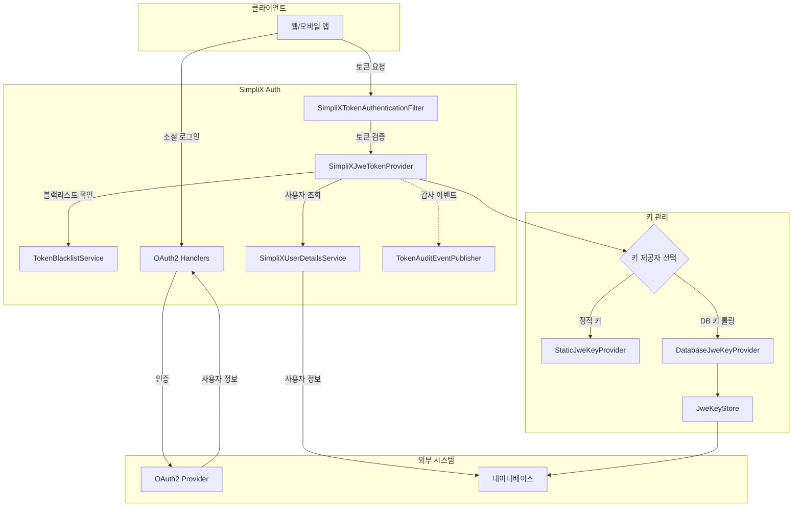
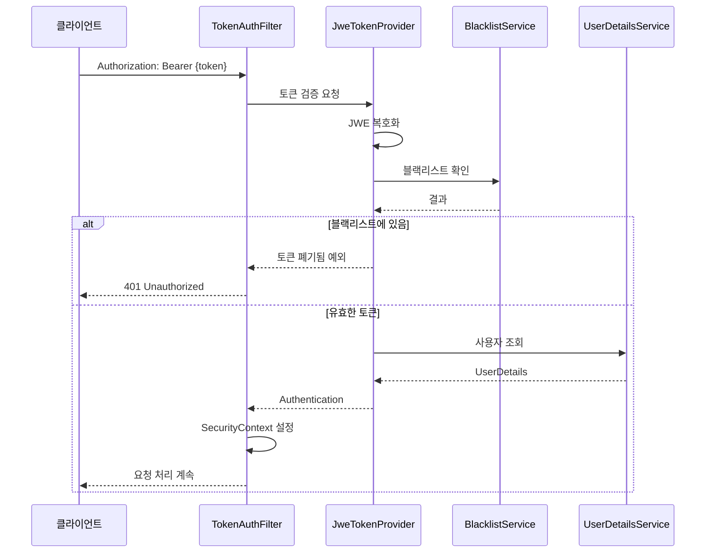

# SimpliX Auth Overview

## 아키텍처



---

## 핵심 컴포넌트

### SimpliXJweTokenProvider

JWE(JSON Web Encryption) 토큰의 생성, 검증, 갱신을 담당하는 핵심 컴포넌트입니다. JWT와 달리 토큰 내용이 암호화되어 클레임 정보가 보호됩니다.

```java
public class SimpliXJweTokenProvider {
    // 토큰 생성
    TokenPair issueTokenPair(Authentication authentication);

    // 토큰 검증 및 인증 객체 반환
    Authentication getAuthentication(String token);

    // 토큰 갱신
    TokenPair refreshToken(String refreshToken);

    // 토큰 폐기 (블랙리스트 등록)
    void revokeToken(String accessToken);
}
```

**주요 기능:**
- RSA-OAEP-256 알고리즘 기반 암호화
- Access Token / Refresh Token 쌍 발급
- IP 및 User-Agent 검증 (선택적)
- 토큰 블랙리스트 연동

### SimpliXTokenAuthenticationFilter

HTTP 요청에서 토큰을 추출하고 인증을 처리하는 필터입니다.

```java
public class SimpliXTokenAuthenticationFilter extends OncePerRequestFilter {
    // Authorization 헤더에서 Bearer 토큰 추출
    // 토큰 검증 후 SecurityContext에 인증 정보 설정
}
```

**주요 기능:**
- Bearer 토큰 추출
- 세션-토큰 하이브리드 인증 지원
- 인증 실패 시 적절한 에러 응답

### TokenBlacklistService

폐기된 토큰을 관리하는 서비스입니다. 세 가지 구현체를 제공합니다.

```java
public interface TokenBlacklistService {
    void blacklist(String tokenId, Instant expiry);
    boolean isBlacklisted(String tokenId);
}
```

| 구현체 | 특징 | 사용 시나리오 |
|--------|------|--------------|
| InMemoryTokenBlacklistService | 메모리 기반, 서버 재시작 시 초기화 | 개발/테스트 환경 |
| CaffeineTokenBlacklistService | 로컬 캐시, TTL 자동 만료 | 단일 서버 운영 |
| RedisTokenBlacklistService | 분산 캐시, 서버 간 공유 | 다중 서버 운영 |

### OAuth2AuthenticationService

소셜 로그인 시 사용자 처리 로직을 정의하는 인터페이스입니다. **애플리케이션에서 구현해야 합니다.**

```java
public interface OAuth2AuthenticationService {
    // 소셜 로그인 사용자 인증/등록
    UserDetails authenticateOAuth2User(OAuth2UserInfo userInfo);

    // 기존 계정에 소셜 계정 연동
    void linkSocialAccount(String userId, OAuth2UserInfo userInfo);

    // 소셜 계정 연동 해제
    void unlinkSocialAccount(String userId, OAuth2ProviderType provider);

    // 연동된 소셜 계정 목록 조회
    Set<OAuth2ProviderType> getLinkedProviders(String userId);
}
```

### TokenAuditEventPublisher

토큰 관련 이벤트에 대한 감사 로깅을 위한 인터페이스입니다. ISO 27001, SOC2, GDPR 등 컴플라이언스 요구사항을 충족하기 위해 **선택적으로 구현**할 수 있습니다.

```java
public interface TokenAuditEventPublisher {
    // 토큰 검증 실패 이벤트
    void publishTokenValidationFailed(TokenAuditEvent event);

    // 토큰 갱신 성공/실패 이벤트
    void publishTokenRefreshSuccess(TokenAuditEvent event);
    void publishTokenRefreshFailed(TokenAuditEvent event);

    // 토큰 폐기 이벤트
    void publishTokenRevoked(TokenAuditEvent event);

    // 블랙리스트 관련 이벤트
    void publishTokenBlacklisted(String jti, Duration ttl, String username);
    void publishBlacklistedTokenUsed(String jti, String username, String clientIp);
}
```

| 감사 이벤트 | 발생 시점 |
|------------|----------|
| Token Validation Failed | 만료/폐기/IP불일치/UA불일치/손상된 토큰 사용 시 |
| Token Refresh Success/Failed | 토큰 갱신 시도 시 |
| Token Revoked | 로그아웃 또는 명시적 토큰 폐기 시 |
| Token Blacklisted | 토큰이 블랙리스트에 등록될 때 |
| Blacklisted Token Used | 폐기된 토큰 재사용 시도 시 |

---

## Auto-Configuration

### SimpliXAuthAutoConfiguration

```java
@AutoConfiguration
@EnableConfigurationProperties(SimpliXAuthProperties.class)
@ConditionalOnProperty(name = "simplix.auth.enabled", havingValue = "true", matchIfMissing = true)
public class SimpliXAuthAutoConfiguration {
    // 인증 핸들러 빈 정의
}
```

**조건부 빈:**

| Bean | 조건 |
|------|------|
| `SimpliXJweTokenProvider` | `simplix.auth.security.enable-token-endpoints=true` |
| `SimpliXTokenAuthenticationFilter` | JweTokenProvider 빈 존재 시 |
| `TokenBlacklistService` | `simplix.auth.token.enable-blacklist=true` |

### SimpliXOAuth2AutoConfiguration

```java
@AutoConfiguration
@ConditionalOnProperty(name = "simplix.auth.oauth2.enabled", havingValue = "true", matchIfMissing = true)
public class SimpliXOAuth2AutoConfiguration {
    // OAuth2 관련 빈 정의
}
```

**조건부 빈:**

| Bean | 조건 |
|------|------|
| OAuth2 Handlers | `simplix.auth.oauth2.enabled=true` |
| UserInfoExtractor | 각 Provider 설정 존재 시 |

---

## 설정 속성

### 전체 설정 구조

```yaml
simplix:
  auth:
    # 모듈 활성화
    enabled: true

    # JWE 토큰 설정
    jwe:
      encryption-key-location: classpath:keys/jwe-key.json
      algorithm: RSA-OAEP-256
      encryption-method: A256GCM

      # 키 롤링 설정 (선택)
      key-rolling:
        enabled: false
        key-size: 2048
        auto-initialize: true
        retention:
          buffer-seconds: 86400
          auto-cleanup: false

    # 토큰 설정
    token:
      access-token-lifetime: 1800
      refresh-token-lifetime: 604800
      enable-ip-validation: false
      enable-user-agent-validation: false
      enable-token-rotation: true
      enable-blacklist: false

    # 보안 설정
    security:
      enable-token-endpoints: true
      enable-web-security: true
      enable-cors: true
      enable-csrf: true
      prefer-token-over-session: true

    # OAuth2 설정
    oauth2:
      enabled: true
      providers:
        google:
          client-id: your-client-id
          client-secret: your-client-secret
```

### 속성 참조

| 속성 | 타입 | 기본값 | 설명 |
|------|------|--------|------|
| `simplix.auth.enabled` | boolean | `true` | 모듈 활성화 |
| `simplix.auth.jwe.encryption-key-location` | String | - | JWE 키 파일 경로 |
| `simplix.auth.jwe.algorithm` | String | `RSA-OAEP-256` | JWE 알고리즘 |
| `simplix.auth.jwe.encryption-method` | String | `A256GCM` | 암호화 방식 |
| `simplix.auth.token.access-token-lifetime` | int | `1800` | Access 토큰 수명 (초) |
| `simplix.auth.token.refresh-token-lifetime` | int | `604800` | Refresh 토큰 수명 (초) |
| `simplix.auth.token.enable-blacklist` | boolean | `false` | 블랙리스트 활성화 |
| `simplix.auth.security.enable-token-endpoints` | boolean | `true` | 토큰 엔드포인트 활성화 |
| `simplix.auth.security.prefer-token-over-session` | boolean | `true` | 토큰 우선 인증 |
| `simplix.auth.oauth2.enabled` | boolean | `true` | OAuth2 활성화 |

---

## 키 제공자 전략

### 전략 비교

| 특성 | StaticJweKeyProvider | DatabaseJweKeyProvider |
|------|---------------------|----------------------|
| 용도 | 단순 배포, 단일 서버 | 키 롤링, 다중 서버 |
| 키 저장 | 파일 시스템 | 데이터베이스 |
| 키 롤링 | 수동 (재배포 필요) | 자동화 가능 |
| 다중 버전 | 미지원 | 지원 |

### 언제 사용하나

**StaticJweKeyProvider 권장:**
- 단일 서버 환경
- 키 변경이 거의 없는 경우
- 간단한 설정이 필요한 경우

**DatabaseJweKeyProvider 권장:**
- 다중 서버/마이크로서비스 환경
- 정기적인 키 로테이션이 필요한 경우
- 키 버전 관리가 필요한 경우

---

## 인증 흐름



---

## 모니터링

### 로깅

```yaml
logging:
  level:
    dev.simplecore.simplix.auth: DEBUG
```

| 레벨 | 출력 내용 |
|------|----------|
| TRACE | 토큰 페이로드 상세, 키 로딩 과정 |
| DEBUG | 토큰 발급/검증/폐기 이벤트 |
| INFO | 인증 성공/실패 요약 |
| WARN | 토큰 만료, 블랙리스트 토큰 접근 |

---

## 환경 변수

| 변수 | 설명 | 기본값 |
|------|------|--------|
| `SIMPLIX_AUTH_ENABLED` | 모듈 활성화 | `true` |
| `SIMPLIX_AUTH_JWE_ENCRYPTION_KEY_LOCATION` | 키 파일 경로 | - |
| `SIMPLIX_AUTH_TOKEN_ACCESS_TOKEN_LIFETIME` | Access 토큰 수명 | `1800` |
| `SIMPLIX_AUTH_TOKEN_REFRESH_TOKEN_LIFETIME` | Refresh 토큰 수명 | `604800` |

---

## 관련 문서

- [시작하기](ko/auth/getting-started.md) - 빠른 시작 가이드
- [JWE 토큰 인증](ko/auth/jwe-token.md) - JWE 토큰 상세 가이드
- [토큰 블랙리스트](ko/auth/token-blacklist.md) - 블랙리스트 구현 가이드
- [OAuth2 소셜 로그인](ko/auth/oauth2.md) - OAuth2 설정 및 구현 가이드
- [보안 설정](ko/auth/security-configuration.md) - Security Filter Chain 설정
- [설정 레퍼런스](ko/auth/configuration-reference.md) - 전체 설정 속성 목록
- [JWE 키 롤링](ko/auth/jwe-key-rolling.md) - 키 로테이션 개념
