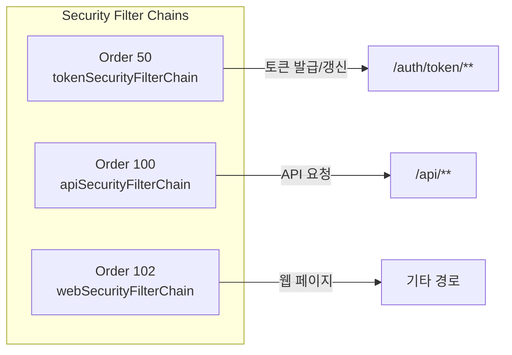
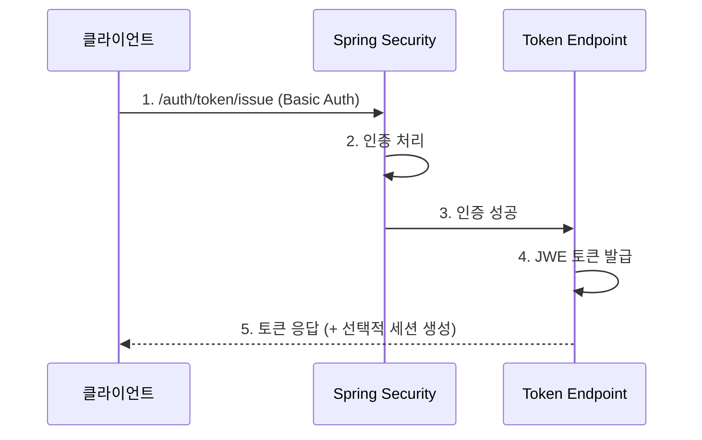
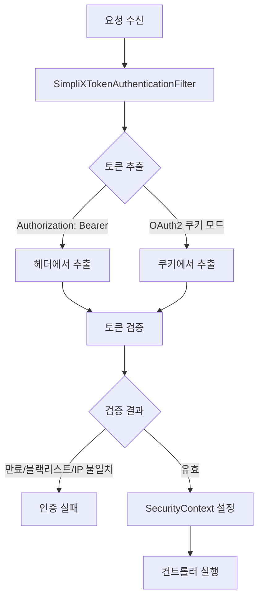
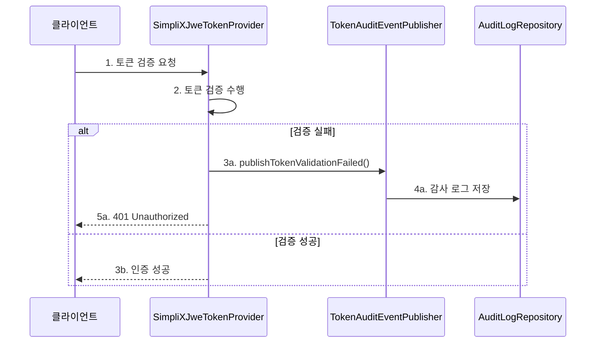

# 보안 설정

SimpliX Auth의 보안 관련 설정을 상세히 설명합니다. Spring Security 기반의 다양한 보안 기능을 구성할 수 있습니다.

## 목차

- [Security Filter Chain 구조](#security-filter-chain-구조)
- [토큰 엔드포인트 보안](#토큰-엔드포인트-보안)
- [API 보안](#api-보안)
- [웹 보안](#웹-보안)
  - [커스텀 LogoutHandler](#커스텀-logouthandler)
  - [커스텀 LogoutSuccessHandler](#커스텀-logoutsuccesshandler)
- [CORS 설정](#cors-설정)
- [CSRF 설정](#csrf-설정)
- [HTTPS 설정](#https-설정)
- [세션 관리](#세션-관리)
- [예외 처리](#예외-처리)
- [Method Security](#method-security)
- [토큰 감사 로깅](#토큰-감사-로깅)

## Security Filter Chain 구조

SimpliX Auth는 3개의 Security Filter Chain을 순서대로 적용합니다:



### Filter Chain 우선순위

| 요청 경로 | Filter Chain | Order |
|----------|--------------|-------|
| `/auth/token/issue` | tokenSecurityFilterChain | 50 |
| `/api/users` | apiSecurityFilterChain | 100 |
| `/dashboard` | webSecurityFilterChain | 102 |

## 토큰 엔드포인트 보안

토큰 발급/갱신 엔드포인트의 보안 설정:

```yaml
simplix:
  auth:
    security:
      enable-token-endpoints: true  # 토큰 엔드포인트 활성화
```

### 보호되는 엔드포인트

| 엔드포인트 | 메서드 | 인증 | 설명 |
|-----------|--------|------|------|
| `/auth/token/issue` | GET | Basic Auth | 토큰 발급 |
| `/auth/token/refresh` | GET | X-Refresh-Token | 토큰 갱신 |
| `/auth/token/revoke` | POST | Bearer Token | 토큰 폐기 |

### 토큰 발급 흐름



## API 보안

`/api/**` 경로에 대한 보안 설정:

```yaml
simplix:
  auth:
    security:
      permit-all-patterns:
        - /api/public/**
        - /api/health
        - /swagger-ui/**
        - /v3/api-docs/**
```

### 인증 흐름



### 토큰 vs 세션 우선순위

```yaml
simplix:
  auth:
    security:
      prefer-token-over-session: true  # 기본값
```

| 설정값 | 세션 있음 | 토큰 있음 | 사용되는 인증 |
|--------|----------|----------|--------------|
| true | O | O | 토큰 |
| true | O | X | 세션 |
| false | O | O | 세션 |
| false | X | O | 토큰 |

## 웹 보안

전통적인 웹 페이지를 위한 폼 로그인 설정:

```yaml
simplix:
  auth:
    security:
      enable-web-security: true
      login-page-template: /login
      login-processing-url: /login
      logout-url: /logout
      permit-all-patterns:
        - /css/**
        - /js/**
        - /images/**
        - /public/**
```

### 폼 로그인 설정

```java
// 자동 설정되는 내용
http.formLogin(form -> form
    .loginPage("/login")
    .loginProcessingUrl("/login")
    .successHandler(authenticationSuccessHandler)
    .failureHandler(authenticationFailureHandler)
    .permitAll());
```

### 로그아웃 설정

자동으로 다음이 처리됩니다:
- SecurityContext 클리어
- 세션 무효화
- 쿠키 삭제: `JSESSIONID`, `access_token`, `refresh_token`

### 커스텀 LogoutHandler

로그아웃 시 감사 로깅, 토큰 블랙리스트 등록 등 추가 작업을 수행할 수 있습니다.

```java
@Configuration
public class LogoutConfig {

    @Bean
    public LogoutHandler auditLogoutHandler(AuditService auditService) {
        return (request, response, authentication) -> {
            if (authentication != null) {
                String username = authentication.getName();
                String ip = request.getRemoteAddr();

                // 감사 로그 기록
                auditService.logLogout(username, ip, LocalDateTime.now());

                // 토큰 블랙리스트 등록
                String token = extractToken(request);
                if (token != null) {
                    tokenBlacklistService.addToBlacklist(token);
                }
            }
        };
    }

    private String extractToken(HttpServletRequest request) {
        String bearerToken = request.getHeader("Authorization");
        if (bearerToken != null && bearerToken.startsWith("Bearer ")) {
            return bearerToken.substring(7);
        }
        return null;
    }
}
```

### 커스텀 LogoutSuccessHandler

로그아웃 성공 후 커스텀 리다이렉트 또는 JSON 응답을 반환할 수 있습니다.

```java
@Bean
public LogoutSuccessHandler customLogoutSuccessHandler() {
    return (request, response, authentication) -> {
        // API 요청인 경우 JSON 응답
        if (isApiRequest(request)) {
            response.setStatus(HttpServletResponse.SC_OK);
            response.setContentType(MediaType.APPLICATION_JSON_VALUE);
            response.getWriter().write("{\"message\": \"Logged out successfully\"}");
        } else {
            // 웹 요청인 경우 커스텀 페이지로 리다이렉트
            response.sendRedirect("/goodbye?user=" +
                (authentication != null ? authentication.getName() : ""));
        }
    };
}

private boolean isApiRequest(HttpServletRequest request) {
    return request.getRequestURI().startsWith("/api/") ||
           "application/json".equals(request.getHeader("Accept"));
}
```

### 핸들러 등록 순서

`LogoutHandler`와 `LogoutSuccessHandler`가 모두 등록된 경우:

1. `LogoutHandler.logout()` 실행 (토큰 폐기, 감사 로깅 등)
2. Spring Security 기본 로그아웃 처리 (세션 무효화, SecurityContext 클리어)
3. `LogoutSuccessHandler.onLogoutSuccess()` 실행 (리다이렉트/응답)

### 커스텀 Success/Failure Handler

```java
@Configuration
public class AuthHandlerConfig {

    @Bean(name = "authenticationSuccessHandler")
    public AuthenticationSuccessHandler authenticationSuccessHandler(
            UserRepository userRepository) {

        return (request, response, authentication) -> {
            String username = authentication.getName();

            // 마지막 로그인 시간 업데이트
            userRepository.updateLastLogin(username, LocalDateTime.now());

            // 기본 동작: 저장된 요청 또는 기본 URL로 리다이렉트
            new SavedRequestAwareAuthenticationSuccessHandler()
                .onAuthenticationSuccess(request, response, authentication);
        };
    }

    @Bean(name = "authenticationFailureHandler")
    public AuthenticationFailureHandler authenticationFailureHandler(
            LoginAttemptService loginAttemptService) {

        return (request, response, exception) -> {
            String username = request.getParameter("username");

            // 실패 시도 기록
            loginAttemptService.recordFailure(username);

            // 5회 실패 시 계정 잠금
            if (loginAttemptService.isBlocked(username)) {
                response.sendRedirect("/login?error=blocked");
                return;
            }

            response.sendRedirect("/login?error");
        };
    }
}
```

## CORS 설정

Cross-Origin Resource Sharing 설정:

```yaml
simplix:
  auth:
    security:
      enable-cors: true
    cors:
      allowed-origins:
        - http://localhost:3000
        - https://your-frontend.com
      allowed-methods:
        - GET
        - POST
        - PUT
        - DELETE
        - OPTIONS
      allowed-headers:
        - Authorization
        - Content-Type
        - X-Refresh-Token
      exposed-headers:
        - X-Total-Count
      allow-credentials: true
      max-age: 3600
```

### CORS 설정 상세

| 속성 | 설명 | 기본값 |
|------|------|--------|
| `allowed-origins` | 허용할 오리진 목록 | `*` |
| `allowed-methods` | 허용할 HTTP 메서드 | 모든 메서드 |
| `allowed-headers` | 허용할 요청 헤더 | 모든 헤더 |
| `exposed-headers` | 클라이언트에 노출할 응답 헤더 | 없음 |
| `allow-credentials` | 인증 정보(쿠키, 헤더) 허용 | `false` |
| `max-age` | Preflight 응답 캐시 시간(초) | 1800 |

### 주의사항

`allow-credentials: true` 사용 시 `allowed-origins`에 `*`를 사용할 수 없습니다. 명시적인 오리진을 지정해야 합니다.

## CSRF 설정

Cross-Site Request Forgery 보호 설정:

```yaml
simplix:
  auth:
    security:
      enable-csrf: true
      csrf-ignore-patterns:
        - /api/token/**
        - /h2-console/**
        - /api/webhook/**
```

### CSRF 토큰 사용

Thymeleaf 템플릿에서:
```html
<form method="post" action="/update">
    <input type="hidden" th:name="${_csrf.parameterName}" th:value="${_csrf.token}"/>
    <!-- 폼 내용 -->
</form>
```

JavaScript에서:
```javascript
// CSRF 토큰을 메타 태그에서 읽기
const token = document.querySelector('meta[name="_csrf"]').content;
const header = document.querySelector('meta[name="_csrf_header"]').content;

fetch('/api/update', {
    method: 'POST',
    headers: {
        [header]: token,
        'Content-Type': 'application/json'
    },
    body: JSON.stringify(data)
});
```

### API에서 CSRF 비활성화

REST API는 일반적으로 CSRF 보호가 필요하지 않습니다 (토큰 기반 인증 사용 시):

```yaml
simplix:
  auth:
    security:
      csrf-ignore-patterns:
        - /api/**
```

## HTTPS 설정

프로덕션 환경에서 HTTPS 강제:

```yaml
simplix:
  auth:
    security:
      require-https: true
```

활성화 시:
- 모든 HTTP 요청이 HTTPS로 리다이렉트
- 쿠키에 `Secure` 플래그 자동 설정

### SSL 인증서 설정

```yaml
server:
  ssl:
    key-store: classpath:keystore.p12
    key-store-password: ${SSL_KEYSTORE_PASSWORD}
    key-store-type: PKCS12
    key-alias: tomcat
```

## 세션 관리

### 세션 생성 정책

```yaml
# SimpliX Auth 기본 정책
# SessionCreationPolicy.IF_REQUIRED
```

| 정책 | 설명 |
|------|------|
| `IF_REQUIRED` | 필요 시 세션 생성 (기본값) |
| `ALWAYS` | 항상 세션 생성 |
| `NEVER` | 세션 생성하지 않음 (기존 세션은 사용) |
| `STATELESS` | 세션 완전 비활성화 |

### 토큰 발급 시 세션 생성

```yaml
simplix:
  auth:
    token:
      create-session-on-token-issue: true  # 기본값
```

활성화 시:
1. 토큰 발급 후 세션 생성
2. 세션 타임아웃 = Access 토큰 수명
3. SecurityContext를 세션에 저장
4. 웹 페이지에서 세션 인증 사용 가능

## 예외 처리

### AuthenticationEntryPoint

인증되지 않은 요청 처리:

```java
// SimpliXAuthenticationEntryPoint 기본 동작
@Override
public void commence(HttpServletRequest request,
                    HttpServletResponse response,
                    AuthenticationException authException) {

    if (isApiRequest(request)) {
        // API 요청: JSON 오류 응답
        response.setStatus(HttpServletResponse.SC_UNAUTHORIZED);
        response.setContentType(MediaType.APPLICATION_JSON_VALUE);
        // {"error": "Unauthorized", "message": "..."}
    } else {
        // 웹 요청: 로그인 페이지로 리다이렉트
        response.sendRedirect(loginUrl);
    }
}
```

### AccessDeniedHandler

권한 부족 시 처리:

```java
// SimpliXAccessDeniedHandler 기본 동작
@Override
public void handle(HttpServletRequest request,
                  HttpServletResponse response,
                  AccessDeniedException accessDeniedException) {

    if (isApiRequest(request)) {
        // API 요청: 403 JSON 응답
        response.setStatus(HttpServletResponse.SC_FORBIDDEN);
        // {"error": "Forbidden", "message": "..."}
    } else {
        // 웹 요청: 403 에러 페이지
        response.sendRedirect("/error/403");
    }
}
```

### 커스텀 예외 처리기

```java
@ControllerAdvice
public class SecurityExceptionHandler {

    @ExceptionHandler(TokenValidationException.class)
    public ResponseEntity<SimpliXApiResponse<?>> handleTokenValidation(
            TokenValidationException ex) {

        return ResponseEntity
            .status(HttpStatus.UNAUTHORIZED)
            .body(SimpliXApiResponse.error(ex.getMessage(), ex.getDetail()));
    }

    @ExceptionHandler(AccessDeniedException.class)
    public ResponseEntity<SimpliXApiResponse<?>> handleAccessDenied(
            AccessDeniedException ex) {

        return ResponseEntity
            .status(HttpStatus.FORBIDDEN)
            .body(SimpliXApiResponse.error("Access Denied", ex.getMessage()));
    }
}
```

## Method Security

메서드 레벨 보안 활성화:

```java
@Configuration
@EnableMethodSecurity(prePostEnabled = true)
public class MethodSecurityConfig {
    // SimpliXAuthMethodSecurityConfiguration에서 자동 설정됨
}
```

### 사용 예시

```java
@Service
public class UserService {

    @PreAuthorize("hasRole('ADMIN')")
    public List<User> getAllUsers() {
        // ADMIN 역할만 접근 가능
    }

    @PreAuthorize("hasRole('USER') and #userId == authentication.name")
    public User getUser(String userId) {
        // 본인 정보만 조회 가능
    }

    @PreAuthorize("hasAnyRole('ADMIN', 'MANAGER')")
    public void updateUser(User user) {
        // ADMIN 또는 MANAGER 역할만 접근 가능
    }

    @PostAuthorize("returnObject.owner == authentication.name")
    public Document getDocument(String documentId) {
        // 반환된 문서의 소유자만 조회 가능
    }
}
```

### SpEL 표현식

| 표현식 | 설명 |
|--------|------|
| `hasRole('ROLE')` | 특정 역할 보유 |
| `hasAnyRole('R1', 'R2')` | 나열된 역할 중 하나 보유 |
| `hasAuthority('AUTH')` | 특정 권한 보유 |
| `isAuthenticated()` | 인증된 사용자 |
| `isAnonymous()` | 익명 사용자 |
| `#paramName` | 메서드 파라미터 참조 |
| `authentication.name` | 현재 인증된 사용자명 |
| `returnObject` | 메서드 반환값 (PostAuthorize) |

## 토큰 감사 로깅

SimpliX Auth는 토큰 관련 이벤트에 대한 감사 로깅을 지원합니다. 보안 모니터링 및 컴플라이언스 요구사항(ISO 27001, SOC2, GDPR)을 충족하기 위해 사용할 수 있습니다.

### 감사 이벤트 유형

| 이벤트 | 설명 | 발생 시점 |
|--------|------|----------|
| Token Validation Failed | 토큰 검증 실패 | 만료/폐기/IP불일치/UA불일치/손상 |
| Token Refresh Success | 토큰 갱신 성공 | 리프레시 토큰으로 새 토큰 발급 |
| Token Refresh Failed | 토큰 갱신 실패 | 리프레시 토큰 검증 실패 |
| Token Revoked | 토큰 폐기 | 로그아웃 또는 명시적 폐기 |
| Token Blacklisted | 토큰 블랙리스트 등록 | 토큰이 블랙리스트에 추가됨 |
| Blacklisted Token Used | 블랙리스트 토큰 사용 시도 | 폐기된 토큰으로 접근 시도 |

### 실패 사유 (TokenFailureReason)

| 사유 | 설명 |
|------|------|
| `TOKEN_EXPIRED` | 토큰 만료 (exp 클레임 초과) |
| `TOKEN_REVOKED` | 토큰 폐기됨 (블랙리스트) |
| `INVALID_SIGNATURE` | 서명 검증 실패 |
| `MALFORMED_TOKEN` | 토큰 파싱 불가 |
| `IP_MISMATCH` | IP 주소 불일치 |
| `USER_AGENT_MISMATCH` | User-Agent 불일치 |
| `MISSING_TOKEN` | 토큰 누락 |
| `MISSING_REFRESH_TOKEN` | 리프레시 토큰 헤더 누락 |
| `INVALID_CREDENTIALS` | 인증 정보 오류 |
| `USER_NOT_FOUND` | 사용자 없음 |
| `ACCOUNT_LOCKED` | 계정 잠금 |
| `ACCOUNT_DISABLED` | 계정 비활성화 |

### TokenAuditEventPublisher 구현

감사 이벤트를 수신하려면 `TokenAuditEventPublisher` 인터페이스를 구현합니다:

```java
@Component
@Slf4j
public class CustomTokenAuditPublisher implements TokenAuditEventPublisher {

    private final AuditLogRepository auditLogRepository;

    @Override
    public void publishTokenValidationFailed(TokenAuditEvent event) {
        log.warn("Token validation failed: user={}, reason={}, ip={}",
            event.username(), event.failureReason(), event.clientIp());

        saveAuditLog("TOKEN_VALIDATION_FAILED", event);
    }

    @Override
    public void publishTokenRefreshSuccess(TokenAuditEvent event) {
        log.info("Token refreshed: user={}, ip={}",
            event.username(), event.clientIp());

        saveAuditLog("TOKEN_REFRESH_SUCCESS", event);
    }

    @Override
    public void publishTokenRefreshFailed(TokenAuditEvent event) {
        log.warn("Token refresh failed: user={}, reason={}, ip={}",
            event.username(), event.failureReason(), event.clientIp());

        saveAuditLog("TOKEN_REFRESH_FAILED", event);
    }

    @Override
    public void publishTokenIssueSuccess(TokenAuditEvent event) {
        log.info("Token issued: user={}, ip={}",
            event.username(), event.clientIp());

        saveAuditLog("TOKEN_ISSUED", event);
    }

    @Override
    public void publishTokenIssueFailed(TokenAuditEvent event) {
        log.warn("Token issue failed: user={}, reason={}, ip={}",
            event.username(), event.failureReason(), event.clientIp());

        saveAuditLog("TOKEN_ISSUE_FAILED", event);
    }

    @Override
    public void publishTokenRevoked(TokenAuditEvent event) {
        log.info("Token revoked: user={}, jti={}, ip={}",
            event.username(), event.jti(), event.clientIp());

        saveAuditLog("TOKEN_REVOKED", event);
    }

    @Override
    public void publishTokenBlacklisted(String jti, Duration ttl, String username) {
        log.info("Token blacklisted: jti={}, ttl={}, user={}",
            jti, ttl, username);

        // 블랙리스트 등록 감사 로그
    }

    @Override
    public void publishBlacklistedTokenUsed(String jti, String username, String clientIp) {
        log.warn("Blacklisted token used: jti={}, user={}, ip={}",
            jti, username, clientIp);

        // 보안 경고: 폐기된 토큰 재사용 시도 감지
    }

    private void saveAuditLog(String eventType, TokenAuditEvent event) {
        // IP 주소 마스킹 (GDPR 준수)
        String maskedIp = maskIpAddress(event.clientIp());

        AuditLog log = AuditLog.builder()
            .eventType(eventType)
            .username(event.username())
            .tokenId(event.jti())
            .failureReason(event.failureReason().name())
            .clientIp(maskedIp)
            .userAgent(event.userAgent())
            .tokenType(event.tokenType())
            .timestamp(Instant.now())
            .build();

        auditLogRepository.save(log);
    }
}
```

### TokenAuditEvent 구조

```java
public record TokenAuditEvent(
    String username,          // 사용자명 (null 가능)
    String jti,               // JWT ID (토큰 식별자)
    TokenFailureReason failureReason,  // 실패 사유
    String clientIp,          // 클라이언트 IP
    String userAgent,         // User-Agent 헤더
    String tokenType,         // "access" 또는 "refresh"
    Map<String, Object> additionalDetails  // 추가 정보
) {
    // 성공 이벤트 생성
    public static TokenAuditEvent success(...) { ... }

    // 실패 이벤트 생성
    public static TokenAuditEvent failure(...) { ... }

    // 성공 여부 확인
    public boolean isSuccess() {
        return failureReason == TokenFailureReason.NONE;
    }
}
```

### 보안 모니터링 활용

감사 이벤트를 활용한 보안 모니터링 예시:

```java
@Component
@RequiredArgsConstructor
public class SecurityMonitor implements TokenAuditEventPublisher {

    private final AlertService alertService;
    private final Cache<String, Integer> failedAttempts;

    @Override
    public void publishTokenValidationFailed(TokenAuditEvent event) {
        // IP별 실패 횟수 추적
        String ip = event.clientIp();
        int attempts = failedAttempts.get(ip, k -> 0) + 1;
        failedAttempts.put(ip, attempts);

        // 5회 이상 실패 시 알림
        if (attempts >= 5) {
            alertService.sendSecurityAlert(
                "Suspicious activity detected from IP: " + ip
            );
        }
    }

    @Override
    public void publishBlacklistedTokenUsed(String jti, String username, String clientIp) {
        // 블랙리스트 토큰 재사용은 즉시 알림
        alertService.sendSecurityAlert(
            "Blacklisted token reuse attempt: user=" + username + ", ip=" + clientIp
        );
    }

    // 기타 메서드 구현...
}
```

### 감사 이벤트 흐름



### 구현 시 주의사항

- **비동기 처리**: 감사 로그 저장이 메인 요청 흐름을 차단하지 않도록 비동기로 처리하세요
- **예외 처리**: 감사 로그 저장 실패가 인증 흐름에 영향을 주지 않도록 예외를 적절히 처리하세요
- **민감 데이터 마스킹**: IP 주소, User-Agent 등 개인정보는 필요에 따라 마스킹하세요
- **보존 기간**: 규정 요구사항에 맞는 로그 보존 정책을 수립하세요

## 관련 문서

- [시작하기](ko/auth/getting-started.md)
- [JWE 토큰 인증](ko/auth/jwe-token.md)
- [OAuth2 소셜 로그인](ko/auth/oauth2.md)
- [설정 레퍼런스](ko/auth/configuration-reference.md)
