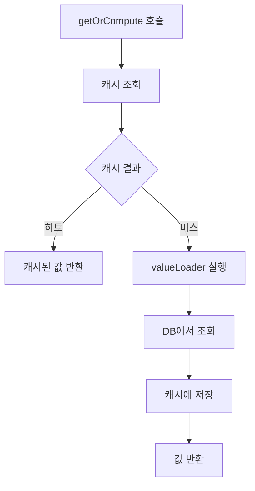

# CacheService 사용 가이드

CacheService를 통한 프로그래밍 방식 캐시 사용법입니다.

## Table of Contents

- [CacheService 소개](#cacheservice-소개)
- [API Reference](#api-reference)
- [기본 사용법](#기본-사용법)
- [데이터 조회](#데이터-조회)
- [데이터 저장](#데이터-저장)
- [캐시 무효화](#캐시-무효화)
- [배치 작업](#배치-작업)
- [캐시 통계](#캐시-통계)
- [실전 예제](#실전-예제)

---

## CacheService 소개

`CacheService`는 SimpliX Cache 모듈의 핵심 서비스로, 캐시 전략(Local/Redis)에 관계없이 일관된 API를 제공합니다.

### 주입 방법

```java
@Service
@RequiredArgsConstructor
public class MyService {

    private final CacheService cacheService;

    // ...
}
```

### 특징

- **전략 추상화**: Local/Redis 전략에 관계없이 동일한 API
- **타입 안전성**: 제네릭을 통한 타입 안전한 캐시 조회
- **TTL 지원**: 캐시별, 키별 TTL 설정 가능
- **배치 작업**: 여러 키를 한 번에 처리하는 벌크 API

---

## API Reference

### 조회 메서드

```java
/**
 * 캐시에서 값을 조회합니다.
 *
 * @param cacheName 캐시 이름
 * @param key 캐시 키
 * @param type 반환 타입 클래스
 * @return Optional로 감싼 캐시 값 (없으면 empty)
 */
<T> Optional<T> get(String cacheName, Object key, Class<T> type)

/**
 * 캐시에 값이 있으면 반환하고, 없으면 valueLoader를 실행하여 캐싱 후 반환합니다.
 * 기본 TTL이 적용됩니다.
 *
 * @param cacheName 캐시 이름
 * @param key 캐시 키
 * @param valueLoader 캐시 미스 시 실행할 로더
 * @param type 반환 타입 클래스
 * @return 캐시된 값 또는 새로 로드한 값
 */
<T> T getOrCompute(String cacheName, Object key, Callable<T> valueLoader, Class<T> type)

/**
 * 캐시에 값이 있으면 반환하고, 없으면 valueLoader를 실행하여 지정된 TTL로 캐싱 후 반환합니다.
 *
 * @param cacheName 캐시 이름
 * @param key 캐시 키
 * @param valueLoader 캐시 미스 시 실행할 로더
 * @param type 반환 타입 클래스
 * @param ttl 캐시 유지 시간
 * @return 캐시된 값 또는 새로 로드한 값
 */
<T> T getOrCompute(String cacheName, Object key, Callable<T> valueLoader, Class<T> type, Duration ttl)

/**
 * 캐시 키 존재 여부를 확인합니다.
 *
 * @param cacheName 캐시 이름
 * @param key 캐시 키
 * @return 존재하면 true
 */
boolean exists(String cacheName, Object key)

/**
 * 캐시의 모든 키를 조회합니다.
 *
 * @param cacheName 캐시 이름
 * @return 키 컬렉션
 */
Collection<Object> getKeys(String cacheName)

/**
 * 캐시의 모든 항목을 조회합니다.
 *
 * @param cacheName 캐시 이름
 * @param type 값 타입 클래스
 * @return 키-값 맵
 */
<T> Map<Object, T> getAll(String cacheName, Class<T> type)
```

### 저장 메서드

```java
/**
 * 캐시에 값을 저장합니다. 기본 TTL이 적용됩니다.
 *
 * @param cacheName 캐시 이름
 * @param key 캐시 키
 * @param value 저장할 값
 */
<T> void put(String cacheName, Object key, T value)

/**
 * 캐시에 값을 지정된 TTL로 저장합니다.
 *
 * @param cacheName 캐시 이름
 * @param key 캐시 키
 * @param value 저장할 값
 * @param ttl 캐시 유지 시간
 */
<T> void put(String cacheName, Object key, T value, Duration ttl)

/**
 * 여러 항목을 한 번에 캐시에 저장합니다.
 *
 * @param cacheName 캐시 이름
 * @param entries 키-값 맵
 */
<T> void putAll(String cacheName, Map<Object, T> entries)

/**
 * 여러 항목을 지정된 TTL로 한 번에 캐시에 저장합니다.
 *
 * @param cacheName 캐시 이름
 * @param entries 키-값 맵
 * @param ttl 캐시 유지 시간
 */
<T> void putAll(String cacheName, Map<Object, T> entries, Duration ttl)
```

### 무효화 메서드

```java
/**
 * 특정 키를 캐시에서 제거합니다.
 *
 * @param cacheName 캐시 이름
 * @param key 제거할 키
 */
void evict(String cacheName, Object key)

/**
 * 여러 키를 캐시에서 제거합니다.
 *
 * @param cacheName 캐시 이름
 * @param keys 제거할 키 컬렉션
 */
void evictAll(String cacheName, Collection<?> keys)

/**
 * 특정 캐시의 모든 항목을 제거합니다.
 *
 * @param cacheName 캐시 이름
 */
void clear(String cacheName)

/**
 * 모든 캐시의 모든 항목을 제거합니다.
 */
void clearAll()
```

### 통계 메서드

```java
/**
 * 캐시 통계를 조회합니다.
 *
 * @param cacheName 캐시 이름
 * @return 캐시 통계 정보
 */
CacheStatistics getStatistics(String cacheName)
```

---

## 기본 사용법

### getOrCompute 패턴

가장 권장되는 캐시 사용 패턴입니다. 캐시에 값이 있으면 반환하고, 없으면 로더를 실행하여 캐싱합니다.

```java
@Service
@RequiredArgsConstructor
public class UserService {

    private final CacheService cacheService;
    private final UserRepository userRepository;

    /**
     * 사용자 조회 (캐시 우선)
     */
    public User getUser(String userId) {
        return cacheService.getOrCompute(
            "users",                                    // 캐시 이름
            userId,                                     // 캐시 키
            () -> userRepository.findById(userId)       // 캐시 미스 시 실행
                    .orElseThrow(() -> new UserNotFoundException(userId)),
            User.class                                  // 반환 타입
        );
    }
}
```

### getOrCompute 동작 흐름



---

## 데이터 조회

### Optional을 사용한 조회

캐시 값이 없을 수 있는 경우:

```java
@Service
@RequiredArgsConstructor
public class ProductService {

    private final CacheService cacheService;

    /**
     * 제품 조회 (Optional 반환)
     */
    public Optional<Product> findProduct(String productId) {
        return cacheService.get("products", productId, Product.class);
    }

    /**
     * 제품 조회 (없으면 예외)
     */
    public Product getProduct(String productId) {
        return cacheService.get("products", productId, Product.class)
            .orElseThrow(() -> new ProductNotFoundException(productId));
    }
}
```

### 존재 여부 확인

```java
/**
 * 캐시에 사용자가 있는지 확인
 */
public boolean isUserCached(String userId) {
    return cacheService.exists("users", userId);
}

/**
 * 캐시된 사용자만 조회
 */
public User getCachedUserOnly(String userId) {
    if (cacheService.exists("users", userId)) {
        return cacheService.get("users", userId, User.class).orElse(null);
    }
    return null;  // DB 조회 없이 null 반환
}
```

### 커스텀 TTL

데이터 특성에 따라 다른 TTL 적용:

```java
@Service
@RequiredArgsConstructor
public class ConfigService {

    private final CacheService cacheService;
    private final ConfigRepository configRepository;

    /**
     * 시스템 설정 - 긴 TTL (변경이 드문 데이터)
     */
    public SystemConfig getSystemConfig(String key) {
        return cacheService.getOrCompute(
            "systemConfigs",
            key,
            () -> configRepository.findSystemConfig(key),
            SystemConfig.class,
            Duration.ofHours(24)  // 24시간
        );
    }

    /**
     * 기능 플래그 - 짧은 TTL (자주 변경될 수 있는 데이터)
     */
    public FeatureFlag getFeatureFlag(String flagName) {
        return cacheService.getOrCompute(
            "featureFlags",
            flagName,
            () -> configRepository.findFeatureFlag(flagName),
            FeatureFlag.class,
            Duration.ofSeconds(30)  // 30초
        );
    }

    /**
     * 사용자별 설정 - 중간 TTL
     */
    public UserPreference getUserPreference(String userId) {
        return cacheService.getOrCompute(
            "userPreferences",
            userId,
            () -> configRepository.findUserPreference(userId),
            UserPreference.class,
            Duration.ofMinutes(15)  // 15분
        );
    }
}
```

### 복합 키 사용

여러 값을 조합한 캐시 키:

```java
@Service
@RequiredArgsConstructor
public class OrderService {

    private final CacheService cacheService;
    private final OrderRepository orderRepository;

    /**
     * 사용자의 특정 상태 주문 목록
     */
    public List<Order> getUserOrdersByStatus(String userId, OrderStatus status) {
        // 복합 키: userId_status
        String cacheKey = userId + "_" + status.name();

        return cacheService.getOrCompute(
            "userOrders",
            cacheKey,
            () -> orderRepository.findByUserIdAndStatus(userId, status),
            List.class,
            Duration.ofMinutes(5)
        );
    }

    /**
     * 날짜 범위 주문 (더 복잡한 키)
     */
    public List<Order> getOrdersByDateRange(String userId, LocalDate from, LocalDate to) {
        // 구조화된 키: userId:from:to
        String cacheKey = String.format("%s:%s:%s", userId, from, to);

        return cacheService.getOrCompute(
            "ordersByRange",
            cacheKey,
            () -> orderRepository.findByUserIdAndDateRange(userId, from, to),
            List.class,
            Duration.ofMinutes(10)
        );
    }
}
```

---

## 데이터 저장

### 직접 저장

조회와 별도로 캐시에 직접 저장:

```java
@Service
@RequiredArgsConstructor
public class SessionService {

    private final CacheService cacheService;

    /**
     * 세션 생성 및 캐싱
     */
    public Session createSession(String userId) {
        Session session = Session.builder()
            .id(UUID.randomUUID().toString())
            .userId(userId)
            .createdAt(Instant.now())
            .build();

        // 30분 TTL로 세션 캐싱
        cacheService.put("sessions", session.getId(), session, Duration.ofMinutes(30));

        return session;
    }

    /**
     * 세션 갱신 (TTL 연장)
     */
    public void refreshSession(String sessionId) {
        Optional<Session> session = cacheService.get("sessions", sessionId, Session.class);

        if (session.isPresent()) {
            Session refreshed = session.get().toBuilder()
                .lastAccessedAt(Instant.now())
                .build();

            // TTL 재설정
            cacheService.put("sessions", sessionId, refreshed, Duration.ofMinutes(30));
        }
    }
}
```

### 조건부 저장

특정 조건에서만 캐싱:

```java
@Service
@RequiredArgsConstructor
public class UserService {

    private final CacheService cacheService;
    private final UserRepository userRepository;

    /**
     * 활성 사용자만 캐싱
     */
    public User getActiveUser(String userId) {
        // 캐시 확인
        Optional<User> cached = cacheService.get("activeUsers", userId, User.class);
        if (cached.isPresent()) {
            return cached.get();
        }

        // DB 조회
        User user = userRepository.findById(userId)
            .orElseThrow(() -> new UserNotFoundException(userId));

        // 활성 사용자만 캐싱
        if (user.isActive()) {
            cacheService.put("activeUsers", userId, user, Duration.ofHours(1));
        }

        return user;
    }

    /**
     * null이 아닌 경우만 캐싱
     */
    public User findUserWithCaching(String userId) {
        return cacheService.get("users", userId, User.class)
            .orElseGet(() -> {
                User user = userRepository.findById(userId).orElse(null);

                // null이 아닌 경우만 캐싱
                if (user != null) {
                    cacheService.put("users", userId, user);
                }

                return user;
            });
    }
}
```

---

## 캐시 무효화

### 단일 키 무효화

데이터 변경 시 캐시 제거:

```java
@Service
@RequiredArgsConstructor
public class UserService {

    private final CacheService cacheService;
    private final UserRepository userRepository;

    /**
     * 사용자 업데이트
     */
    @Transactional
    public User updateUser(String userId, UserUpdateRequest request) {
        User user = userRepository.findById(userId)
            .orElseThrow(() -> new UserNotFoundException(userId));

        user.update(request);
        User saved = userRepository.save(user);

        // 캐시 무효화
        cacheService.evict("users", userId);

        // 관련 캐시도 무효화
        cacheService.evict("userProfiles", userId);

        return saved;
    }

    /**
     * 사용자 삭제
     */
    @Transactional
    public void deleteUser(String userId) {
        userRepository.deleteById(userId);

        // 모든 관련 캐시 무효화
        cacheService.evict("users", userId);
        cacheService.evict("userProfiles", userId);
        cacheService.evict("userPermissions", userId);
    }
}
```

### 다중 키 무효화

여러 키를 한 번에 제거:

```java
@Service
@RequiredArgsConstructor
public class ProductService {

    private final CacheService cacheService;
    private final ProductRepository productRepository;

    /**
     * 카테고리 제품 가격 일괄 업데이트
     */
    @Transactional
    public void updateCategoryPrices(String category, BigDecimal priceMultiplier) {
        List<Product> products = productRepository.findByCategory(category);

        // 가격 업데이트
        products.forEach(p -> p.updatePrice(p.getPrice().multiply(priceMultiplier)));
        productRepository.saveAll(products);

        // 관련 캐시 일괄 무효화
        List<String> productIds = products.stream()
            .map(Product::getId)
            .collect(Collectors.toList());

        cacheService.evictAll("products", productIds);

        // 카테고리 관련 캐시도 무효화
        cacheService.evict("productsByCategory", category);
    }
}
```

### 전체 캐시 클리어

특정 캐시 또는 모든 캐시 초기화:

```java
@Service
@RequiredArgsConstructor
public class CacheAdminService {

    private final CacheService cacheService;

    /**
     * 특정 캐시 전체 클리어
     */
    public void clearProductCache() {
        cacheService.clear("products");
        log.info("Product cache cleared");
    }

    /**
     * 여러 캐시 클리어
     */
    public void clearAllUserCaches() {
        cacheService.clear("users");
        cacheService.clear("userProfiles");
        cacheService.clear("userPermissions");
        cacheService.clear("userSessions");
        log.info("All user-related caches cleared");
    }

    /**
     * 모든 캐시 클리어 (주의: 운영 환경에서 신중히 사용)
     */
    public void clearAllCaches() {
        cacheService.clearAll();
        log.warn("All caches cleared - this may impact performance");
    }
}
```

### 무효화 패턴: Write-Through

저장과 동시에 캐시 업데이트:

```java
@Service
@RequiredArgsConstructor
public class UserService {

    private final CacheService cacheService;
    private final UserRepository userRepository;

    /**
     * Write-Through 패턴: 저장 후 캐시 업데이트
     */
    @Transactional
    public User updateUserWriteThrough(String userId, UserUpdateRequest request) {
        User user = userRepository.findById(userId)
            .orElseThrow(() -> new UserNotFoundException(userId));

        user.update(request);
        User saved = userRepository.save(user);

        // 캐시 업데이트 (evict 대신 put)
        cacheService.put("users", userId, saved);

        return saved;
    }
}
```

---

## 배치 작업

### 다중 항목 조회

여러 키의 값을 한 번에 조회:

```java
@Service
@RequiredArgsConstructor
public class ProductService {

    private final CacheService cacheService;
    private final ProductRepository productRepository;

    /**
     * 여러 제품 일괄 조회
     */
    public Map<String, Product> getProducts(Set<String> productIds) {
        // 1. 캐시에서 전체 조회
        Map<Object, Product> cached = cacheService.getAll("products", Product.class);

        // 2. 요청된 ID 중 캐시에 있는 것 필터링
        Map<String, Product> result = new HashMap<>();
        Set<String> missingIds = new HashSet<>();

        for (String id : productIds) {
            if (cached.containsKey(id)) {
                result.put(id, cached.get(id));
            } else {
                missingIds.add(id);
            }
        }

        // 3. 캐시 미스된 항목은 DB에서 조회
        if (!missingIds.isEmpty()) {
            List<Product> products = productRepository.findAllById(missingIds);

            Map<Object, Product> toCache = products.stream()
                .collect(Collectors.toMap(Product::getId, p -> p));

            // 4. 조회된 항목 캐싱
            cacheService.putAll("products", toCache);

            // 5. 결과에 추가
            products.forEach(p -> result.put(p.getId(), p));
        }

        return result;
    }
}
```

### 다중 항목 저장

여러 항목을 한 번에 캐싱:

```java
@Service
@RequiredArgsConstructor
public class CacheWarmupService {

    private final CacheService cacheService;
    private final ProductRepository productRepository;
    private final ConfigRepository configRepository;

    /**
     * 제품 캐시 워밍
     */
    public void warmupProductCache() {
        List<Product> products = productRepository.findPopularProducts(100);

        Map<Object, Product> entries = products.stream()
            .collect(Collectors.toMap(Product::getId, p -> p));

        cacheService.putAll("products", entries, Duration.ofHours(1));

        log.info("Warmed up {} products in cache", entries.size());
    }

    /**
     * 설정 캐시 워밍
     */
    public void warmupConfigCache() {
        List<Config> configs = configRepository.findAll();

        Map<Object, Config> entries = configs.stream()
            .collect(Collectors.toMap(Config::getKey, c -> c));

        cacheService.putAll("configs", entries, Duration.ofHours(24));

        log.info("Warmed up {} configs in cache", entries.size());
    }
}
```

### 캐시 키 조회

특정 캐시의 모든 키 확인:

```java
@Service
@RequiredArgsConstructor
public class CacheInspectionService {

    private final CacheService cacheService;

    /**
     * 캐시 키 목록 조회
     */
    public Collection<Object> getCacheKeys(String cacheName) {
        return cacheService.getKeys(cacheName);
    }

    /**
     * 캐시 크기 확인
     */
    public int getCacheSize(String cacheName) {
        return cacheService.getKeys(cacheName).size();
    }

    /**
     * 특정 패턴의 키 조회
     */
    public List<String> getKeysByPattern(String cacheName, String pattern) {
        return cacheService.getKeys(cacheName).stream()
            .map(Object::toString)
            .filter(key -> key.contains(pattern))
            .collect(Collectors.toList());
    }
}
```

---

## 캐시 통계

### 통계 조회

```java
@Component
@RequiredArgsConstructor
public class CacheStatsReporter {

    private final CacheService cacheService;

    /**
     * 단일 캐시 통계
     */
    public CacheStatsDto getCacheStats(String cacheName) {
        CacheStatistics stats = cacheService.getStatistics(cacheName);

        return CacheStatsDto.builder()
            .cacheName(cacheName)
            .hits(stats.hits())
            .misses(stats.misses())
            .hitRate(stats.hitRate())
            .size(stats.size())
            .evictions(stats.evictions())
            .memoryUsage(stats.memoryUsage())
            .build();
    }

    /**
     * 모든 캐시 통계
     */
    public List<CacheStatsDto> getAllCacheStats() {
        List<String> cacheNames = List.of(
            "users", "products", "orders", "configs"
        );

        return cacheNames.stream()
            .map(this::getCacheStats)
            .collect(Collectors.toList());
    }
}
```

### 통계 모니터링

```java
@Component
@RequiredArgsConstructor
@Slf4j
public class CacheMonitor {

    private final CacheService cacheService;

    private static final double LOW_HIT_RATE_THRESHOLD = 0.5;
    private static final double GOOD_HIT_RATE_THRESHOLD = 0.8;

    /**
     * 주기적 통계 로깅
     */
    @Scheduled(fixedDelay = 60000)  // 1분마다
    public void logCacheStatistics() {
        List<String> cacheNames = List.of("users", "products", "orders");

        for (String cacheName : cacheNames) {
            CacheStatistics stats = cacheService.getStatistics(cacheName);

            // 기본 통계 로깅
            log.info("Cache [{}] - Hits: {}, Misses: {}, Hit Rate: {:.1f}%, Size: {}",
                cacheName,
                stats.hits(),
                stats.misses(),
                stats.hitRate() * 100,
                stats.size()
            );

            // 히트율 경고
            if (stats.hitRate() < LOW_HIT_RATE_THRESHOLD && stats.hits() + stats.misses() > 100) {
                log.warn("Low cache hit rate for '{}': {:.1f}% - consider increasing TTL or pre-warming",
                    cacheName, stats.hitRate() * 100);
            }
        }
    }

    /**
     * 히트율 알림
     */
    @Scheduled(fixedDelay = 300000)  // 5분마다
    public void checkCacheHealth() {
        List<String> criticalCaches = List.of("users", "configs");

        for (String cacheName : criticalCaches) {
            CacheStatistics stats = cacheService.getStatistics(cacheName);

            if (stats.hitRate() < LOW_HIT_RATE_THRESHOLD) {
                // 알림 발송 (Slack, Email 등)
                sendAlert(cacheName, stats);
            }
        }
    }

    private void sendAlert(String cacheName, CacheStatistics stats) {
        log.error("ALERT: Cache '{}' has critically low hit rate: {:.1f}%",
            cacheName, stats.hitRate() * 100);
        // 실제 알림 로직 구현
    }
}
```

### CacheStatistics 필드 설명

| 필드 | 타입 | 설명 |
|------|------|------|
| `hits` | long | 캐시 히트 횟수 |
| `misses` | long | 캐시 미스 횟수 |
| `evictions` | long | TTL 만료 또는 크기 초과로 제거된 항목 수 |
| `puts` | long | 캐시에 저장된 횟수 |
| `removals` | long | 명시적으로 제거된 횟수 |
| `hitRate` | double | 히트율 (0.0 ~ 1.0) |
| `size` | long | 현재 캐시된 항목 수 |
| `memoryUsage` | long | 메모리 사용량 (bytes, 지원하는 경우) |

---

## 실전 예제

### 사용자 서비스

```java
@Service
@RequiredArgsConstructor
@Slf4j
public class UserService {

    private final CacheService cacheService;
    private final UserRepository userRepository;

    private static final String CACHE_NAME = "users";
    private static final Duration DEFAULT_TTL = Duration.ofMinutes(30);

    /**
     * 사용자 조회
     */
    public User getUser(String userId) {
        return cacheService.getOrCompute(
            CACHE_NAME,
            userId,
            () -> {
                log.debug("Cache miss for user: {}", userId);
                return userRepository.findById(userId)
                    .orElseThrow(() -> new UserNotFoundException(userId));
            },
            User.class,
            DEFAULT_TTL
        );
    }

    /**
     * 사용자 생성
     */
    @Transactional
    public User createUser(UserCreateRequest request) {
        User user = User.create(request);
        User saved = userRepository.save(user);

        // 생성된 사용자 캐싱
        cacheService.put(CACHE_NAME, saved.getId(), saved, DEFAULT_TTL);

        return saved;
    }

    /**
     * 사용자 업데이트
     */
    @Transactional
    public User updateUser(String userId, UserUpdateRequest request) {
        User user = userRepository.findById(userId)
            .orElseThrow(() -> new UserNotFoundException(userId));

        user.update(request);
        User saved = userRepository.save(user);

        // 캐시 업데이트
        cacheService.put(CACHE_NAME, userId, saved, DEFAULT_TTL);

        return saved;
    }

    /**
     * 사용자 삭제
     */
    @Transactional
    public void deleteUser(String userId) {
        userRepository.deleteById(userId);
        cacheService.evict(CACHE_NAME, userId);
    }

    /**
     * 여러 사용자 조회
     */
    public List<User> getUsers(List<String> userIds) {
        Map<Object, User> cached = cacheService.getAll(CACHE_NAME, User.class);

        List<String> missingIds = userIds.stream()
            .filter(id -> !cached.containsKey(id))
            .collect(Collectors.toList());

        if (!missingIds.isEmpty()) {
            List<User> users = userRepository.findAllById(missingIds);
            Map<Object, User> toCache = users.stream()
                .collect(Collectors.toMap(User::getId, u -> u));
            cacheService.putAll(CACHE_NAME, toCache, DEFAULT_TTL);
            cached.putAll(toCache);
        }

        return userIds.stream()
            .map(cached::get)
            .filter(Objects::nonNull)
            .collect(Collectors.toList());
    }
}
```

### 설정 서비스 (계층적 캐시)

```java
@Service
@RequiredArgsConstructor
public class SettingsService {

    private final CacheService cacheService;
    private final SettingsRepository settingsRepository;

    /**
     * 테넌트별 설정 (짧은 TTL)
     */
    public TenantSettings getTenantSettings(String tenantId) {
        return cacheService.getOrCompute(
            "tenantSettings",
            tenantId,
            () -> settingsRepository.findTenantSettings(tenantId),
            TenantSettings.class,
            Duration.ofMinutes(5)
        );
    }

    /**
     * 글로벌 설정 (긴 TTL)
     */
    public GlobalSettings getGlobalSettings() {
        return cacheService.getOrCompute(
            "globalSettings",
            "global",
            () -> settingsRepository.findGlobalSettings(),
            GlobalSettings.class,
            Duration.ofHours(1)
        );
    }

    /**
     * 설정 변경 시 캐시 무효화
     */
    @Transactional
    public void updateTenantSettings(String tenantId, TenantSettings settings) {
        settingsRepository.saveTenantSettings(tenantId, settings);
        cacheService.evict("tenantSettings", tenantId);
    }

    /**
     * 글로벌 설정 변경 시 모든 테넌트 캐시 무효화
     */
    @Transactional
    public void updateGlobalSettings(GlobalSettings settings) {
        settingsRepository.saveGlobalSettings(settings);
        cacheService.evict("globalSettings", "global");
        cacheService.clear("tenantSettings");  // 테넌트 설정도 영향받을 수 있음
    }
}
```

---

## Related Documents

- [Overview](ko/cache/overview.md) - 모듈 개요 및 아키텍처
- [Spring Cache Guide](ko/cache/spring-cache-guide.md) - @Cacheable 어노테이션 사용법
- [Advanced Guide](ko/cache/advanced-guide.md) - 고급 사용법 및 트러블슈팅
