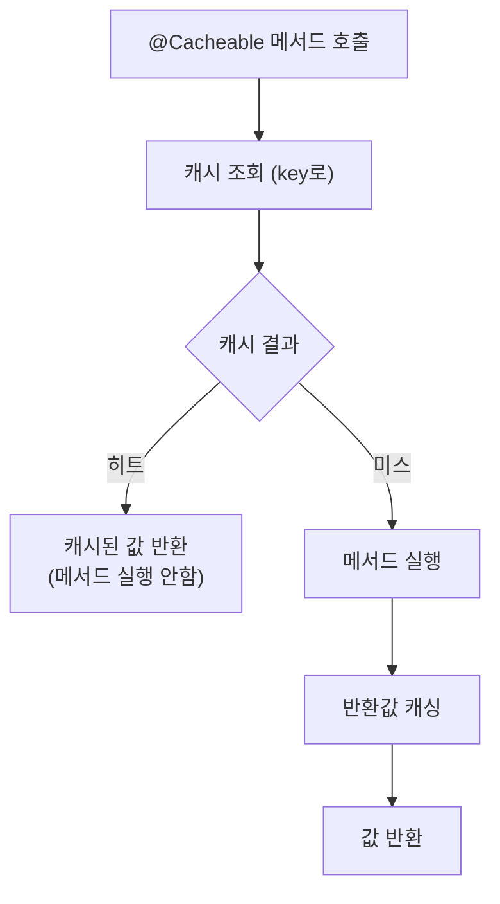
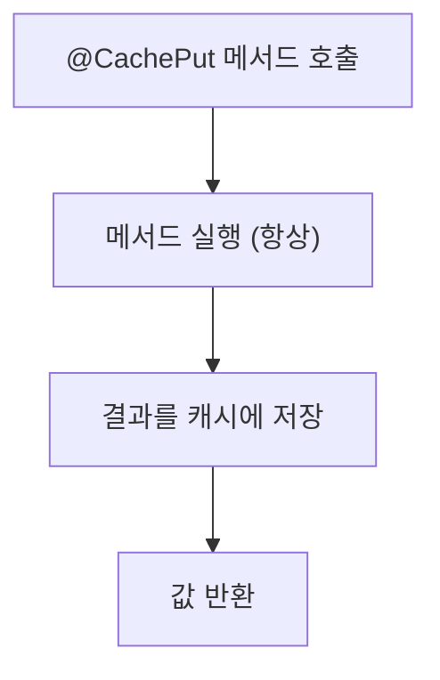

# Spring Cache 통합 가이드

Spring의 표준 캐시 어노테이션을 사용하는 방법입니다.

## Table of Contents

- [개요](#개요)
- [활성화](#활성화)
- [@Cacheable](#cacheable)
- [@CachePut](#cacheput)
- [@CacheEvict](#cacheevict)
- [@Caching](#caching)
- [SpEL 표현식](#spel-표현식)
- [조건부 캐싱](#조건부-캐싱)
- [커스텀 키 생성](#커스텀-키-생성)
- [실전 패턴](#실전-패턴)
- [주의사항](#주의사항)

---

## 개요

SimpliX Cache는 Spring의 표준 캐시 추상화를 완전히 지원합니다. 선언적 어노테이션을 사용하여 간편하게 캐싱을 적용할 수 있습니다.

### 지원 어노테이션

| 어노테이션 | 용도 |
|-----------|------|
| `@Cacheable` | 캐시 조회, 미스 시 메서드 실행 후 캐싱 |
| `@CachePut` | 항상 메서드 실행 후 결과 캐싱 |
| `@CacheEvict` | 캐시에서 항목 제거 |
| `@Caching` | 여러 캐시 어노테이션 조합 |
| `@CacheConfig` | 클래스 레벨 캐시 설정 |

### 장점

- **선언적**: 비즈니스 로직과 캐시 로직 분리
- **AOP 기반**: 메서드 호출 시 자동으로 캐시 처리
- **표준화**: Spring 표준 API로 다른 캐시 구현체로 쉽게 전환 가능

---

## 활성화

SimpliX Cache는 자동으로 Spring Cache를 활성화합니다. 별도 설정이 필요 없습니다.

```java
// 자동 활성화됨 - 별도 @EnableCaching 불필요
@SpringBootApplication
public class MyApplication {
    public static void main(String[] args) {
        SpringApplication.run(MyApplication.class, args);
    }
}
```

---

## @Cacheable

메서드 결과를 캐시에 저장하고, 이후 호출 시 캐시된 값을 반환합니다.

### 기본 사용

```java
@Service
public class UserService {

    private final UserRepository userRepository;

    /**
     * 캐시에 값이 있으면 메서드를 실행하지 않고 캐시된 값 반환
     * 캐시에 값이 없으면 메서드 실행 후 결과 캐싱
     */
    @Cacheable(value = "users", key = "#userId")
    public User getUser(String userId) {
        log.info("DB에서 사용자 조회: {}", userId);  // 캐시 히트 시 출력 안됨
        return userRepository.findById(userId)
            .orElseThrow(() -> new UserNotFoundException(userId));
    }
}
```

### 동작 흐름



### 속성

| 속성 | 타입 | 설명 |
|------|------|------|
| `value` / `cacheNames` | String[] | 캐시 이름 (필수) |
| `key` | String | 캐시 키 (SpEL 표현식) |
| `keyGenerator` | String | 키 생성기 빈 이름 |
| `condition` | String | 캐싱 조건 (SpEL) |
| `unless` | String | 캐싱 제외 조건 (SpEL) |
| `sync` | boolean | 동기화 모드 (동시 호출 시 1번만 실행) |

### 다중 캐시

여러 캐시에 동시에 저장:

```java
@Service
public class ProductService {

    /**
     * products와 productDetails 두 캐시에 저장
     */
    @Cacheable(value = {"products", "productDetails"}, key = "#productId")
    public Product getProduct(String productId) {
        return productRepository.findById(productId).orElse(null);
    }
}
```

### sync 모드

동시에 같은 키로 요청이 들어올 때 한 번만 실행:

```java
@Service
public class HeavyService {

    /**
     * 동시 요청 시 첫 번째 요청만 실행, 나머지는 대기 후 결과 공유
     */
    @Cacheable(value = "heavyData", key = "#id", sync = true)
    public HeavyData getHeavyData(String id) {
        // 비용이 큰 작업
        return heavyComputation(id);
    }
}
```

---

## @CachePut

항상 메서드를 실행하고 결과를 캐시에 저장합니다. 캐시 업데이트에 사용합니다.

### 기본 사용

```java
@Service
public class UserService {

    /**
     * 항상 메서드 실행 후 결과 캐싱
     * 기존 캐시 값이 있어도 덮어씀
     */
    @CachePut(value = "users", key = "#user.id")
    public User updateUser(User user) {
        return userRepository.save(user);
    }
}
```

### 동작 흐름



### @Cacheable vs @CachePut

| 특성 | @Cacheable | @CachePut |
|------|-----------|-----------|
| 메서드 실행 | 캐시 미스 시만 | 항상 |
| 용도 | 조회 | 생성/수정 |
| 캐시 갱신 | 미스 시 | 항상 |

### 생성/수정 패턴

```java
@Service
public class ProductService {

    /**
     * 제품 생성 - 생성 후 캐싱
     */
    @CachePut(value = "products", key = "#result.id")
    public Product createProduct(ProductCreateRequest request) {
        Product product = Product.create(request);
        return productRepository.save(product);
    }

    /**
     * 제품 수정 - 수정 후 캐시 갱신
     */
    @CachePut(value = "products", key = "#productId")
    public Product updateProduct(String productId, ProductUpdateRequest request) {
        Product product = productRepository.findById(productId)
            .orElseThrow(() -> new ProductNotFoundException(productId));
        product.update(request);
        return productRepository.save(product);
    }
}
```

---

## @CacheEvict

캐시에서 항목을 제거합니다.

### 단일 키 제거

```java
@Service
public class UserService {

    /**
     * 특정 키 제거
     */
    @CacheEvict(value = "users", key = "#userId")
    public void deleteUser(String userId) {
        userRepository.deleteById(userId);
    }
}
```

### 전체 캐시 클리어

```java
@Service
public class CacheAdminService {

    /**
     * 캐시 전체 클리어
     */
    @CacheEvict(value = "users", allEntries = true)
    public void clearUserCache() {
        log.info("User cache cleared");
    }

    /**
     * 여러 캐시 전체 클리어
     */
    @CacheEvict(value = {"users", "userProfiles", "userPermissions"}, allEntries = true)
    public void clearAllUserCaches() {
        log.info("All user-related caches cleared");
    }
}
```

### 속성

| 속성 | 타입 | 설명 | 기본값 |
|------|------|------|--------|
| `value` / `cacheNames` | String[] | 캐시 이름 | - |
| `key` | String | 제거할 키 (SpEL) | - |
| `allEntries` | boolean | 전체 항목 제거 | false |
| `beforeInvocation` | boolean | 메서드 실행 전 제거 | false |

### beforeInvocation

메서드 실행 전에 캐시를 제거할지 결정:

```java
@Service
public class DataService {

    /**
     * 기본: 메서드 실행 후 캐시 제거
     * 메서드 실행 중 예외 발생 시 캐시 제거 안됨
     */
    @CacheEvict(value = "data", key = "#id")
    public void deleteData(String id) {
        dataRepository.deleteById(id);  // 예외 시 캐시 유지
    }

    /**
     * 메서드 실행 전 캐시 제거
     * 메서드 실행 중 예외 발생해도 캐시는 이미 제거됨
     */
    @CacheEvict(value = "data", key = "#id", beforeInvocation = true)
    public void deleteDataSafe(String id) {
        dataRepository.deleteById(id);  // 예외 시에도 캐시 제거됨
    }
}
```

---

## @Caching

여러 캐시 어노테이션을 조합합니다.

### 다중 제거

```java
@Service
public class UserService {

    /**
     * 여러 캐시에서 동시에 제거
     */
    @Caching(evict = {
        @CacheEvict(value = "users", key = "#userId"),
        @CacheEvict(value = "userProfiles", key = "#userId"),
        @CacheEvict(value = "userPermissions", key = "#userId")
    })
    public void deleteUser(String userId) {
        userRepository.deleteById(userId);
    }
}
```

### 조회 + 제거 조합

```java
@Service
public class OrderService {

    /**
     * 주문 상태 변경
     * - orders 캐시 갱신
     * - userOrders 캐시 제거 (목록이 변경되므로)
     */
    @Caching(
        put = @CachePut(value = "orders", key = "#orderId"),
        evict = @CacheEvict(value = "userOrders", key = "#result.userId")
    )
    public Order updateOrderStatus(String orderId, OrderStatus status) {
        Order order = orderRepository.findById(orderId)
            .orElseThrow(() -> new OrderNotFoundException(orderId));
        order.setStatus(status);
        return orderRepository.save(order);
    }
}
```

### 복잡한 조합

```java
@Service
public class ProductService {

    /**
     * 제품 업데이트
     * - products 캐시 갱신
     * - productsByCategory 캐시 제거 (카테고리 목록 갱신 필요)
     * - productSearch 캐시 전체 제거 (검색 결과 갱신 필요)
     */
    @Caching(
        put = @CachePut(value = "products", key = "#productId"),
        evict = {
            @CacheEvict(value = "productsByCategory", key = "#result.category"),
            @CacheEvict(value = "productSearch", allEntries = true)
        }
    )
    public Product updateProduct(String productId, ProductUpdateRequest request) {
        Product product = productRepository.findById(productId).orElseThrow();
        product.update(request);
        return productRepository.save(product);
    }
}
```

---

## SpEL 표현식

Spring Expression Language를 사용하여 동적으로 키를 생성합니다.

### 메서드 파라미터 참조

```java
@Service
public class CacheExampleService {

    // 단일 파라미터
    @Cacheable(value = "users", key = "#userId")
    public User getUser(String userId) { ... }

    // 인덱스로 참조
    @Cacheable(value = "users", key = "#p0")
    public User getUserByIndex(String userId) { ... }

    // 파라미터 이름으로 참조 (권장)
    @Cacheable(value = "users", key = "#a0")
    public User getUserByArgument(String userId) { ... }

    // 객체 속성 참조
    @Cacheable(value = "users", key = "#request.userId")
    public User getUserByRequest(UserRequest request) { ... }

    // 중첩 속성
    @Cacheable(value = "orders", key = "#order.user.id")
    public OrderDetails getOrderDetails(Order order) { ... }
}
```

### 복합 키 생성

```java
@Service
public class SearchService {

    // 문자열 연결
    @Cacheable(value = "search", key = "#category + '_' + #page")
    public List<Product> search(String category, int page) { ... }

    // String.format 사용
    @Cacheable(value = "search", key = "T(java.lang.String).format('%s_%d_%d', #category, #page, #size)")
    public Page<Product> searchPaged(String category, int page, int size) { ... }

    // concat 메서드
    @Cacheable(value = "userOrders", key = "#userId.concat('_').concat(#status.name())")
    public List<Order> getUserOrders(String userId, OrderStatus status) { ... }
}
```

### 반환값 참조

```java
@Service
public class ProductService {

    // #result로 반환값 참조 (CachePut에서 유용)
    @CachePut(value = "products", key = "#result.id")
    public Product createProduct(ProductCreateRequest request) {
        Product product = Product.create(request);
        return productRepository.save(product);
    }

    // 반환값 속성 사용
    @CachePut(value = "productsByCategory", key = "#result.category")
    public Product updateProductCategory(String productId, String newCategory) { ... }
}
```

### 조건식

```java
@Service
public class ConditionalCacheService {

    // 비교 연산
    @Cacheable(value = "data", key = "#id", condition = "#id.length() > 5")
    public Data getData(String id) { ... }

    // null 체크
    @Cacheable(value = "users", key = "#userId", condition = "#userId != null")
    public User getUser(String userId) { ... }

    // 메서드 호출
    @Cacheable(value = "data", key = "#id", condition = "#id.startsWith('cached_')")
    public Data getCacheableData(String id) { ... }

    // 논리 연산
    @Cacheable(value = "data", key = "#id", condition = "#id != null and #id.length() > 0")
    public Data getValidData(String id) { ... }
}
```

### 유용한 SpEL 표현식

| 표현식 | 설명 |
|--------|------|
| `#paramName` | 파라미터 이름으로 참조 |
| `#p0`, `#a0` | 인덱스로 파라미터 참조 |
| `#result` | 메서드 반환값 참조 |
| `#root.method.name` | 메서드 이름 |
| `#root.target` | 대상 객체 |
| `#root.targetClass` | 대상 클래스 |
| `#root.args[0]` | 첫 번째 인자 |
| `T(ClassName).method()` | 정적 메서드 호출 |

---

## 조건부 캐싱

### condition 속성

캐싱 여부를 결정하는 조건 (메서드 실행 전 평가):

```java
@Service
public class ConditionalService {

    /**
     * ID가 null이 아닌 경우에만 캐싱
     */
    @Cacheable(value = "users", key = "#userId", condition = "#userId != null")
    public User getUser(String userId) { ... }

    /**
     * 활성 사용자만 캐싱
     */
    @Cacheable(value = "users", key = "#userId", condition = "#active == true")
    public User getActiveUser(String userId, boolean active) { ... }

    /**
     * 특정 카테고리만 캐싱
     */
    @Cacheable(
        value = "products",
        key = "#productId",
        condition = "#category == 'PREMIUM' or #category == 'VIP'"
    )
    public Product getProduct(String productId, String category) { ... }
}
```

### unless 속성

결과에 따라 캐싱 제외 (메서드 실행 후 평가):

```java
@Service
public class UnlessService {

    /**
     * null 결과는 캐싱하지 않음
     */
    @Cacheable(value = "users", key = "#userId", unless = "#result == null")
    public User findUser(String userId) {
        return userRepository.findById(userId).orElse(null);
    }

    /**
     * 빈 컬렉션은 캐싱하지 않음
     */
    @Cacheable(value = "orders", key = "#userId", unless = "#result.isEmpty()")
    public List<Order> getUserOrders(String userId) {
        return orderRepository.findByUserId(userId);
    }

    /**
     * 특정 상태는 캐싱하지 않음
     */
    @Cacheable(
        value = "orders",
        key = "#orderId",
        unless = "#result.status.name() == 'PENDING'"
    )
    public Order getOrder(String orderId) {
        return orderRepository.findById(orderId).orElse(null);
    }

    /**
     * 오래된 데이터는 캐싱하지 않음
     */
    @Cacheable(
        value = "data",
        key = "#id",
        unless = "#result.createdAt.isBefore(T(java.time.LocalDateTime).now().minusDays(7))"
    )
    public Data getData(String id) { ... }
}
```

### condition vs unless

| 속성 | 평가 시점 | #result 사용 | 용도 |
|------|----------|-------------|------|
| `condition` | 메서드 실행 전 | 불가 | 입력 기반 조건 |
| `unless` | 메서드 실행 후 | 가능 | 결과 기반 조건 |

---

## 커스텀 키 생성

### KeyGenerator 인터페이스

복잡한 키 생성 로직을 재사용:

```java
@Configuration
public class CacheKeyConfig {

    /**
     * 기본 키 생성기: 클래스명_메서드명_파라미터
     */
    @Bean
    public KeyGenerator customKeyGenerator() {
        return (target, method, params) -> {
            StringBuilder sb = new StringBuilder();
            sb.append(target.getClass().getSimpleName());
            sb.append("_");
            sb.append(method.getName());
            sb.append("_");
            for (Object param : params) {
                sb.append(param != null ? param.toString() : "null");
                sb.append("_");
            }
            return sb.toString();
        };
    }

    /**
     * 해시 기반 키 생성기 (긴 키 방지)
     */
    @Bean
    public KeyGenerator hashKeyGenerator() {
        return (target, method, params) -> {
            String raw = target.getClass().getSimpleName()
                + "_" + method.getName()
                + "_" + Arrays.toString(params);
            return DigestUtils.md5DigestAsHex(raw.getBytes());
        };
    }

    /**
     * 테넌트 인식 키 생성기
     */
    @Bean
    public KeyGenerator tenantAwareKeyGenerator(TenantContext tenantContext) {
        return (target, method, params) -> {
            String tenantId = tenantContext.getCurrentTenantId();
            return tenantId + ":" + method.getName() + ":" + Arrays.toString(params);
        };
    }
}
```

### KeyGenerator 사용

```java
@Service
public class MultiTenantService {

    /**
     * 커스텀 키 생성기 사용
     */
    @Cacheable(value = "tenantData", keyGenerator = "tenantAwareKeyGenerator")
    public TenantData getData(String dataId) { ... }

    /**
     * 해시 키 생성기 사용 (긴 파라미터가 있는 경우)
     */
    @Cacheable(value = "searchResults", keyGenerator = "hashKeyGenerator")
    public SearchResult search(SearchRequest request) { ... }
}
```

---

## 실전 패턴

### 읽기 중심 서비스

```java
@Service
@RequiredArgsConstructor
public class ProductService {

    private final ProductRepository productRepository;

    @Cacheable(value = "products", key = "#productId")
    public Product getProduct(String productId) {
        return productRepository.findById(productId)
            .orElseThrow(() -> new ProductNotFoundException(productId));
    }

    @Cacheable(value = "productsByCategory", key = "#category + '_' + #page")
    public Page<Product> getProductsByCategory(String category, int page) {
        return productRepository.findByCategory(category, PageRequest.of(page, 20));
    }

    @CachePut(value = "products", key = "#result.id")
    public Product createProduct(ProductCreateRequest request) {
        return productRepository.save(Product.create(request));
    }

    @Caching(
        put = @CachePut(value = "products", key = "#productId"),
        evict = @CacheEvict(value = "productsByCategory", allEntries = true)
    )
    public Product updateProduct(String productId, ProductUpdateRequest request) {
        Product product = productRepository.findById(productId).orElseThrow();
        product.update(request);
        return productRepository.save(product);
    }

    @Caching(evict = {
        @CacheEvict(value = "products", key = "#productId"),
        @CacheEvict(value = "productsByCategory", allEntries = true)
    })
    public void deleteProduct(String productId) {
        productRepository.deleteById(productId);
    }
}
```

### 계층적 캐시

```java
@Service
@CacheConfig(cacheNames = "orders")  // 클래스 레벨 기본 캐시
@RequiredArgsConstructor
public class OrderService {

    private final OrderRepository orderRepository;

    @Cacheable(key = "#orderId")
    public Order getOrder(String orderId) {
        return orderRepository.findById(orderId).orElseThrow();
    }

    @Cacheable(cacheNames = "userOrders", key = "#userId")
    public List<Order> getUserOrders(String userId) {
        return orderRepository.findByUserId(userId);
    }

    @Cacheable(cacheNames = "recentOrders", key = "#userId + '_' + #limit")
    public List<Order> getRecentOrders(String userId, int limit) {
        return orderRepository.findRecentByUserId(userId, limit);
    }

    @Caching(
        put = @CachePut(key = "#result.id"),
        evict = {
            @CacheEvict(cacheNames = "userOrders", key = "#result.userId"),
            @CacheEvict(cacheNames = "recentOrders", allEntries = true)
        }
    )
    public Order createOrder(OrderCreateRequest request) {
        return orderRepository.save(Order.create(request));
    }
}
```

### 조건부 캐싱 전략

```java
@Service
@RequiredArgsConstructor
public class DataService {

    private final DataRepository dataRepository;

    /**
     * 활성 데이터만 캐싱
     */
    @Cacheable(
        value = "activeData",
        key = "#id",
        condition = "#includeInactive == false",
        unless = "#result == null or #result.status != 'ACTIVE'"
    )
    public Data getData(String id, boolean includeInactive) {
        if (includeInactive) {
            return dataRepository.findById(id).orElse(null);
        }
        return dataRepository.findActiveById(id).orElse(null);
    }

    /**
     * 대용량 데이터는 캐싱 제외
     */
    @Cacheable(
        value = "documents",
        key = "#docId",
        unless = "#result != null and #result.size > 1048576"  // 1MB 초과 제외
    )
    public Document getDocument(String docId) {
        return documentRepository.findById(docId).orElse(null);
    }
}
```

---

## 주의사항

### 1. 프록시 기반 동작

같은 클래스 내부 호출은 캐시가 작동하지 않습니다:

```java
@Service
public class UserService {

    // 문제: 내부 호출 시 캐시 작동 안함
    public User getUserWithDetails(String userId) {
        User user = getUser(userId);  // 캐시 작동 안함!
        user.setDetails(loadDetails(userId));
        return user;
    }

    @Cacheable(value = "users", key = "#userId")
    public User getUser(String userId) {
        return userRepository.findById(userId).orElse(null);
    }
}
```

**해결 방법:**

```java
// 방법 1: 별도 서비스로 분리
@Service
@RequiredArgsConstructor
public class UserService {

    private final UserCacheService userCacheService;

    public User getUserWithDetails(String userId) {
        User user = userCacheService.getUser(userId);  // 외부 호출 - 캐시 작동
        user.setDetails(loadDetails(userId));
        return user;
    }
}

@Service
public class UserCacheService {

    @Cacheable(value = "users", key = "#userId")
    public User getUser(String userId) {
        return userRepository.findById(userId).orElse(null);
    }
}

// 방법 2: self-injection (권장하지 않음)
@Service
public class UserService {

    @Autowired
    private UserService self;

    public User getUserWithDetails(String userId) {
        User user = self.getUser(userId);  // 프록시 통한 호출
        return user;
    }

    @Cacheable(value = "users", key = "#userId")
    public User getUser(String userId) { ... }
}
```

### 2. 직렬화 요구사항

캐시 객체는 직렬화 가능해야 합니다 (특히 Redis 사용 시):

```java
// Good: Serializable 구현
public class User implements Serializable {
    private static final long serialVersionUID = 1L;

    private String id;
    private String name;
    private LocalDateTime createdAt;
}

// Bad: Serializable 미구현 시 Redis에서 오류 발생
public class User {
    private String id;
    private InputStream data;  // 직렬화 불가
}
```

### 3. 가변 객체 주의

캐시된 객체를 수정하면 캐시도 변경됩니다:

```java
// 문제: 캐시된 객체 직접 수정
@Cacheable(value = "users", key = "#userId")
public User getUser(String userId) { ... }

public void updateUserName(String userId, String newName) {
    User user = getUser(userId);
    user.setName(newName);  // 캐시된 객체가 변경됨!
}

// 해결: 불변 객체 또는 복사본 사용
public void updateUserNameSafe(String userId, String newName) {
    User user = getUser(userId);
    User copy = user.toBuilder().name(newName).build();
    // copy 사용
}
```

### 4. null 캐싱

기본적으로 null도 캐싱됩니다:

```java
// null도 캐싱됨 - DB에 없는 ID로 반복 조회 시 성능 향상
@Cacheable(value = "users", key = "#userId")
public User findUser(String userId) {
    return userRepository.findById(userId).orElse(null);
}

// null 캐싱 방지
@Cacheable(value = "users", key = "#userId", unless = "#result == null")
public User findUserNoNullCache(String userId) {
    return userRepository.findById(userId).orElse(null);
}
```

---

## Related Documents

- [Overview](ko/cache/overview.md) - 모듈 개요 및 아키텍처
- [CacheService Guide](ko/cache/cacheservice-guide.md) - 프로그래밍 방식 캐시 사용법
- [Advanced Guide](ko/cache/advanced-guide.md) - 고급 사용법 및 트러블슈팅
