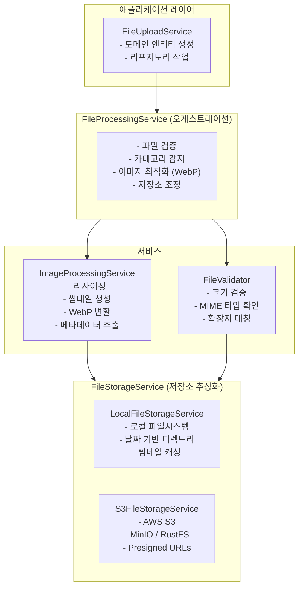

# SimpliX File Module Overview

## 목차

- [Architecture](#architecture)
- [Core Components](#core-components)
  - [FileProcessingService](#fileprocessingservice)
  - [FileStorageService](#filestorageservice)
  - [ImageProcessingService](#imageprocessingservice)
  - [FileValidator](#filevalidator)
- [Data Models](#data-models)
  - [StoredFileInfo](#storedfileinfo-record)
  - [FileProcessingRequest](#fileprocessingrequest-record)
  - [ProcessedFileResult](#processedfileresult-record)
- [FileCategory](#filecategory)
- [Configuration Properties](#configuration-properties)
- [Exception Hierarchy](#exception-hierarchy)
- [Auto-Configuration](#auto-configuration)
- [Related Documents](#related-documents)

---

## Architecture



---

## Core Components

### FileProcessingService

파일 업로드의 오케스트레이션을 담당하는 메인 서비스입니다.

```java
public interface FileProcessingService {
    // 파일 처리 및 저장 (자동 타입 감지)
    ProcessedFileResult processAndStore(FileProcessingRequest request);

    // 이미지 전용 처리 (리사이징 포함)
    ProcessedFileResult processAndStoreImage(MultipartFile file, Integer maxWidth, Integer maxHeight);

    // 일반 파일 처리 (이미지 처리 없음)
    ProcessedFileResult processAndStoreGenericFile(MultipartFile file, String directory);

    // 파일 카테고리 판별
    FileCategory determineCategory(MultipartFile file);

    // WebP 최적화 적용 여부 확인
    boolean shouldOptimizeToWebp(MultipartFile file);
}
```

### FileStorageService

파일 저장소의 추상화 인터페이스입니다.

```java
public interface FileStorageService {
    // 파일 저장
    StoredFileInfo store(InputStream inputStream, String originalName, String directory);
    StoredFileInfo store(InputStream inputStream, String originalName, String mimeType, String directory);

    // 파일 조회
    Resource retrieve(String storedPath);

    // 파일 삭제
    boolean delete(String storedPath);

    // 파일 존재 확인
    boolean exists(String storedPath);

    // 공개 URL 생성
    String getPublicUrl(String storedPath);

    // 썸네일 조회
    Resource getThumbnail(String storedPath, int width, int height);
    String getThumbnailUrl(String storedPath, int width, int height);
}
```

### ImageProcessingService

이미지 처리 작업을 담당하는 서비스입니다.

```java
public interface ImageProcessingService {
    // 리사이징
    ProcessedImage resizeIfExceeds(InputStream input, int maxWidth, int maxHeight);
    ProcessedImage resize(InputStream input, int maxWidth, int maxHeight, boolean preserveAspectRatio);

    // 썸네일 생성
    ProcessedImage generateThumbnail(InputStream input, int width, int height);

    // 메타데이터 추출
    ImageMetadata extractMetadata(InputStream input);

    // WebP 변환
    ProcessedImage convertToWebp(InputStream input, int quality, boolean lossless);
    ProcessedImage optimizeAndConvertToWebp(InputStream input, int maxWidth, int maxHeight, int quality);

    // 형식 확인
    boolean isImage(String mimeType);
    boolean isSupported(String mimeType);
    boolean isWebpSupported();
}
```

### FileValidator

파일 검증 로직을 담당하는 컴포넌트입니다.

- 빈 파일 검사
- 파일 크기 검증
- MIME 타입 화이트리스트 검사
- 확장자-MIME 타입 매칭 검증
- 이미지 형식 검증

---

## Data Models

### StoredFileInfo (Record)

저장된 파일의 정보를 담는 불변 레코드입니다.

| 필드 | 타입 | 설명 |
|------|------|------|
| `originalName` | String | 업로드된 원본 파일명 |
| `storedName` | String | UUID 기반 저장 파일명 |
| `storedPath` | String | 저장소 내 전체 경로 |
| `mimeType` | String | MIME 타입 |
| `fileSize` | Long | 파일 크기 (bytes) |
| `extension` | String | 확장자 (점 제외) |
| `checksum` | String | SHA-256 체크섬 |

### FileProcessingRequest (Record)

파일 처리 요청을 담는 레코드입니다.

| 필드 | 타입 | 설명 |
|------|------|------|
| `file` | MultipartFile | 처리할 파일 |
| `directory` | String | 저장 디렉토리 |
| `maxFileSize` | DataSize | 최대 파일 크기 (선택) |
| `allowedMimeTypes` | Set<String> | 허용 MIME 타입 (선택) |
| `maxWidth` | Integer | 최대 이미지 너비 (선택) |
| `maxHeight` | Integer | 최대 이미지 높이 (선택) |
| `enableWebpOptimization` | Boolean | WebP 최적화 여부 (선택) |

### ProcessedFileResult (Record)

처리 결과를 담는 레코드입니다.

| 필드 | 타입 | 설명 |
|------|------|------|
| `storedInfo` | StoredFileInfo | 저장 정보 |
| `category` | FileCategory | 파일 카테고리 |
| `mimeType` | String | 최종 MIME 타입 |
| `width` | Integer | 이미지 너비 (null if non-image) |
| `height` | Integer | 이미지 높이 (null if non-image) |
| `wasOptimized` | boolean | WebP 최적화 적용 여부 |
| `originalMimeType` | String | 원본 MIME 타입 |

---

## FileCategory

파일 유형을 분류하는 열거형입니다.

| 카테고리 | 확장자 |
|----------|--------|
| `IMAGE` | jpg, jpeg, png, gif, webp, svg, bmp, ico |
| `VIDEO` | mp4, webm, mov, avi, mkv |
| `AUDIO` | mp3, wav, ogg, flac, aac |
| `DOCUMENT` | pdf, doc, docx, xls, xlsx, ppt, pptx, txt, rtf |
| `ARCHIVE` | zip, rar, 7z, tar, gz |
| `OTHER` | 기타 |

---

## Configuration Properties

### 기본 파일 설정 (`simplix.file.*`)

```yaml
simplix:
  file:
    enabled: true                          # 모듈 활성화
    default-max-size: 10MB                 # 기본 최대 파일 크기
    max-files-per-request: 10              # 요청당 최대 파일 수
    checksum-algorithm: SHA-256            # 체크섬 알고리즘
    virus-scan-enabled: false              # 바이러스 스캔 (외부 서비스 필요)
    allowed-mime-types:                    # 허용 MIME 타입
      - image/jpeg
      - image/png
      - image/gif
      - image/webp
      - application/pdf
    thumbnail:
      cache-path: ./uploads/.thumbnails    # 썸네일 캐시 경로
      cache-enabled: true                  # 썸네일 캐싱 활성화
      s3-prefix: thumbnails                # S3 썸네일 prefix
```

### 저장소 설정 (`simplix.file.storage.*`)

```yaml
simplix:
  file:
    storage:
      provider: local                      # local 또는 s3
      local:
        base-path: ./uploads               # 로컬 저장 경로
        public-url-prefix: /files          # 공개 URL prefix
      s3:
        endpoint: http://localhost:9000    # S3 endpoint (MinIO/RustFS)
        access-key: ${S3_ACCESS_KEY}
        secret-key: ${S3_SECRET_KEY}
        bucket: my-bucket
        region: us-east-1
        path-style-access: true            # MinIO/RustFS 필수
        public-url-prefix:                 # 공개 URL (없으면 presigned URL)
        presigned-url-expiration: 60       # Presigned URL 만료 시간 (분)
```

### 이미지 처리 설정 (`simplix.file.image.*`)

```yaml
simplix:
  file:
    image:
      default-max-width: 2048              # 기본 최대 너비
      default-max-height: 2048             # 기본 최대 높이
      default-quality: 85                  # JPEG 품질 (1-100)
      max-file-size: 10MB                  # 이미지 최대 크기
      allowed-formats:                     # 허용 이미지 형식
        - image/jpeg
        - image/png
        - image/gif
        - image/webp
      thumbnail:
        default-sizes: [64, 128, 256]      # 기본 썸네일 크기
        default-quality: 80                # 썸네일 품질
        max-dimension: 512                 # 최대 썸네일 크기
      optimization:
        enable-webp-conversion: true       # WebP 변환 활성화
        webp-quality: 80                   # WebP 품질
        webp-lossless: false               # 무손실 압축
        min-size-for-optimization: 10240   # 최소 크기 (10KB)
```

---

## Exception Hierarchy

### FileUploadException

파일 업로드 관련 예외입니다.

| 에러 코드 | 설명 |
|-----------|------|
| `EMPTY_FILE` | 빈 파일 |
| `FILE_SIZE_EXCEEDED` | 파일 크기 초과 |
| `INVALID_FILE_TYPE` | 허용되지 않는 MIME 타입 |
| `INVALID_EXTENSION` | 확장자-MIME 불일치 |
| `VIRUS_DETECTED` | 바이러스 감지 |
| `STORAGE_QUOTA_EXCEEDED` | 저장소 용량 초과 |
| `STORAGE_WRITE_FAILED` | 저장 실패 |
| `CHECKSUM_MISMATCH` | 체크섬 불일치 |
| `MAX_FILES_EXCEEDED` | 최대 파일 수 초과 |
| `INVALID_IMAGE` | 유효하지 않은 이미지 |
| `IMAGE_PROCESSING_FAILED` | 이미지 처리 실패 |

### StorageException

저장소 관련 예외입니다.

| 에러 코드 | 설명 |
|-----------|------|
| `WRITE_FAILED` | 쓰기 실패 |
| `READ_FAILED` | 읽기 실패 |
| `DELETE_FAILED` | 삭제 실패 |
| `PATH_NOT_FOUND` | 경로 없음 |
| `PERMISSION_DENIED` | 권한 없음 |
| `CHECKSUM_CALCULATION_FAILED` | 체크섬 계산 실패 |
| `INVALID_PATH` | 유효하지 않은 경로 |
| `STORAGE_FULL` | 저장소 가득 참 |

### ImageProcessingException

이미지 처리 관련 예외입니다.

| 에러 코드 | 설명 |
|-----------|------|
| `INVALID_IMAGE_FORMAT` | 유효하지 않은 이미지 형식 |
| `UNSUPPORTED_FORMAT` | 지원하지 않는 형식 |
| `RESIZE_FAILED` | 리사이징 실패 |
| `THUMBNAIL_GENERATION_FAILED` | 썸네일 생성 실패 |
| `METADATA_EXTRACTION_FAILED` | 메타데이터 추출 실패 |
| `IMAGE_TOO_LARGE` | 이미지 크기 초과 |
| `CORRUPTED_IMAGE` | 손상된 이미지 |
| `CONVERSION_FAILED` | 변환 실패 |

---

## Auto-Configuration

`FileAutoConfiguration`은 다음 조건에서 활성화됩니다:

- `simplix.file.enabled=true` (기본값)

활성화 시 자동으로 등록되는 빈:

- `FileProperties`
- `StorageProperties`
- `ImageProperties`
- `FileValidator`
- `ImageProcessingService` (AwtImageProcessingService)
- `FileStorageService` (Local 또는 S3)
- `FileProcessingService` (DefaultFileProcessingService)

---

## Related Documents

- [Storage Guide (저장소 설정)](ko/file/storage-guide.md) - Local/S3 Provider 설정
- [Upload Guide (파일 업로드)](ko/file/upload-guide.md) - 파일 업로드 및 처리
- [Image Guide (이미지 처리)](ko/file/image-guide.md) - 이미지 리사이징, 썸네일, WebP
