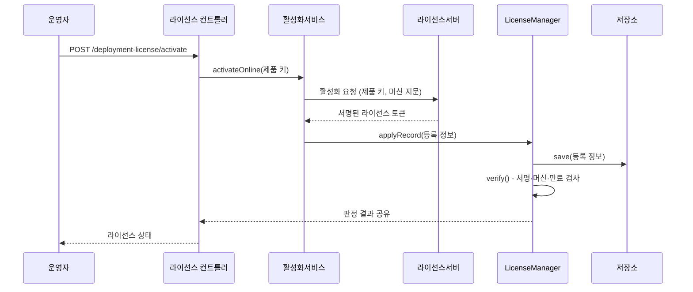
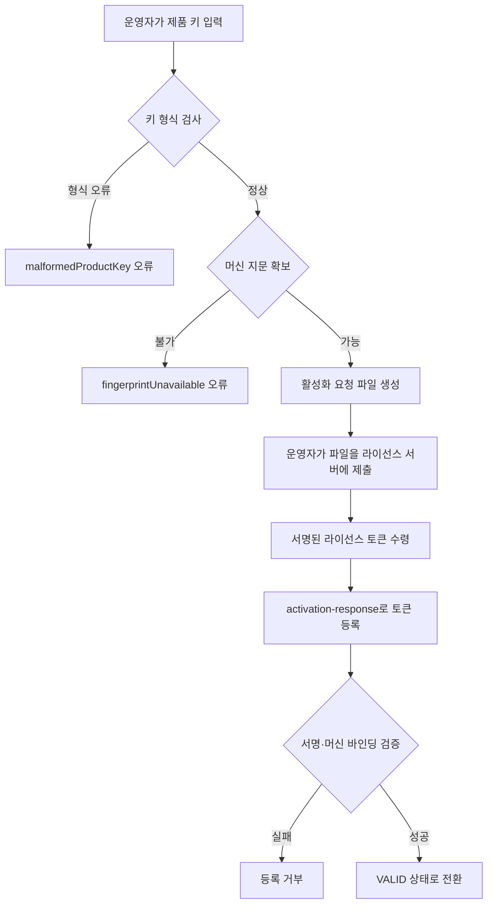

# 라이선스 활성화

배포본에 라이선스를 등록하는 세 가지 경로를 설명합니다. 네트워크가 열린 환경은 온라인 활성화, 폐쇄망은 요청 파일을 주고받는 오프라인 활성화, 개발 환경과 사전 발급 설치는 토큰 파일 제공을 사용합니다.

## 목차

- [등록 경로 비교](#등록-경로-비교)
- [온라인 활성화](#온라인-활성화)
- [오프라인 활성화](#오프라인-활성화)
- [토큰 파일 제공](#토큰-파일-제공)
- [하트비트와 재검증](#하트비트와-재검증)
- [라이선스 이전](#라이선스-이전)
- [최초 설치 마법사](#최초-설치-마법사)
- [설정](#설정)
- [문제 해결](#문제-해결)
- [관련 문서](#관련-문서)

## 등록 경로 비교

| 항목 | 온라인 활성화 | 오프라인 활성화 | 토큰 파일 제공 |
|------|-------------|---------------|---------------|
| 라이선스 서버 접근 | 배포본이 직접 접근 | 운영자가 대신 접근 | 불필요 |
| 좌석 확보 | 자동 | 서버에서 수동 발급 | 사전 발급 |
| 하트비트 | 가능 | 불가 | 불가 |
| 폐기 반영 | 하트비트로 자동 | 재발급 필요 | 재발급 필요 |
| 용도 | 일반 운영 | 폐쇄망 설치 | 개발, 사전 구성된 설치 |

온라인 활성화는 하트비트로 폐기·만료·계약 변경을 자동 반영하므로, 네트워크가 열려 있다면 우선 선택합니다.

---

## 온라인 활성화

### 처리 흐름



제품 키는 호스트를 떠나기 전에 자체 체크섬으로 검사합니다. 오타는 서버 왕복 없이 "키 형식이 올바르지 않음"으로 즉시 반환됩니다.

### REST API

**Endpoint:** `POST {prefix}/deployment-license/activate`

**Request:**
```bash
curl -X POST "http://localhost:8080/api/v1/deployment-license/activate" \
  -H "Authorization: Bearer {token}" \
  -H "Content-Type: application/json" \
  -d '{
    "productKey": "ACPS-XXXX-XXXX-XXXX-XXXX",
    "replaceExisting": false
  }'
```

| Field | Type | Required | Description |
|-------|------|----------|-------------|
| `productKey` | string | 예 | 고객에게 발급된 제품 키 |
| `replaceExisting` | boolean | 아니오 | 다른 키로 등록된 정상 라이선스를 교체할지 여부 |

**Response:**
```json
{
  "type": "SUCCESS",
  "message": "License activated",
  "body": {
    "status": "VALID",
    "usable": true,
    "licenseId": "LIC-0001",
    "customer": "Example Corp",
    "productCode": "ACPS-PORTAL",
    "tierLabel": "Enterprise",
    "expiresAt": "2027-07-29T00:00:00Z",
    "features": ["analytics", "reporting"],
    "limits": {"devices": 500},
    "usage": {"devices": 128},
    "heartbeatRequired": true,
    "maskedProductKey": "ACPS-XXXX-****-****-XXXX"
  },
  "timestamp": "2026-07-29T11:30:00+09:00"
}
```

이미 정상 라이선스가 등록된 배포본에서 다른 키로 활성화하면 거부됩니다. 의도한 교체라면 `replaceExisting`을 `true`로 보냅니다.

---

## 오프라인 활성화

배포본이 라이선스 서버에 닿을 수 없는 폐쇄망 설치에 사용합니다.

### 처리 흐름



제품 키 형식은 요청 파일을 만들기 전에 검사합니다. 운영자가 파일을 다른 네트워크로 들고 간 뒤에야 오타가 드러나면 왕복을 한 번 더 해야 하기 때문입니다.

### 1단계: 활성화 요청 파일 생성

**Endpoint:** `GET {prefix}/deployment-license/activation-request`

```bash
curl -X GET "http://localhost:8080/api/v1/deployment-license/activation-request?productKey=ACPS-XXXX-XXXX-XXXX-XXXX" \
  -H "Authorization: Bearer {token}"
```

**Response:**
```json
{
  "type": "SUCCESS",
  "body": {
    "body": "{\"productKey\":\"...\",\"fingerprints\":[\"...\"],\"nonce\":\"...\"}",
    "nonce": "b4c1e0f2a9d7",
    "requestedAt": "2026-07-29T02:30:00Z"
  },
  "timestamp": "2026-07-29T11:30:00+09:00"
}
```

`body`를 파일로 저장해 라이선스 서버에 제출합니다. `nonce`는 이 요청에 대한 응답만 받아들이기 위한 값입니다.

### 2단계: 서명된 응답 등록

**Endpoint:** `POST {prefix}/deployment-license/activation-response`

```bash
curl -X POST "http://localhost:8080/api/v1/deployment-license/activation-response" \
  -H "Authorization: Bearer {token}" \
  -H "Content-Type: application/json" \
  -d '{
    "productKey": "ACPS-XXXX-XXXX-XXXX-XXXX",
    "licenseToken": "eyJhbGciOiJFZERTQSJ9...",
    "replaceExisting": false
  }'
```

토큰은 서명과 머신 바인딩을 모두 검증한 뒤에만 등록됩니다. 다른 머신에 발급된 토큰은 `MACHINE_MISMATCH`로 거부됩니다.

> ⚠ 폐기된 활성화는 오프라인 등록으로 되살릴 수 없습니다. 폐기가 파일 하나로 무력화되면 폐기 자체가 의미를 잃기 때문이며, 새 활성화를 발급받아야 합니다.

---

## 토큰 파일 제공

발급받은 토큰을 `token-path` 위치에 두고 기동하면 저장소에 등록 정보가 없을 때 가져옵니다.

```bash
echo "eyJhbGciOiJFZERTQSJ9..." > ./license.key
```

```yaml
application:
  license:
    token-path: ./license.key
```

저장된 등록 정보가 이미 있으면 파일은 무시됩니다. 다만 저장된 등록 정보가 **거부 상태**이고 파일에 다른 토큰이 있으면, 파일의 토큰으로 다시 등록합니다. 셸 접근 없이 복구할 수 있는 유일한 경로이기 때문입니다.

| 저장소 상태 | 파일 처리 |
|------------|----------|
| 등록 정보 없음 | 파일에서 가져옴 |
| 정상 등록 | 파일 무시 |
| 거부 상태 + 파일에 다른 토큰 | 파일 토큰으로 재등록 |
| 폐기(`REVOKED`) 상태 | 파일 무시 |

빌드가 유출로 표시된 검증 키를 담고 있고 저장소에 아무것도 없으면, 파일을 읽기 전에 천장이 "보유한 것 없음"으로 고정됩니다. 파일을 먼저 읽으면 손으로 넣은 토큰이 기준이 되어, 새 배포본에 위조 토큰을 먹이는 경로가 그대로 열립니다. 자세한 내용은 [유출 키 천장](ko/license/overview.md#compromiseceiling)에 있습니다.

---

## 하트비트와 재검증

| 작업 | 주기 | 대상 | 역할 |
|------|------|------|------|
| 재검증 | `re-verification-interval-minutes` (기본 30분) | 모든 배포본 | 저장된 등록 정보를 다시 판정 |
| 하트비트 | 라이선스가 지정한 주기 | 하트비트를 요구하는 라이선스 | 새로 서명된 토큰 수령 |

하트비트 작업은 한 시간마다 깨어나 라이선스가 지정한 주기가 지났는지 확인하고, 지났을 때만 서버에 요청합니다. 폐쇄망 라이선스는 하트비트를 요구하지 않으므로 건너뜁니다.

두 작업 모두 Spring 스케줄링을 사용하므로 애플리케이션에 `@EnableScheduling`이 필요합니다.

### 즉시 갱신

일정을 기다리지 않고 지금 갱신합니다. 계약을 방금 변경했거나 폐기를 즉시 반영해야 할 때 사용합니다.

```bash
curl -X POST "http://localhost:8080/api/v1/deployment-license/heartbeat" \
  -H "Authorization: Bearer {token}"
```

---

## 라이선스 이전

다른 머신으로 라이선스를 옮기려면 좌석을 먼저 반납합니다.

```bash
curl -X POST "http://localhost:8080/api/v1/deployment-license/deactivate" \
  -H "Authorization: Bearer {token}"
```

반납하면 라이선스 서버의 좌석이 풀리고 로컬 등록 정보가 삭제됩니다. 새 머신에서 같은 제품 키로 활성화하면 됩니다.

반납하지 않은 채 새 머신에서 활성화하면 좌석이 이미 사용 중이라는 이유로 거부됩니다. 이전 머신에 접근할 수 없다면 라이선스 서버에서 좌석을 해제해야 합니다.

---

## 최초 설치 마법사

`SetupState` 빈을 등록한 애플리케이션은 설치 마법사 경로를 사용할 수 있습니다. 설치가 끝나기 전에는 인증 없이 접근할 수 있고, 끝난 뒤에는 닫힙니다.

```java
import dev.simplecore.simplix.license.setup.SetupState;
import org.springframework.stereotype.Component;

import java.util.Optional;

@Component
public class ApplicationSetupState implements SetupState {

    private final SystemSettingRepository settingRepository;

    public ApplicationSetupState(SystemSettingRepository settingRepository) {
        this.settingRepository = settingRepository;
    }

    @Override
    public boolean isInitialized() {
        return settingRepository.findSetting().map(SystemSetting::isInitialized).orElse(false);
    }

    @Override
    public Optional<String> licenseServerUrl() {
        return settingRepository.findSetting().map(SystemSetting::getLicenseServerUrl);
    }

    @Override
    public void saveLicenseServerUrl(String serverUrl) {
        settingRepository.updateLicenseServerUrl(serverUrl);
    }
}
```

설치 단계의 등록 절차는 운영 단계와 같으며 경로만 다릅니다.

| 운영 단계 | 설치 단계 |
|----------|----------|
| `POST {prefix}/deployment-license/activate` | `POST {prefix}/system/setup/license/activate` |
| `GET {prefix}/deployment-license/activation-request` | `GET {prefix}/system/setup/license/activation-request` |
| `POST {prefix}/deployment-license/activation-response` | `POST {prefix}/system/setup/license/activation-response` |

라이선스 서버 주소는 설치 단계에서 확인하고 저장합니다.

```bash
curl -X POST "http://localhost:8080/api/v1/system/setup/license/server" \
  -H "Content-Type: application/json" \
  -d '{"serverUrl": "https://license.example.com"}'
```

설치 마법사의 상태 변경 경로(설치 제출, env 프로필 편집기, 라이선스 단계)는 부트스트랩 토큰을 제시한 요청이거나 루프백에서 온 요청만 사용할 수 있습니다.

```yaml
simplix:
  license:
    setup:
      token: ${SETUP_TOKEN}
```

> ⚠ 리버스 프록시를 **같은 호스트**에 두고 `127.0.0.1`로 전달하는 구성(nginx → `localhost:8080` 등)에서는 외부에서 온 요청도 서버가 보기에 루프백입니다. 이때 토큰을 비워 두면 설치 전 창 동안 env 프로필 편집기가 외부에 열립니다. 프록시 뒤에 두는 배포본은 토큰을 반드시 설정하세요.

---

## 설정

### 온라인 활성화

```yaml
application:
  license:
    activation:
      server-url: https://license.example.com
      heartbeat-enabled: true
```

`server-url`을 비우면 온라인 활성화가 비활성화되고 파일·오프라인 등록만 가능합니다. 애플리케이션이 `ActivationServerDirectory` 빈을 등록하면 설정 대신 그 값이 사용되므로, 설치 단계에서 정한 주소를 그대로 쓸 수 있습니다.

### 폐쇄망 배포본

```yaml
application:
  license:
    token-path: /opt/app/license.key
    state-path: /opt/app/data/license-state.json
    activation:
      server-url: ""
      heartbeat-enabled: false
```

---

## 문제 해결

### 활성화가 계속 거부됩니다

증상: 온라인 활성화가 서버에서 거부됩니다.

확인 순서:

1. 기동 로그의 검증 키 지문이 라이선스 서버가 기록하는 서명 키 지문과 같은지 확인합니다. 다르면 그 서버가 발급한 모든 토큰이 거부됩니다.
2. `product-key-prefix`가 제품 키의 접두사와 같은지 확인합니다. 접두사는 체크섬 계산에 포함됩니다.
3. `ContactIdentity`를 등록했다면, 보고하는 주소가 고객 정보의 주소와 같은지 확인합니다.
4. 등록은 됐는데 상태가 `SIGNING_KEY_COMPROMISED`라면 [강제 적용 가이드](ko/license/enforcement-guide.md#signing_key_compromised로-차단됩니다)를 봅니다.

### FINGERPRINT_UNAVAILABLE로 실패합니다

증상: 머신 지문을 읽지 못해 활성화가 진행되지 않습니다.

원인: 컨테이너나 가상 머신에서 안정적인 식별자를 읽을 수 없는 경우입니다. 상태 조회 응답의 `machineFingerprintAvailable`이 `false`인지 확인하고, 컨테이너에 고정된 MAC 주소나 머신 ID를 부여합니다.

### 컨테이너를 교체하면 라이선스가 사라집니다

증상: 재배포할 때마다 `NOT_ACTIVATED`로 돌아갑니다.

원인: 파일 저장소를 쓰면서 `state-path`가 볼륨에 있지 않은 경우입니다. JPA를 클래스패스에 추가하면 DB 저장소가 자동 선택되어 볼륨 없이 유지됩니다.

### CLOCK_TAMPERED로 차단됩니다

증상: 정상 라이선스인데 시계 조작으로 판정됩니다.

원인: 호스트 시계가 이전에 관측된 시점보다 뒤로 갔습니다. NTP로 시계를 맞추고 재검증합니다. 검증 워터마크는 호스트에 관한 사실이라 토큰을 새로 등록해도 유지됩니다.

---

## 관련 문서

- [모듈 개요](ko/license/overview.md) - 아키텍처와 판정 흐름
- [강제 적용 가이드](ko/license/enforcement-guide.md) - 기능 게이팅과 수량 제한
- [설정 레퍼런스](ko/license/configuration.md) - 설정 옵션 전체 목록
