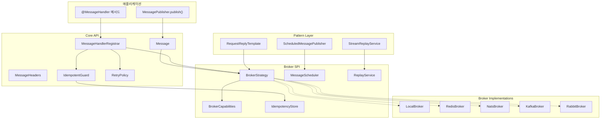
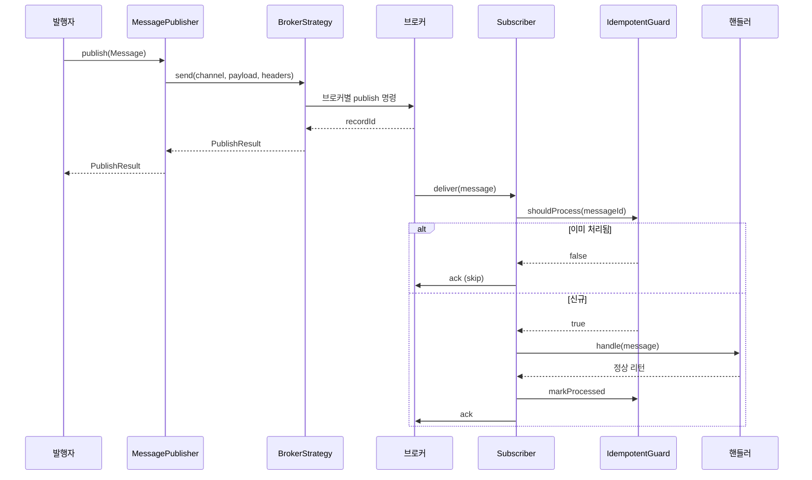

# SimpliX Messaging Module Overview

## Overview

SimpliX Messaging 모듈은 메시지 브로커 추상화(`BrokerStrategy`)를 통해 NATS JetStream, Redis Streams, Kafka, RabbitMQ, Local 메모리 브로커를 단일 API로 통합합니다. 멱등성 보장, 재시도/Dead Letter, 지연 발행, 리플레이, Request/Reply 등 운영 패턴이 내장되어 있어 인프라 교체 시 애플리케이션 코드 변경을 최소화합니다.

## Features

- **5종 브로커 통합 SPI**: Local, Redis Streams, NATS JetStream, Kafka, RabbitMQ
- **선언적 컨슈머**: `@MessageHandler`로 핸들러 등록, 자동 ack / 수동 ack 모두 지원
- **멱등성 보장**: 메시지 ID 기반 dedup (Caffeine, Redis SET, JetStream Nats-Msg-Id)
- **에러 정책**: 지수 백오프 재시도 → DLQ 자동 라우팅
- **지연 발행**: KV/타이머 기반 시점 지정 발행
- **리플레이**: ID 또는 시간 범위로 과거 메시지 재처리
- **Request/Reply**: 동기 응답 패턴 템플릿
- **Wire Protobuf 자동 직렬화**: `Message.ofProtobuf()` 팩토리
- **Actuator 통합**: Health Indicator, Micrometer 메트릭

---

## Architecture



---

## Core Components

### Message\<T\>

불변 메시지 봉투(envelope)입니다. 페이로드 타입은 `byte[]`(공통), POJO(JSON 자동 직렬화) 또는 Wire Protobuf 객체를 지원합니다.

```java
public final class Message<T> {
    String getMessageId();
    String getChannel();
    T getPayload();
    MessageHeaders getHeaders();
    Instant getTimestamp();

    // Factories
    static Message<byte[]> ofBytes(String channel, byte[] payload);
    static <M> Message<byte[]> ofProtobuf(String channel, M wireMessage);
}
```

**핵심 책임:**
- Builder 또는 팩토리로만 생성 (불변성)
- 미지정 시 `messageId`는 UUID v4로 자동 생성
- `MessageHeaders.CONTENT_TYPE`을 자동 추론(JSON / Protobuf / octet-stream)

### MessagePublisher

```java
public interface MessagePublisher {
    PublishResult publish(Message<?> message);
    CompletableFuture<PublishResult> publishAsync(Message<?> message);
    boolean isAvailable();
}
```

기본 구현체는 `DefaultMessagePublisher`이며, 활성 `BrokerStrategy`에 위임합니다.

### BrokerStrategy

브로커별 동작을 캡슐화하는 SPI입니다. 모든 구현은 thread-safe해야 합니다.

```java
public interface BrokerStrategy {
    PublishResult send(String channel, byte[] payload, MessageHeaders headers);
    Subscription subscribe(SubscribeRequest request);
    void ensureConsumerGroup(String channel, String groupName);
    void acknowledge(String channel, String groupName, String messageId);
    BrokerCapabilities capabilities();
    void initialize();
    void shutdown();
    boolean isReady();
    String name();
}
```

### BrokerCapabilities

런타임에 브로커 기능을 조회할 수 있는 record입니다.

```java
record BrokerCapabilities(
    boolean consumerGroups,
    boolean replay,
    boolean ordering,
    boolean deadLetter,
    boolean scheduledDelivery,
    boolean nativeDedup,
    boolean nativeRequestReply
) {}
```

### @MessageHandler

핸들러 메서드를 채널에 바인딩하는 어노테이션입니다.

```java
@MessageHandler(
    channel = "order-events",
    group = "order-service",
    concurrency = 1,
    autoAck = true,
    idempotent = false
)
public void handle(Message<OrderProto> message);
```

| 속성 | 기본값 | 설명 |
|------|--------|------|
| `channel` | (필수) | 채널/스트림/토픽 이름. `${...}` 플레이스홀더 지원 |
| `group` | `""` | 컨슈머 그룹 이름 |
| `concurrency` | `1` | 동시 컨슈머 수 |
| `autoAck` | `true` | 정상 리턴 시 자동 ACK |
| `idempotent` | `false` | 메시지 ID 기반 dedup 적용 |

핸들러 시그니처:
- `void handle(Message<T> message)` - 자동 ACK
- `void handle(Message<T> message, MessageAcknowledgment ack)` - 수동 ACK

### IdempotentGuard

메시지 ID 기반 중복 처리 방지. `idempotent=true`인 핸들러에 적용됩니다.

```java
public class IdempotentGuard {
    boolean shouldProcess(Message<?> message);   // false면 건너뜀
    void markProcessed(Message<?> message);
}
```

내부적으로 `IdempotencyStore`를 사용합니다.

### RetryPolicy

지수 백오프 재시도 정책입니다.

```java
public class RetryPolicy {
    Duration initialBackoff;     // 1s (default)
    Duration maxBackoff;          // 30s (default, 하드코딩)
    int maxAttempts;              // simplix.messaging.error.max-retries + 1
    double multiplier;            // 2.0
    double jitterFactor;          // 0.1
}
```

---

## Auto-Configuration

### MessagingAutoConfiguration

브로커 종류에 따라 다른 구성을 import합니다.

| Broker | Configuration |
|--------|---------------|
| `local` | `LocalMessagingConfiguration` |
| `redis` | `RedisMessagingConfiguration` |
| `nats` | `NatsMessagingConfiguration` |
| `kafka` | `KafkaMessagingConfiguration` |
| `rabbit` | `RabbitMessagingConfiguration` |

**공통 등록 빈:**

| Bean | 조건 |
|------|------|
| `messagePublisher` | `BrokerStrategy` 빈 존재 시 |
| `messageHandlerRegistrar` | `@MessageHandler` 어노테이션 검색 |
| `idempotentGuard` | 항상 |
| `retryPolicy` | 항상 |
| `messagingHealthIndicator` | Actuator 클래스패스 |
| `messagingMetrics` | Micrometer 클래스패스 |

---

## Configuration Properties

### 전체 설정 구조

```yaml
simplix:
  messaging:
    broker: nats
    instance-id: pacs-studio-1
    subscriber-startup-delay: 0s

    publisher:
      auto-message-id: false

    channels:
      order-events:
        content-type: application/protobuf
        max-length: 100000
        duplicate-window: 5m
        deliver-policy: all

    idempotent:
      ttl: 24h

    error:
      max-retries: 3
      retry-backoff: 1s
      dead-letter:
        enabled: true

    redis:
      key-prefix: ""
      poll-timeout: 2s
      batch-size: 10
      claim-min-idle-time: 5m
      pending-check-interval: 30s
      payload-encoding: BASE64

    nats:
      servers: nats://localhost:4222
      stream-prefix: "simplix-"
      subject-prefix: "simplix."
      duplicate-window: 2m
      max-age: 7d
      auto-create-streams: true
      auto-update-streams: true
      deliver-policy: all
      retention: limits
      storage: file
      replicas: 1
      scheduler:
        enabled: true
        kv-bucket: simplix-scheduled
        poll-interval: 5s
        leader-lock-ttl: 30s
```

### Property Reference (요약)

전체 옵션 목록은 [Configuration Reference](ko/messaging/configuration.md)를 참고하세요.

| Property | Type | Default | Description |
|----------|------|---------|-------------|
| `simplix.messaging.broker` | enum | `local` | 활성 브로커 |
| `simplix.messaging.instance-id` | String | hostname | 인스턴스 식별자 |
| `simplix.messaging.idempotent.ttl` | Duration | `24h` | 처리 ID 보관 기간 |
| `simplix.messaging.error.max-retries` | int | `3` | 재시도 최대 횟수 |
| `simplix.messaging.error.retry-backoff` | Duration | `1s` | 초기 백오프 |

---

## Broker Comparison

| 기능 | Local | Redis Streams | NATS JetStream | Kafka | RabbitMQ |
|------|-------|---------------|----------------|-------|----------|
| 외부 의존성 | 없음 | Redis 6+ | NATS 2.10+ | Kafka 3.x | RabbitMQ 3.x |
| Consumer Groups | ✔ | ✔ (XGROUP) | ✔ (Durable Pull) | ✔ | ✔ |
| Replay | ✔ | ✔ (XRANGE) | ✔ (Stream API) | ✔ (offset) | ✖ |
| Ordering | ✔ | ✔ | ✔ | ✔ (파티션 내) | ✔ |
| Dead Letter | ✖ (직접) | ✔ (직접) | ✔ (직접) | ✔ | ✔ (네이티브) |
| 지연 발행 | ✔ (메모리 타이머) | ✔ (KV polling) | ✔ (KV polling) | ✖ | ✔ |
| 네이티브 중복 제거 | ✖ | ✖ | ✔ (Nats-Msg-Id) | ✖ | ✖ |
| 네이티브 Request/Reply | ✖ | ✖ | ✔ | ✖ | ✔ |

### When to Use

**Local 권장:**
- 단위 테스트, 통합 테스트
- 단일 프로세스 데모

**Redis Streams 권장:**
- 이미 Redis를 운영 중이고 별도 인프라를 더하고 싶지 않을 때
- 경량 큐잉 + replay 필요

**NATS JetStream 권장:**
- 기본 권장 (네이티브 dedup, ack-wait, leader election)
- KV 기반 스케줄러 필요

**Kafka 권장:**
- 대용량 스트림 처리, 장기 보존
- 파티션 기반 강한 정렬 보장 필요

**RabbitMQ 권장:**
- 기존 RabbitMQ 인프라 보유
- 네이티브 DLQ / Request/Reply 필요

---

## Sequence Diagram (Publish + Subscribe)



---

## Patterns

### Request/Reply

```java
@Service
@RequiredArgsConstructor
public class PriceLookupService {

    private final RequestReplyTemplate template;

    public PriceProto lookup(String symbol) {
        return template.requestReply(
            "price-requests",
            PriceRequestProto.newBuilder().symbol(symbol).build(),
            PriceProto.class,
            Duration.ofSeconds(5)
        );
    }
}
```

### Scheduled Publishing

```java
@Service
@RequiredArgsConstructor
public class ReminderService {

    private final ScheduledMessagePublisher scheduler;

    public void scheduleReminder(ReminderProto reminder, Duration delay) {
        scheduler.publishDelayed(
            Message.ofProtobuf("reminders", reminder),
            delay
        );
    }
}
```

### Replay

```java
@Service
@RequiredArgsConstructor
public class AuditReplayService {

    private final StreamReplayService replayService;

    public void rebuildProjection() {
        replayService.replay(
            "audit-events",
            Instant.now().minus(Duration.ofDays(7)),
            Instant.now(),
            message -> projection.apply(message.getPayload())
        );
    }
}
```

---

## Monitoring

### Health Check

```bash
curl http://localhost:8080/actuator/health/messaging
```

```json
{
  "status": "UP",
  "details": {
    "broker": "nats",
    "ready": true,
    "capabilities": {
      "consumerGroups": true,
      "replay": true,
      "scheduledDelivery": true,
      "nativeDedup": true
    }
  }
}
```

### Metrics

| Metric | Type | Description |
|--------|------|-------------|
| `simplix.messaging.publish.success` | Counter | 발행 성공 |
| `simplix.messaging.publish.failure` | Counter | 발행 실패 |
| `simplix.messaging.publish.duration` | Timer | 발행 소요 시간 |
| `simplix.messaging.consume.success` | Counter | 처리 성공 |
| `simplix.messaging.consume.failure` | Counter | 처리 실패 |
| `simplix.messaging.consume.duration` | Timer | 핸들러 처리 시간 |
| `simplix.messaging.consume.retried` | Counter | 재시도 횟수 |
| `simplix.messaging.dlq.count` | Counter | DLQ 라우팅 |
| `simplix.messaging.idempotent.skipped` | Counter | 중복으로 건너뛴 메시지 |

### Logging

```yaml
logging:
  level:
    dev.simplecore.simplix.messaging: DEBUG
```

| 레벨 | 출력 |
|------|------|
| TRACE | 모든 publish/consume 페이로드 (운영 비권장) |
| DEBUG | 메시지 ID, ack 동작, 재시도 백오프 |
| INFO | 브로커 초기화, 컨슈머 그룹 생성, 구독 시작 |
| WARN | 재시도, 디코딩 실패, 컨슈머 일시 단절 |
| ERROR | DLQ 라우팅, 브로커 연결 실패 |

---

## Environment Variables

| Variable | Property | Description |
|----------|----------|-------------|
| `MESSAGING_BROKER` | `simplix.messaging.broker` | 활성 브로커 |
| `NATS_URL` | `simplix.messaging.nats.servers` | NATS 서버 URL |
| `REDIS_HOST` | (Spring Data Redis) | Redis 호스트 |
| `MESSAGING_INSTANCE_ID` | `simplix.messaging.instance-id` | 인스턴스 ID |

---

## Related Documents

- [README](ko/README.md) - 모듈 소개 및 빠른 시작
- [Configuration Reference](ko/messaging/configuration.md) - 설정 옵션 전체 목록
- [Broker Guide](ko/messaging/broker-guide.md) - 브로커별 상세 사용법
