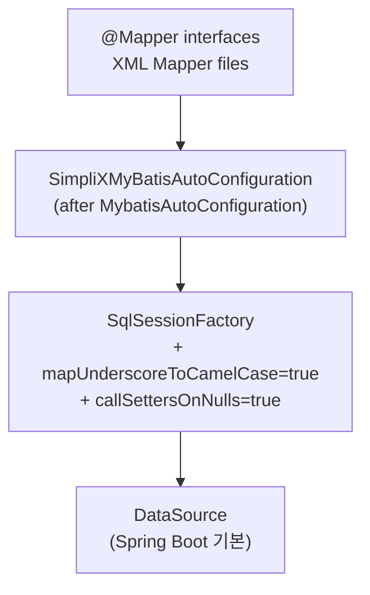

# SimpliX MyBatis Module Overview

Spring Boot 기본 MyBatis 자동 구성 위에 SimpliX 표준 설정을 덮어씌우는 가벼운 통합 모듈입니다.

## Architecture



---

## Core Components

### SimpliXMyBatisAutoConfiguration

Spring Boot 기본 `MybatisAutoConfiguration` **이후에** 실행되어 SimpliX 표준 설정을 덮어씁니다.

```java
@AutoConfiguration(after = MybatisAutoConfiguration.class)
@ConditionalOnClass({SqlSessionTemplate.class, SqlSessionFactoryBean.class})
@ConditionalOnProperty(name = "mybatis.enabled", havingValue = "true", matchIfMissing = true)
@MapperScan(basePackages = "${mybatis.mapper-locations:dev.simplecore.simplix.**.mapper}")
@EnableTransactionManagement
public class SimpliXMyBatisAutoConfiguration { ... }
```

**자동 등록 빈:**

| Bean | 설명 |
|------|------|
| `SqlSessionFactory` | MyBatis SQL 세션 팩토리 |
| `SqlSessionTemplate` | Thread-safe SQL 세션 템플릿 |

### Default Configuration

다음 두 옵션이 자동 적용됩니다.

| 설정 | 효과 |
|------|------|
| `mapUnderscoreToCamelCase = true` | DB의 snake_case 컬럼을 Java camelCase 필드로 자동 매핑 (`user_name` → `userName`) |
| `callSettersOnNulls = true` | NULL 값에도 setter 호출 (Map 반환 시 NULL 키 포함) |

---

## Configuration Properties

```yaml
mybatis:
  enabled: true                                  # 모듈 활성화
  mapper-locations: classpath*:mapper/**/*.xml   # Mapper XML 위치 패턴
  type-aliases-package: com.example.domain      # Type Aliases 스캔 패키지 (선택)
  config-location: classpath:mybatis-config.xml # MyBatis 설정 파일 (선택)
```

| Property | Type | Default | Description |
|----------|------|---------|-------------|
| `mybatis.enabled` | boolean | `true` | 모듈 활성화 |
| `mybatis.mapper-locations` | String | `classpath*:mapper/**/*.xml` | Mapper XML 위치 |
| `mybatis.type-aliases-package` | String | (none) | Type Aliases 스캔 패키지 |
| `mybatis.config-location` | String | (none) | MyBatis 설정 파일 경로 |

---

## Usage

### Mapper 인터페이스

```java
@Mapper
public interface UserMapper {
    List<User> findAll();
    User findById(@Param("id") Long id);
    void insert(User user);
}
```

### Mapper XML (`src/main/resources/mapper/UserMapper.xml`)

```xml
<mapper namespace="com.example.mapper.UserMapper">
    <select id="findAll" resultType="User">
        SELECT id, user_name, email, created_at FROM users
    </select>
</mapper>
```

`mapUnderscoreToCamelCase`로 `user_name`이 `User.userName`에 자동 매핑됩니다.

### Service

```java
@Service
@RequiredArgsConstructor
public class UserService {
    private final UserMapper userMapper;

    @Transactional
    public void createUser(User user) {
        userMapper.insert(user);
    }
}
```

### Type Aliases (선택)

```yaml
mybatis:
  type-aliases-package: com.example.domain
```

```xml
<!-- 설정 후: 전체 패키지 경로 대신 클래스명만 사용 가능 -->
<select id="findById" resultType="User">
```

### 외부 MyBatis 설정 파일 (선택)

```yaml
mybatis:
  config-location: classpath:mybatis-config.xml
```

`<settings>`, `<typeHandlers>`, `<plugins>` 등 고급 옵션이 필요할 때 사용합니다.

---

## Troubleshooting

| 증상 | 원인 / 해결 |
|------|------------|
| `Invalid bound statement (not found)` | XML namespace가 Mapper 인터페이스 경로와 일치하는지 확인. `mybatis.mapper-locations` 위치 확인 |
| 데이터가 null로 반환 | `mapUnderscoreToCamelCase`는 기본 활성화. DB 컬럼이 snake_case인지, Java 필드가 camelCase인지 확인 |
| `Could not resolve type alias 'User'` | `mybatis.type-aliases-package`에 도메인 패키지 경로 지정 |

---

## Related Documents

- [README](ko/README.md) - 모듈 소개 및 빠른 시작
