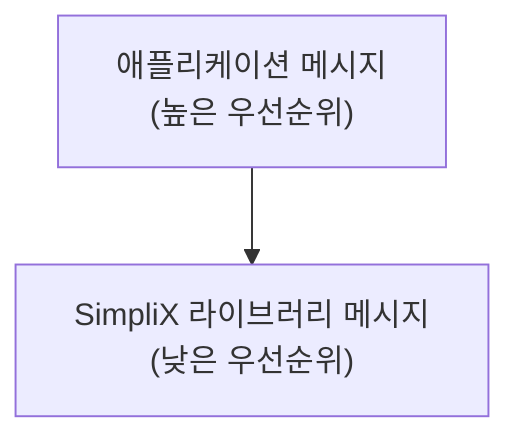

# Configuration Guide

## SimpliX Configuration Properties

SimpliX는 `simplix` 접두사 하에 모든 설정을 구성합니다.

### Core Properties

```yaml
simplix:
  core:
    enabled: true  # SimpliX 전체 활성화 (기본값: true)
```

`simplix.core.enabled=false`로 설정하면 다음 구성요소가 비활성화됩니다:
- SimpliXDateTimeAutoConfiguration
- SimpliXJpaAutoConfiguration
- SimpliXModelMapperAutoConfiguration

### DateTime Properties

```yaml
simplix:
  date-time:
    # 애플리케이션 기본 타임존
    # 우선순위: 이 설정 > spring.jackson.time-zone > user.timezone > 시스템 기본
    default-timezone: Asia/Seoul

    # DB 저장시 UTC로 변환 (기본값: true)
    # true: OffsetDateTime 저장 전 UTC로 변환
    # false: 원래 타임존 유지
    use-utc-for-database: true

    # 타임존 없는 LocalDateTime 정규화 (기본값: true)
    # true: LocalDateTime을 애플리케이션 타임존으로 가정
    normalize-timezone: true
```

### MessageSource Properties

```yaml
simplix:
  message-source:
    enabled: true  # 메시지 소스 통합 활성화 (기본값: true)
```

SimpliX MessageSource는 라이브러리와 애플리케이션 메시지를 계층적으로 통합합니다:



Spring Boot 표준 메시지 설정과 통합:

```yaml
spring:
  messages:
    basename: messages,messages/validation,messages/errors
    encoding: UTF-8
    use-code-as-default-message: false
    fallback-to-system-locale: true
```

### I18n Translation Properties

```yaml
simplix:
  i18n:
    # 기본 로케일 코드 (기본값: en)
    default-locale: en

    # 지원하는 로케일 목록 (기본값: [en, ko, ja])
    # Fallback 순서로 사용됨
    supported-locales:
      - en
      - ko
      - ja
```

I18n 번역 시스템의 Fallback 순서:
1. 현재 로케일 정확 매치 (예: "ko_KR")
2. 언어 코드만 매치 (예: "ko")
3. 설정된 기본 로케일
4. 지원 로케일 목록 순서대로
5. Map에서 첫 번째 사용 가능한 번역
6. 원본 필드 값

### Exception Handler Properties

```yaml
simplix:
  exception-handler:
    enabled: true  # 전역 예외 핸들러 활성화 (기본값: true)
```

비활성화하면 커스텀 예외 핸들러를 직접 구현해야 합니다.

### Swagger Properties

```yaml
simplix:
  swagger:
    i18n-enabled: true  # Swagger 스키마 i18n 지원 (기본값: true)
    customizers:
      enum-extractor:
        enabled: true   # Enum 스키마 자동 추출 (기본값: true)
      nested-object-extractor:
        enabled: true   # 중첩 객체 스키마 추출 (기본값: true)
```

## Spring Boot Integration

SimpliX는 Spring Boot 표준 설정과 통합됩니다.

### Jackson Configuration

```yaml
spring:
  jackson:
    # 타임존 (simplix.date-time.default-timezone이 없을 때 사용)
    time-zone: Asia/Seoul

    # 날짜/시간 포맷
    date-format: yyyy-MM-dd HH:mm:ss

    # ISO 8601 직렬화
    serialization:
      write-dates-as-timestamps: false
```

### Thymeleaf Configuration

```yaml
spring:
  thymeleaf:
    enabled: true
    prefix: classpath:/templates/
    suffix: .html
    mode: HTML
    encoding: UTF-8
    cache: false  # 개발 환경에서는 false
    check-template: true
    check-template-location: true
```

### JPA/Hibernate Configuration

```yaml
spring:
  jpa:
    hibernate:
      ddl-auto: validate
    properties:
      hibernate:
        # 타임존 설정 (UTC 권장)
        jdbc.time_zone: UTC
```

### SpringDoc/OpenAPI Configuration

```yaml
springdoc:
  api-docs:
    enabled: true
    path: /v3/api-docs
  swagger-ui:
    enabled: true
    path: /swagger-ui.html
    operations-sorter: method
  show-actuator: false
  packages-to-scan: com.example.controller

# Scalar UI (현대적 API 문서 UI)
scalar:
  enabled: true
  url: /v3/api-docs
  path: /scalar
```

## Complete Configuration Example

```yaml
simplix:
  core:
    enabled: true
  date-time:
    default-timezone: Asia/Seoul
    use-utc-for-database: true
    normalize-timezone: true
  message-source:
    enabled: true
  i18n:
    default-locale: en
    supported-locales:
      - en
      - ko
      - ja
  exception-handler:
    enabled: true
  swagger:
    i18n-enabled: true
    customizers:
      enum-extractor:
        enabled: true
      nested-object-extractor:
        enabled: true

spring:
  # Jackson
  jackson:
    time-zone: Asia/Seoul
    serialization:
      write-dates-as-timestamps: false

  # Messages
  messages:
    basename: messages,messages/validation,messages/errors
    encoding: UTF-8

  # Thymeleaf
  thymeleaf:
    prefix: classpath:/templates/
    suffix: .html
    cache: false

  # JPA
  jpa:
    hibernate:
      ddl-auto: validate
    properties:
      hibernate:
        jdbc.time_zone: UTC

# OpenAPI
springdoc:
  api-docs:
    enabled: true
    path: /v3/api-docs
  swagger-ui:
    enabled: true
    path: /swagger-ui.html

scalar:
  enabled: true
  path: /scalar
```

## Profile-based Configuration

### Development Profile

```yaml
# application-dev.yml
simplix:
  date-time:
    default-timezone: Asia/Seoul

spring:
  thymeleaf:
    cache: false

logging:
  level:
    dev.simplecore.simplix: DEBUG
```

### Production Profile

```yaml
# application-prod.yml
simplix:
  date-time:
    default-timezone: UTC
    use-utc-for-database: true

spring:
  thymeleaf:
    cache: true

logging:
  level:
    dev.simplecore.simplix: INFO
```

## Disabling Auto-Configuration

특정 Auto-Configuration을 비활성화하려면:

```yaml
spring:
  autoconfigure:
    exclude:
      - dev.simplecore.simplix.springboot.autoconfigure.SimpliXSwaggerAutoConfiguration
      - dev.simplecore.simplix.springboot.autoconfigure.SimpliXThymeleafAutoConfiguration
```

또는 각 설정의 enabled 속성 사용:

```yaml
simplix:
  message-source:
    enabled: false
  exception-handler:
    enabled: false
```