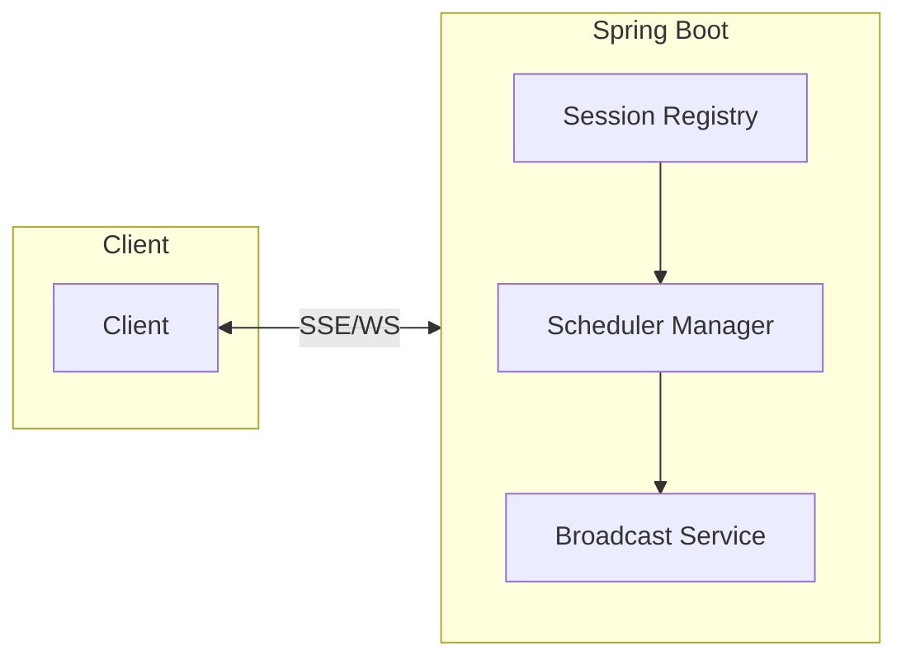
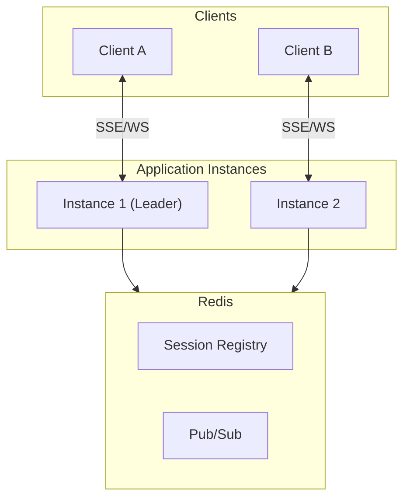
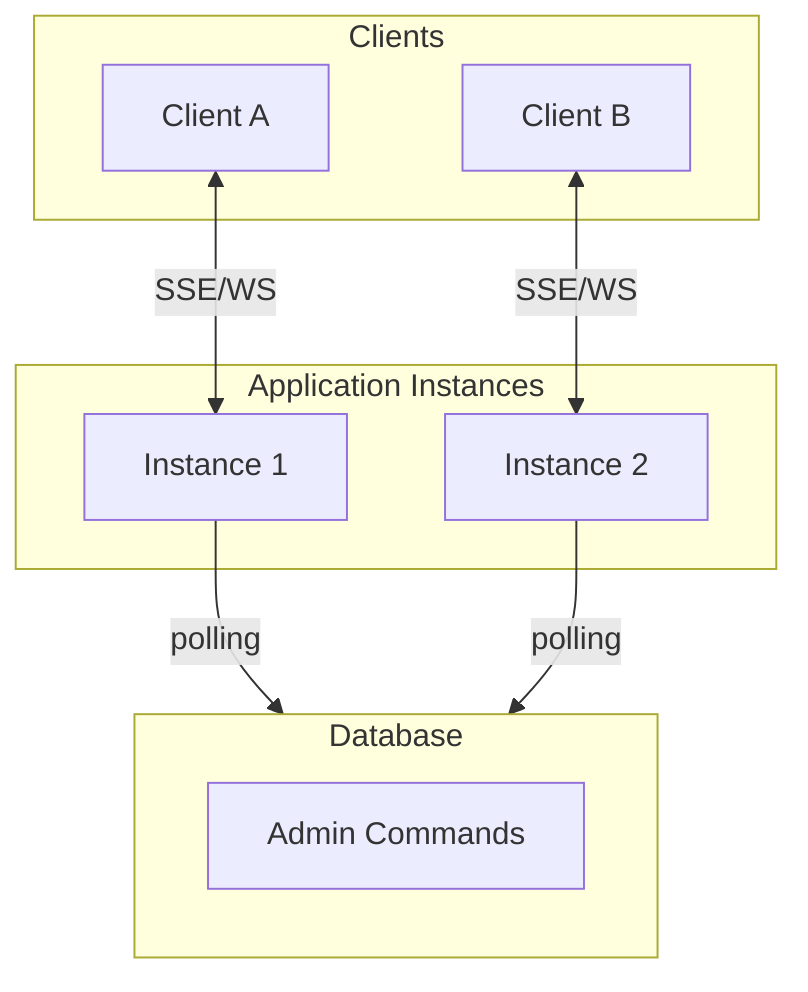

# SimpliX Stream 모듈 개요

SSE (Server-Sent Events) 및 WebSocket 기반 실시간 구독 시스템 모듈입니다.

## 주요 기능

| 기능 | 설명 |
|------|------|
| SSE/WebSocket 지원 | 다중 전송 프로토콜 |
| 단일 채널 다중 구독 | 하나의 연결로 여러 리소스 구독 |
| 자동 구독 전환 | 페이지 이동 시 자동 구독 변경 |
| 스케줄러 공유 | 동일 리소스 구독자 간 스케줄러 재사용 |
| 이벤트 기반 푸시 | simplix-event 연동으로 즉시 데이터 전송 |
| 분산 모드 | Redis Pub/Sub 기반 다중 인스턴스 지원 |
| 분산 Admin | DB 기반 클러스터 전체 관리 (Redis 없이 가능) |
| 권한 관리 | 리소스별 접근 권한 제어 |
| 서버 측 Interval 제어 | 폴링 주기는 서버에서만 설정 (DoS 방지) |
| 모니터링 | Health Check, Micrometer 메트릭 |

## 운영 모드 비교

| 구분 | 단독 모드 | 분산 + Redis | 분산 (Redis 없음) |
|------|----------|--------------|-------------------|
| 인스턴스 | 1대 | N대 | N대 |
| 세션 저장소 | 메모리 | Redis | 메모리 (인스턴스별) |
| 메시지 브로드캐스트 | 직접 전송 | Redis Pub/Sub | 직접 전송 |
| 스케줄러 | 공유 | 리더 선출 후 실행 | 인스턴스별 독립 실행 |
| Admin 제어 | 즉시 실행 | DB 폴링 (선택) | DB 폴링 |
| 적합 환경 | 개발/소규모 | 대규모 운영 | Redis 없는 분산 환경 |

## 아키텍처 다이어그램

### 단독 모드 (Local Mode)

### 분산 모드 (Redis)

### 분산 모드 (DB Admin)

## 튜토리얼 목차

### SSE 전송 방식

1. [SSE 단독 모드 튜토리얼](ko/stream/tutorial-sse-standalone.md)
2. [SSE 분산 모드 (Redis) 튜토리얼](ko/stream/tutorial-sse-distributed-redis.md)
3. [SSE 분산 모드 (DB Admin) 튜토리얼](ko/stream/tutorial-sse-distributed-db.md)

### WebSocket 전송 방식

4. [WebSocket 단독 모드 튜토리얼](ko/stream/tutorial-websocket-standalone.md)
5. [WebSocket 분산 모드 튜토리얼](ko/stream/tutorial-websocket-distributed.md)

### 이벤트 기반 스트리밍

6. [이벤트 기반 스트리밍 튜토리얼](ko/stream/tutorial-event-source.md)

### 관리 및 모니터링

7. [Admin API 가이드](ko/stream/admin-api-guide.md)
8. [모니터링 및 메트릭 가이드](ko/stream/monitoring-guide.md)

### 클라이언트 통합

9. [JavaScript 클라이언트 가이드](ko/stream/client-javascript-guide.md)
10. [React 통합 가이드](ko/stream/client-framework-guide.md)

## 빠른 시작

가장 간단한 SSE 단독 모드부터 시작하려면 [SSE 단독 모드 튜토리얼](ko/stream/tutorial-sse-standalone.md)을 참조하세요.
