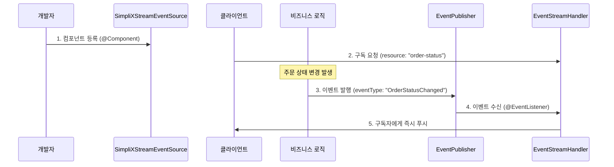
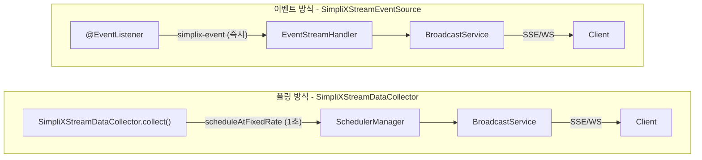
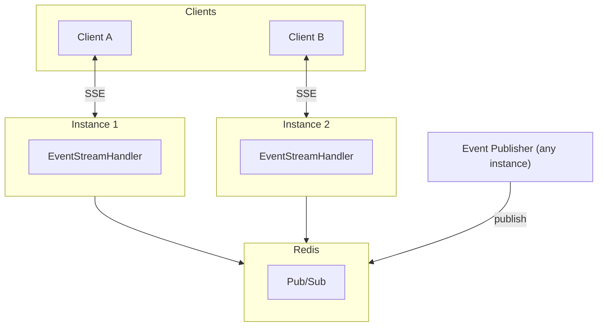

# 이벤트 기반 스트리밍 튜토리얼

simplix-event를 활용한 실시간 이벤트 푸시 구현 가이드입니다.

## 목차

1. [개요](#개요)
2. [폴링 vs 이벤트 비교](#폴링-vs-이벤트-비교)
3. [의존성 설정](#의존성-설정)
4. [SimpliXStreamEventSource 구현](#simplixstreameeventsource-구현)
5. [이벤트 발행](#이벤트-발행)
6. [클라이언트 연동](#클라이언트-연동)
7. [분산 환경](#분산-환경)

---

## 개요

SimpliX Stream은 두 가지 데이터 푸시 방식을 지원합니다:

| 방식 | 구현 인터페이스 | 특징 |
|------|----------------|------|
| 폴링 기반 | `SimpliXStreamDataCollector` | 주기적으로 데이터 수집 후 전송 |
| 이벤트 기반 | `SimpliXStreamEventSource` | 이벤트 발생 시 즉시 전송 |

이벤트 기반 방식은 데이터 변경이 발생할 때만 전송하므로:

- ✔ 더 낮은 지연시간 (ms 단위)
- ✔ 불필요한 폴링 없음 (리소스 효율성)
- ✔ 스케줄러 오버헤드 없음

### 동작 흐름



> ⚠ **중요**: 폴링 방식(SimpliXStreamDataCollector)과 달리, 이벤트 방식은 **비즈니스 로직에서 직접 이벤트를 발행**해야 데이터가 전송됩니다. 컴포넌트 등록과 클라이언트 구독만으로는 데이터를 받을 수 없습니다.

### 폴링 vs 이벤트 핵심 차이

| 구분 | SimpliXStreamDataCollector (폴링) | SimpliXStreamEventSource (이벤트) |
|------|---------------------|---------------------------|
| 데이터 전송 트리거 | 스케줄러가 자동 호출 | **개발자가 이벤트 발행** |
| 구현 필요 사항 | `collect()` 메서드 | `SimpliXStreamEventSource` + `EventPublisher.publish()` |

---

## 폴링 vs 이벤트 비교

### 아키텍처 비교



### 적합한 사용 케이스

| 케이스 | 권장 방식 | 이유 |
|--------|----------|------|
| 시스템 메트릭 (CPU, 메모리) | SimpliXStreamDataCollector | 항상 값이 존재, 주기적 수집 |
| 주가 변동 | SimpliXStreamEventSource | 변동 시에만 전송, 실시간성 중요 |
| 채팅 메시지 | SimpliXStreamEventSource | 메시지 발생 시 즉시 전송 |
| 알림/푸시 | SimpliXStreamEventSource | 지연 없이 전달 필요 |
| 대시보드 집계 데이터 | SimpliXStreamDataCollector | 주기적 집계, 변경 이벤트 없음 |

---

## 의존성 설정

### build.gradle

```gradle
dependencies {
    implementation 'dev.simplecore:simplix-stream'
    implementation 'dev.simplecore:simplix-event'  // 이벤트 기반 필수

    // Spring Boot 기본 의존성
    implementation 'org.springframework.boot:spring-boot-starter-web'
    implementation 'org.springframework.boot:spring-boot-starter-webflux'
}
```

### application.yml

```yaml
simplix:
  stream:
    enabled: true
    mode: local

    # 이벤트 기반 스트리밍 활성화
    event-source:
      enabled: true

    session:
      timeout: 5m
      heartbeat-interval: 30s

  # simplix-event 설정
  events:
    mode: local  # local, redis, kafka
```

---

## SimpliXStreamEventSource 구현

### 예제 1: 주문 상태 변경 이벤트

```java
@Component
public class OrderStatusEventSource implements SimpliXStreamEventSource {

    @Override
    public String getResource() {
        return "order-status";  // 클라이언트 구독 리소스명
    }

    @Override
    public String getEventType() {
        return "OrderStatusChanged";  // simplix-event 이벤트 타입
    }

    @Override
    public Map<String, Object> extractParams(Object payload) {
        // 이벤트 페이로드에서 구독 파라미터 추출
        OrderStatusChangedEvent event = (OrderStatusChangedEvent) payload;
        return Map.of("orderId", event.getOrderId());
    }

    @Override
    public Object extractData(Object payload) {
        // 클라이언트에 전송할 데이터 추출
        OrderStatusChangedEvent event = (OrderStatusChangedEvent) payload;
        return Map.of(
            "orderId", event.getOrderId(),
            "status", event.getNewStatus(),
            "previousStatus", event.getPreviousStatus(),
            "updatedAt", event.getUpdatedAt().toEpochMilli()
        );
    }
}
```

### 예제 2: 채팅 메시지 이벤트

```java
@Component
public class ChatMessageEventSource implements SimpliXStreamEventSource {

    @Override
    public String getResource() {
        return "chat-messages";
    }

    @Override
    public String getEventType() {
        return "ChatMessageSent";
    }

    @Override
    public Map<String, Object> extractParams(Object payload) {
        ChatMessageSentEvent event = (ChatMessageSentEvent) payload;
        return Map.of("roomId", event.getRoomId());
    }

    @Override
    public Object extractData(Object payload) {
        ChatMessageSentEvent event = (ChatMessageSentEvent) payload;
        return Map.of(
            "messageId", event.getMessageId(),
            "roomId", event.getRoomId(),
            "senderId", event.getSenderId(),
            "senderName", event.getSenderName(),
            "content", event.getContent(),
            "sentAt", event.getSentAt().toEpochMilli()
        );
    }

    @Override
    public boolean validateParams(Map<String, Object> params) {
        String roomId = (String) params.get("roomId");
        return roomId != null && !roomId.isBlank();
    }
}
```

### 예제 3: 주가 변동 이벤트 (외부 연동)

```java
@Component
public class StockPriceEventSource implements SimpliXStreamEventSource {

    @Override
    public String getResource() {
        return "stock-price";
    }

    @Override
    public String getEventType() {
        return "StockPriceChanged";
    }

    @Override
    public Map<String, Object> extractParams(Object payload) {
        @SuppressWarnings("unchecked")
        Map<String, Object> event = (Map<String, Object>) payload;
        return Map.of("symbol", event.get("symbol"));
    }

    @Override
    public Object extractData(Object payload) {
        @SuppressWarnings("unchecked")
        Map<String, Object> event = (Map<String, Object>) payload;
        return Map.of(
            "symbol", event.get("symbol"),
            "price", event.get("price"),
            "change", event.get("change"),
            "changePercent", event.get("changePercent"),
            "timestamp", Instant.now().toEpochMilli()
        );
    }

    @Override
    public String getRequiredPermission() {
        return "STOCK_VIEW";  // 권한이 필요한 경우
    }
}
```

---

## 이벤트 발행

### simplix-event를 통한 이벤트 발행

```java
@Service
@RequiredArgsConstructor
public class OrderService {

    private final EventPublisher eventPublisher;

    public void updateOrderStatus(String orderId, OrderStatus newStatus) {
        // 비즈니스 로직 수행
        Order order = orderRepository.findById(orderId);
        OrderStatus previousStatus = order.getStatus();
        order.setStatus(newStatus);
        orderRepository.save(order);

        // 이벤트 발행 -> SimpliXStreamEventSource가 수신 -> 구독자에게 브로드캐스트
        GenericEvent event = GenericEvent.builder()
            .eventType("OrderStatusChanged")
            .aggregateId(orderId)
            .payload(new OrderStatusChangedEvent(
                orderId, newStatus, previousStatus, Instant.now()
            ))
            .build();

        eventPublisher.publish(event);
    }
}
```

### 이벤트 페이로드 클래스

```java
@Data
@AllArgsConstructor
public class OrderStatusChangedEvent {
    private String orderId;
    private OrderStatus newStatus;
    private OrderStatus previousStatus;
    private Instant updatedAt;
}
```

### 외부 시스템 이벤트 연동

```java
@Component
@RequiredArgsConstructor
public class ExternalStockPriceListener {

    private final EventPublisher eventPublisher;

    // 외부 WebSocket/API에서 주가 변동 수신
    public void onStockPriceUpdate(String symbol, BigDecimal price, BigDecimal change) {
        GenericEvent event = GenericEvent.builder()
            .eventType("StockPriceChanged")
            .aggregateId(symbol)
            .payload(Map.of(
                "symbol", symbol,
                "price", price,
                "change", change,
                "changePercent", change.divide(price.subtract(change), 4, RoundingMode.HALF_UP)
            ))
            .build();

        eventPublisher.publish(event);
    }
}
```

---

## 클라이언트 연동

클라이언트는 폴링 방식과 동일하게 구독합니다. 서버에서 리소스 유형에 따라 자동으로 라우팅됩니다.

### JavaScript 클라이언트

```javascript
const client = new StreamClient();

await client.connect();

// 이벤트 기반 리소스 구독 (폴링과 동일한 API)
await client.updateSubscriptions([
    {
        resource: 'order-status',
        params: { orderId: 'ORDER-12345' }
    },
    {
        resource: 'chat-messages',
        params: { roomId: 'ROOM-001' }
    }
]);

// 데이터 리스너 등록
client.on('order-status', (data, meta) => {
    console.log(`Order ${data.orderId} status: ${data.status}`);
    updateOrderUI(data);
});

client.on('chat-messages', (data, meta) => {
    console.log(`New message from ${data.senderName}: ${data.content}`);
    appendMessage(data);
});
```

### React Hook

```tsx
function OrderTracker({ orderId }: { orderId: string }) {
    const { data, connected } = useStream({
        subscriptions: [
            { resource: 'order-status', params: { orderId } }
        ]
    });

    const orderStatus = data['order-status'];

    if (!connected) return <div>Connecting...</div>;

    return (
        <div className="order-tracker">
            <h3>Order: {orderId}</h3>
            {orderStatus && (
                <>
                    <p>Status: {orderStatus.status}</p>
                    <p>Updated: {new Date(orderStatus.updatedAt).toLocaleString()}</p>
                </>
            )}
        </div>
    );
}
```

---

## 분산 환경

### Redis 분산 모드

simplix-event가 Redis 모드로 설정되면, 이벤트가 모든 인스턴스에 전파됩니다.

```yaml
simplix:
  stream:
    mode: distributed
    event-source:
      enabled: true

  events:
    mode: redis

spring:
  data:
    redis:
      host: ${REDIS_HOST:localhost}
      port: ${REDIS_PORT:6379}
```

### 아키텍처



이벤트 발행 시:
1. Event Publisher가 이벤트를 Redis Pub/Sub으로 발행
2. 모든 인스턴스가 이벤트 수신
3. 각 인스턴스의 EventStreamHandler가 로컬 구독자에게 브로드캐스트

---

## 혼합 사용

같은 애플리케이션에서 폴링과 이벤트 방식을 함께 사용할 수 있습니다.

```java
// 폴링 방식 - 시스템 메트릭
@Component
public class SystemMetricsCollector implements SimpliXStreamDataCollector {
    @Override
    public String getResource() {
        return "system-metrics";
    }
    // ...
}

// 이벤트 방식 - 주문 상태
@Component
public class OrderStatusEventSource implements SimpliXStreamEventSource {
    @Override
    public String getResource() {
        return "order-status";
    }
    // ...
}
```

클라이언트는 두 리소스를 동일한 방식으로 구독합니다:

```javascript
await client.updateSubscriptions([
    { resource: 'system-metrics', params: {} },      // 폴링 (1초마다)
    { resource: 'order-status', params: { orderId } } // 이벤트 (즉시)
]);
```

---

## 다음 단계

- [SSE 단독 모드 튜토리얼](ko/stream/tutorial-sse-standalone.md) - 폴링 기반 구현
- [Admin API 가이드](ko/stream/admin-api-guide.md) - 세션/스케줄러 관리
- [모니터링 가이드](ko/stream/monitoring-guide.md) - 메트릭 및 헬스 체크
