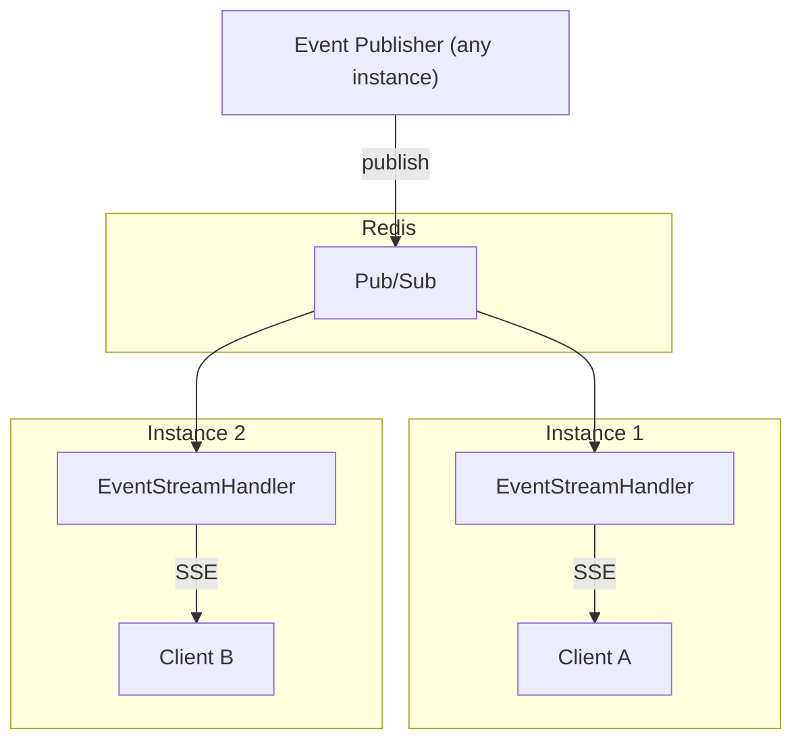

# SSE 분산 모드 (Redis) 튜토리얼

다중 인스턴스 환경에서 Redis를 사용한 SSE 분산 스트리밍 구현 가이드입니다.

## 목차

1. [아키텍처 개요](#아키텍처-개요)
2. [사전 요구사항](#사전-요구사항)
3. [서버 설정](#서버-설정)
4. [분산 구성요소](#분산-구성요소)
5. [리더 선출](#리더-선출)
6. [SimpliXStreamDataCollector 구현](#datacollector-구현)
7. [클라이언트 구현](#클라이언트-구현)
8. [운영 가이드](#운영-가이드)

---

## 아키텍처 개요

분산 모드에서 세션 관리는 **DB 기반**이며, Redis는 **리더 선출**과 **메시지 브로드캐스트**를 담당합니다.

```
+-------------+         +------------------+
|   Client A  | <-----> |   Instance 1     |
+-------------+         |  (Scheduler      |
                        |   Leader)        |
+-------------+         +--------+---------+
|   Client B  | <-----> |   Instance 2     |
+-------------+         +--------+---------+
                                 |
                +----------------+----------------+
                |                                 |
       +--------v---------+            +----------v----------+
       |    Database      |            |       Redis         |
       |  +------------+  |            |  +---------------+  |
       |  | Session    |  |            |  | Pub/Sub       |  |
       |  | Registry   |  |            |  | (Broadcast)   |  |
       |  +------------+  |            |  +---------------+  |
       |  +------------+  |            |  +---------------+  |
       |  | Subscription|  |            |  | Leader        |  |
       |  | Registry   |  |            |  | Election      |  |
       |  +------------+  |            |  +---------------+  |
       |  +------------+  |            +---------------------+
       |  | Server     |  |
       |  | Instances  |  |
       |  +------------+  |
       +------------------+
```

| 구성요소 | 저장소 | 역할 |
|----------|--------|------|
| Session Registry | DB | 모든 인스턴스의 세션 정보를 공유 저장 |
| Subscription Registry | DB | 구독 정보 영속화 및 공유 |
| Server Instances | DB | 서버 인스턴스 상태 및 하트비트 관리 |
| Pub/Sub | Redis | 데이터 메시지를 모든 인스턴스에 브로드캐스트 |
| Leader Election | Redis | 각 구독에 대해 스케줄러 실행 인스턴스를 결정 |

> ℹ Redis가 없는 분산 모드도 가능합니다. 이 경우 각 서버가 독립적으로 스케줄러를 실행하며, 자기 세션에만 데이터를 전송합니다.

---

## 사전 요구사항

- Java 17+
- Spring Boot 3.5+
- Database (H2, MySQL, PostgreSQL 등) - 세션/구독 저장
- Redis 6.0+ (Cluster 또는 Standalone) - 리더 선출 및 브로드캐스트
- Gradle 또는 Maven

---

## 서버 설정

### 1. 의존성 추가

**build.gradle:**

```gradle
dependencies {
    implementation 'dev.simplecore:simplix-stream'

    // Spring Boot 기본 의존성
    implementation 'org.springframework.boot:spring-boot-starter-web'
    implementation 'org.springframework.boot:spring-boot-starter-webflux'
    implementation 'org.springframework.boot:spring-boot-starter-security'

    // DB 의존성 (세션/구독 영속화)
    implementation 'org.springframework.boot:spring-boot-starter-data-jpa'
    runtimeOnly 'org.postgresql:postgresql'  // 또는 다른 DB 드라이버

    // Redis 의존성 (리더 선출 + 브로드캐스트)
    implementation 'org.springframework.boot:spring-boot-starter-data-redis'
}
```

### 2. 애플리케이션 설정

**application.yml:**

```yaml
simplix:
  stream:
    enabled: true
    mode: distributed  # 분산 모드 활성화

    session:
      timeout: 5m
      heartbeat-interval: 30s
      grace-period: 30s
      max-per-user: 5

    scheduler:
      thread-pool-size: 10
      default-interval: 1000ms
      min-interval: 100ms
      max-interval: 60000ms
      max-consecutive-errors: 5

    subscription:
      max-per-session: 20
      partial-success: true

    # 서버 인스턴스 설정 (DB 기반)
    server:
      instance-id: ${HOSTNAME:instance-1}  # 환경변수 또는 명시적 설정
      heartbeat-interval: 30s              # 서버 하트비트 주기
      dead-threshold: 2m                   # 서버 장애 판단 기준

    # 분산 모드 설정
    distributed:
      redis-enabled: true  # Redis 리더선출/브로드캐스트 활성화

      leader-election:
        ttl: 30s              # 리더십 TTL
        renew-interval: 10s   # 리더십 갱신 주기
        retry-interval: 5s    # 리더 선출 재시도 주기

      pubsub:
        channel-prefix: "stream:data:"  # Redis Pub/Sub 채널 프리픽스

# 데이터베이스 설정
spring:
  datasource:
    url: jdbc:postgresql://localhost:5432/stream_db
    username: ${DB_USERNAME}
    password: ${DB_PASSWORD}
  jpa:
    hibernate:
      ddl-auto: update  # 또는 validate (운영 환경)

  # Redis 설정
  data:
    redis:
      host: localhost
      port: 6379
      # 클러스터 모드
      # cluster:
      #   nodes:
      #     - redis-node1:6379
      #     - redis-node2:6379
      #     - redis-node3:6379
      password: ${REDIS_PASSWORD:}
      timeout: 5000
      lettuce:
        pool:
          max-active: 20
          max-idle: 10
          min-idle: 5
```

### 3. Security 설정

```java
@Configuration
@EnableWebSecurity
public class SecurityConfig {

    @Bean
    public SecurityFilterChain filterChain(HttpSecurity http) throws Exception {
        http
            .csrf(csrf -> csrf.disable())
            .authorizeHttpRequests(auth -> auth
                .requestMatchers("/api/stream/**").authenticated()
                .anyRequest().authenticated()
            )
            .httpBasic(Customizer.withDefaults());
        return http.build();
    }
}
```

---

## 분산 구성요소

### DbSessionRegistry (세션 관리)

모든 세션 정보를 데이터베이스에 저장하여 인스턴스 간 공유 및 크로스서버 재연결을 지원합니다.

**데이터베이스 테이블:**

```sql
-- 세션 테이블
stream_sessions (
  id VARCHAR(36) PRIMARY KEY,
  user_id VARCHAR(255),
  transport_type VARCHAR(20),
  state VARCHAR(20),
  instance_id VARCHAR(64),
  connected_at TIMESTAMP,
  last_active_at TIMESTAMP
)

-- 구독 테이블
stream_subscriptions (
  id BIGINT PRIMARY KEY,
  session_id VARCHAR(36),
  subscription_key VARCHAR(255),
  resource VARCHAR(100),
  active BOOLEAN
)

-- 서버 인스턴스 테이블
stream_server_instances (
  instance_id VARCHAR(64) PRIMARY KEY,
  hostname VARCHAR(255),
  status VARCHAR(20),
  last_heartbeat_at TIMESTAMP
)
```

**주요 기능:**
- 크로스서버 세션 복원: 클라이언트가 다른 서버로 재연결 시 세션/구독 복원
- 고아 세션 정리: 서버 장애 감지 시 해당 서버의 세션 자동 정리
- 전역 통계: 모든 서버의 세션/구독 통계 조회

### RedisBroadcaster (메시지 브로드캐스트)

Redis Pub/Sub을 통해 메시지를 모든 인스턴스에 브로드캐스트합니다.

**채널 구조:**

```
stream:data:{subscriptionKey}  -> 브로드캐스트 메시지
stream:data:direct:{sessionId} -> 특정 세션 직접 메시지
```

**메시지 흐름:**

```
1. Scheduler (리더 인스턴스)
   |
   v
2. SimpliXStreamDataCollector.collect()
   |
   v
3. RedisBroadcaster.broadcast()
   |
   v
4. Redis Pub/Sub channel
   |
   +---> Instance 1: 로컬 세션에 전달
   +---> Instance 2: 로컬 세션에 전달
   +---> Instance N: 로컬 세션에 전달
```

---

## 리더 선출

동일한 리소스를 구독하는 여러 인스턴스가 있을 때, 하나의 인스턴스만 스케줄러를 실행합니다.

### 리더 선출 원리

```
1. Instance 1: SETNX stream:leader:stock-price:AAPL → SUCCESS (리더 획득)
2. Instance 2: SETNX stream:leader:stock-price:AAPL → FAIL (대기)
3. Instance 3: SETNX stream:leader:stock-price:AAPL → FAIL (대기)
```

### 리더십 갱신

리더는 주기적으로 리더십을 갱신합니다:

```
리더: EXPIRE stream:leader:stock-price:AAPL 30s (TTL 갱신)
```

리더가 다운되면:
```
1. Redis TTL 만료 (30초 후)
2. 다른 인스턴스가 리더 선출 시도
3. 새 리더가 스케줄러 시작
```

### 리더 변경 시나리오

```
시간 T+0:  Instance 1이 리더
시간 T+15: Instance 1이 리더십 갱신 (TTL 30초로 리셋)
시간 T+30: Instance 1이 리더십 갱신
시간 T+35: Instance 1 다운!
시간 T+60: TTL 만료
시간 T+65: Instance 2가 새 리더 획득, 스케줄러 시작
```

---

## SimpliXStreamDataCollector 구현

분산 모드에서도 SimpliXStreamDataCollector 구현은 동일합니다. 리더 인스턴스에서만 실행됩니다.

### 예제: 실시간 주가 수집기

```java
@Component
public class StockPriceCollector implements SimpliXStreamDataCollector {

    private final StockApiClient stockApiClient;

    public StockPriceCollector(StockApiClient stockApiClient) {
        this.stockApiClient = stockApiClient;
    }

    @Override
    public String getResource() {
        return "stock-price";
    }

    @Override
    public Object collect(Map<String, Object> params) {
        String symbol = (String) params.get("symbol");

        // 외부 API에서 주가 데이터 조회
        StockQuote quote = stockApiClient.getQuote(symbol);

        return Map.of(
            "symbol", symbol,
            "price", quote.getPrice(),
            "change", quote.getChange(),
            "changePercent", quote.getChangePercent(),
            "volume", quote.getVolume(),
            "timestamp", Instant.now().toEpochMilli()
        );
    }

    @Override
    public long getDefaultIntervalMs() {
        return 1000L;
    }

    @Override
    public boolean validateParams(Map<String, Object> params) {
        String symbol = (String) params.get("symbol");
        return symbol != null && symbol.matches("^[A-Z]{1,5}$");
    }
}
```

### 예제: 다중 데이터 소스 수집기

```java
@Component
public class MarketSimpliXStreamDataCollector implements SimpliXStreamDataCollector {

    private final StockService stockService;
    private final ForexService forexService;
    private final CryptoService cryptoService;

    @Override
    public String getResource() {
        return "market-data";
    }

    @Override
    public Object collect(Map<String, Object> params) {
        String type = (String) params.getOrDefault("type", "stock");
        String symbol = (String) params.get("symbol");

        return switch (type) {
            case "stock" -> stockService.getQuote(symbol);
            case "forex" -> forexService.getRate(symbol);
            case "crypto" -> cryptoService.getPrice(symbol);
            default -> throw new IllegalArgumentException("Unknown type: " + type);
        };
    }

    @Override
    public long getDefaultIntervalMs() {
        return 500L;  // 빠른 업데이트
    }
}
```

---

## 이벤트 기반 스트리밍 (선택)

분산 환경에서도 이벤트 기반 스트리밍을 사용할 수 있습니다. simplix-event가 Redis 모드로 설정되면 이벤트가 모든 인스턴스에 자동으로 전파됩니다.

### 설정

```yaml
simplix:
  stream:
    mode: distributed
    event-source:
      enabled: true  # 이벤트 기반 스트리밍 활성화

  events:
    mode: redis  # Redis를 통한 이벤트 전파
```

### SimpliXStreamEventSource 예제

```java
@Component
public class OrderStatusEventSource implements SimpliXStreamEventSource {

    @Override
    public String getResource() {
        return "order-status";
    }

    @Override
    public String getEventType() {
        return "OrderStatusChanged";
    }

    @Override
    public Map<String, Object> extractParams(Object payload) {
        OrderStatusChangedEvent event = (OrderStatusChangedEvent) payload;
        return Map.of("orderId", event.getOrderId());
    }

    @Override
    public Object extractData(Object payload) {
        OrderStatusChangedEvent event = (OrderStatusChangedEvent) payload;
        return Map.of(
            "orderId", event.getOrderId(),
            "status", event.getNewStatus(),
            "updatedAt", event.getUpdatedAt().toEpochMilli()
        );
    }
}
```

### 분산 이벤트 흐름



> 자세한 내용은 [이벤트 기반 스트리밍 튜토리얼](ko/stream/tutorial-event-source.md)을 참조하세요.

---

## 클라이언트 구현

클라이언트 구현은 단독 모드와 동일합니다. 로드 밸런서 뒤의 어떤 인스턴스에 연결해도 동일하게 동작합니다.

### 로드 밸런서 설정 예시

**Nginx:**

```nginx
upstream stream_backend {
    # Sticky session (권장)
    ip_hash;

    server instance1:8080;
    server instance2:8080;
    server instance3:8080;
}

server {
    listen 80;

    location /api/stream/ {
        proxy_pass http://stream_backend;

        # SSE 설정
        proxy_http_version 1.1;
        proxy_set_header Connection "";
        proxy_buffering off;
        proxy_cache off;
        chunked_transfer_encoding off;

        # 타임아웃 설정
        proxy_read_timeout 3600s;
        proxy_send_timeout 3600s;
    }
}
```

### JavaScript 클라이언트

단독 모드와 동일한 클라이언트를 사용합니다:

```javascript
const client = new StreamClient('https://api.example.com');

await client.connect();

client.on('stock-price', (data, meta) => {
    console.log(`${data.symbol}: $${data.price}`);
});

await client.updateSubscriptions([
    {
        resource: 'stock-price',
        params: { symbol: 'AAPL' }
    }
]);
```

### 크로스서버 재연결

분산 환경에서는 재연결 시 다른 인스턴스에 연결될 수 있습니다. DB 기반 세션 관리로 **크로스서버 재연결**이 지원됩니다.

**재연결 엔드포인트:**

```
GET /api/stream/reconnect?sessionId={sessionId}
```

**응답 (SSE 이벤트):**

```javascript
event: reconnected
data: {
  "sessionId": "abc-123",
  "restoredSubscriptions": [
    "stock-price:symbol=AAPL",
    "stock-price:symbol=GOOG"
  ],
  "serverTime": "2025-01-12T10:30:00Z"
}
```

**JavaScript 클라이언트 구현:**

```javascript
class DistributedStreamClient extends StreamClient {

    constructor(baseUrl) {
        super(baseUrl);
        this.sessionId = null;
        this.lastSubscriptions = [];
    }

    async connect() {
        return new Promise((resolve, reject) => {
            this.eventSource = new EventSource(`${this.baseUrl}/api/stream/connect`);

            this.eventSource.addEventListener('connected', (event) => {
                const data = JSON.parse(event.data);
                this.sessionId = data.sessionId;
                resolve(data);
            });

            this.eventSource.onerror = () => {
                this.handleDisconnect();
            };
        });
    }

    async reconnect() {
        if (!this.sessionId) {
            // 세션 ID가 없으면 새 연결
            return this.connect();
        }

        return new Promise((resolve, reject) => {
            // 크로스서버 재연결 시도
            this.eventSource = new EventSource(
                `${this.baseUrl}/api/stream/reconnect?sessionId=${this.sessionId}`
            );

            this.eventSource.addEventListener('reconnected', (event) => {
                const data = JSON.parse(event.data);
                console.log('Reconnected with restored subscriptions:', data.restoredSubscriptions);
                resolve(data);
            });

            this.eventSource.addEventListener('error', () => {
                // 재연결 실패 시 새 연결로 폴백
                console.log('Reconnection failed, creating new session');
                this.sessionId = null;
                this.connect().then(resolve).catch(reject);
            });
        });
    }

    handleDisconnect() {
        console.log('Connection lost, attempting reconnection...');
        setTimeout(() => this.reconnect(), 1000);
    }
}
```

> ℹ 크로스서버 재연결 시 DB에서 세션과 구독 정보가 복원되므로, 클라이언트가 구독을 다시 등록할 필요가 없습니다.

---

## 운영 가이드

### 스케일링 전략

**수평 확장:**

```bash
# Kubernetes 예시
kubectl scale deployment stream-service --replicas=5
```

새 인스턴스가 추가되면:
1. Redis에 인스턴스 등록
2. 새 클라이언트 연결 수용
3. 리더가 없는 구독에 대해 리더 선출 시도

**스케일 다운:**

```bash
kubectl scale deployment stream-service --replicas=2
```

인스턴스가 제거되면:
1. 해당 인스턴스의 세션이 끊어짐
2. Redis의 리더십 TTL 만료
3. 다른 인스턴스가 리더 획득
4. 클라이언트 재연결 시 다른 인스턴스에 연결

### Redis 장애 대응

**Redis 일시 장애:**

```java
@Configuration
public class RedisResilienceConfig {

    @Bean
    public LettuceConnectionFactory lettuceConnectionFactory() {
        LettuceClientConfiguration config = LettuceClientConfiguration.builder()
            .commandTimeout(Duration.ofSeconds(5))
            .build();

        return new LettuceConnectionFactory(
            new RedisStandaloneConfiguration("redis", 6379),
            config
        );
    }
}
```

**Redis Sentinel 설정:**

```yaml
spring:
  data:
    redis:
      sentinel:
        master: mymaster
        nodes:
          - sentinel1:26379
          - sentinel2:26379
          - sentinel3:26379
```

### 모니터링 포인트

| 메트릭 | 설명 | 임계값 |
|--------|------|--------|
| `redis.connections.active` | 활성 Redis 연결 수 | < 연결 풀 크기 |
| `stream.sessions.distributed` | 분산 세션 수 | 인스턴스당 적정 분배 |
| `stream.leader.count` | 인스턴스별 리더십 수 | 균등 분배 권장 |
| `redis.pubsub.messages` | Pub/Sub 메시지 수 | 급증 시 확인 |

### 디버깅 팁

**DB 조회 (세션/구독):**

```sql
-- 모든 활성 세션 조회
SELECT * FROM stream_sessions WHERE state = 'CONNECTED';

-- 특정 사용자의 세션
SELECT * FROM stream_sessions WHERE user_id = 'user123';

-- 리소스별 구독 목록
SELECT * FROM stream_subscriptions WHERE resource = 'stock-price' AND active = true;

-- 서버 인스턴스 상태
SELECT * FROM stream_server_instances ORDER BY last_heartbeat_at DESC;
```

**Redis 키 확인 (리더 선출):**

```bash
# 리더 확인
redis-cli KEYS "stream:leader:*"
redis-cli GET "stream:leader:stock-price:symbol=AAPL"

# Pub/Sub 모니터링
redis-cli SUBSCRIBE "stream:data:*"
```

**로그 레벨 조정:**

```yaml
logging:
  level:
    dev.simplecore.simplix.stream: DEBUG
    dev.simplecore.simplix.stream.infrastructure.distributed: TRACE
    dev.simplecore.simplix.stream.persistence: DEBUG
```

---

## 다음 단계

- [SSE 분산 모드 (DB Admin) 튜토리얼](ko/stream/tutorial-sse-distributed-db.md) - Redis 없이 분산 관리
- [Admin API 가이드](ko/stream/admin-api-guide.md) - 세션/스케줄러 관리
- [모니터링 가이드](ko/stream/monitoring-guide.md) - 메트릭 및 헬스 체크
