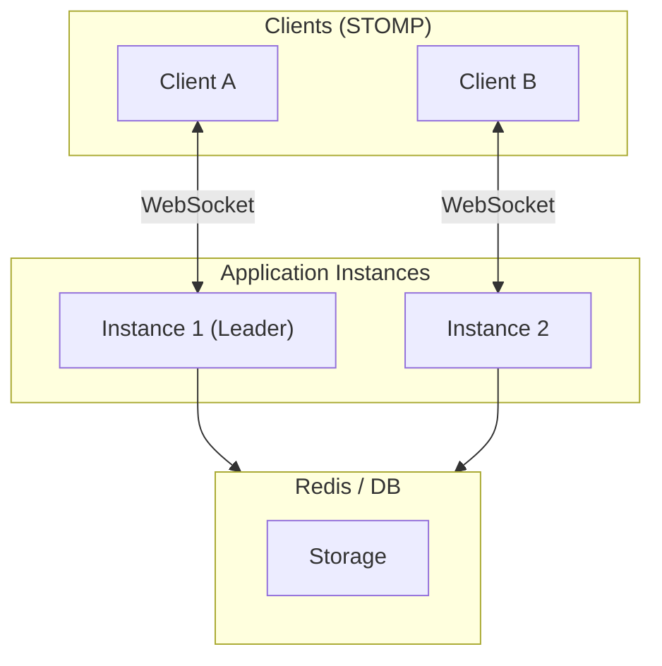

# WebSocket 분산 모드 튜토리얼

다중 인스턴스 환경에서 WebSocket (STOMP)을 사용한 분산 스트리밍 구현 가이드입니다.

## 목차

1. [분산 모드 개요](#분산-모드-개요)
2. [Redis 분산 모드](#redis-분산-모드)
3. [DB Admin 분산 모드](#db-admin-분산-모드)
4. [클라이언트 구현](#클라이언트-구현)
5. [운영 가이드](#운영-가이드)

---

## 분산 모드 개요

WebSocket 분산 모드는 SSE와 동일한 인프라(Redis 또는 DB)를 사용합니다.

### 아키텍처



### 분산 모드 비교

| 특성 | Redis 분산 모드 | DB Admin 모드 (Redis 없음) |
|------|----------------|---------------------------|
| 세션 저장소 | Redis (공유) | 메모리 (인스턴스별) |
| 메시지 브로드캐스트 | Redis Pub/Sub | 직접 전송 |
| 스케줄러 | 리더 선출 | 각 인스턴스 독립 |
| Admin 명령 | DB 폴링 (선택) | DB 폴링 |
| Sticky Session | 불필요 | 필수 |

---

## Redis 분산 모드

### 1. 의존성 추가

**build.gradle:**

```gradle
dependencies {
    implementation 'dev.simplecore:simplix-stream'

    // Spring Boot
    implementation 'org.springframework.boot:spring-boot-starter-web'
    implementation 'org.springframework.boot:spring-boot-starter-security'
    implementation 'org.springframework.boot:spring-boot-starter-websocket'

    // Redis
    implementation 'org.springframework.boot:spring-boot-starter-data-redis'
}
```

### 2. 애플리케이션 설정

**application.yml:**

```yaml
simplix:
  stream:
    enabled: true
    mode: distributed  # Redis 분산 모드

    websocket:
      enabled: true
      endpoint: /ws/stream
      allowed-origins: "*"
      sockjs-enabled: true

    session:
      timeout: 5m
      heartbeat-interval: 30s
      grace-period: 30s
      max-per-user: 5

    scheduler:
      thread-pool-size: 10
      default-interval: 1000ms

    distributed:
      leader-election:
        ttl: 30s
        renew-interval: 10s

      pubsub:
        channel-prefix: "stream:ws:"

      registry:
        key-prefix: "stream:"
        ttl: 1h

spring:
  data:
    redis:
      host: ${REDIS_HOST:localhost}
      port: ${REDIS_PORT:6379}
      password: ${REDIS_PASSWORD:}
```

### 3. 메시지 브로커 확장

대규모 환경에서는 외부 메시지 브로커를 사용합니다:

```java
@Configuration
@EnableWebSocketMessageBroker
public class WebSocketConfig implements WebSocketMessageBrokerConfigurer {

    @Override
    public void configureMessageBroker(MessageBrokerRegistry registry) {
        // RabbitMQ 사용
        registry.enableStompBrokerRelay("/queue", "/topic")
                .setRelayHost("rabbitmq-host")
                .setRelayPort(61613)
                .setClientLogin("guest")
                .setClientPasscode("guest");

        registry.setApplicationDestinationPrefixes("/app");
        registry.setUserDestinationPrefix("/user");
    }

    @Override
    public void registerStompEndpoints(StompEndpointRegistry registry) {
        registry.addEndpoint("/ws/stream")
                .setAllowedOriginPatterns("*")
                .withSockJS();
    }
}
```

### 4. Redis 세션 저장소

WebSocket 세션도 Redis에 저장됩니다:

```
Redis Key: stream:session:ws-abc123
Value: {
  "id": "ws-abc123",
  "userId": "user1",
  "transportType": "WEBSOCKET",
  "state": "CONNECTED",
  "subscriptions": [...],
  "connectedAt": 1704067200000
}
```

---

## DB Admin 분산 모드

### 1. 의존성 추가

**build.gradle:**

```gradle
dependencies {
    implementation 'dev.simplecore:simplix-stream'

    // Spring Boot
    implementation 'org.springframework.boot:spring-boot-starter-web'
    implementation 'org.springframework.boot:spring-boot-starter-security'
    implementation 'org.springframework.boot:spring-boot-starter-websocket'

    // JPA
    implementation 'org.springframework.boot:spring-boot-starter-data-jpa'
    runtimeOnly 'com.mysql:mysql-connector-j'
}
```

### 2. 애플리케이션 설정

**application.yml:**

```yaml
simplix:
  stream:
    enabled: true
    mode: local  # DB Admin은 local 모드

    websocket:
      enabled: true
      endpoint: /ws/stream
      allowed-origins: "*"
      sockjs-enabled: true

    admin:
      enabled: true
      polling-interval: 2s
      command-timeout: 5m

    session:
      timeout: 5m
      heartbeat-interval: 30s

spring:
  datasource:
    url: jdbc:mysql://localhost:3306/simplix
    username: simplix
    password: ${DB_PASSWORD}
  jpa:
    hibernate:
      ddl-auto: update
```

### 3. Sticky Session 설정

DB Admin 모드에서는 Sticky Session이 필수입니다:

**Nginx:**

```nginx
upstream websocket_backend {
    ip_hash;  # Sticky session

    server instance1:8080;
    server instance2:8080;
}

server {
    location /ws/stream {
        proxy_pass http://websocket_backend;

        # WebSocket 프록시 설정
        proxy_http_version 1.1;
        proxy_set_header Upgrade $http_upgrade;
        proxy_set_header Connection "upgrade";
        proxy_set_header Host $host;

        # 타임아웃
        proxy_read_timeout 3600s;
        proxy_send_timeout 3600s;
    }
}
```

---

## 이벤트 기반 스트리밍 (선택)

분산 WebSocket 환경에서도 이벤트 기반 스트리밍을 사용할 수 있습니다.

### Redis 분산 모드 + 이벤트 스트리밍

```yaml
simplix:
  stream:
    mode: distributed
    websocket:
      enabled: true
    event-source:
      enabled: true

  events:
    mode: redis  # Redis를 통한 이벤트 전파
```

### DB Admin 모드 + 이벤트 스트리밍

```yaml
simplix:
  stream:
    mode: local
    websocket:
      enabled: true
    event-source:
      enabled: true
    admin:
      enabled: true

  events:
    mode: local  # 로컬 이벤트만 (인스턴스 내)
```

### SimpliXStreamEventSource 예제

```java
@Component
public class GameEventSource implements SimpliXStreamEventSource {

    @Override
    public String getResource() {
        return "game-events";
    }

    @Override
    public String getEventType() {
        return "GameEvent";
    }

    @Override
    public Map<String, Object> extractParams(Object payload) {
        GameEvent event = (GameEvent) payload;
        return Map.of("gameId", event.getGameId());
    }

    @Override
    public Object extractData(Object payload) {
        GameEvent event = (GameEvent) payload;
        return Map.of(
            "type", event.getType(),
            "gameId", event.getGameId(),
            "playerId", event.getPlayerId(),
            "data", event.getData(),
            "timestamp", event.getTimestamp().toEpochMilli()
        );
    }
}
```

> 자세한 내용은 [이벤트 기반 스트리밍 튜토리얼](ko/stream/tutorial-event-source.md)을 참조하세요.

---

## 클라이언트 구현

### 재연결 처리

분산 환경에서는 재연결이 중요합니다:

```javascript
class DistributedWebSocketClient {
    constructor(baseUrl) {
        this.baseUrl = baseUrl;
        this.stompClient = null;
        this.sessionId = null;
        this.lastSubscriptions = [];
        this.reconnectAttempts = 0;
        this.maxReconnectAttempts = 10;
        this.reconnectDelay = 1000;
    }

    connect() {
        return new Promise((resolve, reject) => {
            const socket = new SockJS(`${this.baseUrl}/ws/stream`);
            this.stompClient = Stomp.over(socket);
            this.stompClient.debug = null;

            this.stompClient.connect(
                {},
                (frame) => {
                    console.log('Connected');
                    this.reconnectAttempts = 0;
                    this.setupSubscriptions(resolve);
                },
                (error) => {
                    console.error('Connection error:', error);
                    this.handleConnectionError(reject);
                }
            );
        });
    }

    setupSubscriptions(resolve) {
        // 연결 메시지 수신
        this.stompClient.subscribe('/user/queue/stream/connected', (message) => {
            const data = JSON.parse(message.body);
            this.sessionId = data.sessionId;

            // 이전 구독 복원
            if (this.lastSubscriptions.length > 0) {
                this.restoreSubscriptions();
            }

            resolve(this.sessionId);
        });

        // 데이터 수신
        this.stompClient.subscribe('/user/queue/stream/data', (message) => {
            const data = JSON.parse(message.body);
            this.handleData(data);
        });

        // 에러 수신
        this.stompClient.subscribe('/user/queue/stream/error', (message) => {
            const error = JSON.parse(message.body);
            this.handleError(error);
        });
    }

    async updateSubscriptions(subscriptions) {
        this.lastSubscriptions = subscriptions;  // 저장

        const request = { subscriptions };
        this.stompClient.send('/app/stream/subscribe', {}, JSON.stringify(request));
    }

    async restoreSubscriptions() {
        if (this.lastSubscriptions.length > 0) {
            console.log('Restoring subscriptions...');
            await this.updateSubscriptions(this.lastSubscriptions);
        }
    }

    handleConnectionError(reject) {
        if (this.reconnectAttempts < this.maxReconnectAttempts) {
            this.reconnectAttempts++;
            const delay = this.reconnectDelay * Math.pow(2, this.reconnectAttempts - 1);

            console.log(`Reconnecting in ${delay}ms (attempt ${this.reconnectAttempts})`);

            setTimeout(() => {
                this.connect().catch(() => {});
            }, delay);
        } else {
            reject(new Error('Max reconnection attempts reached'));
        }
    }

    disconnect() {
        if (this.stompClient) {
            this.stompClient.disconnect();
        }
    }
}
```

### Vue.js 통합

```vue
<template>
  <div>
    <div v-if="!connected" class="loading">Connecting...</div>
    <div v-else>
      <div v-for="message in messages" :key="message.id">
        {{ message.content }}
      </div>
    </div>
  </div>
</template>

<script>
import { ref, onMounted, onUnmounted } from 'vue';
import SockJS from 'sockjs-client';
import { Client } from '@stomp/stompjs';

export default {
  props: {
    roomId: String
  },
  setup(props) {
    const connected = ref(false);
    const messages = ref([]);
    let client = null;

    onMounted(() => {
      client = new Client({
        webSocketFactory: () => new SockJS('/ws/stream'),
        reconnectDelay: 5000,
        heartbeatIncoming: 30000,
        heartbeatOutgoing: 30000,
      });

      client.onConnect = () => {
        connected.value = true;

        // 데이터 수신
        client.subscribe('/user/queue/stream/data', (message) => {
          const data = JSON.parse(message.body);
          if (data.resource === 'chat-messages') {
            messages.value = [...messages.value, ...data.data.messages];
          }
        });

        // 구독 등록
        client.publish({
          destination: '/app/stream/subscribe',
          body: JSON.stringify({
            subscriptions: [{
              resource: 'chat-messages',
              params: { roomId: props.roomId }
            }]
          })
        });
      };

      client.onDisconnect = () => {
        connected.value = false;
      };

      client.activate();
    });

    onUnmounted(() => {
      if (client) {
        client.deactivate();
      }
    });

    return { connected, messages };
  }
};
</script>
```

---

## 운영 가이드

### 로드 밸런서 설정

#### AWS ALB WebSocket 지원

```yaml
# Target Group 설정
TargetGroupAttributes:
  - Key: stickiness.enabled
    Value: "true"
  - Key: stickiness.type
    Value: "lb_cookie"
  - Key: stickiness.lb_cookie.duration_seconds
    Value: "3600"

# Listener Rule (WebSocket 업그레이드 지원)
ListenerRuleConditions:
  - Field: path-pattern
    Values: ["/ws/*"]
```

#### Kubernetes Ingress

```yaml
apiVersion: networking.k8s.io/v1
kind: Ingress
metadata:
  name: stream-ingress
  annotations:
    nginx.ingress.kubernetes.io/proxy-read-timeout: "3600"
    nginx.ingress.kubernetes.io/proxy-send-timeout: "3600"
    nginx.ingress.kubernetes.io/affinity: "cookie"
    nginx.ingress.kubernetes.io/session-cookie-name: "stream-session"
spec:
  rules:
  - host: api.example.com
    http:
      paths:
      - path: /ws
        pathType: Prefix
        backend:
          service:
            name: stream-service
            port:
              number: 8080
```

### 모니터링

#### WebSocket 연결 메트릭

```yaml
# Prometheus 메트릭
simplix_stream_websocket_sessions_active:
  type: gauge
  help: Active WebSocket sessions

simplix_stream_websocket_messages_sent_total:
  type: counter
  help: Total messages sent via WebSocket

simplix_stream_websocket_messages_received_total:
  type: counter
  help: Total messages received via WebSocket
```

#### Grafana 대시보드 쿼리

```promql
# 활성 WebSocket 세션
sum(simplix_stream_websocket_sessions_active)

# 초당 메시지 전송률
rate(simplix_stream_websocket_messages_sent_total[5m])

# 인스턴스별 세션 분포
simplix_stream_websocket_sessions_active by (instance)
```

### 디버깅

#### STOMP 프레임 로깅

```yaml
logging:
  level:
    org.springframework.web.socket: DEBUG
    org.springframework.messaging: DEBUG
    dev.simplecore.simplix.stream.transport.websocket: TRACE
```

#### 클라이언트 디버그 모드

```javascript
// STOMP 클라이언트 디버그 활성화
stompClient.debug = (str) => {
    console.log('STOMP:', str);
};
```

### 장애 대응

#### 연결 끊김 감지

```javascript
// 하트비트 기반 연결 상태 확인
client.heartbeatIncoming = 30000;  // 30초
client.heartbeatOutgoing = 30000;

// 연결 끊김 콜백
client.onWebSocketClose = (event) => {
    console.log('WebSocket closed:', event.code, event.reason);
    // 재연결 로직
};
```

#### Redis 장애 시

Redis 장애 시에도 기존 WebSocket 연결은 유지됩니다:

1. 새 연결만 영향 받음
2. 기존 세션의 데이터 전송 계속 동작
3. Redis 복구 후 자동으로 정상화

---

## 다음 단계

- [Admin API 가이드](ko/stream/admin-api-guide.md) - 세션/스케줄러 관리
- [모니터링 가이드](ko/stream/monitoring-guide.md) - 메트릭 및 헬스 체크
- [클라이언트 프레임워크 가이드](ko/stream/client-framework-guide.md) - React/Vue 통합
