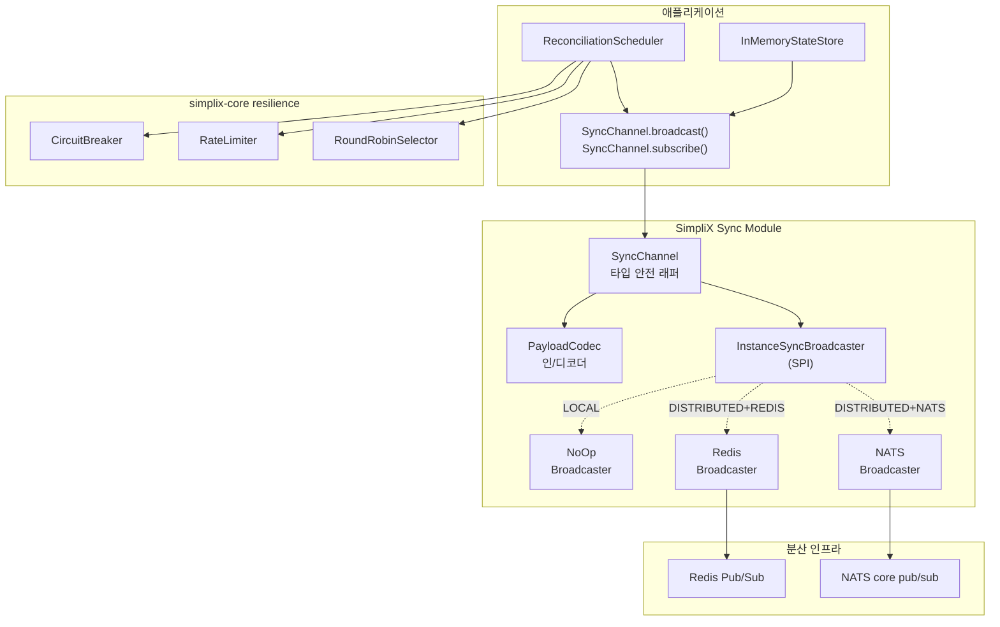
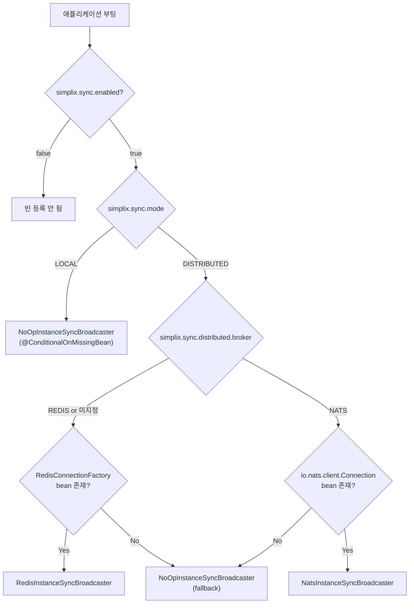
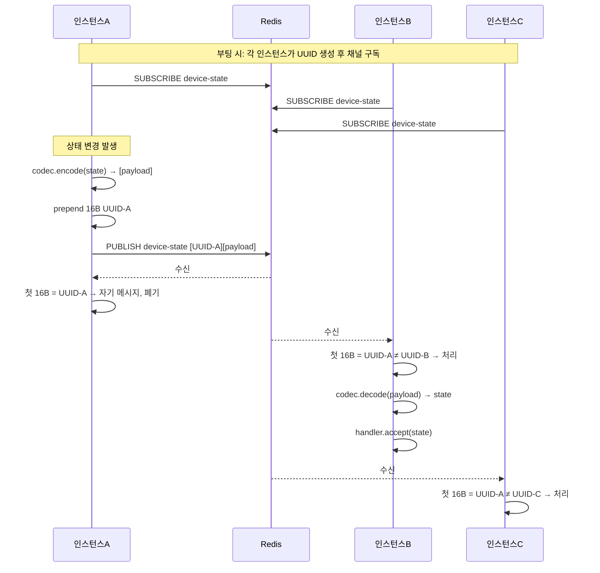
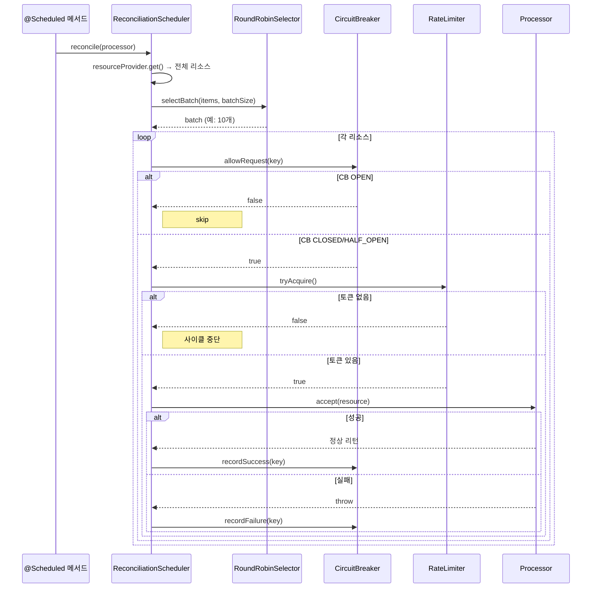

# SimpliX Sync Module Overview

## Overview

SimpliX Sync 모듈은 다중 인스턴스 환경에서 가벼운 pub/sub 브로드캐스트와 라운드로빈 상태 동기화(reconciliation)를 제공하는 경량 모듈입니다. 구조화된 메시징(simplix-messaging)과 달리 fire-and-forget 베스트-에포트 전송에 특화되어 있으며, 단일 인스턴스 환경에서는 No-Op으로 자동 동작하여 코드 변경 없이 단일/분산 모드를 전환할 수 있습니다.

## Use Cases

simplix-sync는 다음과 같은 시나리오에 최적화되어 있습니다.

| 유스케이스 | 설명 | 예시 |
|------------|------|------|
| **인스턴스 캐시 무효화** | 한 노드에서 변경된 데이터를 다른 노드의 로컬 캐시에서 즉시 제거 | 사용자 권한 변경 즉시 반영 |
| **상태 미러링** | 여러 노드가 동일한 상태 스냅샷을 유지 | 디바이스 연결 상태, 세션 정보 |
| **연결 상태 알림** | WebSocket/SSE 클라이언트에 동기화 신호 전파 | 새 알림 발생, 다른 사용자 활동 |
| **주기적 reconciliation** | 외부 시스템과 라운드로빈으로 상태 재동기화 | 의료 디바이스 polling |
| **Resilience 통합 polling** | Circuit Breaker + Rate Limiter 적용된 배치 처리 | 외부 API 호출 분산 |

## Features

- **타입 안전 채널 (`SyncChannel<T>`)** - 직렬화/역직렬화 일원화
- **자기 메시지 필터링** - 16-byte UUID 프리픽스로 발신자 자신은 수신 차단
- **다중 백엔드** - Redis Pub/Sub, NATS core pub/sub
- **로컬 모드** - `NoOpInstanceSyncBroadcaster`로 무비용 동작
- **상태 저장소 (`InMemoryStateStore<S>`)** - 키 기반 동기화 락 제공
- **라운드로빈 reconciliation** - 라운드로빈 배치 처리로 부하 분산
- **Resilience 통합** - simplix-core의 Circuit Breaker / Rate Limiter / RoundRobinSelector 연동
- **Spring Boot Auto-Configuration** - 모드 기반 자동 빈 등록

---

## Architecture



---

## Comparison with simplix-messaging

simplix-sync와 simplix-messaging은 **상호 보완적**인 모듈입니다. 적용 기준은 다음과 같습니다.

| 항목 | simplix-sync | simplix-messaging |
|------|--------------|---------------------|
| 목적 | 인스턴스 간 상태 동기화 신호 | 비즈니스 메시지 전달 |
| 전달 보장 | 베스트-에포트 (구독 끊기면 손실) | 영속성, 재시도, ACK |
| 영속성 | 없음 | JetStream / Streams / Kafka 영속 |
| 멱등성 | 발신자 자기-필터링만 | `IdempotentGuard` + Store |
| 메시지 크기 | 작은 신호 (수 KB) | 임의 크기 |
| 사용 패턴 | pub/sub + reconciliation | Producer/Consumer + ACK |
| 백엔드 | Redis Pub/Sub, NATS core | Redis Streams, JetStream, Kafka, Rabbit |
| 손실 허용 | 허용 (다음 reconciliation에서 복구) | 비허용 (재시도) |

> ℹ 비즈니스 이벤트(주문, 결제, 감사 로그)는 simplix-messaging을, 캐시 무효화/세션 동기화/상태 신호는 simplix-sync를 사용하세요.

---

## Core Components

### InstanceSyncBroadcaster (SPI)

인스턴스 간 raw byte 페이로드 브로드캐스트를 위한 SPI입니다. 모듈 전체의 핵심 추상화이며, 사용자가 직접 구현하여 다른 백엔드를 추가할 수도 있습니다.

```java
public interface InstanceSyncBroadcaster {
    void broadcast(String channel, byte[] payload);
    void subscribe(String channel, InboundPayloadListener listener);

    @FunctionalInterface
    interface InboundPayloadListener {
        void onPayload(byte[] payload);
    }
}
```

**구현체 일람:**

| 구현 | 활성화 조건 | 동작 |
|------|-------------|------|
| `NoOpInstanceSyncBroadcaster` | `mode=LOCAL` (기본) | 모든 호출이 no-op |
| `RedisInstanceSyncBroadcaster` | `mode=DISTRIBUTED` + `broker=REDIS` | Redis Pub/Sub 사용 |
| `NatsInstanceSyncBroadcaster` | `mode=DISTRIBUTED` + `broker=NATS` | NATS core pub/sub 사용 |

### SyncChannel\<T\>

`InstanceSyncBroadcaster`의 raw byte API를 타입 `T`로 래핑한 안전한 채널입니다.

```java
public class SyncChannel<T> {
    public SyncChannel(String channelName, PayloadCodec<T> codec, InstanceSyncBroadcaster broadcaster);

    public void broadcast(T message);             // encode + broadcast
    public void subscribe(Consumer<T> handler);   // decode + handler
    public String getChannelName();
}
```

**핵심 책임:**
- 인코딩 실패 시 ERROR 로그 출력 후 무시 (애플리케이션에 예외 전파 X)
- 디코딩 실패 시 ERROR 로그 출력 후 메시지 폐기
- 채널마다 별도 인스턴스 생성 (한 인스턴스가 한 채널만 처리)

**예시:**

```java
PayloadCodec<DeviceState> codec = PayloadCodec.of(
    state -> objectMapper.writeValueAsBytes(state),
    bytes -> objectMapper.readValue(bytes, DeviceState.class)
);
SyncChannel<DeviceState> channel = new SyncChannel<>("device-state", codec, broadcaster);

channel.subscribe(state -> applyPeerState(state));
channel.broadcast(localState);
```

### PayloadCodec\<T\>

타입 `T`를 바이트 배열로 인/디코딩하는 인터페이스입니다. 람다 팩토리 메서드를 제공하여 어떤 직렬화 형식이든 통합 가능합니다.

```java
public interface PayloadCodec<T> {
    byte[] encode(T message);
    T decode(byte[] payload) throws IOException;

    static <T> PayloadCodec<T> of(Encoder<T> encoder, Decoder<T> decoder);
}
```

**일반적 코덱 구현:**

| 형식 | encode | decode |
|------|--------|--------|
| JSON (Jackson) | `objectMapper.writeValueAsBytes(msg)` | `objectMapper.readValue(bytes, Type.class)` |
| Protobuf (Wire) | `Adapter.encode(msg)` | `Adapter.decode(bytes)` |
| String | `msg.getBytes(UTF_8)` | `new String(bytes, UTF_8)` |
| Java Serialization | `ObjectOutputStream` | `ObjectInputStream` (비권장) |

### InMemoryStateStore\<S\>

키별 상태를 저장하고 동기화된 변경을 보장하는 thread-safe 저장소입니다. 동시에 같은 키를 변경하는 스레드가 있어도 부분 적용을 방지합니다.

```java
public class InMemoryStateStore<S> {
    public InMemoryStateStore(Function<String, S> factory);

    public S getOrCreate(String key);
    public S get(String key);
    public Collection<S> getAll();
    public Set<String> getAllKeys();
    public S remove(String key);
    public int size();

    public void mutate(String key, Consumer<S> mutator);            // synchronized on state
    public <R> R compute(String key, Function<S, R> computer);      // synchronized on state
}
```

**중요 동작:**
- `mutate`와 `compute`는 **상태 객체 자체**(`synchronized(state)`)에 락을 걸어 같은 키에 대한 동시 변경을 직렬화합니다.
- 다른 키는 서로 영향이 없으므로 동시 변경이 가능합니다.
- 락은 `ConcurrentHashMap`이 아닌 상태 객체에 걸리므로 store 자체의 처리량은 영향받지 않습니다.

### ReconciliationScheduler\<R\>

라운드로빈 방식으로 리소스 배치를 순회하며 reconciliation을 수행하는 헬퍼입니다. `@Scheduled` 어노테이션을 직접 소유하지 않고, 호출자가 자신의 cron/fixedDelay 메서드에서 `reconcile()`을 호출하는 패턴입니다. 이를 통해 ShedLock 등 분산 락 통합도 자유롭게 적용할 수 있습니다.

```java
ReconciliationScheduler<DeviceState> scheduler =
    ReconciliationScheduler.<DeviceState>builder()
        .resourceProvider(stateStore::getAll)
        .keyExtractor(DeviceState::getDeviceId)
        .batchSize(10)
        .circuitBreaker(circuitBreaker)
        .rateLimiter(rateLimiter)
        .build();

@Scheduled(fixedDelay = 30_000)
public void reconcile() {
    scheduler.reconcile(this::queryDevice);
}
```

**Resilience 통합 동작:**

| 컴포넌트 | 역할 | 미통과 시 |
|----------|------|----------|
| `CircuitBreaker` | 키별 실패 추적 | 해당 리소스 건너뛰고 다음으로 진행 |
| `RateLimiter` | 글로벌 처리 속도 제한 | 사이클 즉시 중단 (다음 사이클로 이월) |
| `RoundRobinSelector` | 배치 선택 | (필수, 항상 동작) |

---

## Auto-Configuration

### SimpliXSyncAutoConfiguration

```java
@AutoConfiguration
@EnableConfigurationProperties(SyncProperties.class)
@ConditionalOnProperty(name = "simplix.sync.enabled", havingValue = "true", matchIfMissing = true)
public class SimpliXSyncAutoConfiguration { ... }
```

**조건부 빈 등록:**

| Bean | 조건 |
|------|------|
| `noOpInstanceSyncBroadcaster` | `@ConditionalOnMissingBean(InstanceSyncBroadcaster.class)` (fallback) |
| `redisInstanceSyncBroadcaster` | `mode=DISTRIBUTED` + Redis 클래스패스 + `RedisConnectionFactory` 빈 + (`broker=REDIS` 또는 미지정) |
| `natsInstanceSyncBroadcaster` | `mode=DISTRIBUTED` + jnats 클래스패스 + `Connection` 빈 + `broker=NATS` |

> ℹ NATS 백엔드는 자체 Connection을 생성하지 않습니다. 애플리케이션이 `io.nats.client.Connection` 빈을 별도 제공해야 하며, simplix-messaging이 `simplix.messaging.broker=nats`로 설정된 경우 자동 제공합니다.

### Auto-Configuration Decision Flow



---

## Configuration Properties

### 전체 설정 구조

```yaml
simplix:
  sync:
    enabled: true
    mode: DISTRIBUTED       # LOCAL 또는 DISTRIBUTED
    distributed:
      broker: REDIS         # REDIS 또는 NATS
```

### Property Reference

| Property | Type | Default | Description |
|----------|------|---------|-------------|
| `simplix.sync.enabled` | boolean | `true` | 모듈 활성화 |
| `simplix.sync.mode` | enum | `LOCAL` | 동작 모드 (LOCAL/DISTRIBUTED) |
| `simplix.sync.distributed.broker` | enum | `REDIS` | 분산 백엔드 (REDIS/NATS) |
| `simplix.sync.distributed.redis-enabled` | boolean | `true` | (Deprecated) `broker` 사용 권장 |

### Environment Variables

| 변수 | 매핑되는 속성 |
|------|---------------|
| `SIMPLIX_SYNC_ENABLED` | `simplix.sync.enabled` |
| `SIMPLIX_SYNC_MODE` | `simplix.sync.mode` |
| `SIMPLIX_SYNC_DISTRIBUTED_BROKER` | `simplix.sync.distributed.broker` |

---

## Backend Comparison

| 특성 | NoOp (Local) | Redis Pub/Sub | NATS core pub/sub |
|------|--------------|---------------|--------------------|
| 외부 의존성 | 없음 | Redis 서버 | NATS 서버 + Connection 빈 |
| 영속성 | N/A | 없음 (Pub/Sub) | 없음 (core) |
| 자기 메시지 필터 | 해당 없음 | 16-byte UUID 프리픽스 | 16-byte UUID 프리픽스 |
| Wire 형식 | N/A | `[16B UUID][payload]` | `[16B UUID][payload]` |
| 사용 시기 | 단일 인스턴스 | 일반 분산 운영 | NATS 인프라 보유 환경 |
| 신뢰성 | N/A | 베스트-에포트 (구독 끊기면 손실) | 베스트-에포트 |
| 채널 = | 호출 안 됨 | Redis 채널 이름 | NATS subject |
| 부팅 시 동작 | log.debug | UUID 생성 + log.info | UUID 생성 + Dispatcher 생성 + log.info |

> ⚠ Sync 모듈은 베스트-에포트 전달입니다. 메시지 손실이 허용되지 않는 시나리오에서는 simplix-messaging(JetStream / Kafka 등)을 사용하세요.

---

## Wire Format

분산 백엔드(Redis, NATS)는 모두 동일한 wire format을 사용합니다.

```
+----------------------+----------------------+
| 16 bytes UUID prefix | payload bytes        |
+----------------------+----------------------+
```

| 영역 | 크기 | 용도 |
|------|------|------|
| UUID prefix | 16 bytes | 발신 인스턴스 식별 (자기-필터링용) |
| payload | 가변 | 실제 메시지 내용 (`PayloadCodec.encode()` 결과) |

수신 시 첫 16 바이트를 자신의 인스턴스 ID와 비교하여 일치하면 메시지를 폐기합니다(self-filtering). 일치하지 않으면 prefix를 제거한 payload만 `InboundPayloadListener.onPayload()`에 전달됩니다.

> ℹ 인스턴스 ID는 부팅 시 `UUID.randomUUID()`로 생성되어 프로세스 종료까지 유지됩니다. 재시작 시 새 ID로 갱신되므로 재시작 직전의 자기 메시지가 새 ID에서는 외부 메시지로 처리될 수 있습니다(거의 무시할 수 있는 윈도우).

---

## Sequence Diagrams

### Broadcast & Subscribe (Distributed)



### Reconciliation Cycle



---

## Operation Modes

### LOCAL Mode

단일 인스턴스 환경에서 사용합니다. `NoOpInstanceSyncBroadcaster`가 등록되어 모든 broadcast/subscribe 호출이 즉시 반환됩니다.

```yaml
simplix:
  sync:
    mode: LOCAL
```

**특징:**
- 외부 의존성 없음
- broadcast/subscribe 모두 no-op (CPU 사용량 0)
- 코드는 그대로 두고 운영 환경에서만 DISTRIBUTED로 전환 가능

### DISTRIBUTED Mode (Redis)

```yaml
simplix:
  sync:
    mode: DISTRIBUTED
    distributed:
      broker: REDIS

spring:
  data:
    redis:
      host: redis
      port: 6379
```

**특징:**
- Spring Data Redis의 `RedisMessageListenerContainer` 활용
- 채널마다 별도 listener 등록 (자기-필터링 wrapper로 감싸짐)
- 컨테이너 에러 핸들러: 5초 recovery interval 자동 적용
- 시작 시 컨테이너 자동 start

### DISTRIBUTED Mode (NATS)

```yaml
simplix:
  sync:
    mode: DISTRIBUTED
    distributed:
      broker: NATS

# Connection 빈은 별도 제공 필요 (예: simplix-messaging)
simplix:
  messaging:
    broker: nats
    nats:
      servers: nats://nats:4222
```

**특징:**
- 단일 `Dispatcher`를 인스턴스당 하나만 생성 (모든 채널 공유)
- Subscription 핸들러는 비동기 dispatcher 스레드에서 실행
- `@PreDestroy`에서 dispatcher 자동 정리
- 채널 이름이 NATS subject로 직접 사용됨

> ⚠ NATS subject 규칙: 공백 불가, `.`과 `-`는 허용, 와일드카드(`*`, `>`)는 리터럴 채널명에 사용 불가

---

## Logging

```yaml
logging:
  level:
    dev.simplecore.simplix.sync: DEBUG
```

| 레벨 | 출력 |
|------|------|
| TRACE | 상태 저장소 mutate 추적, reconciliation 사이클 미세 동작 |
| DEBUG | reconciliation 사이클 통계, circuit breaker 상태 변경 |
| INFO | broadcaster 초기화 (instanceId 포함), 채널 구독 |
| WARN | reconciliation 처리 실패, 잘못된 형식의 메시지 수신 (UUID prefix 부재) |
| ERROR | 인코딩/디코딩 실패, 브로드캐스트 실패 |

**주요 로그 메시지:**

```
INFO  d.s.s.s.i.r.RedisInstanceSyncBroadcaster - Redis instance sync broadcaster initialized [instanceId=550e8400-e29b-41d4-a716-446655440000]
INFO  d.s.s.s.i.r.RedisInstanceSyncBroadcaster - Subscribed to sync channel: device-state
INFO  d.s.s.s.i.n.NatsInstanceSyncBroadcaster - NATS instance sync broadcaster initialized [instanceId=...]
DEBUG d.s.s.s.c.ReconciliationScheduler - Reconciliation cycle: processing 10 of 247 resources
WARN  d.s.s.s.c.ReconciliationScheduler - Reconciliation failed for key=device-1: connection timeout
ERROR d.s.s.s.c.SyncChannel - Failed to broadcast message on channel=device-state: encode error
```

---

## Related Documents

- [README](ko/README.md) - 모듈 소개 및 빠른 시작
- [Getting Started](ko/sync/getting-started.md) - 단계별 통합 가이드
- [Advanced Guide](ko/sync/advanced-guide.md) - State Store, Reconciliation, Resilience, Custom Backend
