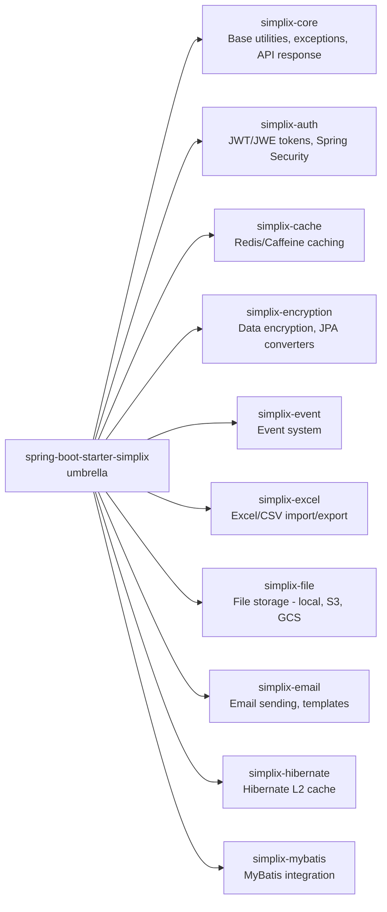
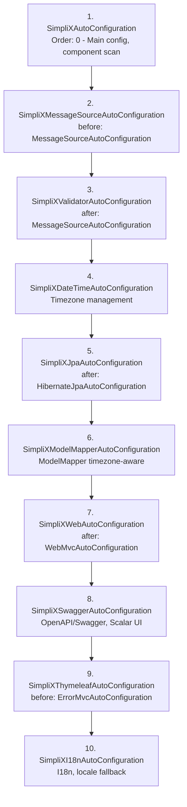

# SimpliX Starter Overview

## Introduction

`spring-boot-starter-simplix`는 SimpliX 프레임워크의 메인 Spring Boot Starter입니다. "Umbrella Starter" 패턴을 사용하여 모든 SimpliX 모듈을 하나의 의존성으로 통합하고, Spring Boot 애플리케이션에 필요한 자동 구성을 제공합니다.

## Architecture

### Umbrella Starter Pattern



### Auto-Configuration Flow

SimpliX의 Auto-Configuration은 Spring Boot 표준을 따르며, 특정 순서로 실행됩니다:



## Package Structure

```
dev.simplecore.simplix
├── springboot
│   ├── autoconfigure/           # Auto-Configuration 클래스
│   │   ├── SimpliXAutoConfiguration.java
│   │   ├── SimpliXDateTimeAutoConfiguration.java
│   │   ├── SimpliXI18nAutoConfiguration.java
│   │   ├── SimpliXJpaAutoConfiguration.java
│   │   ├── SimpliXMessageSourceAutoConfiguration.java
│   │   ├── SimpliXModelMapperAutoConfiguration.java
│   │   ├── SimpliXSwaggerAutoConfiguration.java
│   │   ├── SimpliXThymeleafAutoConfiguration.java
│   │   ├── SimpliXValidatorAutoConfiguration.java
│   │   └── SimpliXWebAutoConfiguration.java
│   │
│   ├── converter/               # JPA AttributeConverter
│   │   ├── SimpliXLocalDateTimeConverter.java
│   │   └── SimpliXOffsetDateTimeConverter.java
│   │
│   ├── properties/              # Configuration Properties
│   │   └── SimpliXProperties.java
│   │
│   └── application/             # 애플리케이션 유틸리티
│       └── ApplicationInfoRunner.java
│
└── web
    ├── advice/                  # 예외 처리
    │   ├── SimpliXExceptionHandler.java
    │   ├── SimpliXResponseBodyAdvice.java
    │   └── ValidationFieldError.java
    │
    ├── config/                  # 웹 설정
    │   ├── SimpliXWebConfig.java
    │   ├── SwaggerSchemaEnhancer.java
    │   └── EnumSchemaExtractor.java
    │
    ├── controller/              # 기본 컨트롤러
    │   ├── SimpliXBaseController.java
    │   └── SimpliXStandardApi.java
    │
    ├── service/                 # 기본 서비스
    │   ├── SimpliXBaseService.java
    │   └── SimpliXService.java
    │
    └── exception/               # 에러 처리
        └── SimpliXErrorController.java
```

## 핵심 컴포넌트

### SimpliXProperties

모든 SimpliX 설정을 관리하는 중앙 Properties 클래스:

```java
@ConfigurationProperties(prefix = "simplix")
public class SimpliXProperties {
    private CoreProperties core = new CoreProperties();
    private ExceptionHandlerProperties exceptionHandler = new ExceptionHandlerProperties();
    private DateTimeProperties dateTime = new DateTimeProperties();
}
```

### SimpliXTimezoneService

타임존 관련 모든 작업을 처리하는 중앙 서비스:

```java
@Bean
public SimpliXTimezoneService timezoneService() {
    return new SimpliXTimezoneService(
        resolveApplicationZoneId(),
        properties.getDateTime().isUseUtcForDatabase(),
        properties.getDateTime().isNormalizeTimezone()
    );
}
```

### SimpliXBaseService

CRUD 작업을 위한 기본 서비스 추상 클래스:

- `findById(ID id)` - ID로 엔티티 조회
- `findById(ID id, Class<P> projection)` - ID로 조회 후 프로젝션 매핑
- `findAll(Pageable pageable)` - 페이징된 전체 조회
- `findAllWithSearch(SearchCondition)` - 동적 검색 조건 조회
- `save(E entity)` - 엔티티 저장
- `deleteById(ID id)` - ID로 삭제

### SimpliXExceptionHandler

전역 예외 처리기:

- SimpliXGeneralException 처리
- 유효성 검사 예외 (MethodArgumentNotValidException)
- Spring Security 예외 (AccessDeniedException, AuthenticationException)
- 일반 예외 래핑 및 로깅
- Trace ID 헤더 추가

### SimpliXResponseBodyAdvice

모든 API 응답을 자동으로 `SimpliXApiResponse`로 래핑:

```java
// Controller 반환값
return user;

// 실제 응답
{
  "type": "SUCCESS",
  "data": { ... },
  "message": null,
  "traceId": "20250101-120000-abc12345"
}
```

**제외 대상:**
- `org.springdoc.*`, `io.swagger.*`, `springfox.*` 패키지
- 이미 `SimpliXApiResponse`로 래핑된 응답

### SimpliXSecurityAutoConfiguration

`simplix.auth.enabled=false` 설정 시 기본 보안 필터 체인 제공:

```java
@AutoConfiguration
@ConditionalOnProperty(name = "simplix.auth.enabled", havingValue = "false")
public class SimpliXSecurityAutoConfiguration {
    // CSRF 비활성화, 모든 요청 허용
}
```

**사용 시기:** 개발/테스트 환경에서 인증 없이 API 테스트 필요 시

### Trace ID 생성

모든 HTTP 요청에 Trace ID 자동 생성:

```
X-Trace-Id: 20250101-120000-abc12345
          ├─ 날짜 ─┤ 시간 │ UUID(8자)
```

- MDC에 자동 등록 (`SimpliXConstants.TRACE_ID`)
- 로깅에서 `%X{traceId}` 패턴으로 사용 가능
- 요청 완료 후 자동 정리

## Conditional Registration

각 Auto-Configuration은 조건부로 등록됩니다:

| Configuration | Condition | Default |
|---------------|-----------|---------|
| SimpliXAutoConfiguration | Always | Enabled |
| SimpliXMessageSourceAutoConfiguration | `simplix.message-source.enabled` | true |
| SimpliXI18nAutoConfiguration | Always | Enabled |
| SimpliXDateTimeAutoConfiguration | `simplix.core.enabled` | true |
| SimpliXJpaAutoConfiguration | `@ConditionalOnClass(EntityManagerFactory)` | Auto |
| SimpliXModelMapperAutoConfiguration | `@ConditionalOnClass(ModelMapper)` | Auto |
| SimpliXSwaggerAutoConfiguration | `@ConditionalOnClass(OpenAPI)` | Auto |
| SimpliXThymeleafAutoConfiguration | `@ConditionalOnClass(SpringTemplateEngine)` | Auto |
| SimpliXWebAutoConfiguration | `@ConditionalOnWebApplication` | Auto |

## 설정 속성

```yaml
simplix:
  core:
    enabled: true                 # 코어 기능 활성화
  message-source:
    enabled: true                 # 메시지 소스 통합
  date-time:
    timezone: Asia/Seoul          # 애플리케이션 타임존
    use-utc-for-database: true    # DB 저장 시 UTC 사용
    normalize-timezone: true      # 타임존 정규화
  exception-handler:
    include-stack-trace: false    # 스택 트레이스 포함 여부
    log-full-stack-trace: true    # 전체 스택 트레이스 로깅
```

| 속성 | 타입 | 기본값 | 설명 |
|------|------|--------|------|
| `simplix.core.enabled` | boolean | `true` | 코어 기능 활성화 |
| `simplix.message-source.enabled` | boolean | `true` | 메시지 소스 통합 |
| `simplix.date-time.timezone` | String | 시스템 기본값 | 애플리케이션 타임존 |
| `simplix.date-time.use-utc-for-database` | boolean | `true` | DB 저장 시 UTC 사용 |
| `simplix.exception-handler.include-stack-trace` | boolean | `false` | API 응답에 스택 트레이스 포함 |

상세 설정: [Configuration Guide](configuration.md)

## Related Documentation

- [Configuration Guide](configuration.md) - 상세 설정 가이드
- [DateTime Guide](datetime.md) - 타임존/날짜시간 관리
- [Exception Handler Guide](exception-handler.md) - 예외 처리 커스터마이징
- [Service & Controller Guide](service-controller.md) - 서비스/컨트롤러 확장
- [Swagger Guide](swagger.md) - API 문서화 설정